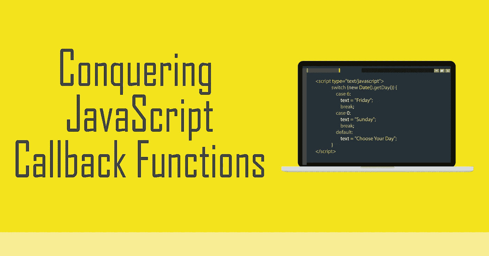

# 初学者理解 JavaScript 回调函数

> 原文：<https://javascript.plainenglish.io/understanding-javascript-callback-functions-for-beginners-9c1ab3352103?source=collection_archive---------7----------------------->



# 什么是回调函数？

如果你从未听说过回调函数，我会用我能想到的最简单的方式告诉你它是什么…

> *它是作为另一个函数的参数传递的函数，稍后或立即执行。*

# 简单的例子

例如，看看这些函数:

```
//Defining functions
function prepare(ingredients, callback) {
       console.log("Preparing " + ingredients);
       callback();
}

//callback function
function chop(){
       console.log("Chopping");
}

//Calling the function
prepare("onions and garlic", chop);
```

在你的日常生活中，你可能会注意到厨师会先准备食材，然后开始切。上面的函数说明了这一点。

`prepare()`函数将“配料”作为第一个参数，将一个名为`chop()`的回调函数作为第二个参数，这个回调函数稍后将在`prepare()`函数中执行。因此控制台将打印:

```
Preparing onions and garlic
Chopping
```

大多数时候，你不会看到像例子那样写的回调函数。开发人员喜欢保持代码简洁，所以我们可以直接将`chop()`插入`prepare()`，就像:

```
//Defining function
function prepare(ingredients, callback) {
       console.log("Preparing " + ingredients);
       callback();
}

//Calling the function
prepare("onions and garlic", function chop() {
       console.log("Chopping" );
});
```

看到了吗？现在代码看起来更简洁了！如果你想更进一步，JavaScript 有**匿名函数**，让你不用命名就可以声明和执行函数。回调函数可以是匿名函数，如下所示:

```
//Defining function
function prepare(ingredients, callback) {
       console.log("Preparing " + ingredients); 
       callback();  
}

//Calling the function
prepare("onions and garlic", () => {
       console.log("Chopping");
});
```

如上所示，现在回调函数不叫‘chop’。它是无名的，因此是匿名的。我希望这能帮助你更好地理解回调函数。

> ***关键提示:*** *回调函数是作为另一个函数的参数传递的函数，最终会被执行。回调函数在主函数内部执行，由主函数决定何时执行。*

# 一个有争议的例子

现在你知道了执行回调的主函数有权决定何时执行。在前面的例子中，它在 main 函数执行后立即执行。

但是对于回调，main 函数还决定了更多。它也可以将参数传递给回调函数。让我们看一个带有参数的回调函数的例子。

看看这段代码:

```
//Defining function
function prepare(ingredients, callback) {
       console.log("Preparing " + ingredients);
       callback(ingredients); //this time, ingredients is added as an argument for the callback
}

//Calling the function
prepare("onions and garlic", function chop(arg) { //chop() now takes in arg as an argument
       console.log("Chopping " + arg);
});
```

这一次，我们不只是调用回调函数`chop()`，而是传入`ingredients`作为参数，并告诉它在执行时打印“Chopping”及其参数。您应该看到控制台现在正在打印:

```
Preparing onions and garlic 
Chopping onions and garlic
```

# 回调函数的更多用途

如果所有的回调函数都只能像我给你展示的例子一样，那就显得很蹩脚了。但是回调函数也是函数！这意味着它也能做函数能做的任何事情！所以不要小看它！

我们再举一个例子。假设您希望控制台打印:

```
Preparing onions and garlic 
Chopping onions
```

这意味着回调函数必须接受`ingredients`并过滤掉不是`onions`的单词，这样它将只打印“切洋葱”而不是“切洋葱和大蒜”。让我们为此编写函数:

```
function chop(ingredients){
  var value = ingredients.match(/\bonions\b/g);
  // Chop onions if one of the ingredients are onions
  if (value) { 
     console.log("Chopping " + value); 
  } 
  //if no onions are found, no need to chop
  else { 
     console.log("Not chopping"); 
  }  
}
```

在这个回调函数中，我们要求它查找单词“onions”是否在 ingredients 参数中。如果是，它会打印“切洋葱”。如果没有，会打印“不劈”。让我们像往常一样运行这个回调函数。

```
function prepare(ingredients, callback) {
       console.log("Preparing " + ingredients);
       callback(ingredients); 
}

function chop(ingredients){
  var value = ingredients.match(/\bonions\b/g);
  // Chop onions if one of the ingredients are onions
  if (value) { console.log("Chopping " + value); } 
  //if no onions are found, no need to chop
  else { console.log("Not chopping"); }  
}prepare("onions and garlic", chop);
```

我们的控制台应该显示:

```
Preparing onions and garlic 
Chopping onions
```

耶！这正是我们想要的！

# 结论

希望这篇教程能帮助你理解什么是回调函数，如何带/不带参数使用它们，以及如何让它们像函数一样有用！关于回调函数还有很多东西需要学习，所以我鼓励你通过构建更多的项目来不断练习和学习。您很快就会看到回调函数的美丽和不可思议之处。

如果您有任何问题，请记住我们都是来帮助您的，所以请随时留下您的评论！感谢阅读，祝学习愉快！干杯！

## **一张用浅白英语写的便条**

你知道我们有四份出版物和一个 YouTube 频道吗？你可以在我们的主页 [**plainenglish.io**](https://plainenglish.io/) 上找到所有这些——关注我们的出版物并 [**订阅我们的 YouTube 频道**](https://www.youtube.com/channel/UCtipWUghju290NWcn8jhyAw) **来表达你的爱吧！**