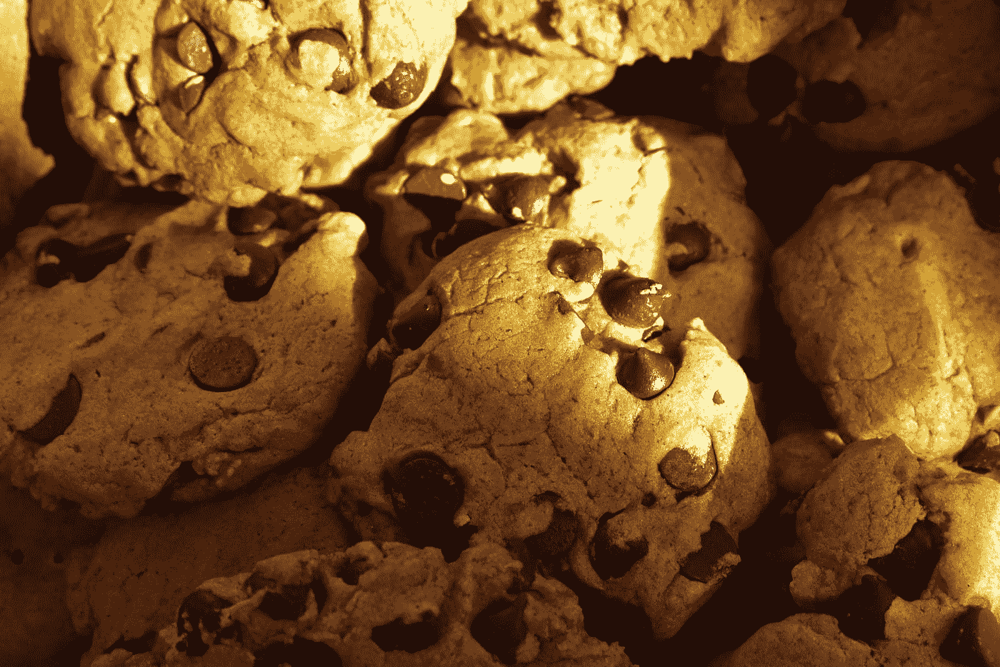
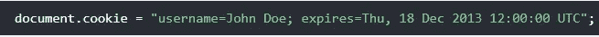
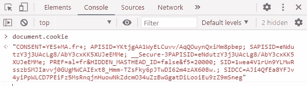
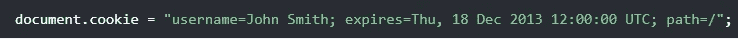
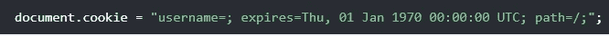

# 了解 JavaScript Cookies

> 原文：<https://javascript.plainenglish.io/understanding-javascript-cookies-2cb5bb994cbf?source=collection_archive---------11----------------------->

## 通过实例了解 JavaScript Cookies

Photo by [Arnold Francisca](https://unsplash.com/@clark_fransa?utm_source=medium&utm_medium=referral) on [Unsplash](https://unsplash.com?utm_source=medium&utm_medium=referral)

# 什么是饼干？

Cookies 在网页上存储用户信息。它们是一种数据，存储在计算机上的小文本文件中。发明 Cookies 是为了存储和记忆用户数据。当用户下次访问该网页时，他的信息和动作会被 cookies 记住。此外，当浏览器向服务器请求网页时，属于该页面的 cookies 会被添加到请求中。通过这种方式，服务器获得必要的数据来**记住**关于用户的信息。

Photo by [Grayson Smith](https://unsplash.com/@graysonsmith_photography?utm_source=medium&utm_medium=referral) on [Unsplash](https://unsplash.com?utm_source=medium&utm_medium=referral)

# 如何创建 Cookies？

JavaScript 可以创建、读取和删除 cookies。因此，我们可以创建一个简单的 cookie 来存储用户名，如下所示:

Create a JavaScript Cookie.

您还可以像这样添加 cookie 的到期日期:

Expiry Cookie.

# 用 JavaScript 读取 Cookie

你可以简单地用 JavaScript 读取 cookies。`**document.cookie**`将返回一个字符串中的所有 cookies。看一下下面的例子，我们在控制台上输入了`**document.cookie**` 属性来获取我存储在 youtube 网页上的 cookies。

Reading Cookies.

# 用 JavaScript 更改 Cookie

我们可以像创建 Cookie 一样用 JavaScript 修改它:

Change a Cookie.

如您所见，旧的 Cookie 被覆盖了。请注意，path 关键字用于指定 cookie 所属的位置或页面。

# 用 JavaScript 删除 Cookie

用 JavaScript 删除 Cookie 非常简单，您只需指定过期日期:

Deleting a Cookie.

请注意，您应该定义 cookie 路径，以确保删除正确的 cookie。

# 结论

如果你想在服务器和浏览器上存储数据，Cookies 是非常重要的。cookies 的替代方案是本地存储和会话存储，但是你不能像我们使用 Cookies 那样向服务器发送数据——它也只能在浏览器中使用。这就是这篇文章，我希望你今天学到了一些新的东西。