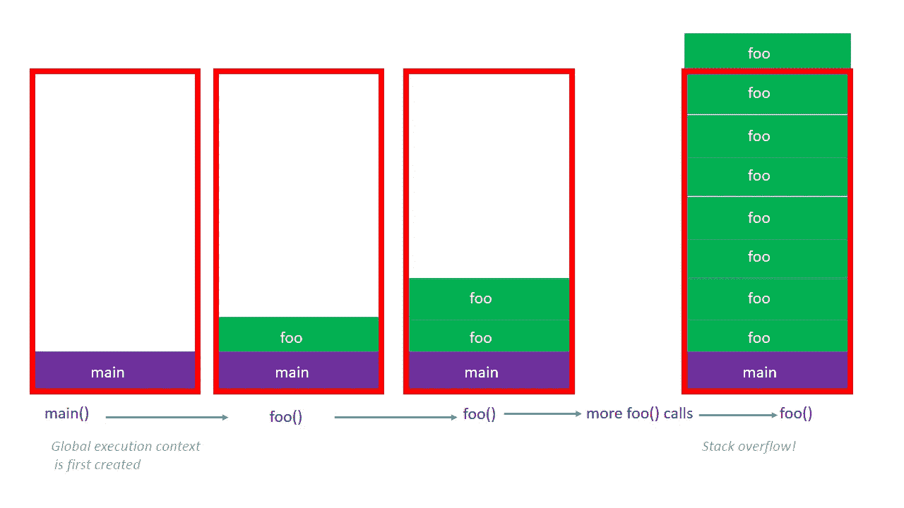

# 了解 JavaScript 执行上下文、调用堆栈和堆栈溢出

> 原文：<https://javascript.plainenglish.io/understanding-javascript-execution-context-call-stack-and-stack-overflow-157b7b358e88?source=collection_archive---------3----------------------->


Stack of Stones

JavaScript 很奇怪。在不完全理解 JavaScript 的情况下使用 JavaScript 是可能的，而且大多数时候 JavaScript 可以让你逃脱惩罚。如果你像我一样是一个有抱负的 JavaScript 忍者，那么你肯定会想理解 JavaScript。这将有助于您更好地调试代码并理解代码是如何工作的。

在这篇文章中，我对 JavaScript 执行上下文和调用堆栈给出了一个非常简单的解释。在这篇文章的最后，你将会有一个帮助你理解这些概念的心智模型。

# **给我上下文**


Wetin dey occur?

我记得看过一部电影，一个年轻的情人男孩和他的女朋友在咖啡店约会。当他在等她时，一位漂亮的女服务员走了过来。

女服务员看到小男孩的衬衫领子粗糙，弯下腰，用手搂住他的脖子，帮他把衣领弄直。就在这时，小男孩的女朋友走了进来，看到女服务员用手搂住她的情人，以为她在吻他！她走出了咖啡店，后来又走出了年轻人的生活。可怜的孩子。

你可能会得出结论，这个小男孩的情人有信任问题，她所看到的欺骗了她。为了正确地陈述情况，她断章取义*。*

# **JavaScript 执行上下文**

假设您有以下 JavaScript 代码:

```
function first() {
  second();
}function second() {
  third();
}function third() {
console.log('I am the third function')
}function boss() {
  first();
}// call the boss function
boss()
```

调用`boss` 函数将执行`first()`函数，后者执行`second()`，后者执行`third()`函数。在每个执行点，JavaScript 引擎必须能够告诉它当前正在执行哪个函数。它必须知道当前执行的*上下文*。

JavaScript 通过在每次执行函数时创建所谓的*执行上下文*来实现这一点。

执行上下文是一个**内部 JavaScript 概念**，JavaScript 引擎使用它来**跟踪**代码的执行。

想象一下，JavaScript 引擎会问自己:*我当前正在执行哪些代码？*执行语境回答了这一点。

# **全球语境**

现在您知道了，当函数被调用时，JavaScript 引擎为它们创建一个执行上下文——这让引擎知道它当前正在执行哪个函数。引擎如何知道它当前执行的代码是否是函数中的*而不是*，也就是说，它如何知道全局代码？(想想全局代码有不在函数中的代码。)

JavaScript 中有两种类型的上下文:函数上下文和全局上下文。在全局范围内而不是在函数内部执行的代码被放在全局上下文中。全局上下文通常表示为`main`。而且通常是第一个被创造出来的。

# **调用堆栈**

> *“这样，末后的要在前，先在后……”——马太福音 20:16*

单独为每个函数调用创建一个执行上下文并不能完全回答这个问题，“我当前正在执行哪个代码？”。JavaScript 引擎必须能够组织每个函数调用的执行上下文，使它更容易知道执行的顺序——哪个先执行。

在上面的例子中，当执行`boss` 函数时，情况是这样的:

```
boss -> first -> second -> third
```

然后函数调用必须“展开”，这意味着`third` 函数的执行将首先完成，然后`second`函数的执行完成，然后`first` 函数的执行完成，然后`boss` 函数的执行完成。

尽管首先调用了`boss` 方法，但它最后完成。该功能的执行遵循**先进后出**的方法。

您可以想象函数执行上下文按照它们被创建的顺序一个在另一个之上。这样第一个在底部，最后一个在顶部。(请记住，必须首先创建全局上下文。)


Creation of execution contexts

然后，函数的执行从顶部开始完成——当一个函数完成时，它从顶部被“移除”,并且它下面的一个被执行。这一直持续到调用堆栈为空！第一次真的变成了最后一次！


Popping of execution contexts when the execution is finished

JavaScript 引擎创建一个`stack` 数据结构，函数执行上下文在函数被调用时放置在该数据结构中。这个数据结构被称为**调用堆栈**。将执行上下文放入调用堆栈称为*插入*，而移除称为*弹出*。

当调用栈为空时，JavaScript 引擎知道代码执行已经完成。

# **什么是栈溢出？**

JavaScript 引擎中实现的调用堆栈的大小不是无限的，它有一个限制，坏代码可能会超过这个限制。

请考虑以下情况:

```
function foo() {
  foo()
}foo();
```

函数`foo` 调用自己，然后再次调用自己，没有停止的条件，所以我们有一个函数调用的无限循环。如果在浏览器中执行这段代码，浏览器将抛出一个错误，告诉您已经超出了调用堆栈的大小。当这种情况发生时，我们说堆栈溢出了。


*Testing the code in Brave Browser*

从概念上讲，这是调用堆栈中发生的情况:



啊哈！就是它，JavaScript 执行上下文，调用栈和栈溢出去神秘化！

# **闭幕词**

感谢您读到这里！我打赌这是值得的。如果你像我喜欢写这篇文章一样喜欢读这篇文章，(打字…对吗？:) )请在社交媒体上分享，你可以在 twitter 上关注我[@ sola the code](https://twitter.com/solathecoder)。

黑客快乐！

*如果你点击拍手图标 50 次，你认为会发生什么？*