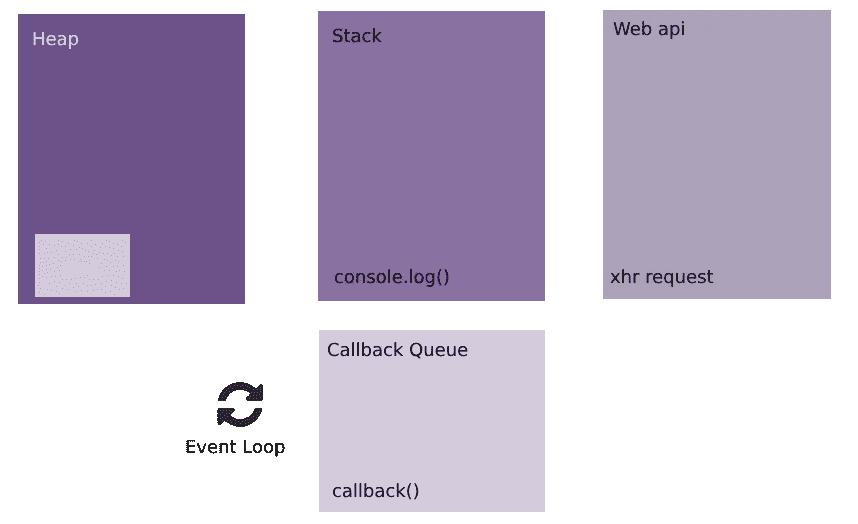
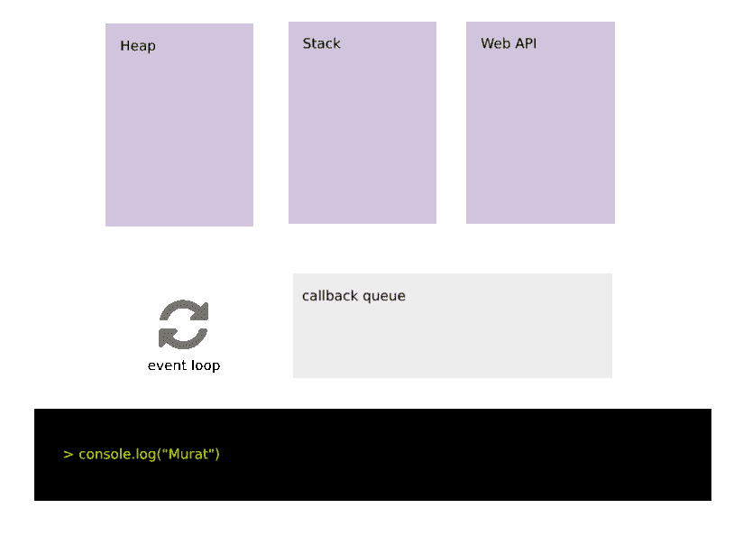

# 理解 JavaScript——堆、堆栈、事件循环和回调队列

> 原文：<https://javascript.plainenglish.io/understanding-javascript-heap-stack-event-loops-and-callback-queue-6fdec3cfe32e?source=collection_archive---------2----------------------->

“white smartphone on two softbound books” by [Kobu Agency](https://unsplash.com/@kobuagency?utm_source=medium&utm_medium=referral) on [Unsplash](https://unsplash.com?utm_source=medium&utm_medium=referral)

JavaScript 是一种单线程语言，这使得它不同于大多数语言。它缺乏多线程应用程序的能力，而不必处理复杂的问题，如死锁或共享变量问题。

## 单线程？

单线程语言缺少同时运行的并发进程。这意味着，如果你有一个花费很长时间的进程，那么它将**阻止其他进程**运行。因此，浏览器中定义了一个等待进程响应的超时。当进程在超时内没有响应时，您将看到一个弹出窗口，询问您是否终止进程。

> 不要在浏览器上运行任何需要很长时间的业务，以免阻塞其他功能。

那么，JavaScript 如何模拟在多线程环境中运行我们的命令呢？为了回答这个问题，让我们深入了解 JavaScript 环境。

## JavaScript 环境

JavaScript environment

虽然 JavaScript 是一种单线程语言，但我们有一个强大的助手，那就是能够管理复杂操作的浏览器。Web API、回调队列和事件循环机制是浏览器的一部分。

下面我们来深入挖掘一下每个部分的一些细节。

## 许多

堆是我们定义变量时存储对象的地方(内存)。

## 堆

堆栈保存我们的函数调用。在每个新的函数调用中，它被推到堆栈的顶部。通过堆栈跟踪，您可以在 JavaScript 上出现异常时看到您的堆栈。

## Web API

浏览器已经定义了 API，开发者可以使用这些 API 进行复杂的处理，例如获取访问者的位置，地理位置被定义。在参考文献 *(1)* 的链接中定义了 API 列表。

## 回调队列

当一个进程完成它的任务时，比如一个 xhr 调用，它会被放入回调队列中。回调队列是在我们的堆栈为空之后由事件循环进程触发的，这意味着进程在该队列中等待，直到我们的堆栈为空。一旦我们的堆栈没有函数调用，那么一个进程就会从回调队列中弹出并被推入堆栈。

**事件循环**

一个负责检查堆栈，然后不断触发回调队列的进程。

## 例子

setTimeout example

上述示例的预期输出是什么？它从一个 console.log 开始，然后继续一个 setTimeout 函数，我们希望这个函数立即运行(？)通过给出一个“0”超时然后另一个 console.log

> setTimeout 是一个特殊的东西。ECMAScript 规范中没有定义。它是一个 Web API (2)。它异步工作。给定的超时并不保证函数在给定时间后仍能工作，但保证它至少会等待给定时间。因此 setTimeout(fn，0)不会立即开始，但会等待至少 0 毫秒。

让我们解释一下当我们运行上面的代码片段时，它将如何表现。

1.  我们的第一个 console . log(“Murat”)将被压入堆栈，因为我们正在进行函数调用。
2.  变量将保存在堆(内存)中
3.  因为它不是异步调用，所以它将输出给定的参数
4.  第一个 console.log 函数将从堆栈中移除，堆将为空
5.  将调用 setTimeout 函数。所以它会被压入堆栈
6.  这是一个异步函数，也是一个 Web API 函数。它将被推送到 Web API 框，setTimeout 函数将从堆栈中移除
7.  将在后台启动一个计时器，至少等待给定的时间量，以设置超时。
8.  console.log("Yusuf ")将被调用，它将被推到堆栈中，Yusuf 将被存储在堆中。
9.  它将输出优素福。但同时，我们的事件循环将继续检查堆栈的状态。
10.  输出 Yusuf 后，它将从堆栈和堆中移除。
11.  当计时器确定至少等待了给定的时间，它将被推送到回调队列(console.log("Fatih "))
12.  当堆栈变空时，我们的事件循环将触发回调队列。
13.  接下来，console.log("Fatih ")将被放入堆栈

因此，我们的输出将在“缪拉”，“优素福”，“法提赫”的顺序

## 参考

1.  Web API 列表，[https://developer.mozilla.org/en-US/docs/Web/API](https://developer.mozilla.org/en-US/docs/Web/API)
2.  setTimeout 规范，[https://developer . Mozilla . org/en-US/docs/Web/API/WindowOrWorkerGlobalScope/settime out](https://developer.mozilla.org/en-US/docs/Web/API/WindowOrWorkerGlobalScope/setTimeout)

*如果你喜欢我的文章，你可以鼓掌支持我，关注我。
我也在*[*LinkedIn*](http://www.linkedin.com/in/muratcatal)*上，欢迎所有邀请。*