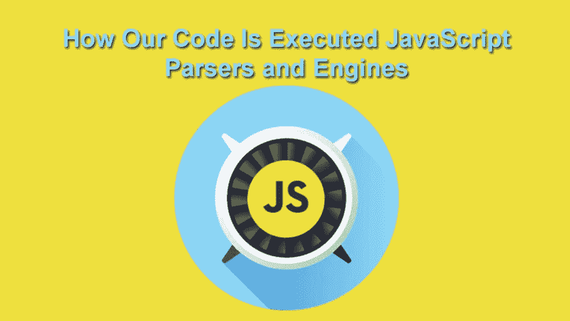

# 了解 2020 年的 JavaScript 解析器

> 原文：<https://javascript.plainenglish.io/understanding-javascript-parsers-in-2020-a2f00830d5fe?source=collection_archive---------6----------------------->



让我们从理解 javaScript 如何在幕后解析我们的代码的核心概念开始新的一年。我认为，在编写业务逻辑时，了解 javaScript 如何工作是很重要的，这样可以更好地理解为什么要编写一行特定的代码，可以是实例化一个变量，也可以是调用一个函数。

# JavaScript 解析器概念:

每当我们编写任何一段像 var myName = "John "这样的 javaScript 代码时，它都会被转换成令牌。标记只不过是代码字符串表示，因此您的代码将被转换为“var”、“my name”“=”、“John”。因此，如果这个语法与 javaScript 语法相匹配，javaScript 语法是 javaScript 引擎的一个定义范例，那么 javaScript 会将其编译为有效的 javaScript 语法。

而如果你写整数 m = 10 这样的东西，最终会是' Integer '，' m '，' = '，' 10 '，那么 javaScript 会告诉我们语法是无效的，因为 javaScript 字典中不存在像' Integer '这样的定义。

## AST(抽象语法树):

当我们谈论 javaScript 中的标记时，标记是 javaScript 表达式的糖语法，所以现在当我们编写 javaScript 表达式时，解析器开始解析语法并创建一个 **AST，它只是一个表示源代码的数据结构。**

让我们以我们之前定义的为例。

```
var myName = “John”
```

在这里，如果我们将这段代码粘贴到 https://astexplorer.net/的浏览器[中，我们将会得到这样的结果:](https://astexplorer.net/)


JSON code structure of the JS syntax

让我们试着理解树结构，以便清楚地了解解析器如何解析 javaScript 语法。从上面的图中我们可以看到，解析器返回给我们一个大对象，它有类似**‘开始’，‘结束’，‘主体’，‘源类型’的属性。 *Start* '** 和' ***End* '** 属性什么都不是，但它表示第一个字符开始和结束的索引是语法的长度。这里从 0 开始，到 19 结束。“Body”是一个对象数组，它表示声明的类型和标识符，在本例中是“myName ”,它还告诉我们“value”中包含的值。种类是可变，可以是任何数据类型。

## JavaScript 解析器的作用域:

当 JavaScript 解析器开始解析时，它也会对变量进行作用域分析。至于上面的例子。

```
let globalVariable = 10;
function abc(){
  let localVariable = 5;
  console.log("Variable is " + localVariable);
}
```

如果我们运行上面的函数，解析器将确定变量“globalVariable”和“localVariable”的范围。该函数将打印 5，因为变量 localVariable 将首先尝试找到它的声明，并且它将找到 5，因为它的阻止范围。

然而如果我们举下面的例子。

```
let globalVariable = 20;
function foo(){
  let localVariable = 15;
  console.log("variable is " + localVariable);
  console.log("variable is " + globalVariable);
}
console.log("variable is " + localVariable);
console.log("variable is " + globalVariable);
```

在上面的例子中，当函数 foo 执行时，它将打印 15，因为它将首先在链上找到它的声明，并且“globalVariable”是全局定义的，所以一旦它向上移动，它将找到它的声明。

但是 console.log("变量是"+local variable)；将打印未定义的**,因为它不会在其上下文中找到局部变量的声明。**

## 优化性能的预解析技术:

JavaScript V8 引擎有一种特殊类型的解析算法，称为预解析器，速度是完全解析的两倍，因为它只解析运行时或启动时需要解析的代码，并且只定义语句的范围。JavaScript 解析器解析代码、构建 AST、确定变量范围并发现错误。当我们在执行上下文中定义函数时，它会占用一些内存并等待函数调用。但是在某些情况下，我们会定义一些函数，我们不会立即调用它们，我们可能会在以后调用它们，但是解析它们会占用我们的内存。

*解决方案:*

我们可以通过调用预解析器来解决这个问题，预解析器只解析需要进入执行上下文的那部分代码，并且只定义其他代码的范围，而不解析它们。这将释放内存，因为在内存中查找作用域是一项开销很大的操作。让我们看一个例子来理解这个概念。

```
function avenger1() {
  console.log("I am avenger 1")
}function avenger2() {
  console.log("I am avenger 2")
}avenger1();
```

在上面的例子中，我们调用了复仇者 1，而复仇者 2 被定义了，但现在没有调用，可以在以后的某个时间点调用。因此，javaScript 将在加载时完全解析函数，并将其保存在内存中，即使尚未调用复仇者 2。这造成了冗余的内存分配，如果您正在构建一个项目，其中声明了 20-30 个这样的方法，而您并没有立即调用它们，那么如果您的应用程序扩展，它将在您的浏览器中调用严重的延迟，并且您可以通过告诉 javaScript 解析器不要在此时解析该函数来提高性能。

让我们再举一个例子，看看当我们将两个函数链接在一起时，如何解决这个问题。

```
(function abc(){
 console.log("I am fully parsed or eagerly parsed");
  function xyz() {
    console.log("I am lazily parsed");
  }
})();
```

当我们调用上面的函数时，当解析器到达第一个括号时，它知道必须立即调用，所以它完全解析 abc 函数，构建它的 AST，当到达没有被调用的 xyz 时，它缓慢地解析 xyz 函数，只创建它的作用域。

## 解析嵌套函数时出现问题:

嵌套函数或闭包是可以访问其外部函数的变量的函数，其嵌套函数的返回值存储在内存中，直到调用该函数，以便外部函数可以访问其内部函数返回的值。

举下面的例子来加深理解。

```
(function abc(){
  let x = 1;
  let y = 2;
  function xyz(){
    return x;
  }
return xyz;
})
```

在上面的例子中，函数 abc 被完全解析了，因为它被放在括号中，而内部函数 xyz 被部分解析了，因为它已经被定义但还没有被调用。

函数“xyz”返回 x 的值 1，因为它可以访问其父函数的变量。因此，当解析“xyz”函数时，它会在其作用域中查找变量 x，因为它没有找到变量 x，所以它会查找其父作用域。这里，变量 x 存储在 abc 的函数上下文中，并一直保留到调用“xyz”函数。

当我们调用内部函数“xyz”时，它在上下文中找不到 x，所以它查找它的父函数，在函数上下文中查找上下文比在调用栈中查找开销更大。

感谢阅读！如果您有任何问题，请随时联系 rajrock38@gmail.com，通过 [LinkedIn](https://www.linkedin.com/in/rajdeepcoder/) 与我联系，或者通过 [Medium](https://medium.com/@rajrock38) 和 [Twitter](https://twitter.com/rajrock38) 关注我。

如果你觉得这篇文章很有帮助，给它一些掌声会很有意义👏并分享出来帮别人找！并欢迎在下方发表评论。