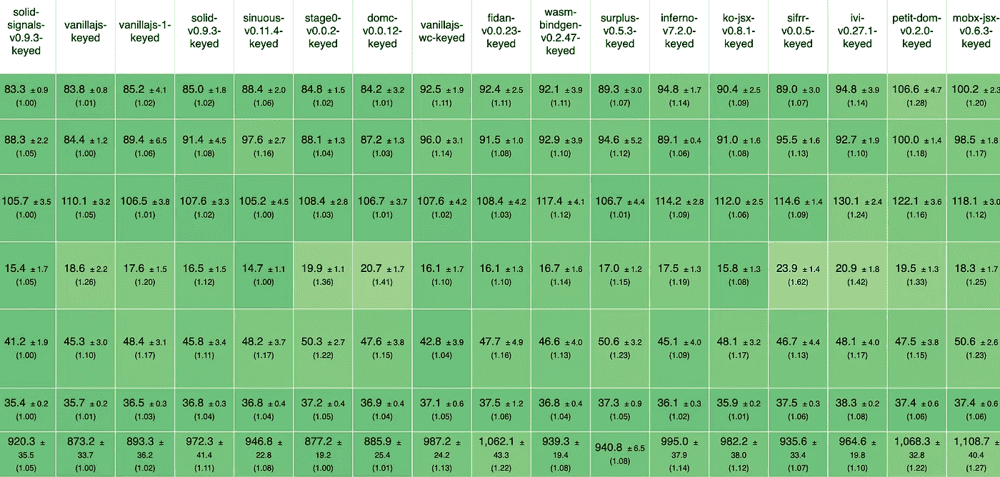
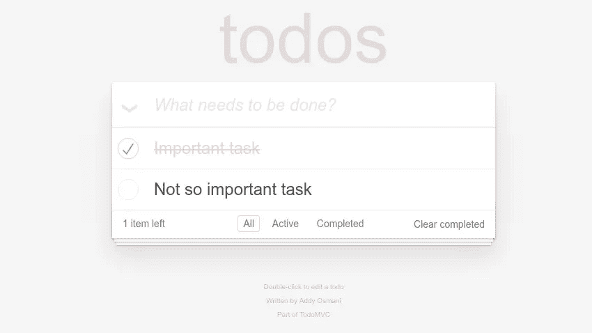

# 了解 JavaScript UI 基准测试

> 原文：<https://javascript.plainenglish.io/understanding-javascript-ui-benchmarking-afe4278b4b46?source=collection_archive---------4----------------------->

Official JS Framework Benchmark Results — Chrome 75

似乎每次有一个新的 UI 框架或你最喜欢的框架中的新功能，我们都会看到一个新的基准，展示我们是如何见证下一个大事件的。但是不要害怕。所有这些花哨的测试和基准可归结为 3 个类别。理解你将能够正确地辨别基准显示的是什么，以及你应该赋予它们什么样的价值。归根结底，不管什么闪亮的新事物将彻底改变开发人员的体验，这些库最终负责做一件事:渲染屏幕。我将保持事情的介绍性，但如果你想更深入地挖掘技术细节，我强烈建议阅读:

 [## 如何在 Web 框架基准测试中胜出

### 两年前，我开始了探索虚拟 DOM 的旅程，并编写了 kivi 库。这个图书馆正在使用关键思想…

medium.com](https://medium.com/@localvoid/how-to-win-in-web-framework-benchmarks-8bc31af76ce7) 

我将关注运行时基准，而不是加载基准。加载和大小基准很重要。但是，除非你服务的是一个静态网站，否则只构成了一小部分的性能特征。是的，第一印象很重要，但是不要把 TTI(互动时间)和总体表现混为一谈。

我还将根据各自的受众对基准类别的评价任意打分。请记住，这完全是我的观点，特定基准的特定值可能会因其质量而有很大差异。

# 动画

Disney Mickey Mouse Standing Figurine By Skitterphoto

## 概观

这些是最古老的基准。在我们能够精确测量执行时间之前，我们只是抛出一个测试，最终用户将自己查看它来决定哪个库更好。它们通常包括在屏幕上移动几个小对象，并可能使用 FPS 来指示该库的性能如何。这些测试的关键定义特征是，它们通常不涉及添加或删除对象，而只涉及同时更新许多对象的属性。

## 例子

*   Sierpinski 的三角形基准——引入 React Fiber 的基准。我从网上收集了一些例子:[https://github.com/ryansolid/solid-sierpinski-triangle-demo](https://github.com/ryansolid/solid-sierpinski-triangle-demo)
*   circles Benchmark——2010 年基干 vs Ember Benchmark 的翻版【https://github.com/ryansolid/circles-benchmark 

## 期待什么

这些测试传统上迎合了虚拟 DOM 库上的反应性 DOM 库和不可变数据上的可变性。类似的技术被用于这次 [MobX 与 Redux 的比较](https://hackernoon.com/an-artificial-example-where-mobx-really-shines-and-redux-is-not-really-suited-for-it-1a58313c0c70)。这些测试通常过于极端，不能被认为是真实的，但是它们确实在视觉上给了你一些库如何随着浏览器过载而退化的想法。

## 戒备

这些基准测试调度开销，因此使用不同方法的实现会产生更大的差异。像`requestAnimationFrame`、`Promise.resolve`或`requestIdleCallback`这样的事情比图书馆做的大多数事情都要重要得多。这些是任何人都可以使用的技术。这些测试中有很多来自早期，在那个时候这些技术是不被期望的，所以实现者可以通过使用这些技术使某些库比其他库更快地出现。

## 优势和劣势

这些基准测试可以显示该库理论上的最高性能。它们通常在复杂的 DOM 操作上更轻，所以你看到的开销主要在 JavaScript 库中。

出于同样的原因，这些测试通常不再特别有趣，因为大多数现代库都非常高效。没有达到荒谬不切实际的程度，比如说用 DOM 元素制作一个 3D 射击游戏(你为什么不用 WebGL？)这个不太相关。

## 得分

*   真实值:3/10
*   库写入值:5/10

# 快照

Shallow Focus Photo of Dslr Camera on Brown Wooden Table By Marcus Spiske

## 概观

随着 React 和虚拟 DOM 的出现，这些基准开始出现。它们的工作原理是生成一些未知的嵌套数据块，然后将它们扔向库，以确定如何处理。通过查看库如何处理不同类型的输入，您可以了解库如何执行各种类型的操作。

## 例子

*   JS 重画性能(DBMon) —变化突变率的数据库监控场景[http://mathieuancelin.github.io/js-repaint-perfs/](http://mathieuancelin.github.io/js-repaint-perfs/)
*   ui bench——一个图书馆作家的调解测试瑞士军刀[https://localvoid.github.io/uibench/](https://localvoid.github.io/uibench/)
*   DOM 调解器基准—计算由不同数据快照[https://somebee.github.io/dom-reconciler-bench/index.html](https://somebee.github.io/dom-reconciler-bench/index.html)引起的 DOM 突变数量

## 期待什么

本质上与前一类完全相反。这些测试迎合了不可变的数据结构和不同的引擎。由于库无法访问数据结构，这些测试倾向于排除使用专用数据结构的反应库。这是一个邀请情景的测试。除非你真的想要区分大树，否则这里很少有实际应用。如果定期从服务器重新呈现大型数据树似乎是一个合理的想法，那么还有其他地方需要优化。

## 戒备

由于这些基准往往只涉及爆炸数据，库有一些解释如何处理它的空间。这使得最终用户很难识别这些基准。DOM 操作，尤其是创建和删除，总是最昂贵的，在一些测试中，即使值不同，DOM 也可能总是相同的形状。小心那些使用 DOM 回收、重用或池化的库。这些模式在基准测试中可能是无害的，但可能会导致视觉上的僵硬、不正确的行为和视图损坏。如果你感到困惑，我推荐你阅读这篇文章和相关文章:[https://www.stefankrause.net/wp/?p=342](https://www.stefankrause.net/wp/?p=342)。

> 当你考虑像 web 组件和 Web 平台的未来这样的事情时，它实际上比那些文章指出的还要严重。大多数虚拟 DOM 库已经远离了这些技巧，但是每隔几个月就会有一些新的框架相信他们通过发明这些方法突破了性能边界。不要被骗了。尽可能快地逃跑。你以后会感谢我的。

这些基准对于一些库之间的比较可能是有价值的，但对于其他库则完全没有用处。简单地说，伴随某些问题的解决方案会因方法的不同而不同，使得这些基准的某些部分不适用。大多数 Web 应用程序是文本和媒体数据的表格和网格，您可以增量加载(如果您有效率的话)并对其执行增量操作。这些测试与增量测试相反。对于一些库来说，这可能是最坏的情况。对于其他人来说，基准真的毫无意义。

注意这些基准测试中包含的反应库，因为它们通常得分很低(我指的是非常低，比如比`innerHTML`更低)。为这些库设计一个解决方案是可能的，但是它们存在于用户空间中，因为这超出了它们的预期用途。因此，这些基准的实现者通常不会为幼稚(和不正确)的方法之外的事情而烦恼。

## 优势和劣势

这些基准测试能够在各种场景下描述初始渲染瓶颈，令人惊叹。它们还让您可以随时测试最坏的情况。这里有很多控制，所以你可以花几天时间做不同的基准测试来理解不同的事情。你可以在不求助于荒谬的大量数据的情况下获得良好的操作度量。

如前所述，他们最大的弱点是他们的特殊性。甚至不同的调解方法也会干扰类似的测试。他们对绝大多数真实案例的脱离也无助于他们的总体吸引力。这些是最难实现的。鉴于其多种多样的测试和测量方法以及对所使用的不同技术进行分类的能力，UIBench 确实是这一类别中的质量佼佼者。

## 得分

*   真实值:2/10
*   库写入值:8/10

# 托多斯

TodoMVC

## 概观

这些基准测试通常基于获取一个演示应用程序，然后将其提升到可以进行有意义的测量的地方。它们并不都是 todos 应用程序(也不是所有的 Todos 基准都属于这一类)，但是 list 应用程序拥有你通常在应用程序中执行的所有主要 DOM 操作。这些基准测试试图从一个演示应用程序开始，通过模拟用户输入来触发测试，从而呈现真实的性能视图。

## 例子

JS 框架基准测试——目前最流行的基准测试之一【https://github.com/krausest/js-framework-benchmark 

TodoMVC 性能比较—旧的 Todo 比较，但具有所有部件【https://github.com/lhorie/todomvc-perf-comparison 

## 期待什么

这些基准通常让实现者管理他们的数据，这样他们就可以展示真正的库代码是什么样子(当在优化场景下使用时)。库可以展示他们希望展示的特性，所以查看代码通常是一种更愉快的体验，因为它应该看起来或多或少像一个熟悉的 Todos 应用程序。当查看这些基准时，只查看性能几乎没有意义。这个想法是你想象自己写代码。如果代码不适合这种类型的基准测试，实现者应该认为它失败了。

## 戒备

这些实际上不是真实世界。在现代设备上获得有意义的结果所需的极端情况，即使有 CPU 节流和移动模拟也只能做到这一点。由于这些测试给了实现者如此多的控制权，所以人们常常可以绕过库，在其上添加普通的 JavaScript 优化。测试场景是完全已知的，所以如果你想赢的话，你可以只写代码在某个场景下做最佳的工作。

几乎所有适用于其他基准测试的欺骗在这里都适用，所以维护者需要保持警惕。具体来说，寻找事件处理(委托或非委托)、渲染调度(`requestAnimationFrame`)、节点重用(键控与非键控)的差异。

## 优势和劣势

这些基准很好地展示了开发人员的体验。即使规模不合适，它们也可以涵盖各种各样的真实案例。

然而，它们可能是最容易被有意或无意滥用的。你需要确保这种比较是公平的，以充分利用它们。即使从现实世界的意图出发，到了紧要关头也不会变得更加现实。

## 得分

*   真实值:5/10
*   库写入值:7/10

# 结论

当心基准。

不是认真的。当心基准。很少有人试图展示超出展示者所希望的东西。几乎所有的都在某些方面有缺陷。希望在这篇文章之后，当你遇到新的问题时，你至少能够把它们都解决掉。他们并非对每个人都没用。他们可以测试对库作者特别有用的非常具体的东西，以确保他们在各种情况下都有良好的表现。但是当你看着它们做决定的时候，一定要理解它们想要表达什么。