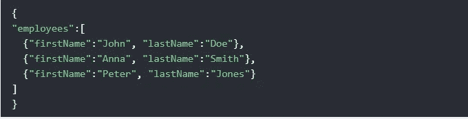
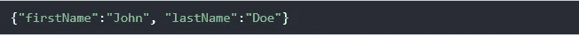
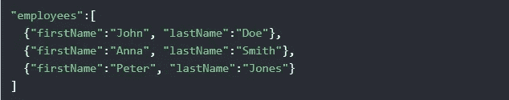
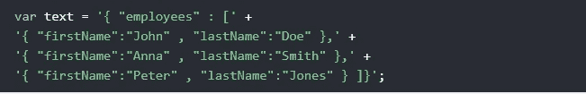

# 理解 JavaScript 中的 JSON

> 原文：<https://javascript.plainenglish.io/understanding-json-in-javascript-cba0570f697e?source=collection_archive---------11----------------------->

## 用实际例子学习 JSON

Photo by [Safar Safarov](https://unsplash.com/@codestorm?utm_source=medium&utm_medium=referral) on [Unsplash](https://unsplash.com?utm_source=medium&utm_medium=referral)

## JSON 是什么？

**JSON** 代表 JavaScript Object Notation，它是一种存储和传输数据的格式，当数据从服务器发送到网页时经常使用。JSON 语法源自 JavaScript 对象表示法语法，但是 JSON 格式是纯文本的。生成 JSON 数据的代码可以用任何编程语言编写，而不仅仅是 JavaScript。

Photo by [Luca Bravo](https://unsplash.com/@lucabravo?utm_source=medium&utm_medium=referral) on [Unsplash](https://unsplash.com?utm_source=medium&utm_medium=referral)

# JSON 示例:

为了帮助您更好地理解这个主题，我从 W3schools 获得了一个 JSON 语法示例。该示例定义了一个 employees 对象:一个由 3 条雇员记录(对象)组成的数组:

JSON Example.

如您所见，JSON 语法与 JavaScript 对象的语法相同。这就是为什么 JavaScript 程序可以轻松地将 JSON 数据转换成原生 JavaScript 对象。

## JSON 对象

JSON 对象写在花括号内，就像普通的 JavaScript 一样。

JSON Object.

## JSON 数组

JSON 数组写在方括号内。就像在普通 JavaScript 中一样，JSON 数组可以包含对象。看看下面的例子:

JSON Array.

## 将 JSON 转换成 JavaScript 对象

当我们想从服务器获取数据并显示在网页上时，我们需要将 JSON 转换成 JavaScript 对象。为了做到这一点，我们需要创建一个包含 JSON 语法的 JavaScript 字符串，然后，我们还必须使用 JavaScript 内置函数`**JSON.parse()**`将字符串转换成 JavaScript 对象。看一看下面的例子，以便发现如何实现这一点。

String Containing JSON Syntax.

Convert the string to an Object.

## 结论

如您所见，在从服务器获取数据时，JSON 非常重要。它独立于语言，易于理解。每个开发人员都必须了解如何使用它。这就是这篇文章，我希望你今天学到了一些新的东西。