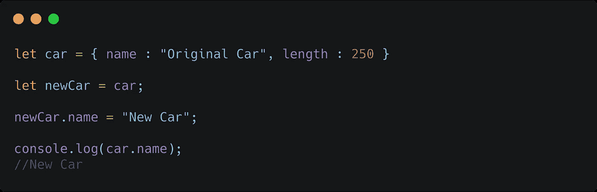
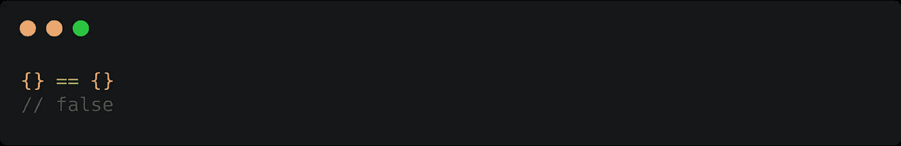
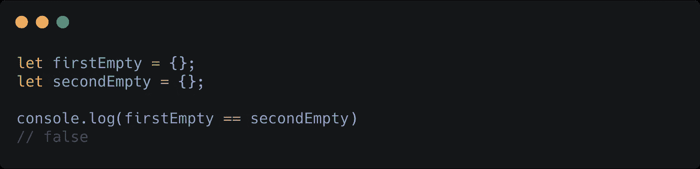
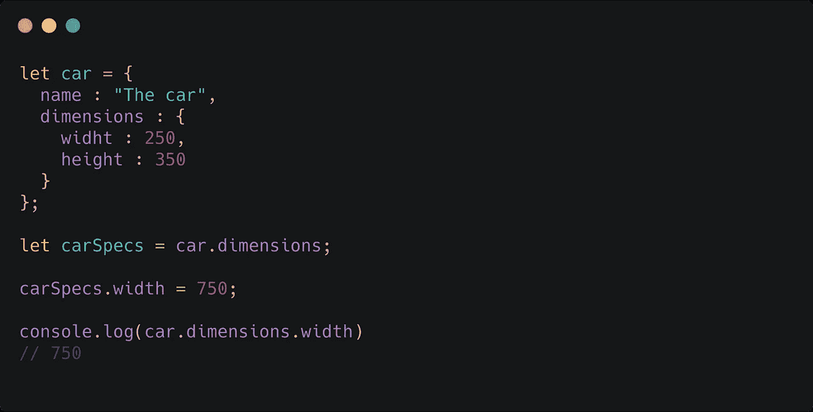
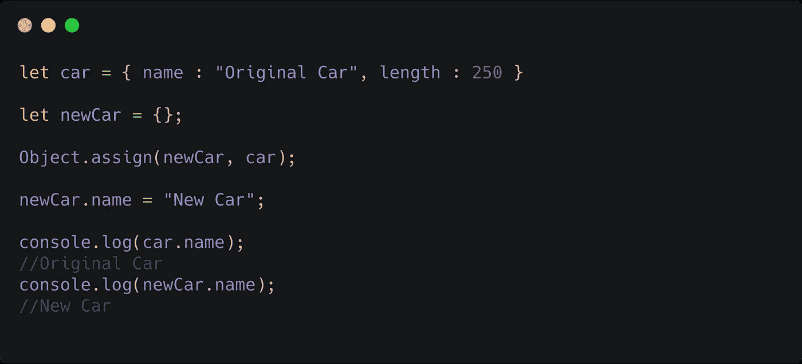
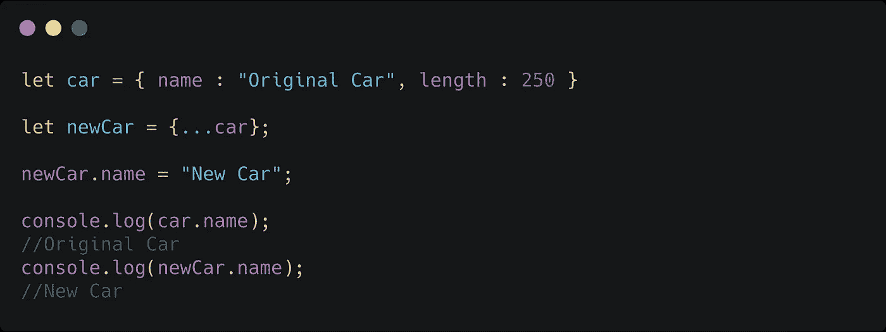
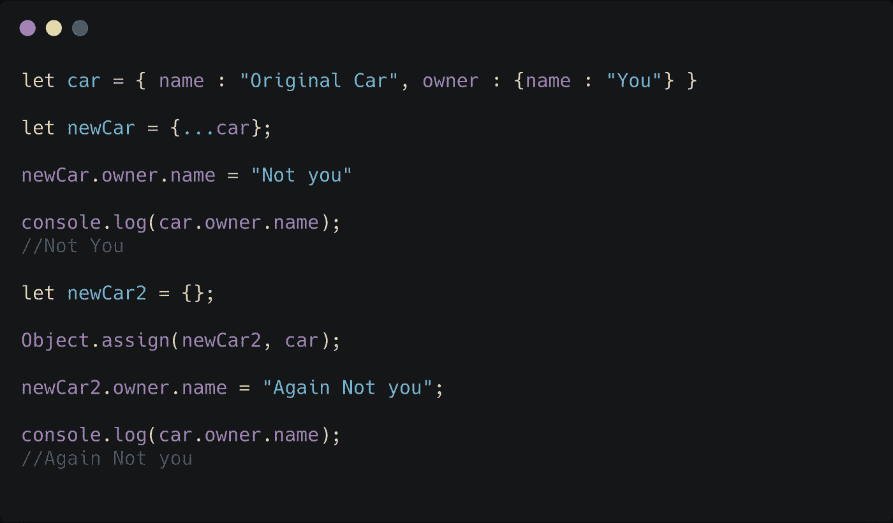
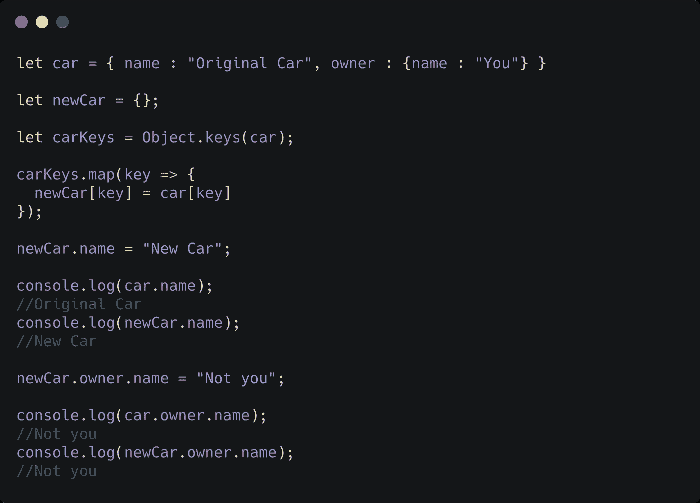
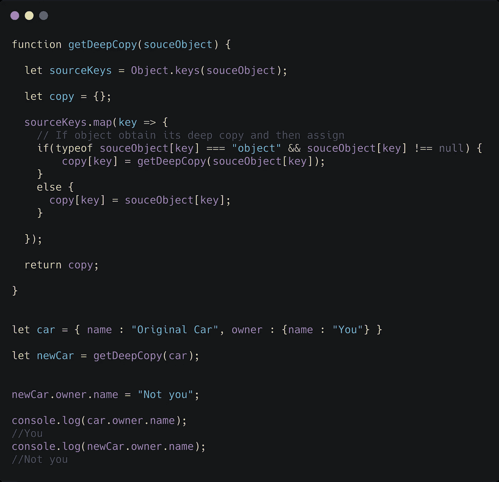
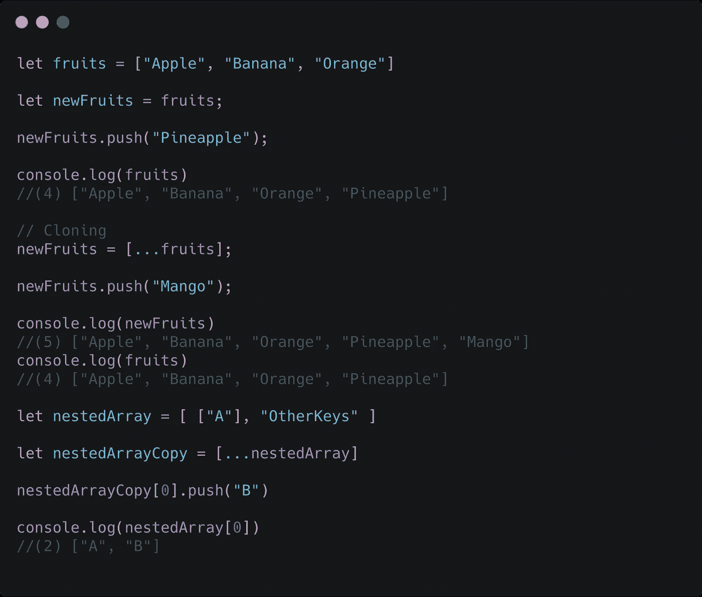

# 理解 JavaScript 中的对象和数组(避免数小时的调试)

> 原文：<https://javascript.plainenglish.io/understanding-objects-and-arrays-in-javascript-and-avoid-hours-of-debugging-1e66dfa710db?source=collection_archive---------7----------------------->

像任何 JavaScript 开发人员一样，您必须广泛使用对象和数组来保存数据。在几乎所有的情况下，你必须复制、更新、删除数据，而不完全理解对象和数组在 JavaScript 中是如何工作的(以及它在 JavaScript 中是如何不同的),这通常工作得很好，直到你遇到一些问题。所以让我们开始吧。

## **1。变量存储参考**

当你用 object 初始化一个变量时，它会保存这个变量的引用。

## 2.复制对象会复制引用

我们创建了一个对象，并将其复制到另一个对象。然后更改新对象的“名称”。现在，如果对象的值被复制，原始值应该保持不变。但这里确实发生了变化。因此，它不是复制值，而是复制引用。

## 2.比较对象

比较对象变得非常棘手。不是比较对象的值，而是比较它的引用。

让我们从比较两个空对象开始。

太令人惊讶了！这里发生的事情是创建了两个空对象并比较了它们的引用。由于创建一个新的对象总是在不同的地方，这两个对象的引用将是不同的，因此不相等。为了更好地理解这一点，这里有另一个等价的代码。

所以当我们分配 ***firstEmpty，*** 一个对象被创建，它的引用被分配给它。现在同样的事情发生在 ***secondEmpty*** 上，因此不同的引用不匹配。

## 3.多级对象

当处理 JavaScript 对象时，你必须明白的一件事是，被赋值的是引用，而不是值。

这里***car . dimensions***是一个对象，所以它没有值，只有对象的引用。所以当我们将***car . dimensions***复制到 ***carSpecs*** 时，它的引用也被复制，所以对 ***carSpecs*** 的任何更改也会更改***car . dimensions***。

因此，任何存储对象的键实际上都存储了引用。

## 3.制作副本(像实际副本一样)

那么我们如何实际复制一个对象，改变它却不会改变它的原始版本呢？有多种方法可以做到这一点。

## 对象.分配

我们创建了一个新的空对象，这当然是一个新的引用。我们使用***object . assign***复制 ***car*** 到 ***newCar 的所有密钥及其值。***

## 扩展运算符(…)

因此，我们使用扩展算子来扩展对象，然后使用对象来组成新的对象。它的工作方式非常类似于 Object.assign

让我们再举一个例子:

这里发生了什么？即使我们复制了使用 ***展开的运算符*** 和 ***Object.assign*** 在 new 中改变也改变了原来的值。为了理解我们先试着理解一下这些 ***传播运算符*** 和***object . assign***实际上是如何工作的？所以这两个方法都不是直接给新对象赋值引用，而是一个接一个地复制它的键。下面是一个等价的代码:

现在，由于我们一个接一个地复制键，对汽车*的引用没有通过其每个键的值复制到新汽车。所以改变 ***中的【new car . name】***不会改变 ***中的*** 。*

*但是 ***car.owner*** 本身就是一个对象，所以它的引用被复制到了 ***newCar.owner*** 中，这样任何一个的链接和改变都会改变另一个。*

*所以这些克隆对象的方法只适用于单级对象，而不适用于嵌套的多级对象，这对于你的大多数用例来说已经足够了。*

*那么我们如何创建一个没有引用原始对象的副本呢？这种方法的问题是，如果一个 keys 存储了另一个对象，而我们复制了它。如果我们不直接复制嵌套的对象，而是像遍历原始对象一样逐个遍历它的键，会怎么样呢？如果它有任何嵌套对象，也是如此。*

**

*因为我们复制了所有嵌套对象，所以没有复制引用，只有值被复制。注意:我们只检查嵌套对象。可能有嵌套数组，它们也作为引用存储。*

*请注意，使用递归进行深度复制几乎是不需要的，而且在处理大量数据时效率很低。*

# *数组*

*数组也是如此。看看这个例子:*

**

*这应该会让您对数组有一个大致的了解。我们可以用同样的方式处理嵌套对象，递归地复制任何嵌套数组。*

*我希望这能为您节省一些时间来识别和避免应用程序数据中的意外变化。*

## ***用简单英语写的 JavaScript 笔记***

*我们已经推出了三种新的出版物！请关注我们的新出版物:[**AI in Plain English**](https://medium.com/ai-in-plain-english)[**UX in Plain English**](https://medium.com/ux-in-plain-english)[**Python in Plain English**](https://medium.com/python-in-plain-english)**——谢谢，继续学习！***

***我们也一直有兴趣帮助推广高质量的内容。如果您有一篇文章想要提交给我们的任何出版物，请发送电子邮件至[**submissions @ plain English . io**](mailto:submissions@plainenglish.io)**，并附上您的 Medium 用户名，我们会将您添加为作者。另外，请让我们知道您想加入哪个/哪些出版物。*****