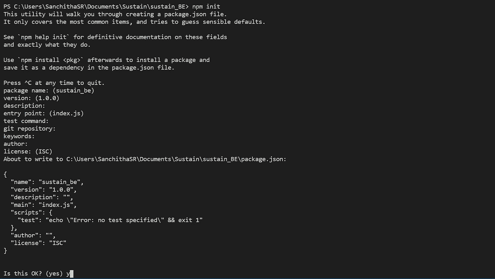
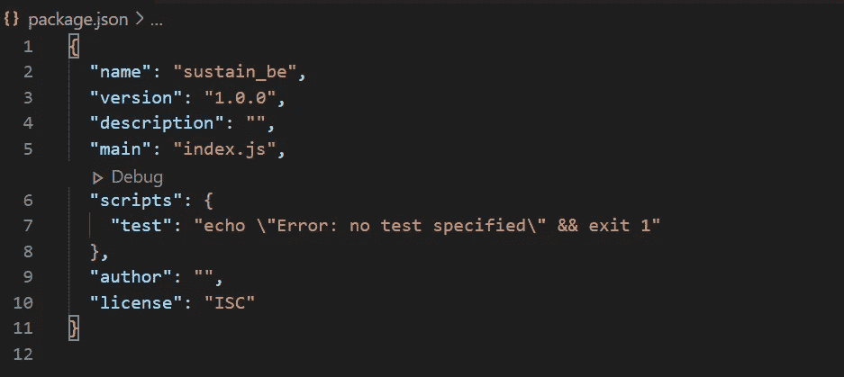

# 了解 package.json

> 原文：<https://javascript.plainenglish.io/understanding-package-json-33c810ea8acb?source=collection_archive---------8----------------------->

**Package.json** 是 Node.js 项目根目录下的一个文件，保存着与项目相关的各种信息。该文件向 npm 提供信息，允许它识别项目以及处理项目的依赖项。

它还可以包含其他元数据，如*项目描述、特定发行版中的项目版本、许可信息，甚至配置数据* —所有这些对于 npm 和包的最终用户都至关重要。

package.json 文件:

*   列出项目所依赖的包
*   指定您的项目可以使用的包版本
*   使您的构建可重复，因此更容易与其他开发人员共享

# 如何创建 package.json 文件？

您可以通过运行带问题的 CLI 或创建默认文件来创建 *package.json* 文件。

1.  打开命令行，导航到项目的根目录。
2.  运行以下命令

```
npm init
```

3.在命令行中回答问卷。



如果希望使用默认值创建文件，可以运行以下命令。

```
npm init --yes
```



Package.json file

# 了解 package.json 的属性

## 名字—

这是 package.json 文件中最重要和*必需的*字段。这应该代表项目的名称。

```
"name": "my-blog-backend",
```

## 版本—

这也是 package.json 文件的一个强制属性，就像名称一样。此属性表示项目模块的版本。此处指定了该字段要遵循的规则[。](https://docs.npmjs.com/about-semantic-versioning)

```
"version": "1.0.0",
```

## 描述—

您可以键入更具体的项目描述，以便将项目理解为字符串。这有助于人们发现您的包裹，因为它列在`npm search`中。

```
"description": "This project is the personal blog",
```

## 主要—

main 字段表示作为程序主要入口点的文件。这应该指向作为应用程序入口点的文件。

```
"main": "server.js",
```

## 脚本—

*"scripts"* 属性是一个字典，包含在包的生命周期中的不同时间运行的脚本命令。关键是生命周期事件，值是在该点运行的命令。

```
"scripts": {
  "start": "npx babel-node src/server.js",
  "dev": "npx babel-node src/server.js",
  "test": "echo \"Error: no test specified\" && exit 1",
  "lint": "eslint ./server"
},
```

## 人员字段:作者、贡献者—

*【作者】*是一个人。*“贡献者”*是一个人的数组。我们可以根据需要使用其中一个字段来列出参与项目的人员。

```
"author": {
  "name": "Sanchitha",
  "email": "s@sharma.com",
  "url": "http://wordspoolsite.wordpress.com/"
},
```

## 虫子—

此字段包含项目问题跟踪器的 URL 和/或应报告问题的电子邮件地址。这些对遇到你的软件包问题的人很有帮助。

```
"bugs":
{
  "url": "https://github.com/owner/project/issues",
  "email": "project@hostname.com"
},
```

## 主页—

项目主页的 URL。

```
"homepage": "https://github.com/owner/project#readme"
```

## 关键词—

这有助于人们发现你的包，因为它列在`npm search`中，你可以将关键字作为字符串数组添加到包中。

```
"keywords": [
    "node",
    "vue",
  ],
```

## 私人—

如果你在你的 package.json 中设置了`"private": true`，那么 npm 将拒绝发布它。默认值将是`false`。

## 依赖性—

依赖关系是在一个简单的对象中指定的，该对象将包名映射到版本范围。版本范围是具有一个或多个空格分隔的描述符的字符串。

```
"dependencies": {
  "express": "^4.17.1"
},
```

## devDependencies

如果有人计划在他们的程序中下载和使用你的模块，那么他们可能不想或者不需要下载和构建你使用的外部测试或者文档框架。

```
"devDependencies": {
  "@babel/cli": "^7.12.8",
  "@babel/core": "^7.12.9",
  "@babel/node": "^7.12.6",
  "@babel/preset-env": "^7.12.7"
}
```

## 储存库—

指定代码所在的位置。这对想贡献的人是有帮助的。如果 git repo 在 GitHub 上，那么`npm docs`命令将能够找到你。

```
"repository": {
  "type" : "git",
  "url" : "https://github.com/npm/cli.git"
}"repository": {
  "type" : "svn",
  "url" : "https://v8.googlecode.com/svn/trunk/"
}
```

## 许可证—

您应该为您的软件包指定一个许可证，以便人们知道他们被允许如何使用它，以及您对它施加的任何限制。

```
“license”: “ISC”,
```

下面是 package.json 文件的例子，它包含了我在这里解释的所有字段。package.json 中还有很多其他字段，你可以在这里找到更多关于它们的[。](https://docs.npmjs.com/cli/v7/configuring-npm/package-json#keywords)

谢谢你