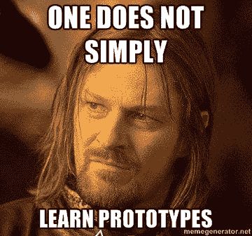
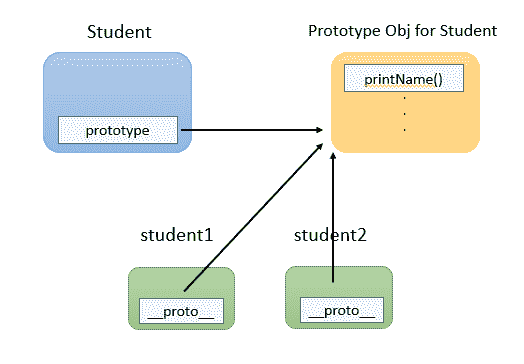
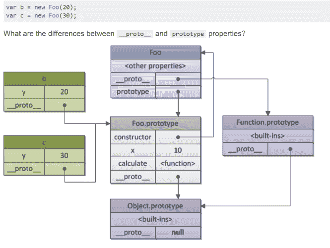

# 理解 JS 中的原型继承

> 原文：<https://javascript.plainenglish.io/understanding-prototypical-inheritance-in-js-3c24e8bd74ce?source=collection_archive---------5----------------------->

## 理解 JavaScript 中的原型、原型继承和原型链所需的一切



我使用 JavaScript 已经快两年了，用 React 替换了基于 jQuery 的 UI，这是我们在小说家公司的一个产品。我喜欢了解我正在使用的工具的不足之处，这样我就可以更有效地使用它。很明显，从我开始 JS 之旅的时候起，理解 JavaScript 中的原型对于理解这种语言是如何工作的至关重要。所以我开始了这次冒险，去了解原型到底是什么，以及我们如何利用它。为了理解什么是原型或原型继承，我们必须首先理解函数在 JS 中是如何工作的。

## JavaScript 中的函数

JavaScript 中的函数由两个内部方法[[Call]]和[[Construct]]驱动。任何带有[[Call]]方法的对象都称为函数，任何*另外*带有[[Construct]]方法的函数都称为**构造函数。**[[Call]]方法决定当你调用一个对象作为函数时会发生什么，例如 *foo(args)* ，而[[Construct]]决定当你调用它作为一个新的表达式时会发生什么，例如 new foo(args)。每个构造函数也有一个内部的[[Call]]方法。

> 类实际上是使用构造函数创建的对象。

需要意识到的一件重要事情是，特别是对于习惯于 Java/C#/C++的人来说，JavaScript 中没有类。类实际上是使用构造函数创建的对象。您可以使用构造函数创建对象的实例。在这方面，它们的工作方式与您的 Java 或 C#对象创建方式相同。构造函数及其实例化的示例:

```
function Student(firstName, lastName) {
    this.firstName = firstName;
    this.lastName = lastName;
    this.getName = () => `${this.firstName} ${this.lastName}`;
 }let student1 = new Student("Albert","Einstein");
let student2 = new Student("Isaac", "Newton");
```

## 原型

现在到了精彩的部分。每个构造函数都有一个名为**‘Prototype’**的**属性**，它指向一个在声明函数时创建的原型对象。我仍然没有弄清楚原型对象是如何创建的，但是现在让我们把它放在一个黑盒里。

> 每个构造函数都有一个名为**‘Prototype’**的**属性**，它指向一个在声明函数时创建的原型对象。

既然 JavaScript 中没有类，那么如何创建可以在实例间共享的方法和属性呢？你可以通过原型属性来实现，也就是说，你可以把它附加到原型对象上。这叫做**原型继承**。在上面的示例中，firstName、lastName 和 getName 是唯一创建的，并存储在 Student 对象的每个实例中。当我们创建 Student 对象的实例时，每个实例都有自己的 firstName、lastName 和 getName 属性。现在让我们添加一个将由所有实例共享的方法:

`Student.prototype.printName = () => console.log(this.getName());`

现在，student1 和 student2 都将共享 printName()函数，因为它已附加到 student.prototype，而且它们是由 Student()构造函数创建的。由 Student()创建的每个实例都将共享 printName()。但如何实现呢？问得好。

构造函数创建的每个实例都有一个指向其构造函数“prototype”属性的内部**‘prototo _ _’**属性。这很令人困惑，我知道。我花了一些时间才明白‘prototype’和‘proto _ property’是不一样的。是的，它们通常会指向同一个 Prototype 对象，但*并不总是*。我们稍后将看到这一点，但首先让我们设想一下这种关系:



Relationship between prototype and __proto__

在查找属性时，JavaScript 首先查看对象实例是否具有该属性，如果不具有，则通过“__proto_”属性转到 Prototype 对象。这就是所谓的**原型链**。JavaScript 将一直向上，直到 Object.prototype，如果在那里找不到它，将返回 undefined。

## __proto__ vs 原型

我答应过要谈谈‘prototype’和‘proto _ property’的区别。正如我所说，“prototype”属性在构造函数中找到，指向该函数的 Prototype 对象，而“__proto_”属性在构造函数及其实例中找到，并指向创建它们的函数的 Prototype 对象。听起来它们应该总是一样的，对吧？让我们看一个例子，其中情况并非如此。我发现下图非常有用:



Image from [http://dmitrysoshnikov.com/ecmascript/javascript-the-core/](http://dmitrysoshnikov.com/ecmascript/javascript-the-core/)

如图所示，Foo 的“__proto_”和“prototype”属性指向不同的东西。Foo 是一个函数，因此由“function”构造函数(JavaScript 内部)创建。所以“__proto_”属性指向函数的 Prototype 对象。但 Foo 的“prototype”属性指向 Foo 的 Prototype 对象。

## ES6 类语法如何与原型相关？

和前面一样，ES6 中的每个类都由一个构造函数和一个原型对象组成，它们通过 prototype 属性相互引用。然而，两者的定义顺序相反。使用旧的样式类，定义构造函数，并为您创建原型对象。使用新样式类时，类定义的主体将成为原型对象的内容(静态方法除外)，在这些内容中，您定义了一个构造函数。无论哪种方式，最终结果都是一样的。

## 结论

我希望这能帮助你理解 JavaScript 中的原型(我说的原型够了吗？)老实说，过几个月我可能会读这篇文章，以重温旧梦。但我真的很喜欢做这样的研究！