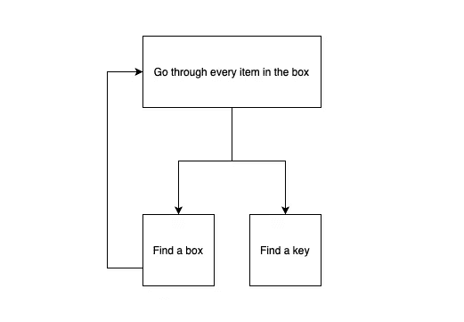
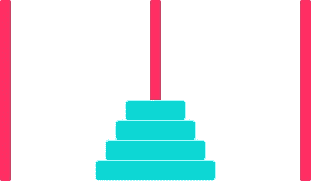

# 通过用 JavaScript 实现“汉诺塔”游戏来理解递归

> 原文：<https://javascript.plainenglish.io/understanding-recursion-by-implementing-the-tower-of-hanoi-in-javascript-a83a54a62f40?source=collection_archive---------2----------------------->

## 思维程序员

## 循环可能会提高程序的性能，但递归可能会提高程序员的性能


Photo by [Jen Theodore](https://unsplash.com/@jentheodore?utm_source=medium&utm_medium=referral) on [Unsplash](https://unsplash.com?utm_source=medium&utm_medium=referral)

递归是一种解决问题的技术，其中一个较大问题的解决方案是根据其自身的较小实例来定义的。你可以试着想象一个现实世界中的例子，当你在家里挖掘时，发现一个神秘地锁着的手提箱，手提箱的钥匙可能在另一个盒子里。这个盒子里有更多的盒子，这些盒子里有更多的盒子。钥匙在某个地方的盒子里。

# 如何寻找钥匙？

我们有两种流行的方法来解决这个问题。

## 第一种方法

在这个解决方案中，我们使用了一个 while-loop 算法:“*当这堆东西不空的时候，拿起一个盒子，然后浏览它*


*while the pile isn’t empty, grab a box, and look through it*

## 第二种方法

在这种方法中，我们使用递归算法:"*，其中函数调用自身。*



*where a function calls itself*

这两种解决方案达到了同样的效果，但是第二种方法似乎比第一种更容易？是的，对我来说更清楚了😁。但事实上，使用递归算法并没有性能上的好处🤣。

> 循环可以提高程序的性能。递归可以为你的程序员带来性能上的提升。根据你的情况选择哪个更重要！利·考德威尔。

这是 JavaScript 中的第二个方法。

因为递归调用它自己，你必须告诉它什么时候停止一切。在这种情况下，这就是我们找到钥匙的时候。

# 河内塔

## 游戏

这是一个在全世界都很流行的数学游戏。有 3 个栓钉，分别标记为 S、D 和 E 的源栓钉、目的栓钉和额外栓钉，并且有 n 个大小不同的盘，可以插入这三个栓钉中的任何一个。所有光盘最初按如下递减顺序(顶部最小)插入源钉。


The initial state

我们的任务是将所有光盘从源位置移动到目标位置。



The final state

有两个限制。

*   一次只能移动一张光盘。
*   在这个过程中的任何时候，我们都不应该将一个较大的光盘放在一个较小的光盘上。

## 怎么解决？

这可能看起来是一个复杂的问题，但是如果我们递归地思考，那么这个问题可以通过三个简单的步骤来解决。

*   步骤 1:使用 d 将 n-1 张光盘从 S 移动到 E。
*   第二步:将第 n 张盘从 S 移到 D
*   步骤 3:使用 S 将 n-1 张光盘从 E 移动到 D

我们将在 JavScript 中编写一个函数，该函数接受代表三个杆(S，D & E)和圆盘数量(n)的字符，并打印圆盘在栓钉之间的移动，以便所有圆盘从初始状态(S 内)移动到最终状态(D 内)。

如果我们运行 3 张光盘的功能:`resolver_tower_of_hanoi(‘s’, ‘d’, ‘e’, 3)`，输出为。

```
Move Disk-1 FROM s TO d
Move Disk-2 FROM s TO e
Move Disk-1 FROM d TO e
Move Disk-3 FROM s TO d
Move Disk-1 FROM e TO s
Move Disk-2 FROM e TO d
Move Disk-1 FROM s TO d
```

很简单，对吧？

# 参考

[1][http://stackoverflow.com/a/72694/139117](http://stackoverflow.com/a/72694/139117)