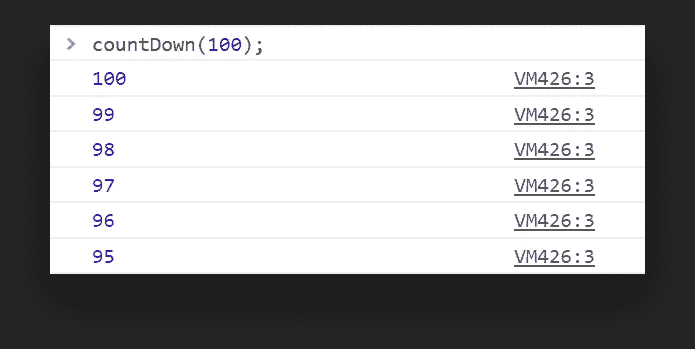
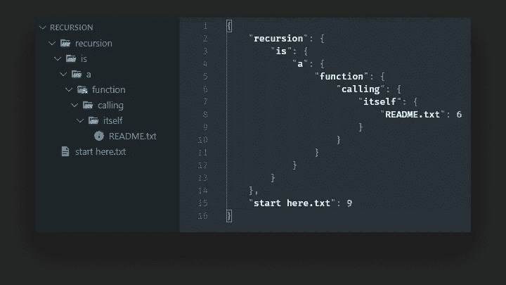
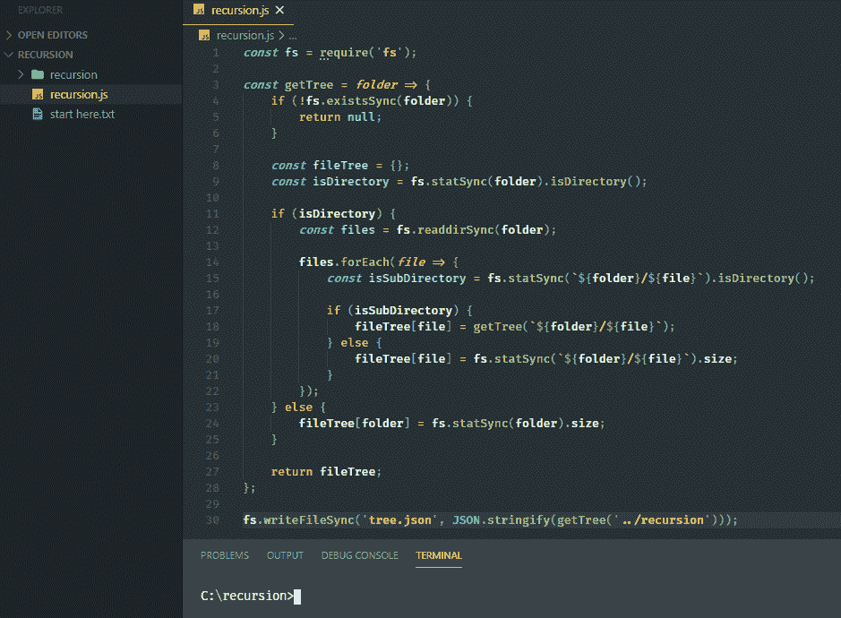

# 理解 JavaScript 中的递归

> 原文：<https://javascript.plainenglish.io/understanding-recursion-in-javascript-72a0cebb76e1?source=collection_archive---------8----------------------->

## 通过实例演示递归

你在上图中看到的是一个 Mandelbrot 集合。可以说是最著名的分形。分形是一组无限复杂的几何形状，它们有一个特殊的特征。在不同的放大倍数下，它们看起来是一样的。

Mandelbrot set on different magnification levels taken from [Wikipedia](https://en.wikipedia.org/wiki/Fractal)

那么分形和递归有什么共同点呢？他们以自我相似的方式不断重复自己。

# 什么是句子中的递归？

> 递归发生在函数调用自身的时候。

这就是全部了。你可能也听过史蒂芬·霍金的名言:

> 要理解递归，首先必须理解递归。

虽然这的确是一个关于递归的聪明玩笑，但是我们可以通过使用它来真正理解它。那么如何转化为实践呢？让我们看一些实际的例子。

# 递归的例子

首先，我们如何知道什么时候使用循环，什么时候使用递归函数？虽然循环的序列有一个确定的结尾，但递归没有顺序结尾。简单地说，如果你不知道你需要循环的次数，你将需要使用递归。这就是为什么停止条件如此重要。否则，您将最终创建一个无限循环。

递归的一些用例是什么？想象一下级联菜单，你可以无限期地拥有子菜单。另一个常见的用例是生成文件树。我们还可以在这里生成层次结构、网络或图形。

为了便于理解，让我们从最基本的场景开始，从一个给定的数字开始倒数。

## 倒数计秒

想象一下，我们必须将 100 的数字打印到控制台上。

我们可以用一个简单的循环来做这件事，但是既然我们在讨论递归，我们就这样做。让我们检查以下功能:

这个函数一直调用自己，直到传递的数字达到 0。您刚刚创建了您的第一个递归函数！如果我们没有 if 语句会发生什么？该函数将无限地调用自己，直到发生以下情况:

它达到了浏览器的最大堆栈大小，这阻止了它永远运行。否则，我们会很快耗尽内存。所以我们在定义递归函数的退出条件时必须非常仔细。现在让我们来看一个稍微复杂一点但实用的例子。

## 生成文件树对象

假设您正在构建一个应用程序，您希望从一个真实的目录结构中生成一个文件树对象。如下图所示:

每个目录都应该是一个对象，包含所有的内容。如果我们命中一个文件，我们可以将它的大小存储为值。

首先在根目录下创建一个名为`recursion.js`的新文件。我们需要首先导入`fs`模块。让我们从心里的目的开始，看看我们想要什么。我们希望有一个函数返回一个文件树对象。这就是我们将要写入 JSON 文件的内容。

所以我们需要实现`getTree`函数。它接受我们想要遍历的文件夹。先加一些检查。

首先，我们需要确保我们正在处理的文件或文件夹是存在的。否则，继续下去就没有意义了。然后我们想要填充最后返回的变量`fileTree`。我们可以从两条路线中的一条开始:

*   我们正在处理一个目录
*   我们正在处理一份文件

如果我们正在处理一个文件，我们可以将大小分配给一个新的节点，以传递的参数命名。否则，我们在一个目录中。这意味着我们需要递归地调用这个函数，因为我们无法知道有多少个子文件夹。

这给我们留下了上面的实现。对于目录中的每个文件，我们希望检查它是否是一个子文件夹。然后我们可以用新的路径调用函数。当我们点击第 8 行时，我们跳转到一个新的文件夹并执行相同的步骤。如果该文件夹有另一个子文件夹，我们也这样做。诸如此类。由于函数最后返回一个`fileTree`对象，我们可以将其值赋回`fileTree[file]`。

在最后，我们用完了子文件夹，这是我们的退出条件。

继续用`node recursion.js`运行这个文件。应该在您的根文件夹中生成一个`tree.json`文件，包含文件夹结构的对象表示。

# 摘要

也就是说，您现在应该已经掌握了递归的艺术。感谢您花时间阅读这篇文章。我想用一个受欢迎的漫画来结束我的演讲，作者是[安全濒危的](https://www.safelyendangered.com/)，它很好地说明了当递归中出现问题时会发生什么:

## **用简单英语写的 JavaScript 笔记**

我们已经推出了三种新的出版物！请关注我们的新出版物，表达对它们的爱:**[**UX**](https://medium.com/ux-in-plain-english)[**Python**](https://medium.com/python-in-plain-english)**——谢谢，继续学习！****

****我们也一直有兴趣帮助推广高质量的内容。如果您有一篇文章想要提交给我们的任何出版物，请发送电子邮件至[**submissions @ plain English . io**](mailto:submissions@plainenglish.io)**，使用您的 Medium 用户名，我们会将您添加为作者。另外，请让我们知道您想加入哪个/哪些出版物。******