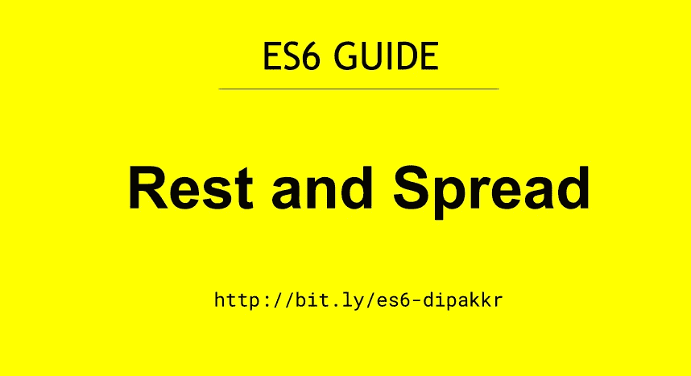

# 了解休息和伸展操作员| ES6 指南

> 原文：<https://javascript.plainenglish.io/understanding-rest-and-spread-operator-es6-guide-e27a9a647dc3?source=collection_archive---------5----------------------->



Rest and Spread Operator | ES6 Guide by Deepak Kumar

Spread 和 Rest 操作符由三个点`...`表示。这三个点有两种用法，一种是作为`Spread Operator`，另一种是作为`Rest Parameter`

那么，让我们来了解一下这些 Spread 和 Rest 操作符到底是做什么的？

## Rest 运算符

*   它将所有剩余的元素收集到一个数组中。
*   Rest 参数可以将任意数量的参数收集到一个数组中。
*   Rest 参数必须是最后一个参数。

下面是一个`Rest`运算符的例子。

> **不使用 Rest 参数:ES5 实现**

```
// Write a Function to print sum of arguments.

    function add() {
      var sum = 0;
      for (var i = 0; i < arguments.length; i++) {
        sum = sum + arguments[i];
      }
      return sum;
    }

    console.log(add(1, 2, 3, 4, 5)); // 15

    console.log(add(1, 3, 4)); // 8
```

> **使用 Rest 运算符的示例:ES6 实现**

```
// Write a Function to print sum of arguments.

   function add(...args) {
      let sum = 0;
      for (let i of args) {
        sum += i;
      }
      return sum;
    }

    console.log(add(3, 4, 5, 10, 20)); // 42

    console.log(add(1, 3, 4)); // 8
```

## 传播算子

*   它允许像`arrays / objects /strings`这样的可重复项扩展成单个参数/元素。
*   ***展开运算符*** 与其余参数相反。在 Rest Parameter 中，我们将参数列表收集到一个数组中，而使用 spread operator，我们可以解开数组元素。

让我们看一个例子来理解`spread`运算符。

```
 ## EXAMPLE - 1

    const cars = ['BMW', 'Audi'];
    const moreCars = ['Maruti', 'Swift', ...cars];

    console.log(moreCars);  // ['Maruti', 'Swift' 'BMW', 'Audi'];

    ## EXAMPLE - 2 //Copying one array to other

    const array1 = [1, 2, 3];
    const copiedArray = ...array1;

    console.log(copiedArray); // [1, 2, 3]
```

ES6 有很多新特性，比如[模板文字](https://github.com/dipakkr/ES6-Guide#2-template-literals)，[默认参数](https://github.com/dipakkr/ES6-Guide#3-default-arguments)，[箭头函数](https://github.com/dipakkr/ES6-Guide#4-arrow-functions)，[数组和对象析构](https://github.com/dipakkr/ES6-Guide#5-array-and-object-destructuring)，[映射、归约和过滤](https://github.com/dipakkr/ES6-Guide#6-map-reduce-and-filter)，[剩余和扩展运算符](https://github.com/dipakkr/ES6-Guide#8-rest-and-spread-operator)，[对象文字](https://github.com/dipakkr/ES6-Guide#9-object-literals)，[类](https://github.com/dipakkr/ES6-Guide#10-classes-in-es6)等等。

*如果您用 javascript 编写代码，但仍然不熟悉 ES6 概念。你应该考虑谷歌一下这些话题。*

这里我写了一个全面的学习 ES6 的指南，可以考虑一下看看。

[https://github.com/dipakkr/ES6-Guide](https://github.com/dipakkr/ES6-Guide)

如果你喜欢这篇文章，请鼓掌！！

更多类似的内容请关注我- > [*推特*](https://twitter.com/diipakkr)|[insta gram](http://instagram.com/diipakkr)|[LinkedIn](https://www.linkedin.com/in/dipakkr/)