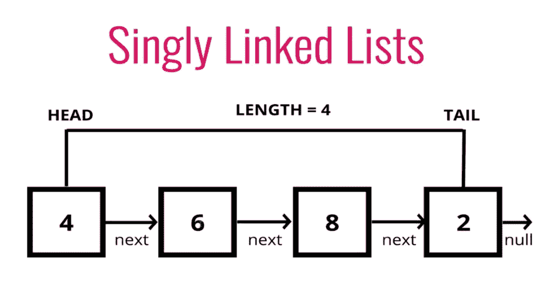
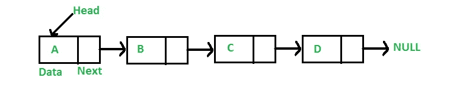
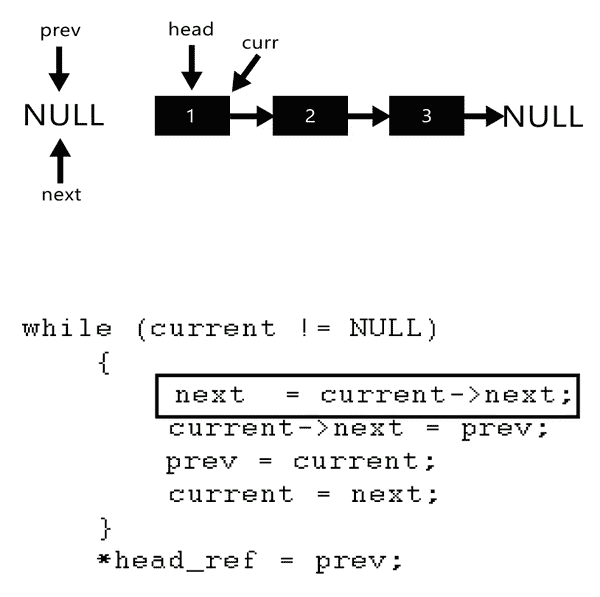

# 理解单链表及其功能

> 原文：<https://javascript.plainenglish.io/understanding-singly-linked-lists-and-their-functions-ae8f2e53f92d?source=collection_archive---------5----------------------->

Structure of a singly linked list

链表是我们都听说过的东西，并且有很好的理由:**它们作为所有其他数据结构的基础理解。有两种不同的链表:单向链表和双向链表。在本文中，我们将讨论前者(并将对两者进行简单的比较)。**

**在继续之前:**本文要求理解 ES2015 JavaScript“类”和“实例方法”语法。如果您从未听说过或使用过 JavaScript 类，这些信息将非常难以理解(除了链表之外，许多其他数据结构也是如此)。如果是这种情况，做一点研究，然后回来！如果您已经理解了这个语法，那么让我们直接开始吧。

# **什么是单链表？**

Fig. 1: Structure of a singly linked list. Credit: [https://www.geeksforgeeks.org/data-structures/linked-list/](https://www.geeksforgeeks.org/data-structures/linked-list/)

**单链表是一种包含头部、尾部和长度属性的数据结构**(最后一个属性是可选的，尽管它使事情变得简单多了)。

链表由叫做**的节点组成。** **一个节点是一段数据，它有一个值以及一个指向另一个节点或空值的指针。**链表的头是第一个节点，尾是最后一个节点，始终指向空。

> 单链表是由节点组成的数据结构。每个节点都有一个值和一个指向下一个节点的指针，或者在到达末尾时为 null。

单链表和双链表的区别如下:**单链表中，每个节点只指向它前面的节点(或者下一行)。在双向链表中，每个节点也有一个指针引用它后面的节点。**同样地，单链表提供了对整体链表数据结构的更容易的基本理解。

值得一提的是，与数组不同，**链表没有内置索引。**这意味着为了在链表中找到一个特定的点，你需要从起点开始，一个接一个地遍历每个节点，直到找到你要找的东西。

我曾经听过一个有趣的比喻:链表就像没有电梯的摩天大楼。要到达你要找的楼层，你需要一次爬一层楼。在一个阵列中，你可以按下一个按钮，直接带你到你需要去的楼层。

你可能在想:“链表听起来非常复杂和低效，我会用它吗？”好吧，那就说说吧。

# 为什么/什么时候我会使用单链表？

有一些不同的时候链表会比数组亮，反之亦然。这取决于你到底要用这些数据做什么。

## **在列表的开头插入或删除数据**

请记住，数组带有内置索引。这意味着，如果一个数组中有 1000 个条目，我们需要将一个条目放在数组的最开始，整个数组中的每个索引都需要向右移动并递增(这意味着我们在这里有一个 O(n ),但我们将在本文结尾回到数组与链表的大 O)。

在链表中，将数据添加到开头是极其简单和高效的。你只需要告诉新的一段数据指向头部，然后把那段数据赋值为新的头部。不需要重新索引。

## **在列表中间插入或删除数据**

与上面的原因相同，在链表中插入和删除数据不需要重新索引整个列表，这比在数组中插入或删除数据更快(当然，除非您从数组的最末端添加或删除某些内容，这不需要任何重新索引)。)

> 在插入和删除数据时，链表非常有用。当需要随机访问时，数组更有用。

好了，现在我们已经简单了解了什么是单链表，以及使用它们的基本原理。**让我们创建一个并构建它的功能。**

**重要提示:**有许多方法可以构建这些功能。这些都只是做每一件事的一种方法。因此，如果你在其他地方看到过不同的做法，这两种方法都没有错。但是如果你找到了更好的解决方法，请在评论中分享吧！

## **创建单链表**

**要创建一个单链表，我们需要从创建两个类开始:** `**Node**` **和** `**SinglyLinkedList**`

因为我们的节点由某种值和指向下一个值的指针组成，所以它需要包含一个`val`属性和一个`next`属性。`next`将从等于`null`开始。

记住，我们的单链表需要包含一个`head`和一个`tail`来指定它的开始和结束位置。我们还将添加一个`length`属性，使我们的一些功能更容易实现。头尾会以`null`开头。

Creating a Singly Linked List

## **添加到列表末尾**

要添加到列表的末尾，我们需要做的就是创建一个新节点，并将当前 tail 的`next`属性设置为新节点，然后使新节点成为 tail。

不要忘记**边缘情况:**如果没有头(即列表尚不存在)，则将头和尾设置为新节点。将长度增加 1 并返回列表。

Adding a new node to the end of a Singly Linked List

## **从列表末尾删除**

为此，我们需要循环遍历列表，直到找到尾部，然后将尾部之前的节点的`next`值设置为空，并将该节点设置为新的尾部。然后将列表的长度减 1，并返回被删除的节点的值(记住，您需要提前保存这个变量以便返回它)。

**边缘情况:**如果没有头，返回`undefined`；如果删除节点后列表的长度为零，请确保将头部和尾部设置回 null。

Removing a node from the end of a Singly Linked List

## **从列表的开头删除**

从单链表的开头删除一个节点非常简单。我们需要做的就是将 head 设置为当前 head 的下一个值，然后将长度减 1 并返回旧的 head(记住将原始 head 保存为变量，以便可以返回它。)

**边缘情况:**`shift()`的边缘情况是与`pop().`非常相似，如果没有头，返回`undefined`。如果在移除头部之后列表的长度为零，确保尾部被设置回 null(在这种情况下头部已经被设置为 null，但是尾部将被默认设置为`Node`。将其设置为 null 可以防止这种情况发生)。

Removing from the beginning of a Singly Linked List

## **添加到列表的开头**

添加到单链表的开头也很容易。我们只需要创建一个新节点，并将其`next`值设置为当前头，将其指定为新头，将列表递增 1，然后返回列表。

**边缘情况:**如果 head 当前为空，那么这意味着我们要卸载的将是列表中唯一的值。因此，需要将它设置为头部和尾部。

Adding to the beginning of a Singly Linked List

## **根据节点在列表中的位置检索节点**

记住，链表不像数组那样有索引！所以我们需要在这里做一些额外的工作。我们的函数将被传递一个索引，所以我们将需要创建某种类型的`counter`变量，当它小于索引时，我们可以用它来循环遍历列表(从头开始)。一旦我们到达传入的索引，我们就返回那个节点。

**边缘情况:**如果传入的索引小于零或者大于等于列表长度，则返回`null`(或-1，`undefined`等。(不好的东西)。

Retrieving a Node by its index

## **给定节点在列表中的位置，改变节点的值(和新值)**

因为我们已经创建了`get`函数，我们可以用它来查找给定索引处的节点。我们可以很容易地将这个节点设置为一个变量，因为我们的`get`函数返回找到的节点。找到节点后，我们需要做的就是将它的值设置为传入的值，然后返回 true。如果没有找到节点，返回 false。

**边缘情况:**我们定义的`get`函数已经处理了无效的索引。这使得我们的`set`函数非常简洁。

Changing the value of a specified node in a Singly Linked List

## **在列表的指定位置添加一个新节点**

这个函数有点棘手。首先，我们需要根据传入的值创建新节点。现在，为了让我们在某个地方插入节点，我们需要找到直接在传入的索引之前的节点，并将其`next`值设置为新节点。在这之后，我们需要将我们的新节点的`next`值设置为找到的节点的`next`值(我知道，有很多“nexts”)。这意味着我们需要确保我们已经提前将它保存为一个变量。一旦我们添加了新的节点，将长度增加 1 并返回 true。

**但是等等！如果我们的函数传递给我们一个零索引或者一个等于列表长度的索引，我们已经为它们写了函数！在这些情况下使用您的`unshift`或`push`函数，并将给定值传递给它们。**

**边缘情况:**如果给定的索引小于零或大于列表的长度(在这种情况下，它是否等于列表的长度并不重要，因为我们可以将新节点添加到末尾)，返回 false。此外，我们希望这个函数只返回 true 或 false。现在，如果我们在这里使用了`unshift`或`push`方法，它将返回整个列表。这不是世界末日，但作为程序员，我们喜欢保持一致。这里一个简单的解决方法是，如果使用了这两个方法中的任何一个，就让我们的方法返回 true。

Adding a new Node to a Singly Linked List

## **从列表的指定位置删除一个新节点**

要删除一个节点，我们需要做的就是找到传入的索引之前的节点，然后将其`next`设置为下一个节点(我们要删除的节点)的`next`。我们在这里所做的就是通过使前一个节点的`next`成为它前面两个下一个的节点，来切断前一个节点和曾经在它后面的节点之间的链接(厌倦了读“下一个”这个词了吗？).

完成后，将长度减 1 并返回移除的节点(这意味着您需要将它保存到一个变量中)。

**但是等等！如果传入的索引等于列表长度减一，或者等于零，我们已经为这些写了方法！在这些情况下，分别返回您的 `pop()`或`shift()`方法。**

**边缘情况:**如果传入的索引小于零或者大于等于列表长度，则返回`null`。

Removing a Node from a Singly Linked List given its index

## **原地反转单链表**

就地反转单链表(“就地”的意思是不复制它)是一个经典的问题，同样也是最难解释的问题。也有很多方法可以做到。下面是我们将如何解决这个问题**(这是一个迭代解决方案的例子，也有递归解决方案)**:

首先，交换头部和尾部，将尾部保存为一个新变量(通常称为`curr`)。然后创建一个变量`next`和一个变量`prev`。`prev`应该从`null`开始。接下来，遍历列表。将`next`设置为当前`curr`的下一个属性(如上定义，它从尾部开始)。然后，将`curr`节点的下一个属性设置为我们定义的`prev`变量。现在，设置`prev`等于`curr`，设置`curr`等于`next`。

一旦这些都完成了，返回更新的列表。

感觉极度迷茫？可以理解。看看下面的解决方案，试着理解发生了什么。如果您仍然有问题，我在解决方案下提供了一个有用的 gif，可能会有所帮助。

Reversing a Singly Linked List

如果你很难理解这个，看看下面这张来自 geeksforgeeks.org 的 gif 图片。

Fig. 2: Reversing a singly linked list. Credit: [https://www.geeksforgeeks.org/reverse-a-linked-list/](https://www.geeksforgeeks.org/reverse-a-linked-list/)

# **单链表与数组的大 O**

咻！还和我在一起吗？让我们花点时间来看看单链表和数组的大 O 符号。

## **插入:O(1)**

单链表对于在一组数据的开头插入值非常有用。它不像数组那样需要任何重新索引，因此需要恒定的时间。

## **清除:O(1)或 O(n)**

如果我们从一个单链表的开头开始移除，这是非常有效的，并且花费恒定的时间。然而，如果我们从最末端开始，我们需要在尾部之前找到条目，这涉及到遍历整个列表。

## **搜索:O(n)**

如果我们在一个单链表中寻找一个特定的值，这需要线性的时间，因为我们需要从头开始并遍历整个链表，直到找到我们想要的。这类似于数组，尽管不是完全平等的比较。

## **访问:O(n)**

正如本文开头所讨论的，访问单向链表的特定索引远不如数组有效，因为它没有数组那样的内置“随机访问”。访问数组中的第 1000 个元素非常简单，并且花费恒定的时间，因为每个值都被索引，由于上面讨论的原因，访问单链表中的第 1000 个元素要慢得多，并且花费线性时间。

在本文中，我们讨论了什么是单链表/它们与双向链表和数组有什么不同，它们有什么用，什么时候数组可能更好，单链表的常见函数，以及它们的用例。

我们在这篇文章中已经讨论了很多。如果看起来很多，花点时间消化这些信息，然后回来尽可能多地复习。

**有比这里提供的更好的解决方案吗？欢迎在评论中分享！**