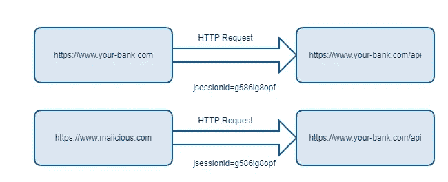

# 了解 CORS 的基本知识并获取证书

> 原文：<https://javascript.plainenglish.io/understanding-the-basics-to-fetch-credentials-863b25968ed5?source=collection_archive---------2----------------------->

## 作为一名开发人员，当你试图在一个 API 上使用 fetch 时，你将不可避免地遇到各种错误，因为它没有被授权，对吗？

你可能会揪着头发走

对吗？

嗯，当在各种 API 上使用 Fetch 时，有时各种证书会被添加到它们的 API 中，以便允许站点保持安全。API 有三种类型的请求:省略、允许同源和包含？这到底是什么意思？要理解 Fetch 中的凭证，首先必须对 CORS(跨源资源共享)有一个基本的了解。

CORS 是一个跨源资源共享的标准。我们为什么需要这个？嗯，现代浏览器有安全功能，可以防止黑客攻击的发生。这被称为同源策略。这是为了不允许来自一个来源的文档或脚本访问外来来源的资源。为什么这如此重要？基本上，它是为了阻止一个跨站请求伪造。

根据维基百科:

跨站点请求伪造(CSRF)是一种攻击，它迫使最终用户在他们当前已通过身份验证的 web 应用程序上执行不需要的操作。CSRF 攻击专门针对状态改变请求，而不是窃取数据，因为攻击者无法看到对伪造请求的响应。在社会工程的一点帮助下(例如通过电子邮件或聊天发送链接)，攻击者可以欺骗 web 应用程序的用户执行攻击者选择的操作。如果受害者是普通用户，成功的 CSRF 攻击可迫使用户执行状态更改请求，如转移资金、更改电子邮件地址等。如果受害者是一个管理帐户，CSRF 可以危及整个网络应用程序。

如果这个网站是你的银行信息，或者至少是一个亚马逊账户，那就糟了。基本上，如果你要对你的 facebook 账户这么做

Please, don’t do this

你可能会问，“那么，什么是起源？”。这意味着混合使用协议、域和端口来确定资源是否来自同一个地方。例如，“http://api.facebook.com”与“http://facebook.com”不同。这也适用于“http://localhost:3000”与“http://localhost:8080”。

现在，为了保证用户在站点上的安全，您可以根据是否希望共享这些 cookies，向获取请求添加凭证！

您可以省略 aka 从不发送或接收 cookies。

您可以使用同源发送用户凭证(cookies、基本 http 认证等..)如果 URL 与调用脚本位于同一原点。**这是默认值。**

最后，您可以使用 Include，它总是发送用户凭证(cookies、基本 http auth 等..)，即使是跨来源呼叫。

需要记住的一点是，如果网站配置不当，这对用户来说是多么危险。

如果您的凭据配置错误，可以参考以下资源来了解恶意参与者会做些什么:

[https://ports wigger . net/research/exploining-CORS-misconfiguration-for-bit coins-and-bounts](https://portswigger.net/research/exploiting-cors-misconfigurations-for-bitcoins-and-bounties)

正确理解 CORS，对规范有一个基本的理解，并意识到你的站点的个人需求，将允许你确保在你的特定领域或应用上最安全的用户体验。

以下资源将更深入地介绍如何使用凭据:

 [## 请求.凭据

### 接口的凭据只读属性指示用户代理是否应该从另一个…

developer.mozilla.org](https://developer.mozilla.org/en-US/docs/Web/API/Request/credentials) 

[https://www . moes if . com/blog/technical/CORS/authority-Guide-to-CORS-跨产地-资源共享-休息-API/#](https://www.moesif.com/blog/technical/cors/Authoritative-Guide-to-CORS-Cross-Origin-Resource-Sharing-for-REST-APIs/#)

 [## 即使使用“同源”凭据，请求标头中也未设置 Cookie。问题#349 github/fetch

### 向 Django API 发出请求需要设置 csrftoken cookie。我无法设置和发送…

github.com](https://github.com/github/fetch/issues/349)