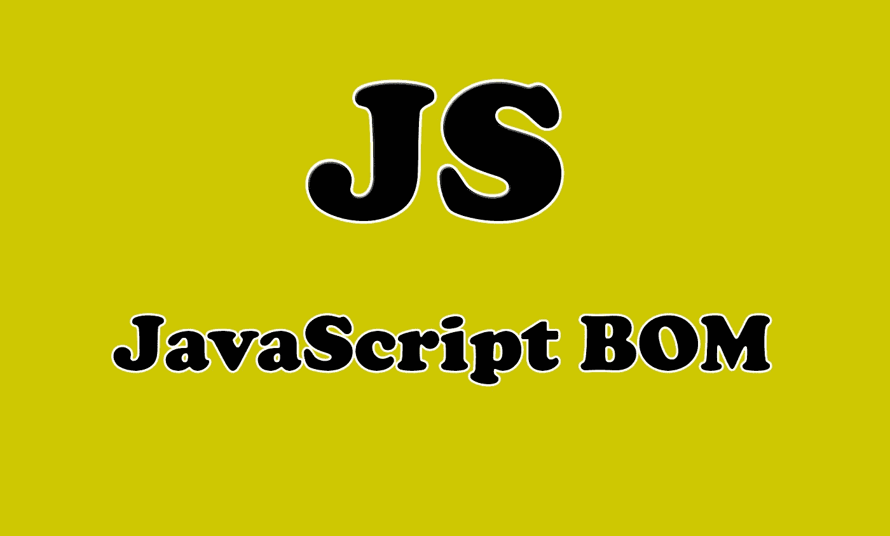
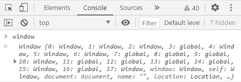

# 理解 JavaScript 中的浏览器对象模型

> 原文：<https://javascript.plainenglish.io/understanding-the-browser-object-model-in-javascript-b83fbb77d649?source=collection_archive---------6----------------------->

## 通过实例了解 JavaScript BOM


Photo by [ThisisEngineering RAEng](https://unsplash.com/@thisisengineering?utm_source=medium&utm_medium=referral) on [Unsplash](https://unsplash.com?utm_source=medium&utm_medium=referral)

# 介绍

浏览器对象模型(BOM)允许 JavaScript 与浏览器通信。由于现代浏览器已经为 JavaScript 交互性实现了(几乎)相同的方法和属性，它通常被称为 BOM 的方法和属性。所以这个浏览器对象模型为我们提供了暴露 web 浏览器功能的对象(窗口对象)。

在本文中，我们将了解浏览器对象模型的一些方法和属性，这些方法和属性将允许我们用 JavaScript 与浏览器进行通信。让我们开始吧。



Image created with ❤️️ By [Mehdi Aoussiad](https://mehdiouss315.medium.com/).

# 窗口对象

所有浏览器都支持对象`**window**`。它代表浏览器的窗口。这个对象包含了很多我们可以在 JavaScript 中使用的方法和属性。甚至(HTML DOM 的)文档对象也是窗口对象的属性。

```
window.document.getElementById("ID");
```

与以下内容相同:

```
document.getElementById("ID");
```

对象`window`的属性和方法可以不用前缀`window`来编写。

如果想检查窗口对象包含的所有方法和属性，可以在浏览器控制台中编写`window`。



The window object in the console.

# 窗纱

对象`**window.screen**`包含关于用户屏幕的信息。也可以不使用窗口前缀。

这个对象`screen`也有一些属性和方法，我们可以访问它们来获得用户屏幕的信息。

以下是一些例子:

属性返回访问者屏幕的宽度，以像素为单位。

```
document.getElementById("demo").innerHTML =
"Screen Width: " + **screen.width**;//Returns: Screen Width: 1366 
(This is in my case because my screen width is 1366, it depends on your screen).
```

属性返回访问者屏幕的高度，以像素为单位。

```
document.getElementById("demo").innerHTML =
"Screen Height: " + **screen.height**;//Returns: Screen height: 768
```

还有更多的属性，您可以从其他资源中搜索它们。

# 窗口位置

对象`**window.location**`也是窗口对象的一部分。它可用于获取当前页面地址(URL)并将浏览器重定向到新页面。

看看下面的例子:

```
document.getElementById("demo").innerHTML =
"Page location is " + **window.location.href**;
```

结果是:

```
Page location is **https://medium.com/stories** (as an example).
```

如您所见，这将返回您在浏览器中打开的当前页面的 URL 地址。

这是另一个例子:

属性返回互联网主机(当前页面)的名称。

```
document.getElementById("demo").innerHTML =
"Page hostname is " + **window.location.hostname**;
```

结果是:

```
Page hostname is **www.medium.com**
```

位置对象还有更多的属性。

# 窗口历史

对象`**window.history**`包含浏览器的历史。JavaScript 访问该对象的方式有一些限制。

一些重要的方法是:

*   `history.back()`与在浏览器中点击后退箭头相同。
*   `history.forward()`与点击浏览器中的前进箭头相同。

这两种方法将允许您后退和前进，以便轻松地在网页之间导航。

# 弹出框

JavaScript 在窗口对象中有三种弹出框:警告框、确认框和提示框。

看看下面的例子:

如果您想确保信息传递给用户，可以使用警告框。

```
window.**alert**("*sometext*");
```

如果你想让用户确认或接受某样东西，通常会使用确认框。

```
window.**confirm**("*sometext*");
```

如果您希望用户在进入页面之前输入一个值，通常会使用提示框。

```
window.**prompt**("*sometext*","*defaultText*");
```

正如您所看到的，window 对象有很多方法和属性，我们可以用它们在 JavaScript 中与浏览器进行通信。您可以从 [MDN 文档](https://developer.mozilla.org/en-US/docs/Web/API/Window)中了解到许多其他信息。

# 结论

Browser 对象模型表示窗口浏览器，所有浏览器都支持它。除此之外，全局 JavaScript 对象、函数和变量自动成为 window 对象的成员。

感谢您阅读本文，希望您觉得有用。如果有，通过 [**订阅我们的 YouTube 频道**](https://www.youtube.com/channel/UCtipWUghju290NWcn8jhyAw?sub_confirmation=true) **获取更多类似内容！**

# 更多阅读

[](https://medium.com/javascript-in-plain-english/5-amazing-front-end-development-tools-that-you-should-know-7372dc377d7) [## 你应该知道的 5 个惊人的前端开发工具

### 每个开发人员都应该知道的有用的前端开发工具

medium.com](https://medium.com/javascript-in-plain-english/5-amazing-front-end-development-tools-that-you-should-know-7372dc377d7)