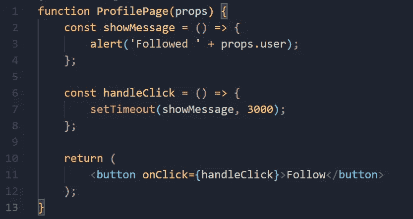
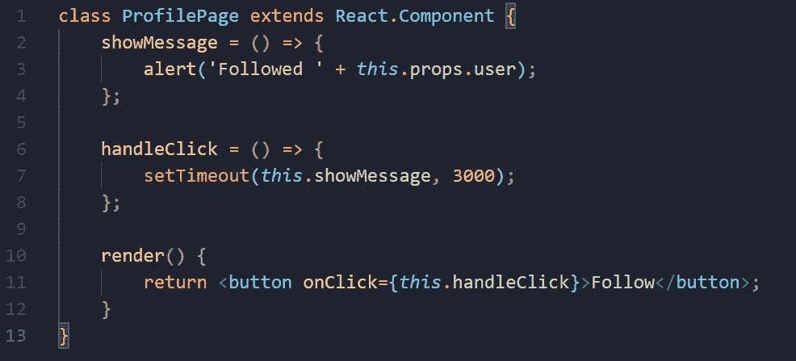
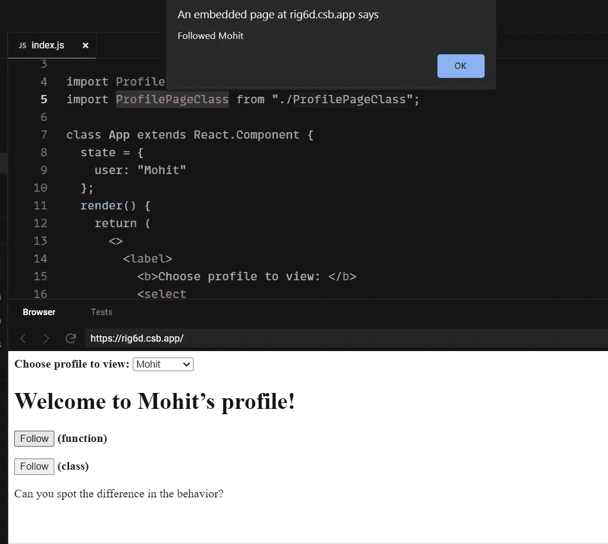
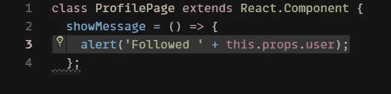
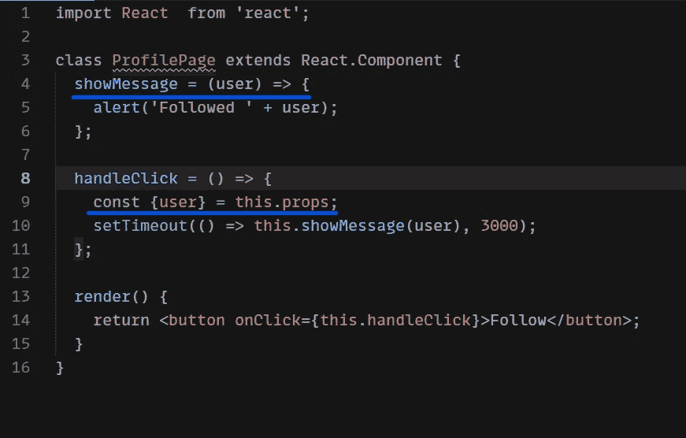
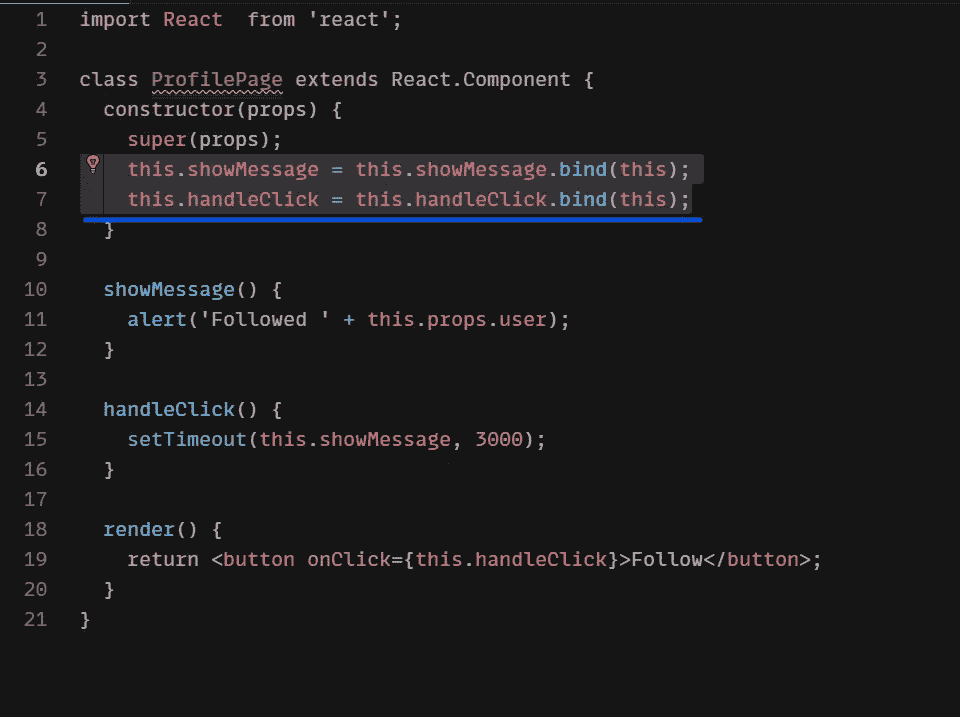
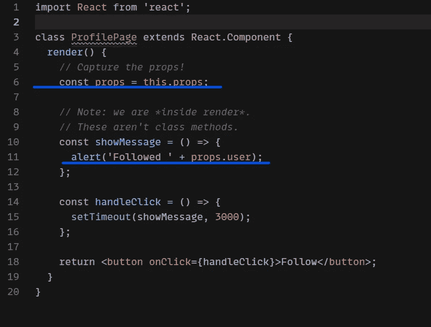

# 理解 React 中函数和类组件的区别

> 原文：<https://javascript.plainenglish.io/understanding-the-difference-between-function-class-components-in-react-35279a119d29?source=collection_archive---------6----------------------->

## 在 React 应用中选择合适的组件

使用 **React** 中的组件，更好地理解它们如何影响你的**应用的性能**一直是一个令人困惑的话题，开发者最终会拥有一个庞大的代码库，随着时间的推移，越来越难以管理。所以，你将听到的主要答案是**类组件**提供了对更多特性的访问，如 ***(状态)*** ，但是带有不再有效的**挂钩**。

你一定听说过其中一个有更好的性能，但是性能取决于代码在做什么，而不是选择一个类或函数。性能几乎相同，使用各种优化技术可以产生差异。

# 功能组件

考虑一个组件。让我们以一个简单的**组件**为例，它模拟一个带有 ***setTimeout*** 的网络请求，并显示一个确认警告。如果 ***道具.用户*** 是‘莫希特’，3 秒后会简单显示***‘跟随莫希特’***。

在上面的例子中，你可以使用箭头或者函数声明，两者的工作方式是一样的。

在课堂上实现上述示例:

人们经常错误地以同样的方式看待这两者，但是它们的含义是不同的。为了观察区别，你可以打开我创建的代码 [***沙箱***](https://codesandbox.io/s/serene-bhabha-rig6d?file=/src/ProfilePageFunction.js) 来更好的理解。

打开上面给出的代码沙箱并运行代码，现在尝试这些步骤来测量差异。

1.  点击 ***跟随*** 按钮。**(函数或类你可以选择其中的任何一个)**
2.  在 3 秒钟之前更改选定的配置文件。
3.  现在阅读文本**警报**。

你会注意到，当我们点击跟随按钮**(使用功能组件)**然后切换到不同的配置文件时，它显示的是以前的用户**的名字**而不是我们 3 秒后选择的名字。但是当我们按下 follow 按钮**(使用类组件)**时，每次都会显示新选择的用户名。通过自己运行沙盒，你会得到更好的理解。

在本例中，如果您按下**“Mohit’s”配置文件**上的 follow 按钮，然后更改所选用户，在**功能组件** t 的情况下，您仍会在警告对话框中看到 Mohit。在类组件的情况下，您会在警告对话框中注意到**切换的配置文件**名称。

如您所见，第一个行为完全是我们声称对我们来说正确的，因为我的组件不应该混淆我跟随了谁！。

## 那么这种错误行为的原因是什么呢？

为了理解这一点，让我们仔细看看我们类中的 ***showMessage*** 方法。

类方法从***this . prop . user***中读取，并且道具在 **React** 中是不可变的，所以它们永远不会改变，但是 ***this*** 一直是可变的&这就是 ***的全部目的如果我们的组件在进程中重新渲染， ***this.props*** 将改变&**show message**方法从“***too new”***props**中读取用户。*****

这显示了**用户界面**本质中一个有趣的关系，如果我们说 UI 是当前应用程序状态的函数，那么**事件处理程序**是 ***渲染结果的一部分。*** 但是调度超时，显示 ***this.props*** 中断关系。

假设没有**功能组件**，那么这个问题的解决方案是什么？

如果我们想以某种方式“修复”渲染和修正道具与读取它们的 ***showMesage*** 回调之间的连接。我们可以实现这种可能性的一种方法是在事件早期读取 ***this.props*** ，然后通过超时完成处理程序传递它们。尽管如此，这种方法会使代码在最后更容易出错，我们不能使用一个以上的属性，我们也不能访问状态，我们会再次遇到同样的问题。

就算我们把 ***预警*** 代码放在 ***handleClick*** 里面也回答不了更大的问题。目的是以这样一种方式构造我们的代码，允许将它分成更多的方法，并且能够读取与该调用相关的呈现所对应的属性和状态。

## 如果我们 ***绑定*** 构造函数中的方法会怎么样？

记住问题是在阅读 ***this.props*** 太晚，不符合我们正在使用的语法，所以不会解决这个问题。如果我们依靠 **JavaScript** 闭包，位问题可以得到解决。然而，应该避免闭包，因为很难想象一个值会随着时间而变化。因此，如果我们使用闭包来替代特定渲染中的 ***道具*** 或 ***状态*** ，我们很容易就能依赖它们。

函数组件捕获渲染值:

但是如果我们在 ***render 中定义函数，那么拥有一个类又有什么意义呢？***

当父组件用不同的道具渲染 ***ProfilePage*** 时， **React** 再次调用 ***ProfilePage*** 函数&我们已经点击过的事件句柄，该事件句柄属于之前的渲染，有自己的 ***用户*** 值，正在被 ***showMessage*** 读取。这就是为什么在上面的沙盒示例中，当我们在更改所选用户后点击 follow **Mohit** 时，它仍然显示**‘Followed Mohit’。**