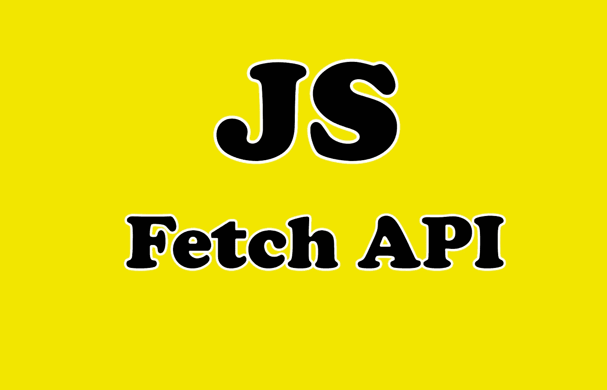
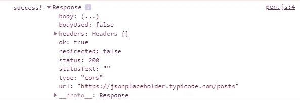
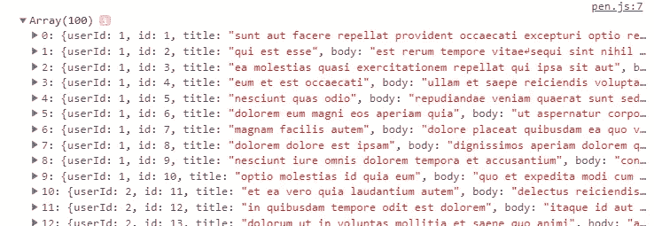

# 理解 JavaScript 中的 Fetch API

> 原文：<https://javascript.plainenglish.io/understanding-the-fetch-api-in-javascript-585913cf2a80?source=collection_archive---------6----------------------->

## 通过实例了解 fetch API



Image Created with ❤️️ By Mehdi Aoussiad.

# 介绍

Fetch API 提供了一个获取资源的接口。它用于发出 Ajax 请求，比如调用 API、获取远程资源或从服务器获取 HTML 文件。

对于任何使用过 Ajax XHR 的人来说，这似乎都很熟悉，但是新的 API 提供了更强大、更灵活的特性集。就个人而言，我更喜欢使用 fetch，因为它用更简单的语法完成了我需要的一切。

在本文中，我们将探索如何在 JavaScript 中使用 fetch API。让我们开始吧。

# 基本提取 API 语法

在今天的文章中，我们将使用 [JSON 占位符](https://jsonplaceholder.typicode.com/)来发出真正的 API 请求。

假设您想使用下面的 URL 从 API 获取一个帖子列表:

```
https://jsonplaceholder.typicode.com/posts
```

首先，您可以将它作为参数传递给`**fetch()**`方法。看看下面的例子:

```
fetch('https://jsonplaceholder.typicode.com/posts');
```

方法`fetch()`返回一个承诺。我们可以使用`then()`和`catch()`来处理 API 响应。让我们将响应记录到控制台。

```
fetch('https://jsonplaceholder.typicode.com/posts').then(function (response) {
	// The API call was successful!
	console.log('success!', response);
}).catch(function (err) {
	// There was an error
	console.warn('Something went wrong.', err);
});
```

如果您查看控制台中的响应，您会注意到`response.body`不是可用的 JSON。



The console.

因此，我们需要使用方法`json()`将其转换成 JSON。看看下面的例子:

```
fetch('https://jsonplaceholder.typicode.com/posts').then(function (response) {
	// The API call was successful!
	return response.**json()**;
}).then(function (data) {
	// This is the JSON from our response
	console.log(data);
}).catch(function (err) {
	// There was an error
	console.warn('Something went wrong.', err);
});
```

正如你在上面看到的，我们可以在一个链接的`then()`方法中处理实际的响应 JSON，并用方法`catch()`处理错误。现在，如果我们查看控制台，我们可以在那里看到我们的帖子。



The console.

# 提出其他请求类型

默认情况下，Fetch API 发出`GET`请求。假设您想通过 API 发出一个`POST`请求来发布一篇新文章。

方法`fetch()` 接受第二个参数，可以用来传入一个选项对象。看看下面的例子:

```
fetch('https://jsonplaceholder.typicode.com/posts', {
	method: 'POST'
}).then(function (response) {
	// The API call was successful!
	if (response.ok) {
		return response.json();
	} else {
		return Promise.reject(response);
	}
}).then(function (data) {
	// This is the JSON from our response
	console.log(data);
}).catch(function (err) {
	// There was an error
	console.warn('Something went wrong.', err);
});
```

# 使用 Fetch API 设置标题

您可能需要做的另一件常见的事情是为您的请求设置标题和其他属性。这也可以通过 options 对象来完成。

看看下面的例子:

```
fetch('https://jsonplaceholder.typicode.com/posts', {
	method: 'POST',
	body: 'title=' + encodeURIComponent('My awesome new article') + '&body=' + encodeURIComponent('This is the text of my article'),
	headers: {
		'Content-Type': 'application/json'
	},
	referrer: 'no-referrer'
}).then(function (response) {
	// The API call was successful!
	if (response.ok) {
		return response.json();
	} else {
		return Promise.reject(response);
	}
}).then(function (data) {
	// This is the JSON from our response
	console.log(data);
}).catch(function (err) {
	// There was an error
	console.warn('Something went wrong.', err);
});
```

您可以在 [Mozilla 开发者网络](https://developer.mozilla.org/en-US/docs/Web/API/WindowOrWorkerGlobalScope/fetch#Parameters)上查看选项和值的完整列表。

# 结论

除 IE 之外，所有现代浏览器都支持 fetch API。它可以在新的移动浏览器上运行，但可能无法在旧的浏览器上运行。然而，它使得获取、请求和提交数据变得更加容易。

感谢您阅读本文，希望您觉得有用。如果是这样，通过 [**订阅解码获得更多类似内容，我们的 YouTube 频道**](https://www.youtube.com/channel/UCtipWUghju290NWcn8jhyAw?sub_confirmation=true) **！**

# 进一步阅读

[](https://medium.com/javascript-in-plain-english/how-to-fetch-data-from-an-api-in-javascript-dccde83619b2) [## 如何在 JavaScript 中从 API 获取数据

### 通过实例了解 fetch API

medium.com](https://medium.com/javascript-in-plain-english/how-to-fetch-data-from-an-api-in-javascript-dccde83619b2)