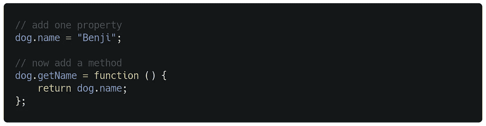
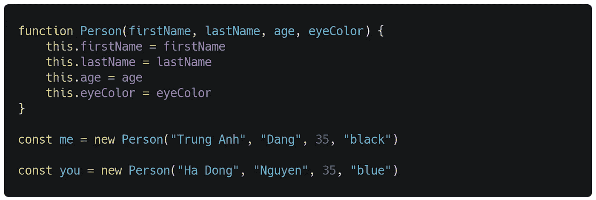

# 深刻理解 JavaScript 的本质

> 原文：<https://javascript.plainenglish.io/understanding-the-nature-of-javascript-deeply-6614bb180a77?source=collection_archive---------7----------------------->

## 已知的已知，未知的已知，和未知的未知

Photo by [JESHOOTS.COM](https://unsplash.com/@jeshoots?utm_source=medium&utm_medium=referral) on [Unsplash](https://unsplash.com?utm_source=medium&utm_medium=referral)

JavaScript 是在网络早期(1995 年)由 Netscape 创建的，从技术上来说，“JavaScript”是 Sun Microsystems(现在的 Oracle)授权的商标，用于描述 Netscape(现在的 Mozilla)对该语言的实现。它是一种编程语言，现在比任何其他编程语言都被更多的软件开发人员使用。

你了解 JavaScript 的本质吗？如果没有，试着再读一遍这篇文章。

## JavaScript 的语法是 C 语言家族的一部分

任何有 C 系列语言经验的人都应该立即熟悉 JavaScript 语法。这个家族最明显的成员是 C、ANSI C、Objective-C、C++、Java、PHP、C#和 JavaScript。它们共享语法和一些结构。

a JavaScript for loop

## 它被部署为源代码

JavaScript 总是作为源代码部署，并由 JavaScript 引擎编译。源代码的好处在于它是一种灵活的交付格式，并且能够抽象出引擎之间的差异。有两种技术可以使文件保持较小的大小:压缩(主要是 gzip)和缩小(通过重命名变量、删除注释等使源代码变小)。

## 它是一种动态的语言

大多数对象可以在运行时以各种方式改变，对象可以直接创建，等等。创建对象后，您可以自由添加和删除对象的属性。

你从一个空白的物体开始。

start with an empty object

然后向它添加一个属性和一个方法。

add a property and add a method

在程序生命周期的任何时候，你都可以改变属性和方法的值，完全删除属性，添加更多的属性和方法。

## 它是一种动态类型语言

如果在运行时检查变量的类型，那么语言就是动态类型的。动态类型语言的常见例子包括 JavaScript、Objective-C、PHP、Python、Ruby、Lisp 和 Tcl。在 JavaScript 中，变量没有固定的静态类型，你可以给一个给定的变量赋值。

JavaScript 中的一个简单例子。

It don’t require you to declare the data types of your variables before you use them

上述语句为同一变量数据分配了一个新值，该变量数据的数据类型不同于先前分配的值。

## 它是网络平台的一部分

JavaScript 是内置于网络浏览器中的语言。它是 web 平台(HTML5 APIs、DOM 等)的重要组成部分。)以至于很容易忘记，没有后者也可以用前者。

但是 JavaScript 在非浏览器设置(比如 Node.js)中用于服务器的东西越多，shell 脚本就越明显。

## JavaScript 具有函数式编程特性

支持一级函数、闭包、通过`bind()`的局部应用、数组内置`map()`和`reduce()`等函数式编程。

> 函数式编程是一种编程范式——一种构建计算机程序的结构和元素的风格——将计算视为数学函数的评估，并避免改变状态和可变数据。

在 JavaScript 中，对象不是附加的。JavaScript 中的几乎所有东西都是对象，包括函数。由于这个特性，函数可以用在任何可能用到变量的地方，包括函数调用中的参数。

例如:假设我们有一个函数，将两个值相加，然后将值加倍。

然后是一个减去数值并返回双精度值的函数。

这些函数具有相似的逻辑，但区别在于运算符的功能。我们可以构建一个接收 operator 函数的函数，并在函数内部使用它。

现在我们有了一个`f`参数，并用它来处理`a`和`b`。我们传递了`sum(a, b)`和`subtraction(a, b)`函数来与`doubleOperator(f, a, b)`函数组合并创建一个新的行为。

函数式编程的好例子还包括像`.map()`、`.reduce()`和`.forEach()`这样的函数。

上面的代码打印了一个数组的内容。

## 它具有面向对象的特性

JavaScript 中任何不是字符串、数字、符号或 true、false、null 或 undefined 的值都是对象。即使字符串、数字和布尔值不是对象，它们也可以表现得像不可变的对象。JavaScript 支持面向对象的编程，如可变状态、对象、继承等。

如果你不熟悉一个物体的样子，这里有个例子。

在 JavaScript 中，只有对象和数组是可变的，而不是原始值。对象的状态可以在创建后修改。在上面的例子中，我们可以修改一个`person`对象的`age`属性。

对于继承，它使用原型继承模型。你有对象原型，而不是类。新对象通过原型链自动继承其父对象的方法和属性。可以随时修改对象的原型，这使得 JavaScript 成为一种非常灵活、动态的语言。

现在我们定义一个构造 person 对象的函数，让我们看看下面的代码。

输出。

我们可以在其原型中添加方法，然后这些方法将被该类的每个实例继承。例如:

输出。

这里的`Person`类有一个名为`info()`的新方法添加到它的原型中，这个方法记录了实例的信息，比如它的名称和年龄。

## JavaScript 经常无声无息地失败

直到 ECMAScript 3 才出现异常处理。这解释了为什么这种语言经常无声无息地失败，并自动转换参数和操作数的值:它最初不能抛出异常。

例如:如果一个操作符的操作数没有合适的类型，它们将根据需要进行转换。

输出。

另一个例子:如果一个算术计算失败，你得到一个错误值，而不是一个异常。

输出。

从那时起，ECMAScript 3 的设计者就试图避免无声的失败。

## JavaScript 引擎通常在幕后优化效率较低的语言机制

例如，原则上，JavaScript 数组就是字典。但实际上，如果数组有连续的索引，引擎会连续存储数组。

很简单，对吧？

# **用简单英语写的便条**

你知道我们有四份出版物和一个 YouTube 频道吗？你可以在我们的主页 [**plainenglish.io**](https://plainenglish.io/) 上找到所有这些——关注我们的出版物并 [**订阅我们的 YouTube 频道**](https://www.youtube.com/channel/UCtipWUghju290NWcn8jhyAw) **来表达你的爱吧！**