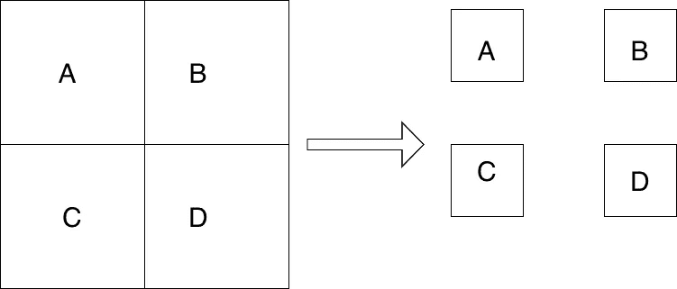
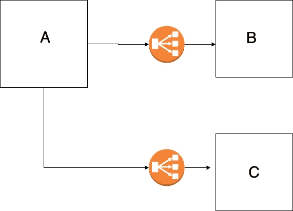
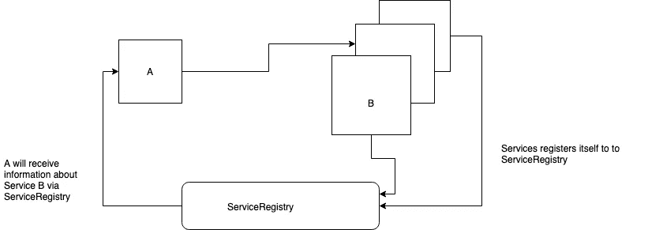
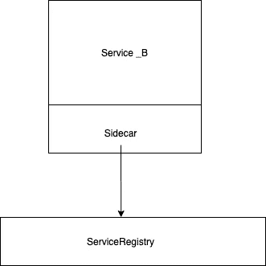
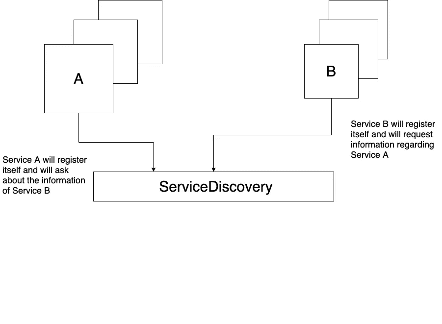
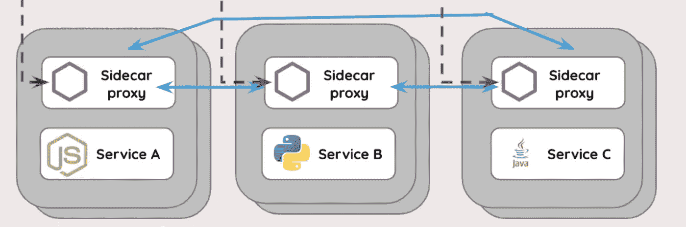
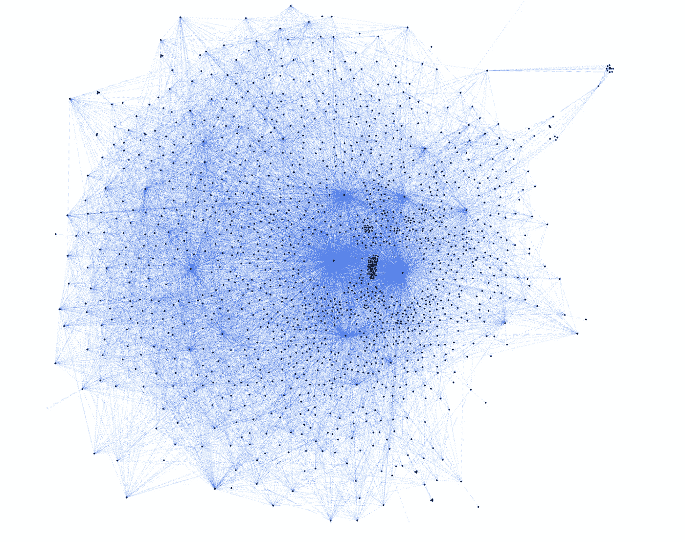

# 扩展您的服务:了解服务发现和服务网格

> 原文：<https://javascript.plainenglish.io/understanding-the-service-discovery-and-service-mesh-f1ee3a628c76?source=collection_archive---------4----------------------->

当今时代，大家都在说微服务。微服务架构的旅程从一个整体开始。在一个整体中，我们将我们的整个应用打包成一个单元，我们将它作为一个应用来开发和部署。单个存储库中的大量代码，难以维护和扩展。为了处理与 monolith 相关的问题，有一个通用的解决方案，即将 monolith 拆分为多个可管理的独立服务，并在需要时分别进行扩展。这些较小的服务被称为微服务。

让我们看看传统的独石，看看有什么好的。比方说，我们的 monolith 有 4 个模块——A、B、C 和 d。现在，无论何时 A 想要与 B 通话，都非常容易。这只是一个函数调用，因为 A 将能够调用 B 的公共方法，因为它们是同一个应用程序的一部分。但是这种系统存在许多问题，例如:

1.  如果模块 A 有 bug，代码无法编译。这将导致我们的整个服务瘫痪
2.  如果模块 A 上的负载比模块 B 大得多，我们就无法独立扩展模块 A。
3.  模块 A 的发布依赖于模块 B 的发布

因此，建议将我们的 monoliths 分成更小的服务。

Figure 1 — Splitting a monolith into smaller services

但是在分布式设置中，我们必须面对许多挑战，比如模块 A 如何与模块 b 交互。

Figure 2 — Services communicating via a load balancer

这个问题的一个更简单的解决方案是服务 A 将通过负载均衡器与服务 B 对话。但是这种方法有以下问题:

1.  负载平衡器将是单点故障
2.  我们将在应用程序中对负载平衡器的 URL 进行硬编码，这也是一种不好的做法
3.  请求必须经过额外的跳跃，因为请求将总是通过负载平衡器

更好的方法似乎是引入 ServiceRegistry。服务注册表将保存所有服务的 IP。如果存在服务 B 的 3 个实例，服务注册中心将拥有服务 B 的 3 个实例的 IP 地址。

Figure 3- Introduction of ServiceRegistry

让我们来看看具有 ServiceRegistry 的基础架构:

1.  每当服务联机时，它都会向 ServiceRegistry 注册自己
2.  每当一个服务上线时，它向 ServiceRegistry 请求其他服务的 IP，无论它将联系谁
3.  每隔一段时间，ServiceRegistery 将使用与其他服务相关的信息更新服务

在上图中，ServiceRegistry 看起来像是一个单点故障，但 ServiceRegistry 通常由许多服务器组成，数据在这些服务器之间复制。

为了完成这一切，所有服务都需要一种与 ServiceRegistry 通信的方式。一个常见的解决方案是有一个边车。每项服务都会安装一个边车。sidecar 将拥有关于 ServiceRegistry 的信息。sidecar 将与 ServiceRegistry 通信，并将为应用程序提供所需服务的 IP。边车将作为代理。现在，所有进出特定服务的请求都通过 sidecar。

Figure 4- Every Service has a sidecar along with it

与其他体系结构相比，这种体系结构将解决以下优点:

1.  服务 A 将直接与服务 B 交互，从而减少网络延迟
2.  边车还将实现断路和重试机制
3.  现在我们的系统中没有单点故障

Figure 4

所以现在我们的整体如图 5 所示，服务之间的交互也将是无缝的。

Figure 5

可以用来实现上述体系结构的几种常用工具是哈希公司的领事、网飞·爱德华卡等。

Figure 6 — How a ServiceMesh looks when having 1000’s of services

在优步、亚马逊、网飞等系统中。服务数量太高，即系统有 100 到 1000 个微服务。因此，上面的架构看起来像一个网状结构。因此，这种模式被称为**服务网状架构**。