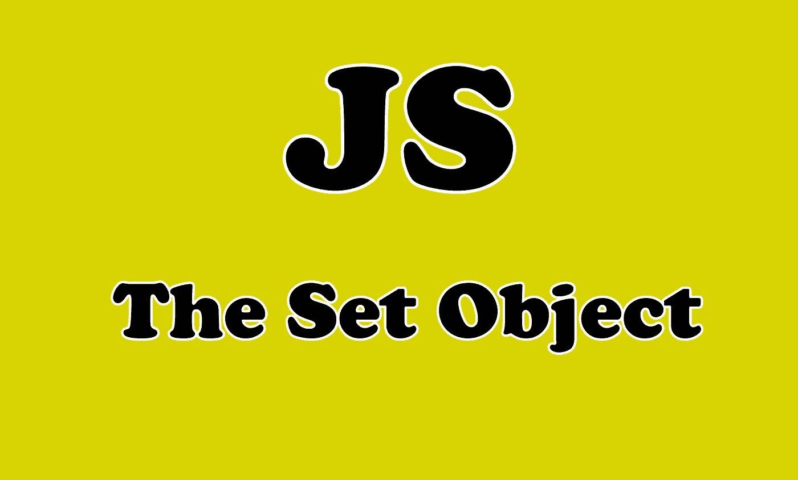
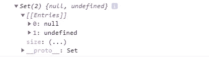
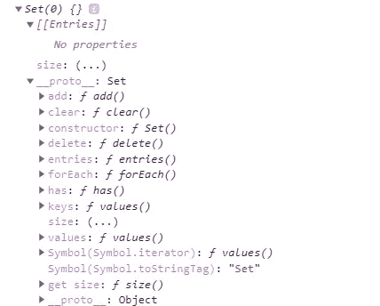

# 理解 JavaScript 中的 Set 对象

> 原文：<https://javascript.plainenglish.io/understanding-the-set-object-in-javascript-381aa5f5c43a?source=collection_archive---------4----------------------->

## 通过实例了解 Set 对象


Photo by [Wes Hicks](https://unsplash.com/@sickhews?utm_source=medium&utm_medium=referral) on [Unsplash](https://unsplash.com?utm_source=medium&utm_medium=referral)

# 介绍

JavaScript 中的 **set** 对象是一个 ES6 特性，它允许您存储唯一的值、原语或对象引用。`**Set**`对象是值的集合。您可以按插入顺序循环访问集合中的元素。`**Set**`中的一个值只能出现一次。

在本文中，我们将通过一些实际例子来了解 JavaScript 中的 **Set** 对象。让我们开始吧。



Image created with ❤️️ By author.

# 设置对象

`set`是 JavaScript 中存储唯一值的标准内置对象。因为对象`Set`中的每个值必须是唯一的，所以将检查*值的相等性*。`NaN`和`undefined`也可以存储在一套中。

这里有一个例子:

```
var sett = **new Set**([null, undefined]);console.log(sett); 
```

输出:



The console.

正如你所看到的，我们使用关键字`new`来创建一个新的对象，因为我们已经有了一个 Set 构造函数，我们将在下面讨论它。

# 集合构造函数

`**Set**` 构造函数允许您创建`Set`对象，存储任何类型的唯一值，无论是原始值还是对象引用。

如果你看看用`Set`构造函数创建的对象的原型，你会发现它有很多我们可以使用的方法。

下面是一个来自控制台的示例:

```
var sett = **new Set()**;
console.log(sett),
```

输出:



The set object.

下面是一个使用方法`has()`的例子:

```
const set1 = **new Set([1, 2, 3, 4, 5])**;console.log(set1.**has**(1));
// expected output: trueconsole.log(set1.**has**(5));
// expected output: trueconsole.log(set1.**has**(6));
// expected output: false
```

我们可以使用`add`方法向`Set`实例添加一个新值，由于`add`返回对象`Set`，我们可以链接`add`调用。如果一个值已经存在于`Set`对象中，它将不会被再次添加。

看看下面的例子:

```
const sett = new Set(["a","b","c","d","d","e"]);
sett.**add**("f");
sett.**add**("g").add("h").add("i").add("j").add("k").add("k");// the last "k" will not be added to the set object because it already exists
```

我们还可以使用`clear`删除或移除`Set`实例中的所有元素。

```
sett.**clear()**; // clears the set data.
```

您可以使用其他方法，但我们的目标只是理解`set`对象。

# 使用 set 对象从数组中删除重复项

有时，您需要从数组中删除重复的值。最简单的方法是使用`set`对象。

看看下面的例子:

```
var fruits = ["banana", "apple", "orange", "watermelon", "apple", "orange", "grape", "apple"];/**/ First method:** var uniqueFruits = **Array.from(new Set(fruits))**;
console.log(uniqueFruits);
 // returns [“banana”, “apple”, “orange”, “watermelon”, “grape”] **// Second method:** var uniqueFruits2 = **[ ...new Set(fruits)]**;
console.log(uniqueFruits2);
 // returns [“banana”, “apple”, “orange”, “watermelon”, “grape”]
```

对象`Set`使我们更容易从数组中删除重复项。它还保持了代码的整洁。

# 结论

正如您所看到的，Set 对象在 JavaScript 中非常有用并且非常重要。它允许您存储唯一值、添加和清除值。

感谢您阅读本文，希望您觉得有用。

# 更多阅读

[](https://medium.com/javascript-in-plain-english/5-amazing-front-end-development-tools-that-you-should-know-7372dc377d7) [## 你应该知道的 5 个惊人的前端开发工具

### 每个开发人员都应该知道的有用的前端开发工具

medium.com](https://medium.com/javascript-in-plain-english/5-amazing-front-end-development-tools-that-you-should-know-7372dc377d7)