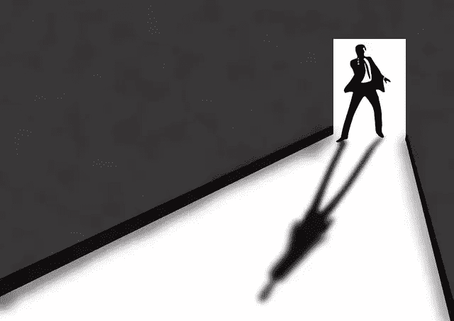
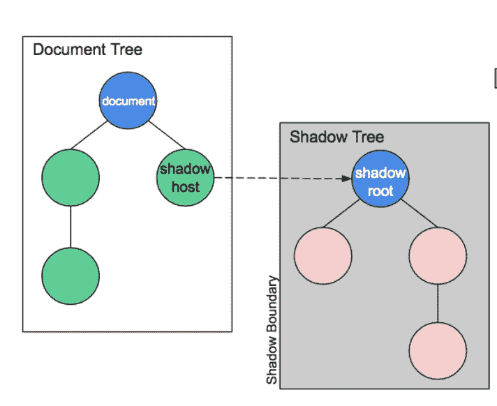
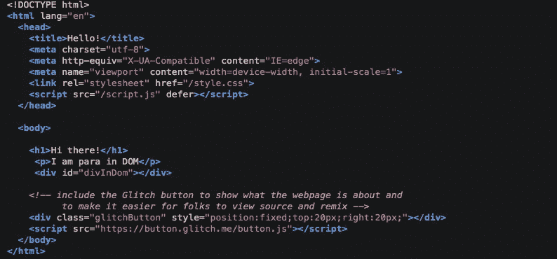
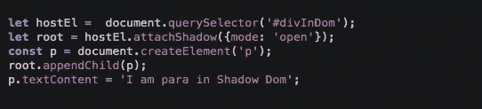
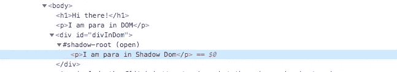
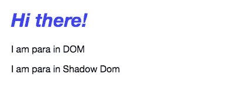
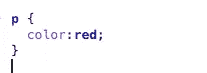
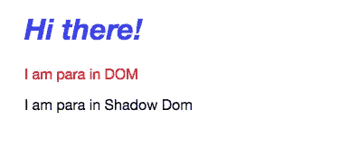

# 点亮阴影世界

> 原文：<https://javascript.plainenglish.io/understanding-the-shadow-dom-8495860b39bf?source=collection_archive---------1----------------------->



I’m DOM, Shadow DOM

这是对**什么是**阴影 DOM 和**如何**、**何时**以及**为什么**要使用阴影 DOM 的基本介绍。

# 什么是暗影 DOM？

简单地说，这是一个 DOM 中的 DOM。

使用 Shadow Dom，您可以附加一个单独的 Dom 树，它被隐藏并封装到任何元素中。这对于在 web 组件中实现封装非常有帮助。



# **如何使用阴影 DOM**

Shadow root:附加到 DOM 元素的影像树的根节点。

# 创建一个影子根:

> **在自定义组件的构造函数中添加阴影——最常见的用例**

当一个定制组件被封装和抽象时，它将工作得最好。Shadow DOM 有助于实现这一目标。我们一会儿会调查的。

```
var shadow = this.attachShadow({mode: 'open'});
```

> **将阴影 dom 附加到 DOM 树中的元素上**

在这种情况下，直接访问 DOM 树的元素并附加阴影 DOM

```
var shadow = element.attachShadow({mode: 'open'});
```

Shadow dom 的模式属性可以是“open”或“closed”。

它指定了是否可以从 JavaScript 访问影子根的内部特性。

所以如果 mode=closed，element.shadowRoot 会返回 *null。*

# 创建阴影 dom 结构:

```
var parent = document.createElement('div');
var img = document.createElement('img');
icon.appendChild(img);
```

# 将影像 dom 附加到影像根:

```
shadow.appendChild(parent);
```

# 为什么是影子王国？

如前所述，它有助于从真实的树中抽象出影子树。

让我们看一个例子:

我们有一个带有 div #divInDom 和' p '标签的 HTML 文件



现在我们给 div #divInDom 添加一个阴影房间



我们在阴影 DOM 中添加了一个 p 标签，现在看起来像这样:



输出:



现在让我们看看✨行动中的影子王国



我们为“p”标签添加了一个样式，如果你还记得，我们现在有两个“p”标签——一个作为 DOM 的一部分，一个作为影子 DOM 的一部分。

让我们看看输出中发生了什么:



如你所见，样式没有影响阴影 DOM 元素。

反之亦然，影子 DOM 中定义的样式不会影响根 DOM。

影子 DOM 并不是最近才出现的——浏览器使用它封装元素的内部结构已经有很长时间了。标记就是很好的例子。

您在 DOM 中看到的只是`<video>`元素，但是它包含一系列按钮和它的影子 DOM 中的其他控件。shadow DOM 规范已经做到了这一点，因此您可以实际操作自己定制元素的 shadow DOM。

链接到示例:

[](https://glitch.com/~shadowdom) [## 阴影世界

### 阴影 Dom 示例🎏Glitch 是一个友好的社区，每个人都可以在这里发现和创建最好的应用程序…

glitch.com](https://glitch.com/~shadowdom) 

影子 DOM 上的 MDN 文档:

[](https://developer.mozilla.org/en-US/docs/Web/Web_Components/Using_shadow_DOM) [## 使用阴影 DOM

### web 组件的一个重要方面是封装——能够保持标记结构、样式和行为…

developer.mozilla.org](https://developer.mozilla.org/en-US/docs/Web/Web_Components/Using_shadow_DOM)