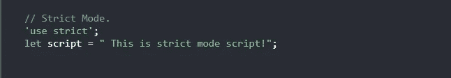

# 理解 JavaScript 中的严格模式

> 原文：<https://javascript.plainenglish.io/understanding-the-strict-mode-in-javascript-8c041025cda8?source=collection_archive---------14----------------------->

## 通过实例了解 JavaScript 严格模式

Photo by [Mimi Thian](https://unsplash.com/@mimithian?utm_source=medium&utm_medium=referral) on [Unsplash](https://unsplash.com?utm_source=medium&utm_medium=referral)

# 什么是严格模式？

JavaScript 的 ES5 版本中引入了严格模式。这是一个使你能够在一个“**严格的**操作环境中编写程序或方法的特性。这是一种选择*进入*的方式，T5 是 JavaScript 的一种受限变体。这种严格的上下文阻止我们在 JavaScript 代码中采取一些行动。因此，它会抛出更多的异常并阻止您出错。严格模式对普通 JavaScript 做了一些改变，这就是我今天要在这篇文章中展示的。

Strict Mode in JavaScript.

# “使用严格”指令

“ **use strict** ”指令不是一个语句，而是一个文字表达式，被早期版本的 JavaScript 所忽略。“使用严格”的目的是表明我们的代码将在严格模式下执行。所有现代浏览器都支持它。通过在脚本或函数的开头添加“use strict”来声明严格模式。如果它是在脚本的开头声明的，那么该脚本中的所有代码都将在严格模式下执行，因为在这种情况下它具有全局作用域。看看下面的例子:

Strict Mode in JavaScript.

如您所见，这个脚本将在严格模式下执行。

# 在严格模式下不允许

在严格模式下，不允许使用没有声明的变量，否则会导致错误。

Using a variable without a declaration.

同样的事情也适用于对象，因为它们也是变量。

在严格模式下不允许删除变量(或对象)。看看下面的例子:

Deleting a variable.

同样的事情也适用于函数，你不能在严格模式下删除一个函数，如果你这样做，它会抛出一个错误。

也不允许删除不可删除的属性:

Trying to delete the object’s prototype.

函数中的关键字`**this**`在严格模式下表现不同。它指的是调用函数的对象。让我们看看下面的例子:

**this** keyword in strict mode.

在严格模式下，关键字`**this**` 会返回 undefined，但在正常模式下，如果没有指定对象，则是指窗口对象。

JavaScript 中的严格模式防止采取其他动作，例如使用 **eval** 函数或带有语句的**等。**

# 为什么是严格模式？

严格模式使得编写 ***安全*** JavaScript 更加容易。因为每次当你使用不好的语法时，它会将其转换为真正的错误。在普通的 JavaScript 中，开发人员不会收到任何为不可写属性赋值或错误键入变量名的错误反馈。另一方面，严格模式会为此抛出一个错误。这对调试 JavaScript 代码很有用。

# 结论

正如您所看到的，JavaScript 中的严格模式帮助我们使代码更加安全和容易。变量使用的简单性给了代码编写人员防止不同语法错误的好处。这篇文章到此为止，我希望你今天学到了一些新东西。