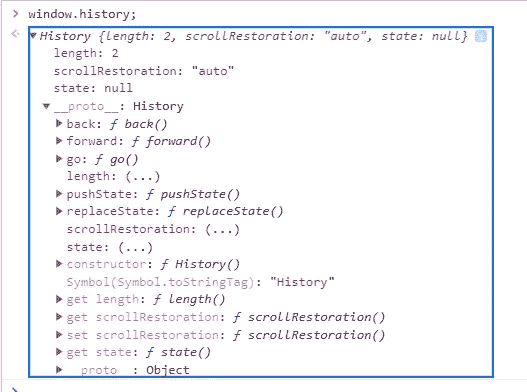

# 理解 JavaScript 中的 Web 历史 API

> 原文：<https://javascript.plainenglish.io/understanding-the-web-history-api-in-javascript-eac987071d4d?source=collection_archive---------11----------------------->

## JavaScript Web 历史 API 及实例

Photo by [Kevin Ku](https://unsplash.com/@ikukevk?utm_source=medium&utm_medium=referral) on [Unsplash](https://unsplash.com?utm_source=medium&utm_medium=referral)

# 什么是 Web API？

**API** 代表 **A** 应用 **P** 编程 **I** 接口。它是某种具有一组功能的接口，允许程序员访问应用程序、操作系统或其他服务的特定功能或数据。web API 是 web 的应用程序编程接口，它可以用于 Web 浏览器或 Web 服务器。我们可以使用不同的技术如 Java 或 Node 等来构建自己的 Web API。还有另一种类型的 API 称为第三方 API，它不是内置在您的浏览器中。你必须从网上下载代码才能使用，比如 Youtube API 或 Twitter API。所以在这篇文章中，我决定给你一些关于 Web 历史 API 的知识。

Photo by [Joshua Aragon](https://unsplash.com/@goshua13?utm_source=medium&utm_medium=referral) on [Unsplash](https://unsplash.com?utm_source=medium&utm_medium=referral)

# Web 历史 API

所有浏览器都支持 web 历史 API。 **window.history** 对象在其原型上有一些有用的方法，我将在下面向您展示。它包含用户访问的所有网站。让我们打开我们的控制台来看看这个对象。看看下面的例子:

The **window.history** Object in the console.

如您所见，“ **window.history** ”对象在其原型上有一些有用的方法。我马上会给你们展示其中的一些。

# 历史回溯法

history **back** 方法加载历史列表中的前一个 **URL** 。这与在浏览器中单击“后退箭头”是一样的。让我们看看下面的例子:

The **back( )** method.

当我们点击该按钮时，它会将我们带到浏览器历史列表中的上一个链接(URL)。

# 历史围棋法

**go()** 方法允许我们在浏览器历史列表中加载一个特定的 URL。让我们看看下面的例子:

The **go()** method.

因此，当我们单击 button 元素时，我们将返回 2 页，正如我们在上面的示例中指定的(-2)。

# 历史向前法

方法加载历史列表中的下一个 URL。在这下面，有一个如何使用的例子。

The **forward()** method.

点击按钮将加载我们浏览器历史列表中的下一个 URL。

# 结论

如你所见，历史 Web API 在我们网站上从一个页面转到另一个页面时非常有用和重要。请确保我们没有涵盖这个 web API 的所有内容，这就是为什么您需要从其他资源中了解更多信息。我希望你今天学到了新东西。