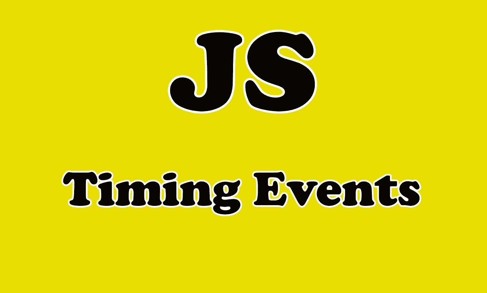

# 理解 JavaScript 中的计时事件

> 原文：<https://javascript.plainenglish.io/understanding-timing-events-in-javascript-3aac74b7c824?source=collection_archive---------8----------------------->

## 用 JavaScript 计时事件，并附有实例


Photo by [Aron Visuals](https://unsplash.com/@aronvisuals?utm_source=medium&utm_medium=referral) on [Unsplash](https://unsplash.com?utm_source=medium&utm_medium=referral)

# 有哪些计时项目？

在 JavaScript 中，程序员使用定时事件来延迟某些代码的执行，或者以特定的间隔重复代码。这可能很有用，因为代码将按时间间隔执行。

有两种类型的功能用于完成这些任务:

`**setTimeout()**`和`**setInterval()**`。

在本文中，我们将学习 JavaScript 中的这些计时函数。让我们开始吧。



Image Created with ❤️️ By [Mehdi Aoussiad](https://mehdiouss315.medium.com/).

# 暂停

方法`setTimeout()`用于将传递的函数的执行延迟一段指定的时间。

该方法接受两个参数:要调用的函数，以及延迟函数执行的时间(以毫秒为单位)。

> 请注意，1000 毫秒相当于 1 秒。

这里有一个例子:

```
// The function that we will call.
function print(){
   console.log('Hello World');
}// The setTimeout.
**setTimeout(print,3000);**
```

上面的例子会在 3 秒(3000 毫秒)后调用函数`print`。所以，消息`hello world`将在 3 秒钟后打印在控制台上。

方法`setTimeout()`将在指定时间过后从第一个参数开始执行一次函数。

# 设置间隔

我们使用方法`setInterval()`来指定一个在执行之间有时间延迟的函数。

同样，向`setInterval()`传递两个参数:您想要调用的函数，以及延迟函数每次调用的时间(以毫秒为单位)。

看看下面的例子:

```
// The function that we will call.
function print(){
   console.log('Hello World');
}// The setInterval.
**setInterval(print,2000);**
```

如您所见，打印功能将每隔 2000 毫秒执行一次。因此，消息`hello world`将每 2 秒钟打印一次。

方法`setInterval()`将继续执行，直到被清除。

# clear 超时和 clearInterval

还有相应的原生函数来停止计时事件:`clearTimeout()`和`clearInterval()`。

为了代码的清晰，你应该总是匹配`clearTimeout()`到`setTimeout()`和`clearInterval()`到`setInterval()`。

要停止一个计时器，调用相应的 clear 函数，并向它传递与您希望停止的计时器匹配的计时器 ID 变量。`clearInterval()`和`clearTimeout()`的语法相同。

看看下面的例子:

```
let timeoutID;

function delayTimer() {
  timeoutID = setTimeout(delayedFunction, 3000);
}

function delayedFunction() {
  alert(“Three seconds have elapsed.”);
}

function clearAlert() {
  **clearTimeout(timeoutID)**;
}
```

正如你所看到的，上面的计时事件将被停止，因为我们清除了它。

# 结论

计时事件在 JavaScript 中非常有用和重要。它们用于在不同的时间间隔清除和执行一段代码。

感谢您阅读本文，希望您觉得有用。

# 更多阅读

[](https://medium.com/javascript-in-plain-english/3-beginner-javascript-algorithms-to-improve-your-coding-skills-9e769ed1ffd9) [## 3 个初级 JavaScript 算法来提高你的编码技能

### JavaScript 算法来提高你解决问题的技能

medium.com](https://medium.com/javascript-in-plain-english/3-beginner-javascript-algorithms-to-improve-your-coding-skills-9e769ed1ffd9)