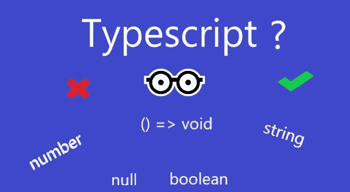
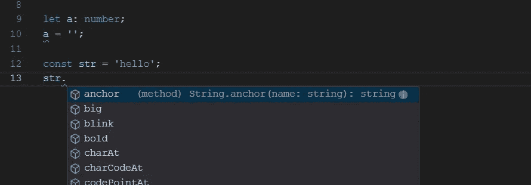

# 了解 TypeScript 中的类型

> 原文：<https://javascript.plainenglish.io/understanding-types-in-typescript-b8d2297126bf?source=collection_archive---------1----------------------->

## 为您的代码构建坚实的基础



现在是 2019 年，大多数库都支持 TypeScript，所以你很有可能想在下一个项目中使用 TypeScript。在 ***写代码。ts*** 文件是不够的，因为 TypeScript 编译器非常宽松，许多 web 开发人员倾向于编写没有任何类型注释的 JavaScript 代码，这使得使用 TypeScript 的整个目的变得徒劳。



TypeScript’s autocomplete suggestion and compile time error checking

此处将涵盖的内容列表:

1.  基本类型(数字、字符串等。)
2.  功能类型
3.  元组
4.  可空类型
5.  枚举
6.  接口

# **基本类型**

```
const name: string = 'Frudo';
```

下面是在 TypeScript 中以下列形式使用类型的简单示例

> 设变量名称:数据类型=值

对于简单类型*,如果变量赋值在声明的同一行完成，data_type* 可以避免。

```
const name = 'Frudo';
```

TypeScript 编译器将推断变量的类型，这被称为*类型推断*，我们可以避免编写不必要的代码。

以下是 TypeScript 中的基本类型:

1.  布尔型(真或假)
2.  数字(整数和小数)
3.  线
4.  排列
5.  任何(它可以保存任何数据类型)

```
const flag: boolean = true;            // boolean
const count: number = 10;             // number
const name: string = 'Fred';         // stringconst names: string[] = ['Fred', 'Alice'];    // Array of string
const temp: Array<number> = [1, 4, 2.5, 100] // Array of numberconst a: any = 'hello'    // any type
const b: any = 5         // any type
```

指定数据类型非常有用，因为它有助于发现常见的赋值错误。

> 谨慎:避免使用 ***任何*** 类型，因为这与编写普通 javascript 代码是一样的

```
let count;           // any type by default
count = 7;          // no error
count = 'wow'      // no error
```

在上面的例子中，count 的类型是“any ”,这是当我们声明变量时由 TypeScript 指定的默认类型。

这个错误可以很容易地用类型来修复:

```
let count: number;   // number type
count = 7;          // no error
count = 'wow'      // compile time error
```

# **功能类型**

在 TypeScript 中，我们也可以为函数定义类型。它对于定义回调函数非常有用，这是 JavaScript 中的一种常见模式。首先，让我们定义一个函数，并对它进行类型注释:

```
function sum(num1: number, num2: number): number {
    return num1 + num2;
}
```

这里我们给了变量`num1`和`num2`一个类型号，函数的返回类型也是冒号后的数字。对于箭头函数，语法是不同的。

```
const sum: (num1: number, num2: number) => number = (num1, num2) => num1 + num2;
```

现在这有点令人困惑，所以让我们把它分成两部分，把变量设为 ***让*** 而不是**const**。**

```
*let sum: (num1: number, num2: number) => number;*
```

*这里我们定义了一个变量`sum` ，并给了它一个函数类型，它有两个参数，类型为*数字*和返回类型为*数字。*在这之后我们将赋予它箭头功能的实现。*

```
*sum = (num1, num2) => num1 + num2;*
```

*这里我们用 arrow 函数实现给变量`sum`赋值。*

*还有一件事，如果函数不返回值，它的返回类型将是`void`，这意味着*没有返回类型。**

```
*function print(value: string): void {
  console.log(value);
}*
```

*最后，让我们用一些用例来总结函数类型:*

# *元组*

*想知道如何在函数中返回多个值吗？元组来拯救，它让您可以轻松地返回多个不同数据类型的值。*

```
*const example: [int, string] = [10, 'Hi'];*
```

*元组只是幕后的数组，但 TypeScript 用独特的类型检查增强功能包装了它。元组可以保存不同的数据类型，可以像数组一样使用索引来访问，但它与数组相比有一些不同。元组中的每个索引只能保存声明期间定义的数据类型。与其他编程语言不同，TypeScript 中的元组是可变的，我们还可以推送或弹出元组中的值。*

*您还可以自动完成特定于索引数据类型，这在数组中是不可能的。即使元组是可变的，也应该尽可能避免。元组用例的一个真实例子是在 React 中，其中`useState()`挂钩返回元组。*

# *可空类型*

*javaScript 有两种类型`undefined`和`null`，它们代表空值或 null 值，就像在 Java 和 c#中一样。这也是用 javascript 编程时人们面临的最常见的运行时错误之一。TypeScript 也有这两种类型，它可以被赋给任何数据类型。*

```
*let str: string;*
```

*这里`str`有值`undefined`,因为我们从未给它赋值，尽管它的数据类型是字符串。对`str`的任何操作都会导致运行时错误，因此我们需要使用 if 语句检查它是否包含某个值，然后执行所需的操作。*

```
*if(str) {
 str.length;
}*
```

*默认情况下，TypeScript 不会在编译时考虑`undefined`和`null`运行时错误。在名为***strictNullChecks***的***ts config . JSON***文件中有一个标志可以设置为 true，这会导致 TypeScript 对代码进行流分析，以检查带有`undefined`和`null`的不安全代码，并在编译时给出错误。*

```
*{
  "include": ["src/**/*"],
  "exclude": ["node_modules", "**/*.spec.ts"],
  "compileOnSave": false,
  "compilerOptions": {
    ...
    "strict": true,             // All strict flags are turned on
    "strictNullChecks": true,   // Null checks for nullable types
    ...
  }
}*
```

*当***strictNullChecks***为真时，那么`let str: string;`将给出错误，因为我们不能将`undefined`赋值给类型字符串。为了允许 undefined 赋值给`str`,我们需要这样声明:*

```
*let str: string | undefined;*
```

*这就是所谓的可空类型。TypeScript 不允许我们直接访问可空类型，相反我们需要对它进行检查。*

```
*let str: string | undefined = 'Hello';str.length; // error// Access like below
if(str) {
 str.length;
}*
```

*这使得代码库更加健壮，并防止了一整类运行时异常。这种空检查如此强大，以至于当 TypeScript 团队在制作编译器时启用了这一功能，他们在代码库中发现了未被发现的错误。*

***注意:** `null`不能赋给`let str: string|undefined`，因为`null`和`undefined`在类型脚本中被认为是不同类型。*

*为了给`null`赋值，我们需要将变量定义为*

```
*let str: string | null | undefined*
```

*这将允许`undefined`和`null`都可以分配给`str`。*

*有时当你知道一个给定的变量不包含`null`或`undefined`时，你可以使用**类型断言**来强制删除 null。*

```
*let str: string | undefined = 'Hello';
str!.length; // it will work*
```

*这里的`!`用于从`str`中移除可空类型，并用它调用`length`。只有当你确信给定的变量不会为空时，才应该小心使用类型断言。*

# *枚举*

*枚举就像逻辑上组合在一起的常量，有助于提高常量的可读性，并且可以有有趣的用例。枚举在其他语言中也是可用的，如 java、c#等，它们也类似于 TypeScript 中的枚举。*

*枚举的定义如下:*

```
*enum Direction {
 North, South, East, West
}*
```

*枚举类型的任何变量只能有由该枚举定义的那些值，例如*

```
*let d: Direction = Direction.North
d = Direction.Southd = "East"    // error// Checking for value
d == Direction.South    // true or false
d == "South"           // error*
```

*正如你所看到的，枚举允许我们施加额外的约束，并且比使用`const`更加易读。*

*默认情况下，枚举从 0 开始取数值，但是我们可以手动给它们赋值。*

```
*enum Direction {
 North=1, South=6, East=5, West=2
}*
```

*您也可以将字符串值赋给枚举。只能将数字和字符串值赋予枚举。*

```
*enum Direction {
 North='north', South='south', East='east', West='west'
}*
```

# *接口*

*在 javascript 中，我们经常动态地创建许多对象，将它们存储在变量中，然后传递给函数。接口允许我们定义这些对象的结构，这样我们就可以放心地编写代码，确信该对象中存在特定的属性。*

```
*interface IProduct {
name: string;
description: string;
price: number;
}*
```

*通常，我以' **I** '开始接口名称，以便区分类和接口，但这不是必须的。接口一旦定义，就可以像任何其他类型一样使用*

```
*let book: IProduct = {
name: 'Typescript guide',
description: 'Guide for beginners',
price: 100
};book = {name: 'Typescript'}; //error, all properties are not definedfunction displayPrice(product: IProduct) {
console.log(product.price);
}*
```

*TypeScript 编译器检查接口的结构相等性，这意味着接口定义的所有属性都应该存在于该对象中，否则将引发编译时错误。*

*我们也可以定义匿名接口(没有名字)*

```
*let custom: { id: number, name: string }; // anonymous interfacecustom = {id: 45, name: 'Frudo'};custom = {id: '45', name: 'Frudo'}; // error, id is number*
```

*接口可以是非常强大的，因为它有助于属性的逻辑分组，这些属性也可以是函数类型、枚举、可空值甚至是另一个接口。*

*接口通常用作模型，例如 json 响应的 api 模型。创建接口模型有助于通过 IDE 自动完成、错误检查和作为自我文档。*

*这里的是一个有用的链接，可以轻松地将 JSON 响应转换为 TypeScript。*

 *[## JSON Utils:从 JSON 生成 C#、VB.Net、SQL 表、Java 和 PHP

### JSON Utils 是一个从 JSON 生成 C#、VB.Net、Javascript、Java 和 PHP 类的网站。它还会清理你的…

www.jsonutils.com](https://www.jsonutils.com/)* 

# *结论*

*因此，我们学习了很多关于 typescript 中最常用的类型以及如何使用它的知识。项目越大，它就变得越有用，真正的项目通常会变得更大。这些额外的工作将为项目的后期铺平道路。快乐编码😃👍。*