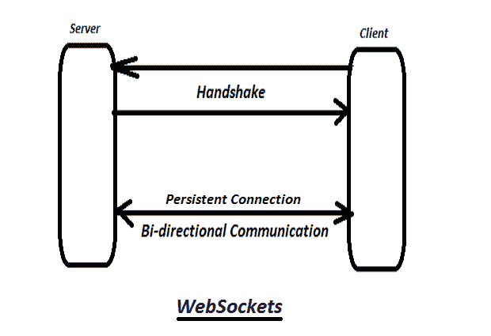
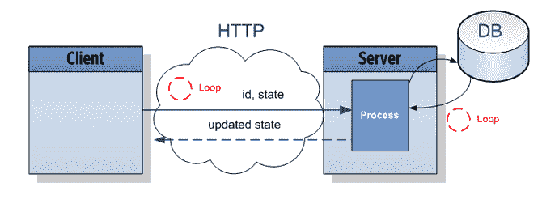

# 了解网络套接字及其可能性

> 原文：<https://javascript.plainenglish.io/understanding-websockets-and-its-possibilities-ef4f5b48973f?source=collection_archive---------4----------------------->

## *能够在用户的浏览器和服务器之间打开双向交互通信会话的技术*

## **简介**

作为 web 应用程序的用户，我们已经习惯于能够通过聊天、文本消息或其他形式的数字通信方法与他人快速、无缝地交互。大多数消费者认为这是某种神秘的互联网魔法，作为程序员，我们知道有一个更深更丰富的解释来解释这种网络技术是什么，它是做什么的，以及它是如何在幕后运作的。

## **你好网络套接字**

从历史上看，对于希望构建实时 web 应用程序的程序员来说，过去的情况是，您构建应用程序，将消息从发送方的客户端发送到服务器，然后将该响应从服务器发送到接收方的客户端。通过 WebSocket API (WebSockets)，我们消除了这一需求，并为 web 开发人员引入了无限的可能性来利用客户机和服务器之间的双向(双向)通信。现在我们已经介绍了网络套接字，让我们了解网络套接字实际上是如何工作的。

从 MDN:****WebSocket API****是一种先进的技术，它使得在用户的浏览器和服务器之间打开双向交互通信会话成为可能。有了这个 API，您可以向服务器发送消息并接收事件驱动的响应，而无需点击服务器进行回复(*[*https://developer . Mozilla . org/en-US/docs/Web/API/WebSockets _ API*](https://developer.mozilla.org/en-US/docs/Web/API/WebSockets_API)*)。**

*本质上，网络套接字允许客户端和服务器保持彼此之间的持久连接，而不需要来自 HTTP 协议的常备请求和响应事件循环。网络套接字不是让客户端向服务器发出请求，让服务器响应来完成请求，而是最初使用 HTTP，然后保持 TCP 连接的活动状态，这样就避免了通常困扰 HTTP 请求和响应周期的延迟，而是使用 TCP 连接来获得几乎没有延迟的实时响应。*

*对于 TCP 连接，网络套接字在请求打开网络套接字连接的客户端和同意握手的服务器之间创建初始握手。一旦创建了这个握手，握手就持续存在(在视觉上继续保持在服务器和客户机之间—见下图)，并且这个持久的 TCP 连接(握手)充当通信桥，然后允许数据(以消息的形式)以实时的方式从客户机流向服务器并返回。*

**

*Image from ([https://images.techhive.com/images/article/2016/06/websockets-100668229-primary.idge.jpg](https://images.techhive.com/images/article/2016/06/websockets-100668229-primary.idge.jpg))*

## ***让我们来看看技术问题***

*如果没有 WebSockets，用户将使用 HTTP 长轮询。通过 HTTP 长轮询，客户端不断轮询服务器并请求新信息。一旦有新数据可用，服务器将向客户端发送数据，因此客户端要接收该新数据，必须继续联系服务器以查看数据库的状态是否已经改变，即是否有新信息要显示。这将持续进行，并且不断检查服务器的新信息需要事件循环来加重服务器基础设施的负担，并且随着来自许多用户的多个客户端访问服务器，这将加重服务器的负担，并且需要将大量数据发送到发出请求的所有不同客户端。*

**

*Image from ([https://medium.com/front-end-weekly/what-are-websockets-7bf0e2e1af2](https://medium.com/front-end-weekly/what-are-websockets-7bf0e2e1af2)).*

*另一方面，对于 WebSockets，我们之前描述的初始握手意味着从每个客户端到服务器建立持久的 TCP 连接，这将允许数据以实时的方式从客户端流向服务器，反之亦然。这个过程从客户机向服务器发出一个初始的 GET HTTP 请求开始。*

*一旦发出初始请求并且握手被接受，TCP 连接就保持打开，并且与 HTTP 长轮询方法不同，不需要每次都从客户端向服务器发出新的请求，因此事件循环不需要处理来自每个客户端的每个持续进行的请求。*

*相反，服务器将只是发送任何新的信息给客户端，客户端将根据需要呈现这些新信息。它自动默认地将新信息从服务器传递到客户端，消除了 HTTP 长轮询将执行的高延迟、基础设施繁重的请求的需要。*

## ***何时使用 WebSockets***

*对于那些热衷于在自己的应用程序中添加 WebSockets 的程序员来说。让我们花点时间来评估什么类型的应用程序最适合 WebSockets。如前所述，做得最好的 web 应用程序是实时或接近实时的应用程序，但是它到底有什么特征呢？*

*让我们看看 Windows 开发人员的博客，它解释了什么时候您可能需要通过传统 HTTP 使用 WebSockets:*

## ****反应时间快****

**当客户需要对变化(尤其是无法预测的变化)做出快速反应时，WebSocket 可能是最佳选择。考虑一个允许多个用户实时聊天的聊天应用程序。如果使用 WebSockets，每个用户都可以实时发送和接收消息。与 REST 相比，WebSockets 允许更高的效率，因为它们不需要发送和接收每个消息的 HTTP 请求/响应开销。**

## ****持续更新****

*当客户想要持续更新资源状态时，WebSockets 通常是一个很好的选择。当客户无法预测何时会发生变化，并且变化很可能在短期内发生时，WebSockets 是一个特别好的选择。*

## ***T3***

*WebSocket 协议不是围绕请求-响应设计的。消息可以在任何时候从连接的任何一端发送，并且没有对一个消息的本地支持来指示它与另一个消息相关。这使得该协议非常适合“启动并忘记”的消息传递场景，而不太适合需要一方在另一方的响应可以启动之前做出响应的事务性需求。*

## ****小有效载荷下的高频消息传递****

**web socket 协议提供了交换消息的持久连接。这意味着单个消息不会产生任何额外的税费来建立传输。诸如建立 SSL、内容协商和交换大容量报头之类的费用只在连接建立时征收一次。**

**由于 WebSockets 是专门为长期连接场景设计的，因此它们避免了建立连接和发送 HTTP 请求/响应头的开销，从而显著提高了性能。**

**引自:(*[*https://blogs . windows . com/windows developer/2016/03/14/when-to-use-a-http-call-inst-of-a-web socket-or-http-2-0/*](https://blogs.windows.com/windowsdeveloper/2016/03/14/when-to-use-a-http-call-instead-of-a-websocket-or-http-2-0/#:~:text=WebSockets%20allow%20for%20a%20higher,each%20message%20sent%20and%20received.&text=When%20a%20client%20wants%20ongoing,are%20generally%20a%20good%20fit.)*)**

*如果您的 web 应用程序的特征符合上面列出的要求，那么可以考虑将这些流行的 WebSocket 库集成到您的应用程序中。*

## ***你自己的图书馆***

**

*([https://www.traveller.com.au/content/dam/images/g/s/2/8/9/w/image.gallery.galleryLandscape.620x414.gs94jd.png/1477354626702.jpg](https://www.traveller.com.au/content/dam/images/g/s/2/8/9/w/image.gallery.galleryLandscape.620x414.gs94jd.png/1477354626702.jpg))*

*当希望使用 WebSocket API 时，我们希望寻找与 WebSockets 和我们的服务器端语言一起工作的有用的库。对于我们的示例，我们使用流行的 Javascript 运行时 Node.js，并将引用 Node.js 生态系统中的 js 库示例。*

*下面是三个流行的 WebSocket JS 库，它们提供了实现 WebSockets 的功能，您可以将这些功能用于您的实时应用程序:*

## *1.socket.io*

*一个广泛流行和使用的 WebSocket 包装器/API，拥有超过 43K 颗星。socket.io 由 Node.js 服务器和 [*Javascript 客户端库*](https://github.com/socketio/socket.io-client) *组成，为处理代理和负载平衡器以及个人防火墙和杀毒软件提供可靠性，甚至支持二进制流。这里是* [*环节*](https://github.com/socketio/socket.io) *。**

## ***②*。ws****

**With 9k stars WS 是一个流行的 WebSocket 是 Node.js 的客户端/服务器库，帮助管理 WebSocket 协议下的事情。由于 WebSocket 协议在大多数主流浏览器中都是本地支持的，所以有些人选择直接使用 WebSocket，而不在上面使用 socket.io。这里是* [*链接*](https://github.com/websockets/ws) *。**

## *3.sockjs*

*At 6k stars sockjs 是一个浏览器 JavaScript 库，它提供了一个类似 WebSocket 的对象，带有一个跨浏览器 Javascript API，可以在浏览器和 web 服务器之间创建低延迟、全双工、跨域的通信。它遵循 HTML5 WebSocket API，只有当它失败时，它才回退到特定于浏览器的协议。这里是 [*链接*](https://github.com/sockjs/sockjs-node) *。**

*引自:([https://blog . bitsrc . io/8-node-js-we b-socket-libraries-for-2018-818 e7e 5b 67 cf](https://blog.bitsrc.io/8-node-js-web-socket-libraries-for-2018-818e7e5b67cf))*

*现在我们有三个 JS 库可以帮助您的应用程序实现 WebSockets，让我们仔细看看可以与这些 WebSocket 库一起使用的托管服务，它们可以帮助实时增强您的应用程序，并使构建更加容易。原谅我的双关语。*

## ***更快的解决方案***

*对于我们这些专注于使用 WebSockets 实现解决方案，而不热衷于编写基础架构代码或处理 WebSocket 部署的人来说，您可以考虑 socket.io 等 JS 库的替代方案，或许可以利用更快更有效的解决方案，如受欢迎的 [Pusher API](https://pusher.com/) 等托管解决方案。*

*什么是 Pusher API？正如他们的网站所说:*

*Pusher 是一个平台，允许开发者尽可能快地轻松构建具有实时特性的应用程序。Pusher 专门为开发人员构建实时和可扩展的基础设施，并打包了强大的功能，如客户端事件、可查询 API、发布/订阅消息等([*【https://pusher.com/tutorials/react-websockets】*](https://pusher.com/tutorials/react-websockets)*)。**

*使用 Pusher，程序员可以做更少的工作来将实时行为实现到他们的应用程序中，而使用 Pusher Channels 这样的服务，可以建立所有必要的基础设施来让您的实时应用程序快速而简单地与 Web Sockets 一起工作。此外，Pusher 确保您的后台基础设施服务器代码能够高效地伸缩，从而减轻程序员在处理大量客户端请求时的负担，这些请求会随着您的实时应用程序越来越受欢迎而出现。*

## ***结论***

**

*图片来自([https://images . unsplash . com/photo-1565049981953-379 c 9 C2 a5d 48？IX lib = r b-1 . 2 . 1&ixid = eyjhchbfawqiojeymdd 9&w = 1000&q = 80](https://images.unsplash.com/photo-1565049981953-379c9c2a5d48?ixlib=rb-1.2.1&ixid=eyJhcHBfaWQiOjEyMDd9&w=1000&q=80)*

*让我们最后总结一下 WebSockets 给希望构建接近实时和实时应用程序的程序员带来的好处！*

*WebSockets 是客户机/服务器 web 技术中的一个游戏改变者。通过建立“握手”，在客户端和服务器之间建立持久的 TCP 连接，这允许在客户端和服务器之间进行双向消息传递，与传统的 HTTP 请求响应周期相比，这具有非常低的延迟和少得多的技术开销。*

*这种持续的 TCP 连接允许最终用户以代码高效和实时的方式构建和使用实时应用，同时允许程序员不必花费大量资源来编写基础设施代码来处理实时行为或部署。*

*对于那些渴望了解更多关于 WebSockets 和更深入一点的人，请参考 WebSocket API 文档([https://html.spec.whatwg.org/multipage/web-sockets.html](https://html.spec.whatwg.org/multipage/web-sockets.html))并查看 WebSockets 上的 Mozilla 文档([https://developer.mozilla.org/en-US/docs/Web/API/WebSocket](https://developer.mozilla.org/en-US/docs/Web/API/WebSocket))。*

*感谢您的阅读，并享受 WebSockets 带来的乐趣！*

***参考文献**
[https://developer . Mozilla . org/en-US/docs/Web/API/Web sockets _ API](https://developer.mozilla.org/en-US/docs/Web/API/WebSockets_API)*

*[https://sookocheff . com/post/networking/how-do-web sockets-work/](https://sookocheff.com/post/networking/how-do-websockets-work/)*

*[https://blogs . windows . com/windows developer/2016/03/14/when-to-use-a-http-call-inst-a-web socket-or-http-2-0/](https://blogs.windows.com/windowsdeveloper/2016/03/14/when-to-use-a-http-call-instead-of-a-websocket-or-http-2-0/)*

*[https://pusher.com/websockets](https://pusher.com/websockets)*