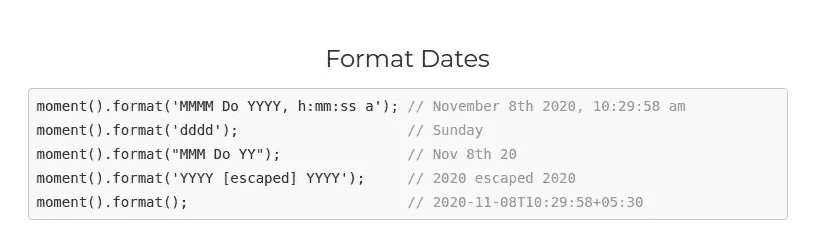

# 难忘的 10 年前的 JavaScript 库

> 原文：<https://javascript.plainenglish.io/unforgettable-10-year-old-javascript-libraries-3e5d4eceac04?source=collection_archive---------3----------------------->

## 革新了 web 开发的旧 JavaScript 项目。也许，你还在使用它们。

Photo by [Inja Pavlić](https://unsplash.com/@inja_jeki?utm_source=unsplash&utm_medium=referral&utm_content=creditCopyText) on [Unsplash](https://unsplash.com/s/photos/stonehenge?utm_source=unsplash&utm_medium=referral&utm_content=creditCopyText)

JavaScript 最初是一种简单的脚本语言，它通过在 DOM 中进行操作来帮助网页变得更动态。几十年前，网站不像我们现在这样充满活力。每个人都记得，旧的 web 应用程序的每个动作都要加载一整页。此后，AJAX 得到了广泛关注，因为它允许开发人员通过静默下载数据来更新 DOM，而无需重新加载整个页面。

十年前，基于 JavaScript 的库通过引入一些连接 DOM 和数据的好方法，使这些 DOM 操作变得更加容易。然而，即使在那个阶段，单一的 web 应用程序也很流行。Web 应用程序使用 AJAX 请求以有状态的方式获取数据和 HTML。此后，基于 MVVM 概念的前端现代框架诞生了。无状态架构极大地推动了这些前端框架。例如，使用 REStful API 模型。

以下 JavaScript 库最初是在大约 10 年前发布的，能够彻底改变整个 web 开发世界。

# jQuery

最初于 2006 年发布的 jQuery 使得 DOM 遍历和事件处理更加容易。在所有流行的浏览器开始实现纯 CSS 动画之前，它的动画模块做得非常好。此外，jQuery AJAX 请求为互联网上的众多 web 应用程序提供了动力。

jQuery 流行的主要原因是它可以很容易地用于任何类型的 web 应用程序，而不管构建特定的 web 应用程序使用什么技术。的确，现在 jQuery 还在被使用，因为不管用哪个前端框架，jQuery 都会工作得很好。

此外，WordPress 模板大量使用 jQuery 来处理响应滑块，像窗口小部件一样的菜单。

A simple example using JQuery basics, screenshot by the author

# jQuery UI

在现代可重用组件概念出现之前，小部件概念是实现结构良好的 UI 库的关键方法。通过使用占位符 DOM 元素和对 UI 库的 JavaScript 函数调用，可以在 web 浏览器上呈现每个小部件。许多网站和 web 应用程序使用 jQuery UI 和 jQuery 来将现代化的 UI 元素包含到它们的产品中。jQuery UI 之所以获得如此高的声誉，是因为当时的原生输入元素对用户并不友好。

有各种各样的 UI 元素用于构建用户友好的 web 应用程序，如对话框、日期选择器、工具提示、菜单等。此外，jQuery UI 有很好的主题，它也有一个自定义的主题构建工具。这个项目出现在 jQuery 发布一年之后。此后，为构建 web 应用程序，引入了众所周知的专有替代方案，如 Kendo UI。

JQuery UI’s date-picker widget, screenshot by the author

# PDF.js

如今，我们可以在网络浏览器中阅读任何流行的文档格式。然而，我们都记得曾经有一段时间，我们下载 Adobe Acrobat Reader 来打开通过互联网下载的 PDF 文件。旧网站甚至要求用户安装外部软件来查看 PDF 文件。最初由 Mozilla 开发的 PDF.js 引入了一种在 web 浏览器中阅读 PDF 文档的方法，方法是将 PDF 的内容呈现到 DOM 中。

此后，web 浏览器增加了对呈现 PDF 的内置支持，web 应用程序也很容易包含嵌入版本的 PDF 文档。

PDF.js demo from the official [website](https://github.com/mozilla/pdf.js#online-demo), screenshot by the author

# Angular.js

Angular.js 是一个前端框架，可用于构建称为 SPA 的单页面 web 应用程序。这个项目正好在 10 年前发布，通过让开发人员制作高度动态的应用程序，它能够将数据绑定方法和动态 HTML 模板提升到下一个级别。现在几乎所有的前端框架都激励大家把前端开发和后端开发分开。然而，Angular.js 可以很容易地用于构建:隔离用户界面(SPA)和基于 MVC 架构的整体应用程序。换句话说，Angular.js 可以很容易地用于 PHP，C *#生成的页面。* NET，Java 等。

A simple example of an Angularjs controller, screenshot by the author

# Moment.js

这个库在数据解析、格式化和操作方面仍然非常流行。它最初于 2011 年发布，数百万个项目成功使用了它。早些时候，Moment.js 提供了一种简单的日期操作方法，还提供了非常有用的功能，如相对时间计算和持续时间计算。然而，这个项目现在并不被它的开发者推荐，因为它有很多缺点，比如与其他产品相比，它的包很大，而且易变。

An example of the date formatting module of moment.js, screenshot by the author