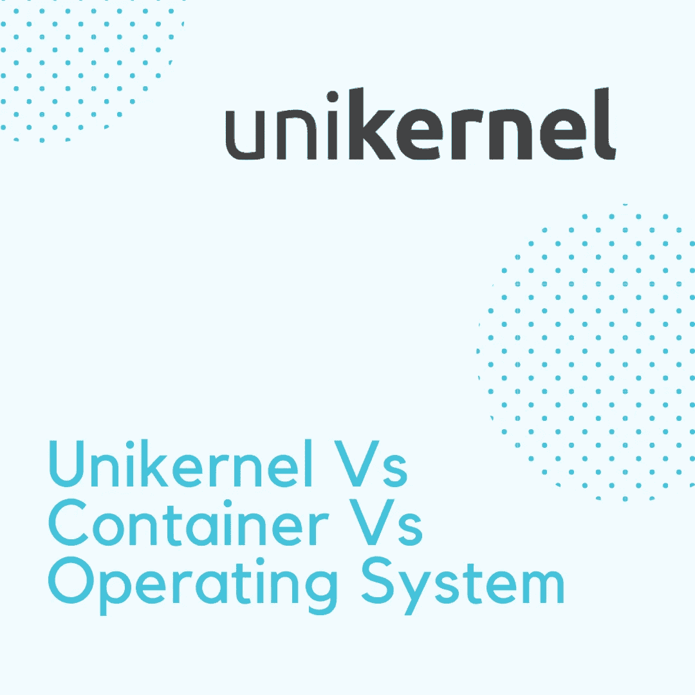
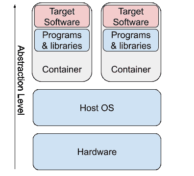
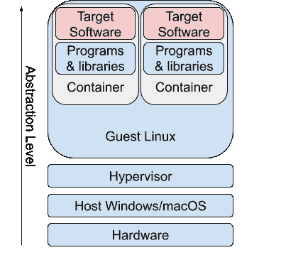
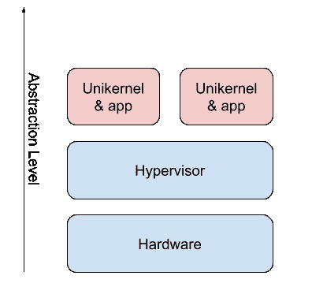

# 单核 Vs .容器 Vs .操作系统:并列比较

> 原文：<https://javascript.plainenglish.io/unikernel-vs-container-vs-operating-system-side-by-side-comparison-3b8d6d93665d?source=collection_archive---------6----------------------->

## 云计算的下一个时代

将软件部署到生产环境的过程是不断发展的。就在几十年前，每个人都使用虚拟机来托管和管理基础架构。最近，行业转向使用带有 Docker 和 Kubernetes 等系统的容器。这一进程的下一个逻辑步骤是 Unikernels，它结合了虚拟化和容器化的优点。

# 为什么部署这么难？

所有这些工具存在的原因是在将软件部署到生产环境时出现的问题。需要解决的一些常见问题如下:

1.  环境一致性。编写一段在单一平台上运行的代码要容易得多。因此，您需要最小化不同部署之间的平台差异。
2.  可扩展性。您应该能够快速扩展您的基础架构，以满足需求高峰并最大限度地降低成本。
3.  安全。这是不言自明的。您希望您的软件容易受到所有级别黑客的攻击。
4.  监控。您希望有效地监控基础架构上的负载，并提取各种数据来优化您的运营。
5.  对开发者友好。软件开发人员希望尽可能少地向客户发布他们的最后一个版本。通过让你的开发者开心，你可以避免以后的许多问题。

这个列表并不详尽，但是这些是一些直到最近都没有简单解决方案的常见问题。

# 使用虚拟机进行部署

在容器出现之前，虚拟化堆栈是大规模应用程序部署的必备工具。要理解其中的区别，你首先要理解什么是操作系统，什么是内核。

**操作系统**是管理硬件和控制运行软件的系统软件。最重要的是，它提供(并取走)对进程的硬件访问。

一个**内核**是操作系统的主要组成部分。操作系统的其余部分用来加载内核。它经常驻留在内存中，并完全控制硬件和软件。

现在，虚拟化是一种在共享硬件上运行多个操作系统的方式。一个叫做主机的操作系统运行一个管理程序，让客户操作系统安全地访问硬件。有时没有主机操作系统。第 1 类虚拟机管理程序直接在硬件上运行，并加载虚拟机。

典型的部署堆栈由运行在多台服务器上的多个虚拟机组成。你可以在上面看到这样一个堆栈的简图。有时它是基于应用程序的虚拟机、基于客户端的虚拟机或基于概念的虚拟机(一个用于数据库，一个用于缓存等)。).您可以注意到浪费了多少资源:每个虚拟机都必须运行自己的操作系统实例(通常是 Linux)，这导致了职责的重复。您也可以想象管理这样一个基础设施有多难:实际上，您最终可以拥有 100 多台服务器(例如，一个 SaaS 平台)，它们都是独立的虚拟机。

基于虚拟机的方法的部署过程有两种方式。构建系统可以生成带有内置软件的虚拟机的完整映像，一旦更新到达，虚拟机就会重新启动。或者，构建系统只生成软件包，使用一组脚本将软件包上传到服务器。这两种方法的缺点是设置复杂，最终会导致虚拟机之间的不一致。当你需要更新操作系统版本时，一场真正的噩梦就开始了。您必须做两次:首先是主机操作系统，然后是客户操作系统。

然而，这种方法也有它的好处。通过这种方式，您可以完全控制系统环境的各个方面，并可以对其进行配置以完全满足您的需求。它还简化了调试，因为您可以直接连接到虚拟机，并将其用作常规工作站。

# 使用容器的部署

随着 Docker 等容器运行时和 Kubernetes 等容器编排系统的出现，软件基础设施的新时代开始了。你可能对容器很熟悉，有些人甚至用过，所以现在我将解释它们是如何工作的。

容器试图实现与虚拟机相同的概念，但是消除了机器之间的重复工作。你还记得上一节的内核的概念吗？Docker 让容器使用主机操作系统的内核，同时允许它们下载特定于应用程序的库和程序，而不是为应用程序加载整个操作系统。由于 Linux 内核如此普遍，并且在不同的发行版中不会真正改变，因此实现了完全的平台独立性。通过调整容器及其映像，您可以微调应用程序将使用的特定库和配置，从而提高性能，而无需运行整个操作系统。典型的容器堆栈如下所示:

运行整个操作系统的开销很小，这意味着你可以在相同的硬件上运行更多的容器(更多的应用程序)。值得注意的是，Docker 只适用于 Linux 内核，因为它们支持健壮的**名称空间**。名称空间标准化了可用的资源，并且可以控制什么进程可以访问什么资源。因此，每个容器都可以获得所需的 CPU 时间、内存、存储和网络。当你在 macOS/Windows 上运行 Docker 时，它会启动一个 Linux 虚拟机，这就是为什么它在这些平台上会慢很多的原因。

当然，基于容器的方法也有缺点。软件必须适应在容器中的使用(容器化)，这可能会变得棘手，尤其是对于遗留代码库。此外，由于 Docker 使用 Linux 内核，您不能使用它来运行为 Windows Server(以前)设计的遗留软件。NET Core 推出)。容器在资源分配和互操作能力方面有更多的配置，所以建立一个适度的基础设施很容易出错。最后，因为 Docker 容器共享相同的内核，所以不能使用定制的内核(例如，基于事务的软件的实时 Linux 内核)。

容器的优势之一是能够在您的开发机器上轻松运行它们。开发者很喜欢这个，那就保留那个吧。部署过程本身也容易得多，您只需将预构建的容器上传到容器存储库中，您的生产服务器就会获取更新的版本。

# 使用单核部署

尽管容器正迅速成为行业标准，但 unikernels 仍有许多工作要做。单核试图将容器的概念推向更远，完全消除对操作系统的需求。单核通过使用库操作系统来实现这一点。库操作系统提供了与常规操作系统类似的(但仅限于单用户、单地址空间)功能，但形式是应用程序使用的库。因此，不是在内存中维护一个常驻内核，而是通过预先构建的二进制库来管理一切。但是，单核不处理资源分配，所以它们仍然需要一个管理程序:

你可以把 hypervisor 想象成一个普通的操作系统，把 unikernels 想象成运行在其上的进程。不同之处在于，所有特定于应用的系统调用都被推送到尽可能靠近应用的地方，而虚拟机管理程序只处理直接的硬件互操作。

可以想象，单核比容器的开销更少，性能应该更高。此外，通过消除多用户、多地址空间内核的使用，安全性得到了显著提高。单核确实是一项令人惊叹的技术，但它们还远未达到生产就绪状态。首先需要解决的一些问题如下:

1.  调试。因为单内核没有运行任何操作系统，所以您不能直接连接到它的 shell 并进行研究。我相信会有更简单的方法，但还不是时候。
2.  简化构建。生成单核图像是复杂的，需要深入的知识。在这个过程被简化和标准化之前，采用将会非常缓慢。
3.  框架支持。大多数当前的应用程序框架将不得不适应和产生关于在单内核中使用的文档。

一些著名的单核项目包括 [ClickOS](http://cnp.neclab.eu/projects/clickos/) 、 [runtime.js](http://runtimejs.org/) 和 [Clive](http://lsub.org/ls/clive.html) 。

# 结束语

感谢您的阅读，我希望我让您对单核感兴趣。请继续关注关于这项革命性技术的更多帖子！

# 资源

*   [维基百科上的单核](https://en.wikipedia.org/wiki/Unikernel)
*   [单核项目列表](http://unikernel.org/projects/)

## **用简单英语写的 JavaScript**

通过 [**订阅我们的 YouTube 频道**](https://www.youtube.com/channel/UCtipWUghju290NWcn8jhyAw) **来表达爱意吧！**