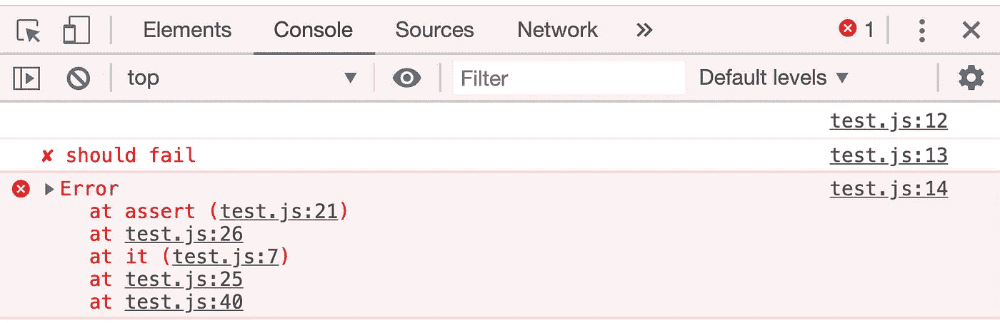
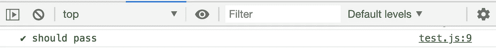
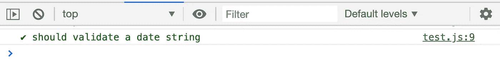
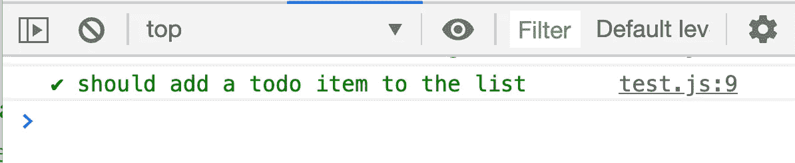

# 在没有框架的情况下对 JavaScript 代码进行单元测试

> 原文：<https://javascript.plainenglish.io/unit-test-front-end-javascript-code-without-a-framework-8f00c63eb7d4?source=collection_archive---------2----------------------->


Photo by [Ferenc Almasi](https://unsplash.com/@flowforfrank?utm_source=medium&utm_medium=referral) on [Unsplash](https://unsplash.com?utm_source=medium&utm_medium=referral)

最近，我正在学习在没有任何库或框架帮助的情况下编写越来越多的 JavaScript 代码。我喜欢对我写的任何代码都有一个良好的单元测试覆盖率，因为每当我想重构我的代码或出于任何其他原因改变它时，这给了我信心。在这篇博文中，我展示了如何在没有任何框架的情况下编写单元测试。

我们将从创建两个文件开始:

*   `test.js`包含我们测试需要的测试函数`assert`和`it`。它还包含所有的单元测试。
*   `test.html`是试跑者。

# 测试功能

让我们首先创建一个`test.js`文件，并编写如下所示的`it`函数

`it`函数有两个参数。第一个参数`desc`是测试用例的描述，第二个参数`fn`是测试函数。`fn`封装在`try/catch`块中。如果`fn`成功执行，我们将在控制台显示成功消息，如果测试失败，我们将在控制台显示失败消息。

接下来，我们在`test.js`中实现`assert`功能。

`assert`函数带一个参数`isTrue`，这个参数是一个条件，比如
`x === y`。`assert`检查条件，如果条件为`false`则抛出错误。

就是这样。这是我们的整个测试框架。

# 测试跑步者

`test.html`是我们的测试运行程序，它包含了`test.js`文件。

# 测试框架的简单测试用例

让我们通过编写几个简单的测试来确保我们的测试框架按预期工作。

## **测试失败**

在`test.js`中的`assert`函数后编写以下测试用例

```
it('should fail', function() {
  assert(1 !== 1);
});
```

在浏览器中打开测试运行器文件`test.html`(最好是 Chrome)。打开浏览器控制台。您应该会在控制台中看到如下所示的失败消息



Sample Test Fail Message

由于`1 !== 1`是无效条件，测试失败。通过查看错误堆栈，您可以了解故障发生的位置。在这种情况下，我会检查 test.js 中的第 26 行，开始调试这个问题。

## 通过测试

现在让我们在`test.js`写一个小的通过测试。

```
it('should pass', function() {
  assert(1 === 1);
});
```

刷新浏览器中的`test.html`并检查控制台。您应该会在控制台中看到如下所示的成功消息



太好了！我们的测试框架似乎运行良好。现在，让我们将我们的测试框架用于一些真实的场景。

# 创建应用程序代码文件

通常，您将在一个单独的 JavaScript 文件中编写应用程序代码，比如`app.js`。让我们创建`app.js`文件

```
 /* app.js */(function(){
  'use strict'; //Create a global variable and expose it to the world
  var $myapp = {};
  self.$myapp = $myapp;})();
```

我们创建了一个全局变量`$myapp`，并将其公开，这样我们就可以从`test.js`文件中调用这个全局变量。始终为全局变量使用唯一的名称，以免与其他全局变量冲突。

现在让我们将`app.js`文件包含在`test.html`中，如下所示

```
 /* test.html */
...
<body>
  ...
  <script src="app.js"></script>
  <script src="test.js"></script>
</body>
```

确保`app.js`包含在和`test.js`之前的

# *在应用程序代码中测试方法*

*让我们在`app.js`文件中编写一个日期验证方法*

*`isValidDate`判断给定的日期字符串是否有效，并返回`true`或`false`。*

*现在，让我们在`test.js`中为这个方法写一个测试用例*

```
*//test.js...
it('should validate a date string', function () { // Valid Date
  assert($myapp.isValidDate('02/02/2020')); // Invalid Date
  assert(!$myapp.isValidDate('01/32/2020'));});
...*
```

*在上面的测试案例中，第一个断言检查有效的日期字符串，第二个断言检查无效的日期字符串。打开或刷新`test.html`测试运行器文件并检查控制台。您应该会看到如下消息*

**

# *测试 DOM*

*假设我们正在编写一个简单的待办事项列表应用程序。我们有一个带有输入字段的表单，用于输入待办事项和提交按钮。我们监听我们的`app.js`文件中的提交事件，事件处理程序更新 DOM 中的 todo 列表。*

*下面是 html 代码*

*下面是`app.js`中更新待办事项列表的 JavaScript 代码。*

*我们想要测试 JavaScript 代码，并确保它像预期的那样向 DOM 中的`#todo-list`无序列表元素添加了一个 todo 项。*

## *DOM 的测试用例*

*下面是检查事件处理程序代码的测试用例，以确保它在输入新的 todo 项时更新 DOM*

*在我们的`test.html`中，我们创建了一个占位符元素`<div id="selector"></div>`来将测试代码插入到我们的测试运行人员的 DOM 中。*

*在测试用例中，`var selector = document.querySelector('#selector')`获得了对占位符元素的引用。然后我们将 id 为`aform`的表单追加到`selector`中。我们必须确保所有的元素名称和 id 都与`app.js`中事件处理程序所期望的一样。*

*下面一行设置输入字段的值*

*`form.elements['todo-input'].value = 'task 1'`*

*然后，我们创建并初始化一个“提交”HTML 事件，并让我们的表单调度该事件*

*`form.dispatchEvent(ev)`*

*这将触发`app.js`文件中监听“提交”事件的事件处理程序。事件处理程序会将“任务 1”添加到`todo-input` HTML 列表中。*

*下面的代码行断言检查一个任务是否如预期的那样被添加到 HTML 列表中。*

*`assert(selector.innerHTML.toLowerCase().includes('<li>task 1</li>'));`*

*在浏览器中运行测试运行程序，并检查浏览器控制台。如果一切按预期进行，您应该会看到以下成功消息。*

**

*测试用例`selector.innerHTML = ''`的最后一行清除了占位符元素。*

# ***涉及异步功能时的测试***

*假设我们正在调用 REST API 来获取用户的名和姓，然后将它们呈现给 DOM。我们想测试 DOM 是否能在不实际调用 API 的情况下成功呈现。*

*下面是我们想要测试的代码*

*`$myapp.get`方法封装了一个`XMLHttpRequest` GET 请求。它接受一个字符串参数`url`并调用带有响应的`callback`函数。*

*`$myapp.getUser`是我们要测试的方法。它调用`$myapp.get`方法，然后回调函数用用户的名字和姓氏呈现 DOM。*

## *存根异步代码*

*如上所示，我们存根异步`$myapp.get`方法并返回一个假的用户对象。*

*我们称之为`$myapp.getUser(1)`方法。这将成功执行存根`$myapp.get`方法，并按照存根中的定义呈现用户的名字和姓氏。*

*下面的代码断言查看我们的测试 DOM 是否用正确的名字和姓氏进行了更新。*

*`assert(selector.innerHTML.includes('Amit Gupta'))`*

*最后，我们通过重置占位符 DOM 对象的 innerHTML 来清除它。*

# *摘要*

*这篇博文展示了如何在不使用任何框架的情况下对前端 JavaScript 代码进行单元测试。博客显示*

*   *如何创建`it`和`assert`测试函数*
*   *如何单元测试应用程序功能*
*   *如何对 DOM 进行单元测试*
*   *当涉及异步调用时如何进行单元测试*

*这是在浏览器中对前端 JavaScript 代码进行单元测试的一种简单而实用的方法。*

# *源代码*

*带有样本测试的源代码托管在 [GitHub](https://github.com/amitgupta15/unit-test-front-end-without-framework) 上。*

## ***用简单英语写的 JavaScript 笔记***

*我们总是有兴趣帮助推广高质量的内容。如果您有一篇文章想要提交给我们的任何出版物，请发送电子邮件至[**submissions @ plain English . io**](mailto:submissions@plainenglish.io)**，并附上您的 Medium 用户名，我们会将您添加为作者。***