# 单元测试 Azure DevOps 扩展

> 原文：<https://javascript.plainenglish.io/unit-testing-azure-devops-extensions-a1ed9ff69552?source=collection_archive---------7----------------------->

## 5 个挑战以及如何解决它们

在我的上一个项目中，我们面临着基于 [**Azure DevOps 基于反应的 UI**](https://developer.microsoft.com/en-us/azure-devops/develop/extensions) 进行单元测试的挑战。

您会发现很多关于如何利用 Azure DevOps 构建您的 React 应用程序并对其进行单元测试的资源。但是我发现关于如何对 Azure DevOps 扩展进行反应单元测试的信息很少。

总体而言，我们面临着 **5 项挑战**，其中 4 项与 Azure DevOps Extensions 相关:

1.  模拟[Azure DevOps extend SDK](https://github.com/Microsoft/azure-devops-extension-sdk)方法的返回值
2.  触发 Azure DevOps 扩展*工作项表单*事件
3.  嘲笑 [Azure DevOps 扩展 API](https://github.com/Microsoft/azure-devops-extension-api) 的返回值和类
4.  模拟外部 Rest API 调用并监视传输的值(使用扩展 API 提供的 *RestClientBase* 类时)
5.  嘲笑和监视日志记录方法(Application Insights SDK)

# 让我们从解释这个例子开始

示例代码、模型和单元测试发布到[git hub](https://github.com/h2floh/azure-dev-ops-react-ui-unit-testing)[*https://git hub . com/H2 floh/azure-dev-ops-react-ui-unit testing*](https://github.com/h2floh/azure-dev-ops-react-ui-unit-testing)。

它包含两个工作项用户界面扩展:

1.  [版本化项目表](https://github.com/h2floh/azure-dev-ops-react-ui-unit-testing/tree/main/src/VersionedItemsTable)——可以将不同 Azure Git repo 分支的版本化项目(文件)链接到工作项目。为此，它将通过 Azure DevOps 服务外部的 Rest API 来保存状态。
2.  [多身份选择器](https://github.com/h2floh/azure-dev-ops-react-ui-unit-testing/tree/main/src/MultiIdentityPicker) —允许您从 Azure DevOps 组织的关联 AAD 租户中选择多个身份，并将信息保存到工作项的文本字段中。

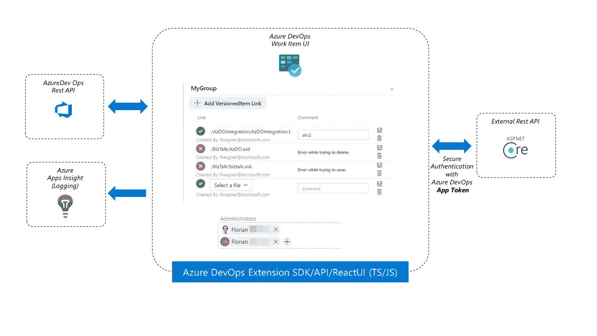

High Level Overview of the UI components and their service interactions

这两个组件之间的主要区别在于，一个将在外部保存状态，另一个将在内部保存到 Azure DevOps Services。

两者的共同之处在于，它们将使用基于 TypeScript 的 Azure DevOps Extension SDK 和 API 与 Azure DevOps 服务通信，并记录基于 Azure 的应用洞察。

# 好的，让我们看看这 5 个挑战以及如何解决它们

**免责声明:**为了突出重要的部分，我重新排序并删除了截图的一些代码。

## 模拟 [Azure DevOps 扩展 SDK](https://github.com/Microsoft/azure-devops-extension-sdk) 方法的返回值

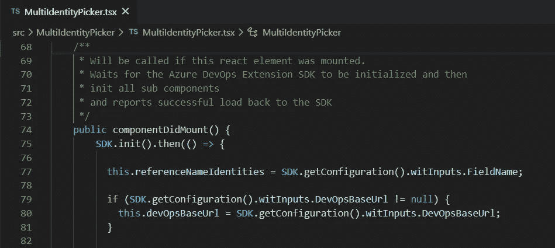

Azure DevOps Extension SDK initialization code

*代码:* SDK 必须被初始化，我们从其中检索配置值。

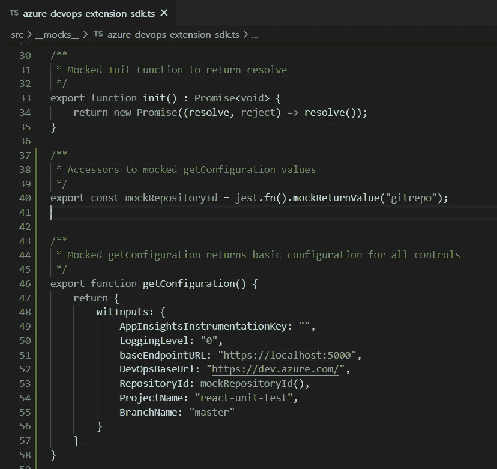

Azure DevOps Extension SDK initialization mock

*mock:***SDK . init()**函数需要返回一个已解析的承诺，以便激活**中的 lambda 函数。然后是()**分支的代码。

**getConfiguration()** 函数可以很容易地通过返回一个具有我们期望的精确结构的 JSON 对象来模仿。我们一次添加了两个 UI 组件的所有配置值。

**如果您需要在测试运行中修改特定的值**,您可以创建一个额外的函数 mock，该函数可被访问以覆盖您的测试文件中的返回值。在本例中，我们通过引入一个模拟函数 **mockRepositoryId()** ，为默认值为*‘gitrepo’*的 *RepositoryId* 执行此操作。

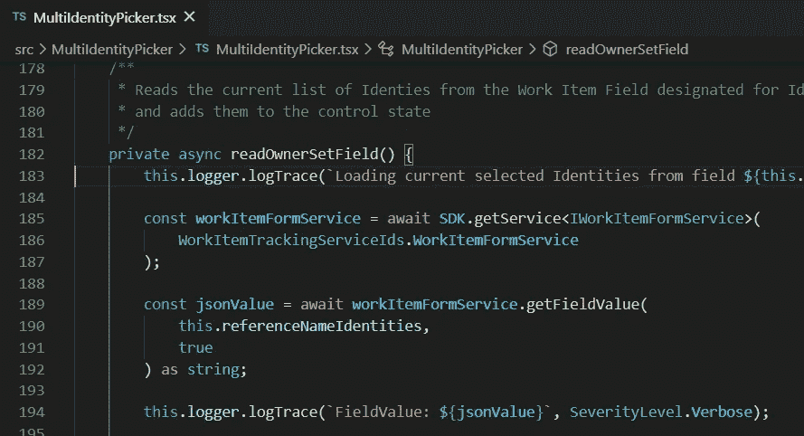

Retrieving a field value

*代码:*我们用函数 **getService()从服务中检索*工作项。使用此服务，我们可以访问和修改 UI 中打开的当前工作项。我们希望检索指定字段的值，以保存该组件的状态。这是通过方法 **getFieldValue()完成的。*****

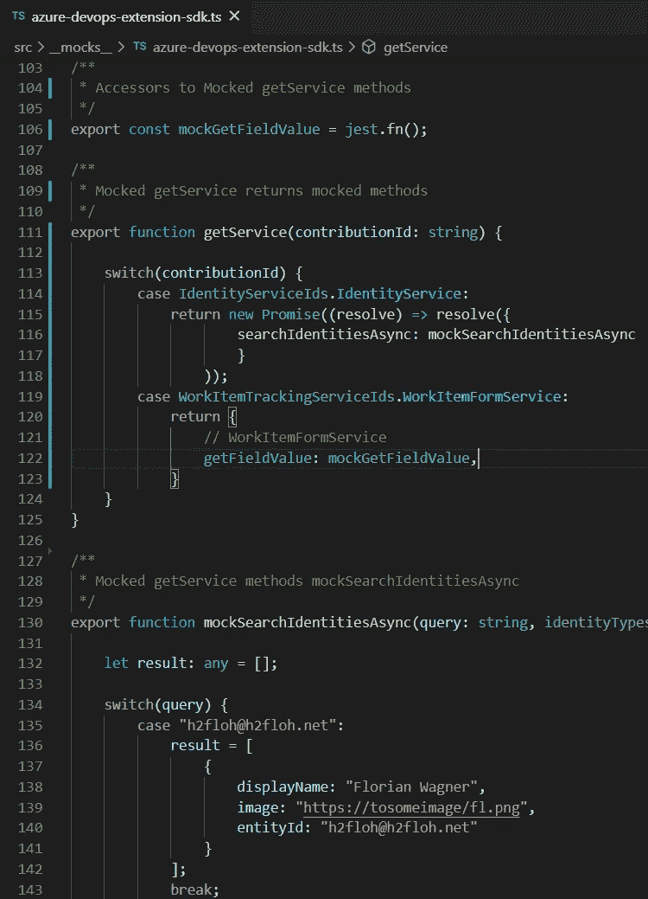

Mocking getService, WorkItemFormService and SearchIdentities

*模拟:*正如你所看到的，我们需要从 **getService()** 返回两个不同的服务，这取决于输入参数。如果请求 W *或 kItemFormService* ，我们只需返回 **getFieldValue()** 方法作为模拟函数 **mockGetFieldValue()** 。这允许我们在单元测试级别注入返回值。在这种情况下，我们不区分需要什么字段。如果你需要的话，因为你正在访问几个字段，你需要为 **mockGetFieldValue()** 创建一个实现，它将对不同的输入参数做出反应。

作为如何对输入参数做出反应的例子，你可以看看 *IdentityService* 的被模仿的**searchdidentitieasync()**方法。根据查询值，我们返回另一个标识。

The related test requiring getService(), getFieldValue() and searchIdentitiesAsync()

*测试:*测试定义了 **getFieldValue()** 的返回值，并期望控件显示与电子邮件地址相关联的名称。电子邮件和显示名称之间的映射发生在已经模仿过的**searchdidentitasync()**方法中。

## 触发 Azure DevOps 扩展 *WorkItemForm* 事件

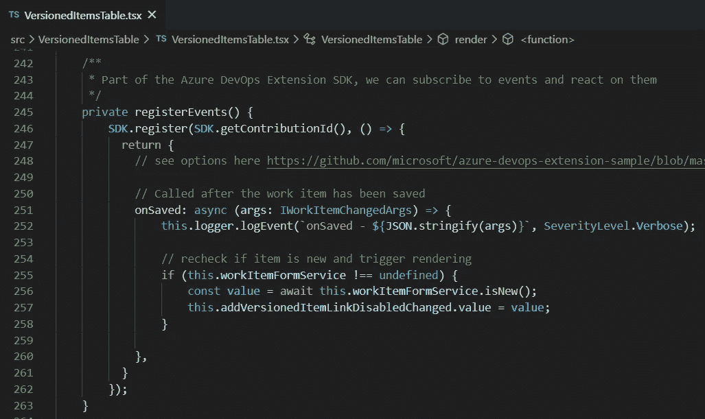

Register onSaved event callback function

*代码:*当您开发一个工作项 UI 控件时，您可以从工作项 UI 中挂接事件，如保存、更改工作项状态等。控件将对 **onSaved()** 事件做出反应，并向 SDK 注册它的回调。

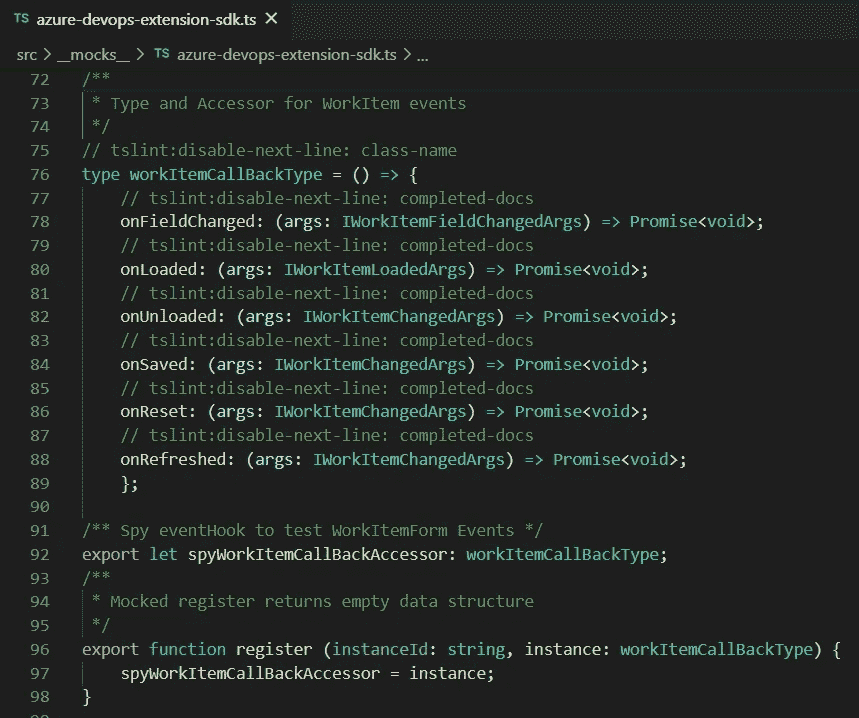

Mocking the event callback system

对于这个模拟，我们必须找出 SDKs **register()** 函数所期望的返回值的确切类型。正如你在截图中看到的，返回值将被分配给被模仿的 **register()** 函数中的 **spyWorkItemCallBack** 函数指针。

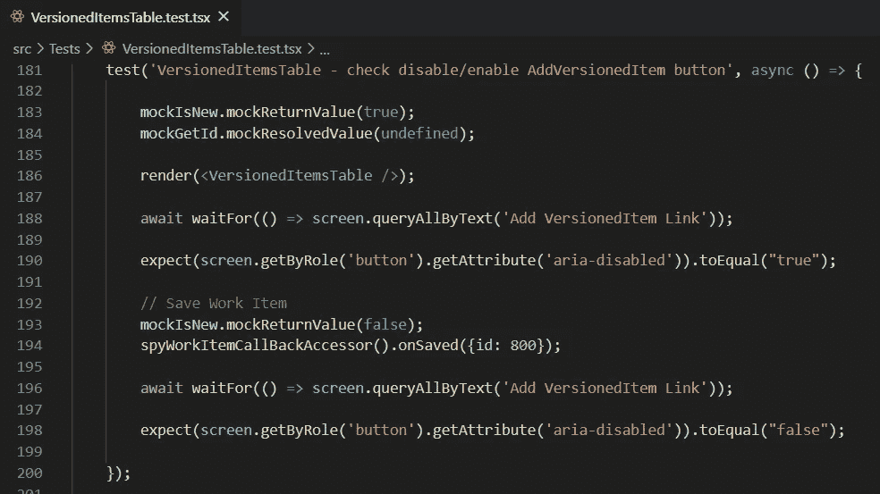

Testing onSaved event

*测试:*现在我们可以通过调用 **spyWorkItemCallBack** 函数指针来触发测试中控件注册的回调函数。

对于所有其他 5 个可能订阅的事件挂钩，这将以相同的方式工作。

## 模仿 [Azure DevOps 扩展 API](https://github.com/Microsoft/azure-devops-extension-api) 的返回值和类

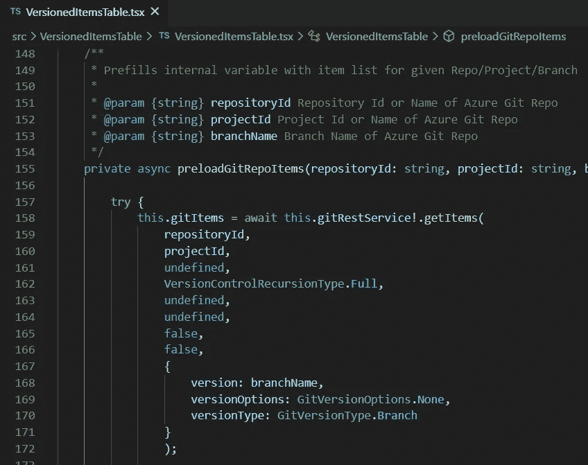

Using Azure DevOps Extension API Git Rest Service

代码:其中一个扩展通过使用 Azure DevOps 扩展 APIs Git 客户端加载 Azure Git repo 的所有项目。扩展只使用了这个类的 **getItems()** 方法。

The mock for the Azure Repo Git Rest Client

*mock:*仅包含 **getItems()** 方法，如果 *RepositoryId* 已知，将返回 **mockGetItems** 函数的值，否则将返回一个错误(用于错误测试)。

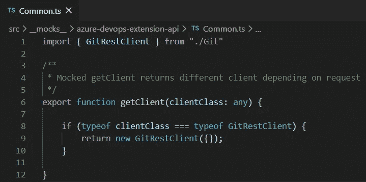

Mocked getClient function of Extension API package

为了检索 API 客户端，有一个 **getClient()** 函数也必须被模拟，以返回正确的模拟实现。如果你使用一个额外的 API，你必须把它包括在这个列表中。

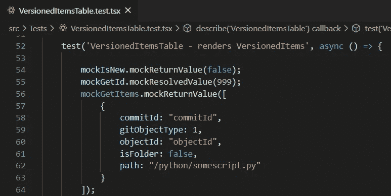

Defining the return value of Git Service getItems() method

*测试:*在您的测试中，您现在可以在通过访问器模拟函数 **mockGetItems** 调用之前指定 **getItems()** 的返回值。

## 模拟外部 Rest API 调用，并窥探传输的值

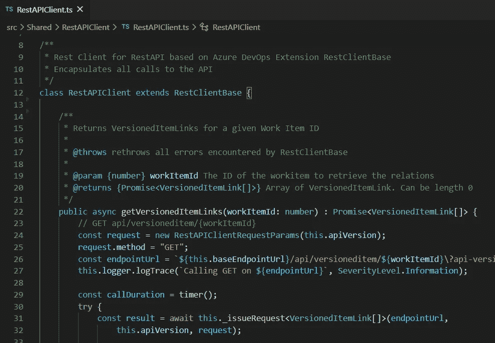

Custom API Client on top of Azure DevOps Extension API Base Rest Client

*代码:*为了访问我们自己的 API，我们继承了扩展 API 的 **RestClientBase** 类。我们主要利用它提供的 **_issueRequest()** 方法及其数据结构来处理 http 请求。

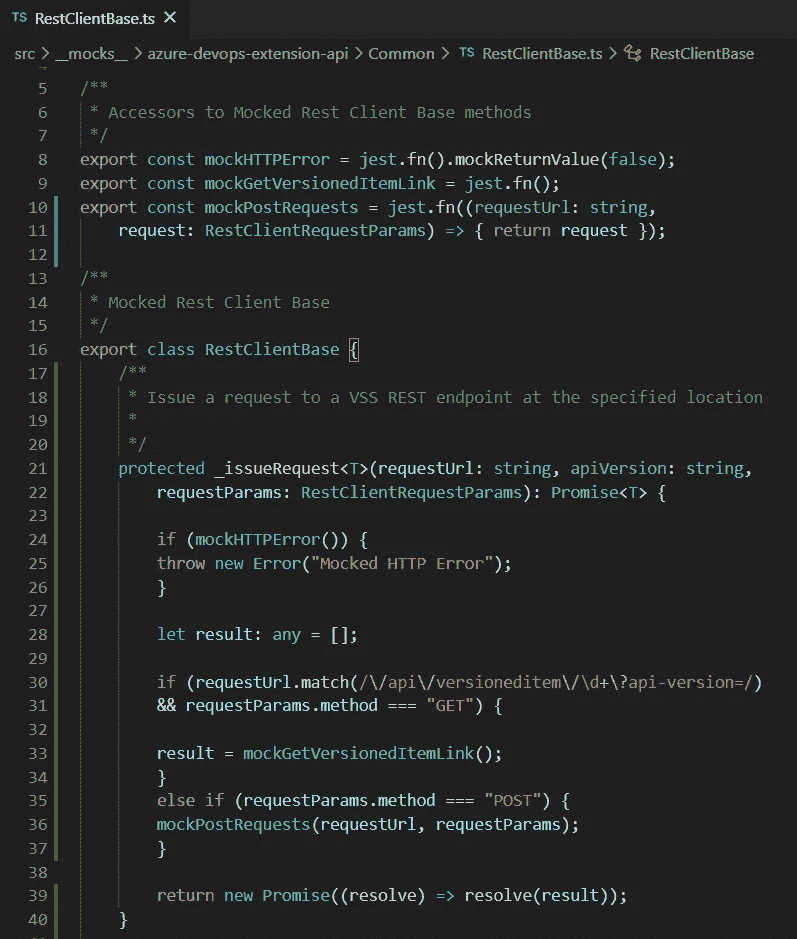

Mocking the Extension API RestBaseClient

*模仿:*我们模仿基类来支持我们自己的客户端，以真正测试我们的 rest 客户端代码。

被模仿的基类现在可以按需抛出错误，返回我们在测试级别为特定 API 调用设置的值(由 method 和 endpointURL 评估),甚至记录请求值，如 POST 调用情况下的测试验证的 body 和 headers。

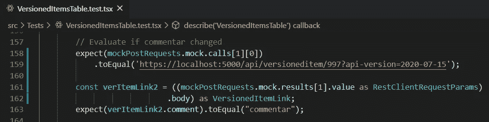

Validation of Rest API POST request.

*测试:*我们现在可以在测试中验证成功的 POST 以及数据传输是否正确。

## 模仿和窥探日志记录方法(应用洞察 SDK)

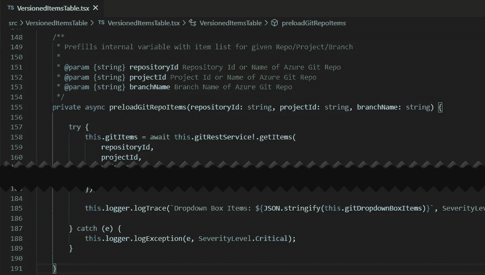

Exception handling and logging

*代码:*我们使用自己的日志记录器实现对应用洞察记录异常和其他信息。在这里，我们记录了与 Git Rest 客户端通信时发生的任何异常。

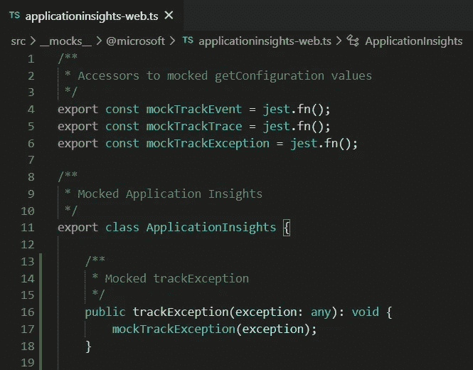

Mock for ApplicationInsights package

*模仿:*我们模仿 **ApplicationInsights** 包中的方法 **trackException()** ，并将该异常作为参数传递给 **mockTrackException** 函数。

通过这种方式，我们可以验证记录的异常内容，也可以为我们的记录器实现提供完整的代码覆盖。

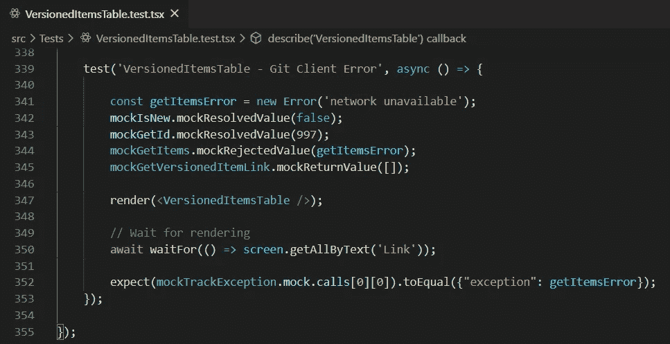

Testing error handling

*测试:*我们可以为被模仿的 Git **getItems()** 方法触发一个异常，并验证该异常是否被记录以及记录的内容是否正确。

# 结论

这需要一些努力，但模仿 Azure DevOps 扩展 SDK 和 API 的所有相关部分来成功创建有意义的单元测试并达到完整的代码覆盖是可能的。

您可以派生出回购协议，用真实的扩展交换示例扩展，并利用现有的模拟作为起点。根据你使用的 SDK / API 特性，你必须扩展模拟部分，当然还有你的测试。

感谢阅读，祝测试愉快！

[*https://github . com/H2 floh/azure-dev-ops-react-ui-unit-testing*](https://github.com/h2floh/azure-dev-ops-react-ui-unit-testing)