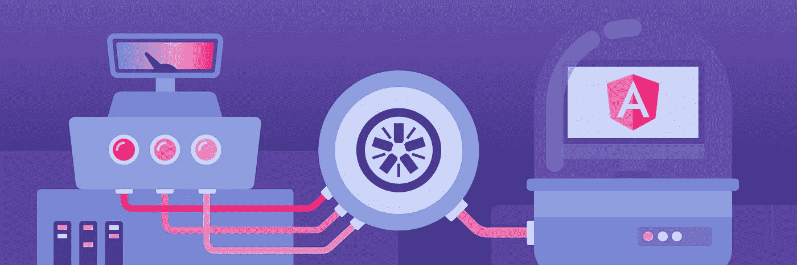

# 角度单元测试:基础

> 原文：<https://javascript.plainenglish.io/unit-testing-in-angular-basics-part-1-329304813dc3?source=collection_archive---------3----------------------->



Credit for this image goes to “[softwarebrothers.co](https://softwarebrothers.co/blog/introduction-to-unit-tests-in-angular/)”

实际上你可能会问为什么我需要学习单元测试，而我可以花更多的时间开发一个好的特性..！为什么单元测试很重要，我应该什么时候写单元测试..每当你听到单元测试的时候，你的脑海中就会闪过很多问题..

在这篇文章中我们将会发现为什么，当&单元测试在 Angular！

你准备好开始单元测试之旅了吗？我们开始吧..

## 首先，我为什么要学习单元测试..为什么它很重要？

*   从编写特性代码开始是一个常见的错误，但是单元测试让你首先想到代码结构的设计。
*   将您的代码放在坚实的基础上，确保您的代码很少或没有错误。
*   使重构代码或添加新功能变得更加容易，因为测试用例确保您不会用新的部分破坏应用程序的任何其他部分。
*   单元测试为你的代码添加了一个很好的文档。

## 是只有单元测试还是有更多的类型？

当然，还有更多测试类型:


Testing Types

*   **单元测试**

测试应用程序的小部分并完全依赖于它自己，在 angular 中它是在没有任何外部资源和模板的情况下孤立地测试组件。

*   **集成测试**

测试两个单元之间的交互，在 angular 中是用模板和外部资源进行测试。

*   **端到端测试**

它是用于自动化测试的，测试确保应用程序从头到尾都按照预期执行。当测试运行时，浏览器的交互就像用户使用你的应用程序一样。角度端到端测试由一个叫做**量角器**的框架驱动。

但是在我们的旅程中，我们将谈论单元测试的角度。

> "测试是我们告诉项目下一代程序员的故事."
> ―罗伊·奥舍洛夫，[单元测试的艺术](https://www.goodreads.com/work/quotes/6678711)

# 工具

**那么我如何在 Angular 中开始单元测试呢？**

您首先需要知道 angular 为您提供了哪些单元测试工具..


1.  **茉莉:**

Jasmine 是一个 javascript 测试框架，试图以人类可读的格式描述测试，以便非技术人员可以理解正在测试的内容。

2.**因果报应:**

Karma 是一个测试运行器，它是一个让我们从命令行在浏览器中运行 jasmine 测试的工具。测试的结果也显示在命令行上。Karma 还可以观察你的开发文件的变化，并自动重新运行测试。

这些是您需要了解的工具，以便在 Angular 项目中开始测试。

***注意:*** *如果你有 angular 的基础知识来理解如何创建 angular 项目&内部结构，那么这篇文章在下一节会更有帮助和有用，但是不要担心，我会给你一些提示来启动你的应用。*

## 启动的先决条件:

您需要在您的机器上安装节点& angular-CLI，并从命令行创建一个新项目:

1.  *npm 安装-g @angular/cli*
2.  *ng 新角度单位测试*

# **入门**

打开您的 angular 项目，让我们更深入地研究结构，以发现我们可以在哪里编写我们的测试用例。


Angular project Structure

如此图所示，在`src/app`中，您可以默认找到您的应用程序组件和任何其他生成的组件，有一种文件您以前从未尝试打开或发现过..这是我们要写作的地方..*是的，那些高亮显示的文件就是我们的目的地* `componentName.component.spec.ts`。

# 测试文件-。规格。ts —结构:

以下是规格文件中要遵循的结构:

```
**describe** ( ‘TestName’ , ( ) => {

  **It** ( ‘sub_testName’ , ( ) => { }}) ;
```

如上面的代码所示，您有:

*   ***形容( )方法***

这是一种用来定义套件的方法&套件意味着一组相关的测试。

*   ***它( )的方法***

用于定义一个单独的测试用例，它有两个参数，string 描述这个测试用例应该返回什么，另一个将是测试运行程序调用的函数。

*在每个 It()方法*的内部，你将编写你的测试用例实现，它分为 3 个步骤:安排、动作、断言，这是一个在[单元测试](http://wiki.c2.com/?UnitTest)方法中安排和格式化代码的模式:每个方法应该将这些功能部分分组，用空行分隔:

1.  **安排**所有必要的前提条件和输入。
2.  **对被测对象或方法进行**动作。
3.  断言预期的结果已经出现。

```
// In you component.spec.ts**describe** ( ‘TestName’ , ( ) => {

  **It** ( ‘sub_testName’ , ( ) => {   let instance = new ComponentName ; //**initialize - Arrange** let result = instance.functionName(“Marina”);//**make a change - Act** expect(result).toContain(“Marina”) ; //**expect the result - Assert**}}) ;
```

而`funtionName`是你 component.ts 中实现的函数

```
// In you component.tsfunction functionName (name) {
  alert("My Name is " + name );
} 
```

如上面的代码片段所示，在`component.spec.ts`中，你有一个描述性的代码行，它安排了你要作为第一步使用的组件实例，然后在该组件中对一个函数进行修改，最后期待结果。

# 最后运行您的测试

当你完成你的测试用例时，运行角度测试命令: **ng test**

**karma** 窗口将打开运行测试用例&，显示用`describe` 方法编写的描述和用`It` 方法编写的测试用例子描述，如果失败或通过，则显示结果。


Karma running test cases

# 技巧

> 好的测试应该讲故事

没有必要每次都遵循相同的结构(安排、动作、断言),但是最好让你的测试代码可读性更好，结构更好..这是编写好的单元测试的技巧之一

当然，这并不是结束，还有很多东西需要发现，这只是开始..请等待测试组件、服务等的下一篇文章:)

> *不要只是阅读，试一试！*

快乐学习..

这里有一些有用的参考资料

 [## 有角的

### Angular 是一个构建移动和桌面 web 应用程序的平台。加入数百万开发者的社区…

angular.io](https://angular.io/guide/testing) [](https://alligator.io/angular/introduction-unit-testing/) [## 角度单元测试简介

### Angular 2+应用的单元测试很容易上手。如果您的项目是使用角坐标设置的…

鳄鱼. io](https://alligator.io/angular/introduction-unit-testing/)