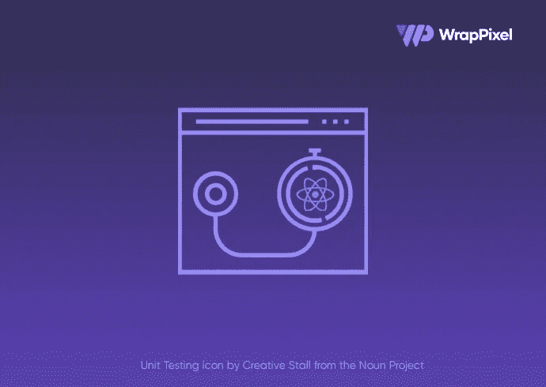
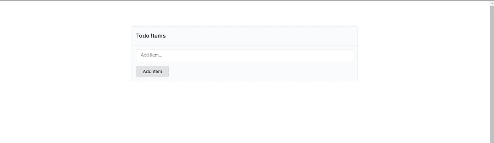
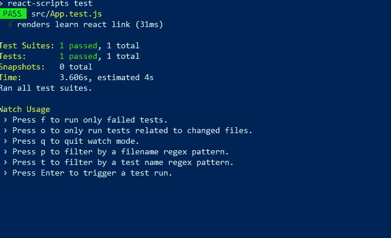
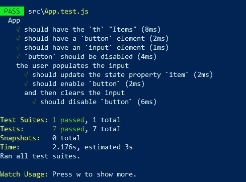

# 单元测试用酶和 Jest 反应成分

> 原文：<https://javascript.plainenglish.io/unit-testing-react-components-using-enzyme-and-jest-testing-frameworks-b6c834c56c24?source=collection_archive---------11----------------------->



在本教程中，我们将使用 Jest 和 React 为一个基本的 todo 应用程序编写单元测试。

我们开始吧！

# **笑话**

Jest 是一个 JavaScript 测试框架，旨在确保任何 JavaScript 代码库的正确性。它允许你用一个平易近人的、熟悉的、功能丰富的 API 来编写测试，并快速给出结果。

Jest 有很好的文档记录，需要很少的配置，并且可以扩展以满足您的需求。关于 Jest 的更多信息，请查看其官方文档。[https://jestjs.io/docs/en/getting-started](https://jestjs.io/docs/en/getting-started)

# **酶**

Enzyme 是 React 的一个 JavaScript 测试工具，它使测试 React 组件的输出变得更加容易。您还可以操纵、遍历和以某种方式模拟给定输出的运行时。欲了解更多信息，请查阅酵素官方文档。

[https://enzymejs.github.io/enzyme/](https://enzymejs.github.io/enzyme/)

# 设置

在本教程中，我们将利用 create-react-app CLI 工具来设置我们的项目。因此，转到您将存储这个项目的目录，并在终端中键入以下内容

```
create-react-app note-redux-app
```

如果您没有 create-react-app install，请在终端中键入以下命令进行全局安装。

```
npm install -g create-react-app
```

# 安装酶

```
npm install --save-dev enzyme enzyme-adapter-react-16 enzyme-to-json
```

Jest 测试框架默认捆绑在 create-react-app 中。

在 src 文件夹中，创建一个包含以下内容的 **tempPolyfills.js** 文件。这对于在旧浏览器上进行测试是必要的。

```
const raf = global.requestAnimationFrame = (cb) => {
  setTimeout(cb, 0);
};export default raf;
```

在 src 文件夹中，创建一个 **setupTests.js** 文件，内容如下:

```
import raf from './tempPolyfills'
import Enzyme  from 'enzyme';
import Adapter from 'enzyme-adapter-react-16';
Enzyme.configure({ adapter: new Adapter() });
```

对于 todo 应用程序的样式，我们将利用语义 ui 库。在我们项目的**index.html**文件中，我们将使用 CDN 链接添加语义 UI 库。

在 **app.js** 文件中，添加以下代码片段:

```
import React from 'react';
class App extends React.Component {
  render() {
    return(
      <div
        className='ui text container'
        id='app'
      >
        <table className='ui selectable structured large table'>
          <thead>
            <tr>
              <th>Items</th>
            </tr>
          </thead>
          <tbody>
            items
          </tbody>
          <tfoot>
            <tr>
              <th>
                <form
                  className='ui form'
                >
                <div className='field'>
                  <input
                    className='prompt'
                    type='text'
                    placeholder='Add item...'
                  />
                </div>
                <button
                  className='ui button'
                  type='submit'
                >
                  Add item
                </button>
                </form>
              </th>
            </tr>
          </tfoot>
        </table>
      </div>
    )
  }
}
export default App;
```

这样我们就可以查看 todo 应用程序的静态版本。



让我们用下面的代码片段让我们的 todo 应用程序起反应

首先，我们的 todo 应用程序需要一个状态来存储 todo 项和一个 todo 项。

下面这段代码应该添加到 **app.js** 中:

```
state = {
    items: [],
    item: '',
};
```

接下来，我们将把输入绑定到状态的 item 属性。因此， **app.js** 中的输入标签应更新如下:

```
<input
    className='prompt'
    type='text'
    placeholder='Add item...'
    value={this.state.item}
    onChange={this.onItemChange}
/>
```

因为`onChange`事件被绑定到`onItemChange`方法，为了用`input`字段的值更新我们状态中的项目属性。`onItemChange`方法应该如下:

```
onItemChange = (e) => {
    this.setState({
      item: e.target.value,
    });
  };
```

# 提交表单

如果输入字段为空，则提交按钮被禁用。对于此功能，请在 render 方法后立即添加下面的代码片段:

```
const submitDisabled = !this.state.item;
```

我们的“添加项目”按钮应该更新如下:

```
<button
  className='ui button'
  type='submit'
  disabled={submitDisabled}
>
```

为了提交我们的 todo 项，我们将向表单添加一个 onSubmit 事件侦听器，它将触发 addItem 函数的执行。

一个`onsubmit`事件应该添加到表单标签中，如下所示:

```
onSubmit={this.addItem}
```

`addItem`功能应该如下:

```
addItem = (e) => {
    e.preventDefault();
    this.setState({
      items: this.state.items.concat(
        this.state.item
      ),
      item: '',
    });
  };
```

# 列出所有待办事项

要列出所有的待办事项，我们需要迭代 items 数组中的每个待办事项。

```
<tbody>
  {
    this.state.items.map((item, idx) => (
      <tr
        key={idx}
      >
        <td>{item}</td>
      </tr>
    ))
  }
</tbody>
```

最后，我们的 todo 应用程序应该是下面的代码片段。

```
import React from 'react';
class App extends React.Component {
  state = {
    items: [],
    item: '',
  };
  onItemChange = (e) => {
    this.setState({
      item: e.target.value,
    });
  };
  addItem = (e) => {
    e.preventDefault();
    this.setState({
      items: this.state.items.concat(
        this.state.item
      ),
      item: '',
    });
  };
  render() {
    const submitDisabled = !this.state.item;
    return(
      <div
        className='ui text container'
        id='app'
      >
        <table className='ui selectable structured large table'>
          <thead>
            <tr>
              <th>Items</th>
            </tr>
          </thead>
          <tbody>
            {
              this.state.items.map((item, idx) => (
                <tr
                  key={idx}
                >
                  <td>{item}</td>
                </tr>
              ))
            }
          </tbody>
          <tfoot>
            <tr>
              <th>
                <form
                  className='ui form'
                  onSubmit={this.addItem}
                >
                <div className='field'>
                  <input
                    className='prompt'
                    type='text'
                    placeholder='Add item...'
                    value={this.state.item}
                    onChange={this.onItemChange}
                  />
                </div>
                <button
                  className='ui button'
                  type='submit'
                  disabled={submitDisabled}
                >
                  Add item
                </button>
                </form>
              </th>
            </tr>
          </tfoot>
        </table>
      </div>
    )
  }
}
export default App;
```

# 用 Jest 和 Enzyme 测试我们的待办事项应用

create-react-app 在`app.test.js`文件中为我们设置了一个虚拟测试。让我们使用项目文件夹中的以下命令来执行项目的初始测试。

`npm test`



打开 **App.test.js** 并清空文件。在该文件的顶部，我们首先导入想要测试的 react 组件，从 React 导入 React，从 Enzyme 导入`shallow()`。`shallow()`功能将用于在测试期间浅渲染组件。

在我们的第一个测试案例中，我们将断言我们的表应该使用标题“items”来呈现。为了编写这个断言，我们需要:

浅层呈现组件
遍历虚拟 DOM，挑选出第一个`th`元素
断言`th`元素包含一个文本值“`Items`”

```
import App from './App';
import React from 'react';
import { shallow } from 'enzyme';
describe('App', () => {
  it('should have the `th` "Items"', () => {
    const wrapper = shallow(
      <App />
    );
    expect(
      wrapper.contains(<th>Items</th>)
    ).toBe(true);
  });
});
```

`shallow()`函数返回酶调用的`wrapper`对象，浅层包装器。该包装包含浅呈现组件。Enzyme 提供给我们的包装器对象有许多有用的方法，我们可以用它们来编写我们的断言。一般来说，这些助手方法**帮助我们遍历和选择虚拟 DOM 上的元素**。其中一个辅助方法是`contains()`。它用于断言虚拟 DOM 上元素的存在。

`contains()`接受一个 React 元素，在本例中，JSX 代表一个 HTML 元素。它返回一个布尔值，表明呈现的组件是否包含该 HTML。

写完我们的第一份酶说明书后，让我们来验证一下是否一切正常。`SaveApp.test.js`并使用以下命令从控制台运行测试命令:

```
npm test
```

接下来，让我们断言该组件包含一个名为“添加项目”的按钮元素

在前一个`it`块之后添加下面的代码片段

```
it('should have a `button` element', () => {
    const wrapper = shallow(
      <App />
    );
    expect(
      wrapper.containsMatchingElement(
        <button>Add item</button>
      )
    ).toBe(true);
  });
```

注意到新的东西了吗？我们没有使用`contains()` 酶包装方法，而是使用了 containsMatchingElement 酶包装方法。如果我们使用 contains，我们需要传递`contains()`一个具有完全相同的属性集的 ReactElement。但通常这是过度的。对于这个规范，只需断言按钮在页面上就足够了。我们可以使用酶的`containsMatchingElement()`法。这将检查组件输出中的任何内容**是否看起来像**预期的元素。

我们不必使用`containsMatchingElement()`方法来匹配属性对属性。

接下来，我们将断言输入字段也存在:

```
it('should have an `input` element', () => {
    const wrapper = shallow(
      <App />
    );
    expect(
      wrapper.containsMatchingElement(
        <input />
      )
    ).toBe(true);
  });
```

接下来，我们将断言按钮元素被禁用:

```
it('`button` should be disabled', () => {
    const wrapper = shallow(
      <App />
    );
    const button = wrapper.find('button').first();
    expect(
      button.props().disabled
    ).toBe(true);
  });
```

【T4 法】是另一种酶包裹法。它需要一个**酶选择器**作为参数。本例中的选择器是 CSS 选择器“按钮”。CSS 选择器只是一种受支持的酶选择器。有关酶选择器的更多信息，请参见酶文档。我们首先返回第一个匹配的元素。读取按钮上的禁用属性或任何其他属性，我们使用`props()`。`props()`返回一个对象，该对象指定 HTML 元素上的属性或反应组件上设置的道具。

# 每次使用 beforeEach

在所有流行的 JavaScript 测试框架中，有一个函数我们可以用来帮助测试设置:before 每个。before 每个都是一个代码块，它将在每个代码块之前运行**。我们可以使用这个函数在每个规格之前渲染我们的组件。**

**此时，我们的测试套件有一些重复的代码。在我们之前的断言中，我们在每个 it 块中呈现了组件。为了避免这些重复，我们将重构我们的断言。我们*将*仅浅渲染我们的描述块顶部的组件:**

**我们重构的测试套装应该如下所示:**

```
describe('App', () => {
  let wrapper;
  beforeEach(() => {
    wrapper = shallow(
      <App />
    );
  });
  it('should have the `th` "Items"', () => {
    expect(
      wrapper.contains(<th>Items</th>)
    ).toBe(true);
  });
  it('should have a `button` element', () => {
    expect(
      wrapper.containsMatchingElement(
        <button>Add item</button>
      )
    ).toBe(true);
  });
  it('should have an `input` element', () => {
    expect(
      wrapper.containsMatchingElement(
        <input />
      )
    ).toBe(true);
  });
  it('`button` should be disabled', () => {
    const button = wrapper.find('button').first();
    expect(
      button.props().disabled
    ).toBe(true);
  });
});
```

# **用户交互测试**

**用户可以与我们的应用程序进行的第一个交互是填写输入字段以添加新项。我们将在当前的描述块中声明另一个描述块，以便为用户交互将测试用例分组。描述块是我们如何“分组”所有需要相同上下文的规格。**

**我们为内部描述编写的 before 每个将在外部上下文中声明的 before 每个之后运行*。因此，在此`beforeEach`运行时，包装将已经被浅渲染。正如预期，这个`beforeEach`将只运行，因为它阻塞在我们的内部描述块中。***

**我们将使用模拟方法来模拟用户交互。**

**simulate 方法接受两个参数:**

1.  **要模拟的事件(如“更改”或“单击”)。这决定了使用哪个事件处理程序(如 onChange 或 onClick)。**
2.  **事件对象(可选)**

**请注意，在我们的 todo 应用程序中，当用户刚刚填充输入字段时，按钮不再被禁用。**

**因此，我们现在可以编写与用户刚刚填充输入字段的上下文相关的规范。我们将编写两个规格:**

**状态属性项已更新以匹配输入字段。按钮不再被禁用。**

```
describe('the user populates the input', () => {
    const item = 'Laundry';
    beforeEach(() => {
      const input = wrapper.find('input').first();
      input.simulate('change', {
        target: { value: item }
      })
    });
    it('should update the state property `item`', () => {
      expect(
        wrapper.state().item
      ).toEqual(item);
    });
    it('should enable `button`', () => {
      const button = wrapper.find('button').first();
      expect(
        button.props().disabled
      ).toBe(false);
    });
  });
```

**在第一个规范中，我们使用`wrapper.state()`来获取状态对象。我们使用`state()`方法从组件中检索状态属性。在第二个例子中，我们再次使用`props()`来读取按钮上的禁用属性。**

**用户填写输入字段后，用户可以从这里采取两个操作，我们可以为其编写规格:**

1.  **用户清除输入字段**
2.  **用户点击“添加项目”按钮**

# **清除输入字段**

**当用户清除输入字段时，我们希望按钮再次被禁用。我们将在描述“用户填充输入”的现有上下文的基础上，在其中嵌套新的描述:**

```
describe('and then clears the input', () => {
  beforeEach(() => {
    const input = wrapper.find('input').first();
    input.simulate('change', {
      target: { value: '' }
    })
  });
  it('should disable `button`', () => {
    const button = wrapper.find('button').first();
    expect(
      button.props().disabled
    ).toBe(true);
  });
});
```

**我们使用 beforeEach 再次模拟一个更改事件，这次将 value 设置为一个空字符串。我们将写一个断言:按钮再次被禁用。
当字段为空时，按钮应被禁用。**

**现在，我们可以验证我们所有的测试都通过了。**

****

**接下来，我们将模拟用户提交表单。**

# ****模拟表单提交****

**用户提交表单后，我们将断言:**

**1.新项目处于状态(项目)**

**2.新项目位于呈现的表格中**

**3.输入字段为空**

**4.“添加项目”按钮被禁用**

**因此，我们将在“用户填充输入”中编写 describe 块，作为“然后清除输入”的兄弟:**

```
describe('and then submits the form', () => {
      beforeEach(() => {
        const form = wrapper.find('form').first();
        form.simulate('submit', {
          preventDefault: () => {},
        });
      });
      it('should add the item to state', () => { });
      it('should render the item in the table', () => { });
      it('should clear the input field', () => { });
      it('should disable `button`', () => { });
    });
```

**我们的 beforeEach 将模拟表单提交。回想一下，addItem 需要一个具有 preventDefault()方法的对象。
我们将模拟一个 submit 事件类型，传入一个具有 addItem 期望的形状的对象。我们将 preventDefault 设置为一个空函数:**

**有了 beforeEach()函数，我们首先断言新项目处于状态:**

```
it('should add the item to state', () => {
  expect(
    wrapper.state().items
  ).toContain(item);
});
```

**Jest 附带了一些处理数组的特殊匹配器。我们使用匹配器 toContain()来断言数组 items 包含 item。**

**接下来，让我们断言该项在表中。**

```
it('should render the item in the table', () => {
  expect(
    wrapper.containsMatchingElement(
      <td>{item}</td>
    )
  ).toBe(true);
});
```

**接下来，我们将断言输入字段已经被清除。**

```
it('should clear the input field', () => {
  const input = wrapper.find('input').first();
  expect(
    input.props().value
  ).toEqual('');
});
```

**最后，我们将断言按钮再次被禁用:**

```
it('should disable `button`', () => {
  const button = wrapper.find('button').first();
  expect(
    button.props().disabled
  ).toBe(true);
});
```

**最后，我们的`app.test.js`文件应该包含以下内容**

```
import App from './App';
import React from 'react';
import { shallow } from 'enzyme';
describe('App', () => {
  let wrapper;
  beforeEach(() => {
    wrapper = shallow(
      <App />
    );
  });
  it('should have the `th` "Items"', () => {
    expect(
      wrapper.contains(<th>Items</th>)
    ).toBe(true);
  });
  it('should have a `button` element', () => {
    expect(
      wrapper.containsMatchingElement(
        <button>Add item</button>
      )
    ).toBe(true);
  });
  it('should have an `input` element', () => {
    expect(
      wrapper.containsMatchingElement(
        <input />
      )
    ).toBe(true);
  });
  it('`button` should be disabled', () => {
    const button = wrapper.find('button').first();
    expect(
      button.props().disabled
    ).toBe(true);
  });
  describe('the user populates the input', () => {
    const item = 'Vancouver';
    beforeEach(() => {
      const input = wrapper.find('input').first();
      input.simulate('change', {
        target: { value: item }
      });
    });
    it('should update the state property `item`', () => {
      expect(
        wrapper.state().item
      ).toEqual(item);
    });
    it('should enable `button`', () => {
      const button = wrapper.find('button').first();
      expect(
        button.props().disabled
      ).toBe(false);
    });
    describe('and then clears the input', () => {
      beforeEach(() => {
        const input = wrapper.find('input').first();
        input.simulate('change', {
          target: { value: '' }
        })
      });
      it('should disable `button`', () => {
        const button = wrapper.find('button').first();
        expect(
          button.props().disabled
        ).toBe(true);
      });
    });
    describe('and then submits the form', () => {
      beforeEach(() => {
        const form = wrapper.find('form').first();
        form.simulate('submit', {
          preventDefault: () => {},
        });
      });
      it('should add the item to state', () => {
        expect(
          wrapper.state().items
        ).toContain(item);
      });
      it('should render the item in the table', () => {
        expect(
          wrapper.containsMatchingElement(
            <td>{item}</td>
          )
        ).toBe(true);
      });
      it('should clear the input field', () => {
        const input = wrapper.find('input').first();
        expect(
          input.props().value
        ).toEqual('');
      });
      it('should disable `button`', () => {
        const button = wrapper.find('button').first();
        expect(
          button.props().disabled
        ).toBe(true);
      });
    });
  });
});
```

**现在，我们可以验证我们所有的测试都通过了。**

# **正在寻找 React 仪表板？**

*   **尝试我们的 [React 仪表板](https://www.wrappixel.com/templates/category/react-templates/)，为无限的客户项目和个人项目创建令人惊叹的 web 应用程序。**
*   **使用我们的[免费模板](https://www.wrappixel.com/templates/category/react-templates/)开始构建网络应用和产品，无需任何投资。**

# ****结论****

**总之，到目前为止，我们已经学会了如何以行为驱动方式组织我们的测试代码，用酶进行浅层渲染。如何使用浅层包装器方法来遍历虚拟 DOM，如何使用 Jest 匹配器来编写不同种类的断言(比如针对数组的`toContain()`)。最后，我们看到了如何在 react 中使用 Jest 和 Enzyme 测试框架，使用行为驱动的方法来驱动测试套件的组合。**