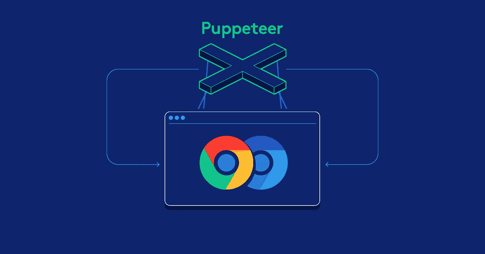

# 用木偶师揭开无头浏览器的威力

> 原文：<https://javascript.plainenglish.io/unraveling-the-power-of-headless-browser-with-puppeteer-eb585a2ee393?source=collection_archive---------3----------------------->

# 作为一名 web 开发人员，我每天有一半的时间花在浏览器上。

对我来说，浏览器总是我看到的东西，包括所有的布局、表单、开发者工具等等。当我了解了无头浏览器之后，我开始深入研究它。原来这是这么强大的一件事，这些年来我一直没有意识到。它让我如此着迷，以至于我来到这里做一些记录。但是在继续之前，让我们知道什么是无头浏览器；

*无头浏览器是没有图形用户界面的网络浏览器。它在类似于流行的 web 浏览器的环境中提供了对网页的自动控制，但是是通过命令行界面执行的。*

简单地说，这意味着没有图形用户界面(GUI)。但是没有 GUI 的浏览器有什么意义呢？开始了。

我们可以用许多不同的工具来揭示无头浏览器的威力，但我现在和[木偶师](https://developers.google.com/web/tools/puppeteer/)在一起。



使用 Puppeteer，我们将拍摄网络浏览器的**屏幕截图**，生成网页的**PDF**和**自动提交表单**而无需抬头。但是木偶师到底是什么？

> *Puppeteer 是一个节点库，它提供了一个高级 API 来控制 Chrome 或 DevTools 协议上的 Chrome。默认情况下，Puppeteer 是无头运行的，但是可以配置为运行完整的(非无头)Chrome 或 Chrome。*

**TLDR；假设已经在您的设备中设置了节点环境，让我们从设置无头 chrome 和木偶师开始。**

```
mkdir puppeteer-project
cd puppeteer-project
yarn
yarn add puppeteer
```

好了，现在我们都设置和配置好了，让我们从抓取网站截图开始吧！用下面的代码在`puppeteer-project`目录中创建一个 index.js 文件

```
const puppeteer = require('puppeteer');(async () => {
  const browser = await puppeteer.launch();
  const page = await browser.newPage();
  await page.goto('https://facebook.com');
  await page.screenshot({path: 'facebook.png'});
  console.log('Screenshot saved!');await browser.close();
})();
```

然后，我们将使用 node 运行这个文件，并检查保存截图`facebook.png`的文件夹`puppeteer-project`。

```
node index.js
```

太好了！你已经截屏了浏览器窗口，但是你可能认为它被裁剪掉了？我敢打赌你做到了。您可以按如下方式在 puppeteer 中设置视点:

```
page.setViewport({width: 2000, height: 2000});
```

为同一个页面生成一个 pdf 怎么样，没什么大不了的。我们将使用浏览器的`pdf`方法来执行它。所以，现在在`index.js`中，我们将使用`pdf`方法代替`screenshot`方法，如下所示:

```
const puppeteer = require('puppeteer');(async () => {
  const browser = await puppeteer.launch();
  const page = await browser.newPage();
  await page.goto('https://facebook.com', {waitUntil: 'networkidle2'});
  await page.pdf({path: 'facebook.pdf', format: 'A4'});await browser.close();
})();
```

再次运行该文件，以查看我们的文件夹中的 facebook.pdf。我在搜索软件包或工具时发现了`puppeteer`，以便从网上下载 pdf 格式的内容，用于我们为黑客马拉松制作的应用程序([梅罗简历](https://meroresume.herokuapp.com/))。

最后，自动化表单提交。因为我们正在与 facebook.com 合作，让我们尝试无标题登录 facebook。

```
*const* puppeteer = require('puppeteer');(*async* () *=>* {const browser = await puppeteer.launch();
*const* page = await browser.newPage();
*const* email = 'youremail@pastehere.com'await page.setViewport({ width: 2000, height: 2000});
await page.goto('https://www.facebook.com', { waitUntil: 'networkidle2' });await page.type('#email', email)
await page.type('#pass', '*********') // enter your password here
await page.click('input[type="submit"]');
await page.waitForNavigation({ waitUntil: 'domcontentloaded' });
page.screenshot({ path: 'loggedIn.png' });})();
```

检查`loggedIn.png`以查看您登录的主页。这样，我们可以自动提交任何表单。当我为了测试需要经常注册一个新用户时，我通常会使用这个。你可以用任何其他形式来尝试，如果你想看看幕后发生了什么，你可以在如下的浏览器窗口中启动木偶师:

```
*const* browser = await puppeteer.launch(({ headless: false }));
```

这些是我们可以用 Puppeteer 做的一些事情，你可以发现更多很酷的东西，不要忘记还有许多其他工具和框架可以自动化浏览器，如 Selenium，它支持 Chrome 以外的浏览器。如果你还没有尝试过，一定要尝试一下。:)