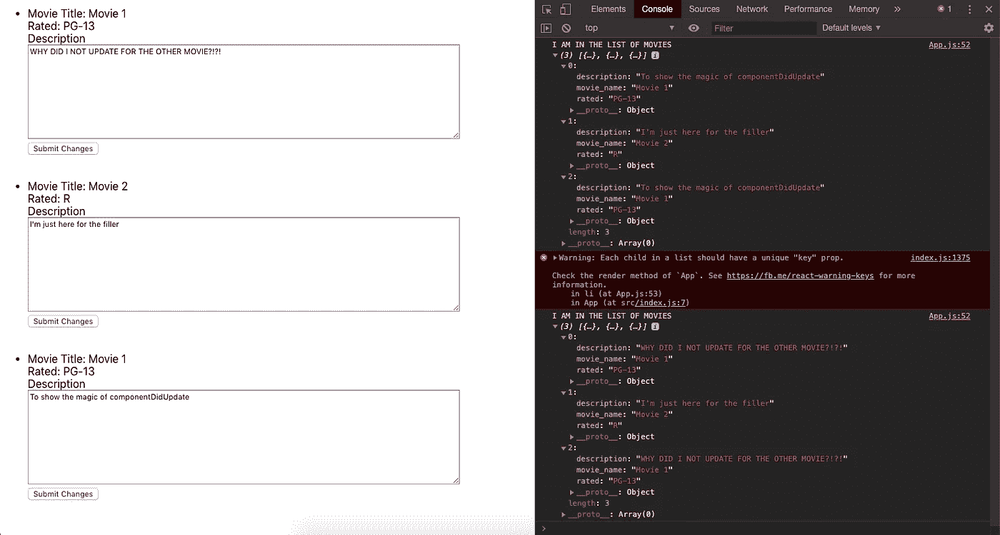

# 通过创建自动更新功能全面了解 React

> 原文：<https://javascript.plainenglish.io/update-feature-while-double-checking-assumptions-8c42e30564d6?source=collection_archive---------3----------------------->

## 通过创建一个结合了 setState()和 componentDidUpdate()的自动更新特性，将您对 React 的理解提升到一个新的层次

# 背景

特定信息可能会在 API 的不同位置重复出现。一个简单而强大的特性是，当您更改特定信息时，该更改会反映在 API 的其他地方。虽然我确实说过这很简单，但实现起来并没有那么简单(至少对我来说是这样)。根据我学到的关于 React 的一些隐含假设，我可以一步一步地向您展示如何实现这个特性以及学到的经验。

我将使用的例子是一个有多部电影的剧院。其中两部电影将会重演。更新功能将做的是，当我更新一部电影的描述时，它将自动更新所有同名电影的更新描述。(如果同一部电影有两种不同的描述，那就太奇怪了！)

首先，请看看下面的要点。

Starting Point for App.js

Starting Point for MovieCard.js

在第一个 gist 或 App.js 中，它的初始状态是一些影院细节和一系列当前正在上映的电影。为了显示更新特征的效果，重复播放两部电影。`App`组件映射电影列表并呈现`MovieCard`组件。

在第二个 gist 或 MovieCard.js 中，它的初始状态是基于其父组件 App.js 的状态的描述。`MovieCard`的目的是呈现特定于电影本身的信息。这个组件需要有一个组件级的状态，因为我是专门为那部电影更新描述的。

既然已经奠定了基础，接下来就是更新特性的逻辑/控制流。

# 更新功能的集体讨论

在我开始编写代码来实现更新特性之前，我喜欢计划出实现这一点的步骤。

我的**第一个想法**是我需要以某种方式更新 App.js 中的初始状态。通过更新 App.js 中的状态，所有从 App.js 状态接收其道具的子组件都应该自动重新呈现，因为在 App.js 级别有状态更改。我可以用`this.setState()`改变状态。

我的第二个想法是如何将子组件`MovieCard`中的新描述传递给它的父组件`App`。在 React 中，这将使用回调函数。为了实现这一点，我可以在`App`组件中创建一个新的回调函数，并将其作为道具传递下去。

我的第三个想法是什么事件会触发我第二个想法的回调函数。我想到的两个选项是`onChange`或者`onSubmit`。剧透一下，如果你真的*看过我的要点，你会注意到第二个要点中的`<form>` 标签。经过一番修改后，`onSubmit`是最好的选择。我已经需要组件级的`onChange`事件来编辑它当前的描述。我考虑过使用`onChange`作为对`App`组件级别的回调函数，但是我建议自己不要这样做，因为每当输入一个字母，Redux 就会不断地重新渲染。*

# *更新功能的逻辑流程*

*现在我已经有了自己的想法，是时候一步一步地巩固它们，实现一个有凝聚力的实现了。我喜欢从触发更新特性的事件开始。我将把每一步与前一节中相应的思想进行比较。*

1.  *在`MovieCard`组件中为表单创建`onSubmit`事件。(第三种想法)*
2.  *在`App`组件级别创建`onSubmit`事件调用的回调函数。(第二个想法)*
3.  *在回调函数中，更新`App`组件状态以反映电影的更新描述。(第一个想法)*

*到目前为止，一切看起来都可行，所以让我们开始吧！*

# *逻辑流程步骤#1*

*为表单创建`onSubmit`事件。以下要点反映了这一点。*

*在第 22 行，`onSubmit`事件增加了三个参数:`e`、`title`和`description`。我需要参数`title`的原因将在后面的步骤 3 中解释。*

# *逻辑流程步骤#2*

*在`App`组件中创建回调函数，表单提交时`onSubmit`调用该函数。以下要点反映了这一点。*

*在第 31–33 行，我创建了有三个参数的`handleSubmit`函数。注意，这三个参数是我从`MovieCard`组件中使用的。*

# *逻辑流程步骤#3*

*创建逻辑来更新具有相同电影标题的所有电影的描述。*

*这比看起来要复杂一点。函数`setState()`不适用于嵌套对象。为了更新一个嵌套对象，我需要使用 spread 操作符，直到到达需要更新的对象。我的 set state 函数可能是这样的:`this.setState({theater: {...this.state.theater, movies: updatedMovies}})`。*

*`movies: updatedMovies`正在替换电影的当前状态，因此`updatedMovies`应该是一个电影数组，它具有更新的描述 ***或*** 其各自电影的当前描述。让我们先把它写成代码。*

*First crack at handleSubmit*

*在这个要点中，我将变量`updatedMovies`实例化为一个空数组，并写下了`setState`函数的样子。由于`updatedMovies`应该是一个反映其各自电影的更新描述或当前描述的电影数组，我可以使用`push`函数来追加`updatedMovies`数组。*

*更新功能应该是用更新的描述来更新所有相同的电影。同样的电影会有同样的片名，这也是`title`参数发挥作用的地方。我可以使用`title`参数作为控制流的关键。让我们写下一些代码来表示这一点。*

*Second Crack at handleSubmit*

*第 5–15 行是将当前/更新的电影推入`updatedMovies`数组的控制流。if/else 语句用作控制流，因为我们只关心在电影名称/标题匹配的情况下用新描述更新电影。*

*在第 12 行，我们可以在`movie`本身中`push`，因为它不满足我们的`if`条件。这也有助于保持电影列表和以前一样的顺序。*

*在第 8 行，我们应该用更新的描述推进电影。然而，每个电影都是一个对象类型，这意味着为了更新对象，我们可以使用 spread 操作符来更新它，类似于我们为`setState()`实现的方式。*

*以下要点反映了这些变化。*

*Third Crack at handleSubmit*

*现在让我们把这个函数放入`App`组件中，然后结束。*

*Final App Component*

# *但是等等…还有更多！*

*如果你一直和这个博客一起写代码，你会注意到…这些都不起作用！每当“电影 1”的描述发生变化，我们点击“提交更改”按钮时，另一个“电影 1”描述的文本框不会发生变化。作为快速检查，我在更改描述之前和之后以及在点击“提交更改”按钮之后做了一个`console.log`。*

**

*Discrepancy between the updated state and what is shown*

*让我们先看看控制台。控制台的上半部分显示了`App`组件的初始状态。下半部分显示了 提交新描述后`App`组件 ***的状态。下半部分显示了在提交基于逻辑流程的新描述后我所期望的。然而，在屏幕截图的左半部分，只有第一个“电影 1”描述被更新，而第二个“电影 1”描述保持不变。****

*由于某种原因， ***实际状态*** (控制台后半部分)与 ***显示状态*** (截图左半部分)有出入。*

*在通读了 [setState()文档](https://reactjs.org/docs/react-component.html#setstate)之后，下面解释了一切。*

> *把`setState()`看作是一个*请求*，而不是一个立即更新组件的命令。为了获得更好的性能，React 可能会延迟它，然后一次更新几个组件。 **React 不保证状态更改会立即应用。***
> 
> *`**setState()**` **并不总是立即更新组件。**它可以批处理或推迟更新，直到以后。这使得在调用`setState()`之后立即读取`this.state`成为一个潜在的陷阱。**取而代之，使用** `**componentDidUpdate**` **或** `**setState**` **回调(** `**setState(updater, callback)**` **)，其中任何一个都保证在应用更新后触发。**如果您需要根据之前的状态设置状态，请阅读下面的`updater`参数。*

*注意:加粗的句子是为了强调与本博客相关的某些要点。原始文档没有将这些句子加粗。*

*引用我之前的话:*

> *通过更新 App.js 中的状态，从 App.js 状态接收其属性的所有子组件都应该自动重新呈现，因为在 App.js 级别有状态更改。我可以使用`this.setState()`来改变状态。*

*根据文档，新状态 ***不会自动应用或立即更新组件*** ，因此没有自动重新渲染。假设`setState()`立即更新组件是所有后续逻辑和流程的关键。既然我的假设是不正确的，我就需要从零开始 ***但是*** 在这种情况下我很幸运。在应用更新后，我可以使用`componentDidUpdate`来更新描述。*

# *实现 componentDidUpdate*

*我看了一下[组件更新文档](https://reactjs.org/docs/react-component.html#componentdidupdate)，发现了以下内容:*

> *Y ou **可以在`componentDidUpdate()`中立即调用** `**setState()**` **但是注意**必须像上面的例子一样用条件**包裹，否则会导致无限循环。***

*对我来说幸运的是，当应用一个更新(即更新的描述)时，在`MovieCard`组件上应用这个更新的唯一条件是如果先前的描述与更新的描述不同。我现在可以立即调用`setState`，因为现在我有一个条件。*

*由于`componentDidUpdate`在应用更新后触发，`this.props.movie.description`是更新的/当前的描述，而`prevProps.movie.description`是先前的描述。如果这些不相等，则调用`setState()`函数，用更新后的描述更新所有其他同名电影。`componentDidUpdate`被放置在`MovieCard`组件中，如下面的要点所示(第 9-13 行)。*

*Final MovieCard Component*

*瞧，更新功能现在正在按预期工作！*

# *关键外卖*

*如果你的假设或你对一个概念/主题/功能的理解没有达到预期的效果，一定要反复检查。理想情况下，我应该在继续之前仔细检查`setState()`的功能，因为这是我更新特性的整个代码的基础。如果它不像我想的那样工作，我就需要从头开始，用不同的方法解决问题。我很幸运，因为我能够用`componentDidUpdate`利用剩下的代码。如果不是这样，那么好的一面将是我对`setState`有了更深入的了解并做出反应。*