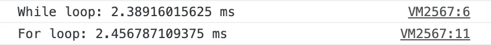

# 停止写入错误的控制台日志

> 原文：<https://javascript.plainenglish.io/upgrade-your-javascript-debugging-with-these-tips-8eecbc1c4312?source=collection_archive---------5----------------------->

## 调试不仅仅是 console.log()。就像字符串、数组和对象有方法一样，console 也有！


在 JavaScript 中调试任何东西的最简单的方法之一是使用`console.log`记录东西。但是控制台提供了许多其他方法，可以帮助您更好地调试**、更智能地调试**和**。**

我们开始吧！

# 1.用 console.log()停止这样做

假设我们有一个名为`name`的变量，我们希望将它记录在控制台中。我们经常发现自己写下这样的话:

```
console.log('name', name)
```

从 ES2015 开始，每当我们想要注销这样的东西时，我们都可以使用对象速记符号。这意味着我们可以这样写:

```
console.log({name})
```

这将输出同样的东西。

# 2.记录多个项目的更好方法

想象一个场景，当您有一堆需要登录到控制台的对象时。

```
const sunil = { name: "Sunil", member: true, id: 134323 };
const ilaria = { name: "Ilaria", member: false, id: 489348};
```

如果我们把`console.log()`这些单独拿出来，就像这样:

```
console.log(sunil)
console.log(ilaria)
```

这将是缓慢而乏味的，并且不会在记录的数据旁边显示变量名。


相反，我们可以使用我们的好朋友从第一个例子！

```
console.log({sunil, ilaria})
```

这将给我们一个更好的格式，更快的解决方案来记录多个项目，并在每个项目旁边显示变量名！


# 3.可以用表格的时候为什么要用线条？

我们可以更进一步，将所有这些放在一个表格中，使其更具可读性。每当你有具有共同属性的对象或对象数组时，使用`console.table()`。这里我们可以使用`console.table({ foo, bar})`，控制台显示:


# 4.分组日志

当你记录许多不同的事情，并且想要将相关的细节分组或嵌套在一起的时候，这是非常有用的。

也许您正在几个不同的函数中记录信息，并且您想要一种方法来清楚地标记信息来自哪个函数。

例如，如果您正在记录用户的详细信息:

```
console.group('User Details');
console.log('name: Sunil Sandhu');
console.log('position: Software Developer');
console.groupEnd();console.group('Account');
console.log('Member Type: Premium Member');
console.log('Member Since: 2018');
console.log('Expiry Date: 20/12/2022');
console.groupEnd();
```


如果需要，您甚至可以将组嵌套在其他组中:

```
console.group('User Details');
console.log('name: Sunil Sandhu');
console.log('position: Software Developer');console.group('Account');
console.log('Member Type: Premium Member');
console.log('Member Since: 2018');
console.log('Expiry Date: 20/12/2022');
console.groupEnd();
console.groupEnd();// notice that we have two groupEnd() calls at the end as we want to nest 'Account' inside of 'User Details'
```


# 5.更好的警告

想要增加某些被记录的信息的可见性吗？`console.warn()`将以黄色背景显示信息:

```
console.warn('This function will be deprecated in the next release')
```


# 6.更好的错误记录

也许您想更进一步，每当您收到那些可怕的红色控制台日志时，使用相同类型的日志记录。你可以这样做:

```
console.error('Your code is broken, go back and fix it!')
```


# 7.自定义控制台样式

带上你的 CSS 技能，开始在控制台中使用它们吧！

您可以使用`%c`指令为任何日志语句添加样式。

```
console.log('%c React ', 
            'color: white; background-color: #61dbfb', 
            'Have fun using React!');
```


# 8.计时你的函数的速度

有没有好奇过某个特定函数的运行速度？你可以这样写:

```
let i = 0;
console.time("While loop");
while (i < 100000) {
  i++;
}
console.timeEnd("While loop");console.time("For loop");
for (i = 0; i < 100000; i++) {
  // For Loop
}
console.timeEnd("For loop");
```


值得记住的是，你在这里看到的速度不是一成不变的。换句话说，它可以让你知道在那个确切的时刻两者之间哪个更快，但是其他因素也会影响它，例如它运行的计算机，当时正在执行的其他事情等等。事实上，如果我们再运行 5 次，我们会看到不同的结果:



有趣的是，我们的 for 循环比 while 循环快 5 倍。

# 9.更好的堆栈跟踪

`console.trace()`向控制台输出堆栈跟踪，并显示代码如何在某一点结束。当试图调试可能在许多不同地方进行调用的复杂代码时，这真的很方便。虽然下面不是“复杂代码”的例子，但它至少解释了这是如何工作的:

```
const sunil = {name: "Sunil", member: true, id: 134323};function getName(person) {
    console.trace()
    return person.name;
}function sayHi(person) {
    let _name = getName(person)
    return `Hi ${_name}`
}
```

`console.trace()`将返回这个:


我们可以点击那些蓝色的链接，它会把我们带到那个`console.trace()`在我们的代码中被制造的时刻。


# 我们做到了！🎉

将大大改善您的控制台登录体验的 9 个技巧。使用控制台进行调试还有其他方法吗？我很想听听他们的故事！

喜欢这篇文章吗？如果有，通过 [**订阅我的 YouTube 频道**](https://www.youtube.com/channel/UCtipWUghju290NWcn8jhyAw?sub_confirmation=true) **获取更多类似内容！**

*最初发表于*[*sunilsandhu.com*](https://sunilsandhu.com/blog/how-performant-are-arrays-and-objects-in-javascript)