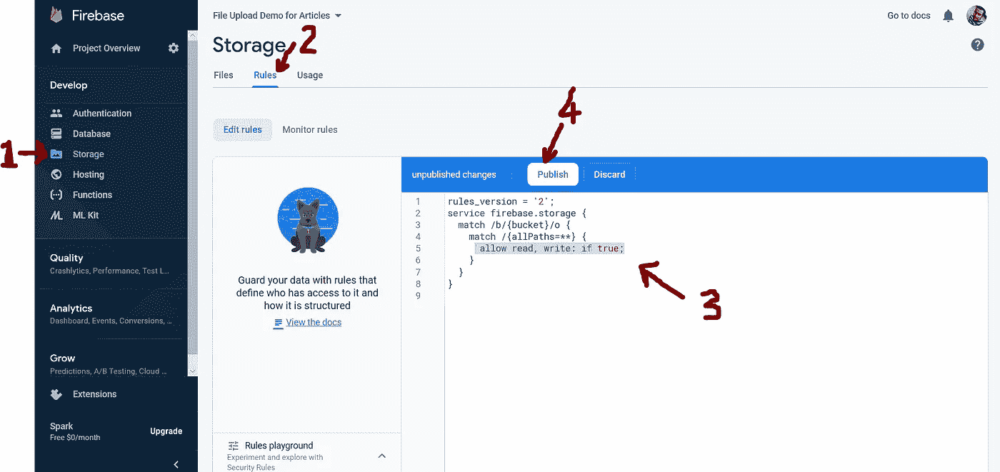
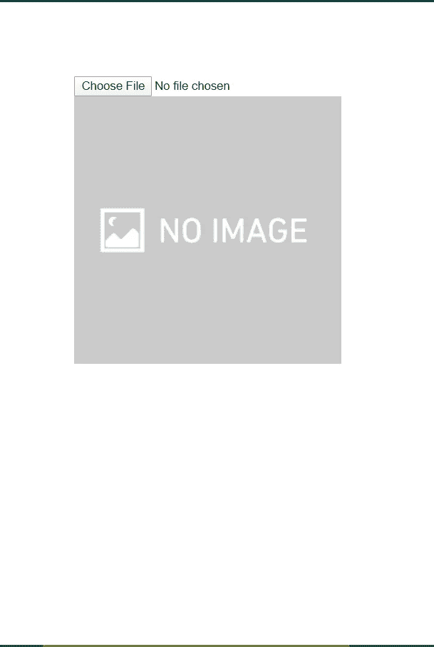
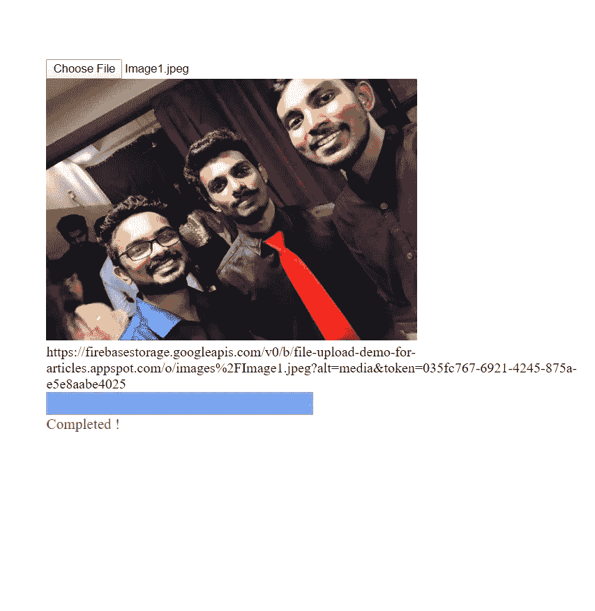

# 将文件和图像上传到 Firebase，并在 Angular 中检索可下载的 URL

> 原文：<https://javascript.plainenglish.io/upload-files-and-images-to-firebase-and-retrieve-a-downloadable-url-a5b3467bb89c?source=collection_archive---------2----------------------->

Photo by [Alex Holyoake](https://unsplash.com/@stairhopper?utm_source=unsplash&utm_medium=referral&utm_content=creditCopyText) on [Unsplash](https://unsplash.com/s/photos/fire-store?utm_source=unsplash&utm_medium=referral&utm_content=creditCopyText)

# 介绍

在[之前的文章](https://medium.com/javascript-in-plain-english/set-up-firebase-in-your-angular-app-for-the-first-time-79e0875e504b)中，我解释了如何在 Angular 应用程序中设置 Firebase。在本文中，我将解释如何将图像或任何其他文件上传到 Angular storage 并获得一个可下载的 URL，该 URL 可用于在应用程序中查看图像或将 URL 保存在 Firebase 数据库或另一个服务器端数据库中。

根据上一篇文章，我们导入了**AngularFireDatabaseModule**来启用模块中 Firebase 的数据库功能(以及 *Firestore* )。但是，由于我们想要上传文件/图像并保存它们，我们不能使用数据库，而是可以使用 Firebase 提供的**存储**功能。

# 入门指南

首先，如果你还没有在你的 angular 应用中设置 firebase，请参考我之前的文章《 [*第一次在你的 Angular App 中设置 Firebase*](https://medium.com/javascript-in-plain-english/set-up-firebase-in-your-angular-app-for-the-first-time-79e0875e504b)》并完全按照那篇文章中的**步骤 1** 和**步骤 2** 中的全部步骤进行操作。如果你做到了这些，你就有资格继续留在这里。

# 步骤 1(激活 Firebase 存储)

1.  在线进入你的 firebase 控制台，打开你的 firebase 项目的控制台。
2.  按照下图中的步骤，转到存储- →规则- →将规则编辑为“真”并发布。

在这里，我们允许书写，你可以根据自己的需要自定义规则。

# 步骤 Angular 应用程序中的配置)

1.  。您必须在 app.module.ts 中导入 AngularFireStorageModule，如下所示，以启用存储功能。

# 步骤 3(上传后获取可下载的 URL)

我已经使用命令 **ng g c fileuploader 创建了一个组件。**

1.  我创建了一个只接受图像类型的文件输入按钮..

这里，在标签中，我使用了一个错误属性来加载一个默认的图片。

选择图像后，图像会自动上传到存储器，上传完成后即可查看图像。

2.编辑。ts 文件如下

这里，在第 13 行中，在存储器中创建了一个名为“images”的文件夹，上传的文件保存在该文件夹中，如第 25 行中的文件路径所定义的。

第 26 行-→**firestorage . upload(<path>，< file > )** 方法返回一个***AngularFireUploadTask***包含几个关于上传任务的信息和有用的方法。我们使用这个*任务*来获取可下载的 url，如第 31 行所示。

3.现在，您可以运行项目并上传图像。

# 步骤 4(上传时显示进度条)

如果需要进度条，也可以添加。我在这里使用 html 中的默认进度视图。学习基本流程后可以自定义进度条。

1.  我编辑了我的 html 文件，并为进度条添加了一些新行，如下所示

2.编辑。ts 文件，并添加我在注释中显示的新行。(第 18 行和第 32 行)

在这里，我也使用了**任务**来获取上传百分比，该百分比返回一个**可观察值<编号>** 。(不要试图在控制台中记录这些值，因为这没有用..) .

3.好啊，你可以走了。赶紧运行 app 自己看看。

Before upload with default image

While uploading

After uploading

# 结论

在这里，您可以了解使用 FireStorage 时需要导入哪些模块，并了解作为 **AngularFireStorage.upload()方法的结果而返回的 **AngularFireUploadTask** 。***AngularFireUploadTask***为我们提供了非常有用的方法来处理上传过程，我在本文中只使用了其中的两种方法，但还有其他方法可以暂停、停止或恢复上传过程。和他们一起玩就看你自己了**。****

## ****用简单英语写的 JavaScript 的注释:****

**我们总是有兴趣帮助推广高质量的内容。如果你有一篇文章想用简单的英语提交给 JavaScript，用你的 Medium 用户名给我们发邮件到[submissions@javascriptinplainenglish.com](mailto:submissions@javascriptinplainenglish.com)，我们会把你添加为作者。**