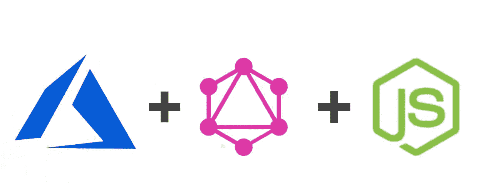
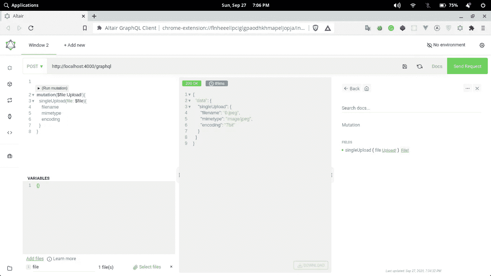
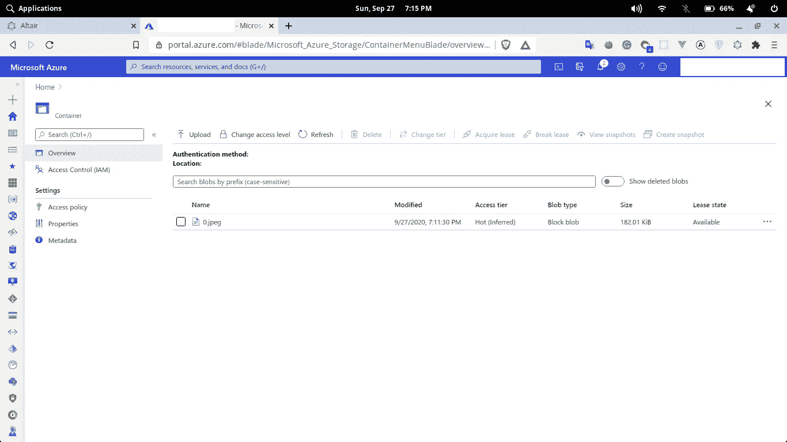

# 使用 GraphQL 和 Node.js 将文件上传到 Azure blob 存储

> 原文：<https://javascript.plainenglish.io/upload-files-to-azure-blob-storage-using-graphql-and-nodejs-ffbea65156a7?source=collection_archive---------7----------------------->

文件上传是大多数网站的重要组成部分，由于 GraphQL 越来越受欢迎，GraphQL 社区开始询问我们如何使用 GraphQL 上传文件。

然后袁晓超·塞里奇为 GraphQL 多部分请求创建了一个[规范，并为 GraphQL 创建了一个](https://github.com/jaydenseric/graphql-multipart-request-spec)[上传包](https://github.com/jaydenseric/graphql-upload)来支持多部分请求。之后，Apollo 在 Apollo Server 2.0 中加入了这个特性。所以现在我们可以使用 GraphQL 轻松上传文件。



# 服务器配置

我们使用 apollo-server 来创建 GraphQL 服务器。Apollo-Server 有一个很棒的[文档](https://www.apollographql.com/docs/apollo-server/getting-started/)可以开始使用。因此，让我们创建根目录并安装所需的包。apollo-server 集成了流行的 Node.js 库，如 express、koa 等。

```
mkdir graphql-azure
cd graphql-azure
npm init -y
npm install apollo-server graphql azure-storage
```

在安装了所需的包之后，我们可以创建模式和解析器。

## 创建模式

我们的模式将是这样的。我们将拥有包含文件名、mimetype 和编码字段的文件类型。singleUpload 变异将用于上传我们的文件到 azure。这种变异使用**上传**标量类型作为参数的类型。从 Apollo Server 2.0 开始，上传类型是内置的。文件的返回类型用于确保文件正确上传到 GraphQL 服务器。当然，它可以根据您的需要进行更改，如返回一个布尔值或字符串。创建模式后，我们需要为 singleUpload 变异创建一个解析器，以便将文件存储到 Azure blob 存储中。

## 创建解析程序

我们使用`createBlockBlobFromStream`方法上传文件。此方法将文件流式传输到 Azure blob 存储。`createBlockBlobFromStream`以**容器名**、**文件名**(文件名用作 blob 存储中的文件名，因此可以相应更改)、 **filestream** 、 **streamsize** 作为参数，并提供一个回调函数，该函数以 error 和 response 作为参数。streamsize 将出现在请求的头中。所以请求对象是在 GraphQL 的上下文对象中传递的。还有其他上传文件到 azure 的方法，比如`createBlockBlobFromLocalFile`，但是它要求文件临时存储在文件系统中。

## 创建服务器和 Azure

在 index.js 文件中，我们首先需要导入包并创建 apollo-server 实例。然后我们需要使用 azure 连接字符串来配置 azure。要创建 azure 存储帐户和容器，请访问官方文档。

让我们测试一下我们的应用程序。



在这里，您可以看到我们的文件已经成功上传，并且返回了带有文件名、mimetype 和编码的响应。此外，我们可以在我们的文档中看到列出了我们的 singleUpload 突变。现在，让我们检查 azure 门户网站，如果我们的图像已经成功上传。



文件已成功上传到 azure。

希望这对你有帮助。如果你有任何疑问或建议，请在评论区告诉我。

祝您愉快:)