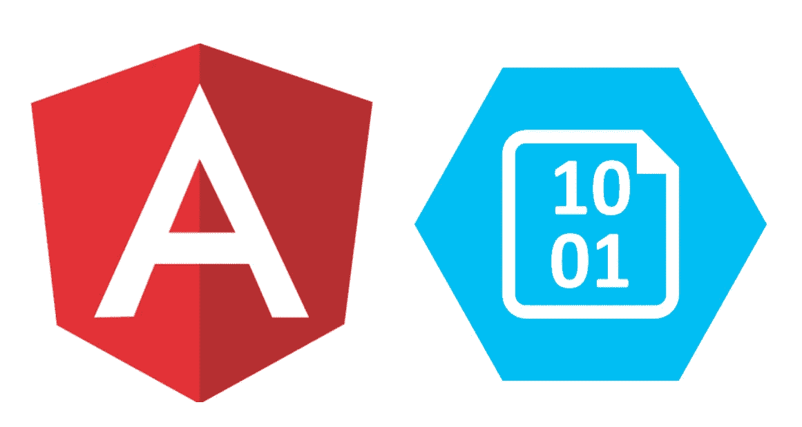

# 使用 Angular 8 上传到 Azure Blob 存储

> 原文：<https://javascript.plainenglish.io/upload-to-azure-blob-storage-with-angular-8-2ed80dfc6672?source=collection_archive---------0----------------------->

## 如何使用从您的后端生成的*共享访问签名* (SAS)令牌将多个文件上传到浏览器中的 blob 存储。

> 注意:这是对我之前文章的更新，我之前的文章使用的是 Azure Storage js 库的旧版本。[https://medium . com/@ stuarttotle/upload-to-azure-blob-storage-with-angular-7977 e 979496 a](https://medium.com/@stuarttottle/upload-to-azure-blob-storage-with-angular-7977e979496a)

我们将使用 Angular 8 和 [@azure/storage-blob](https://www.npmjs.com/package/@azure/storage-blob) 库来上传文件。

最终代码在 [Github](https://github.com/stottle-uk/stottle-angular-blob-storage) 上，其中还包含了列出容器、blob 项目以及删除和下载 blob 项目的示例。

我们会过去的

*   创建用于选择和上传文件的组件
*   创建服务来管理上载的视图状态
*   使用 SAS 令牌保护到 Blob 存储的上传
*   创建一个服务来包装@azure/storage-blob 库中的`uploadBrowserData`方法，以将文件上传到 blob 存储
*   创建显示上传进度的组件

# 创建文件上传组件

`InputFileComponent`组件允许用户选择一个或多个文件进行上传

我们会掩护

1.  选择一个或多个要上传的文件
2.  调用视图状态服务上的方法以开始上载

## 发生了什么事？

我们隐藏了输入，文件对话框用按钮打开。当用户选择文件时，在`BlobUploadsViewStateService`上调用`uploadItems`方法。我们可以在这里添加一些验证，但对我来说，在视图状态服务中进行验证更有意义。

# 创建上传视图状态服务

`BlobUploadsViewStateService`服务管理组件的共享视图状态。我非常熟悉 NGRX 和 redux 模式，所以我创建了一个服务，您可以向其中提供项目来触发操作，并让 observables 监听更改。这也意味着我们可以将业务逻辑从组件中分离出来，组件通常只有一个职责。

我们会掩护

1.  向可观察对象列表以触发上传
2.  获取 SAS 令牌
3.  将文件上传到 blob 存储
4.  在视图状态中保留所有上载进度的列表

## 发生什么事了？

public `uploadItems`方法接受一个文件列表，并调用关于`uploadQueueInner$`主题的`next`方法。`uploadQueue$` getter 将主题作为一个可观察对象进行监听，并将文件列表中的每个文件作为一个单独的项目发出。这是一个可以验证文件的地方。

属性`uploadedItems$`正在监听`uploadQueue$`，并将为每个发出的文件项调用服务中的`uploadFile`方法。需要订阅`uploadedItems$`来开始上传并显示上传进度(我们将在下面的上传进度组件中介绍)

`uploadFile`方法获取最新的 SAS 令牌，并使用令牌和文件细节调用 Blob 存储包装服务上的`uploadToBlobStorage`(我们将在下面介绍)。

`uploadToBlobStorage`方法返回一个 observable，该 observable 在每次改变时发出 loadedBtyes，并可用于跟踪上传进度。

然后，我们将上传响应映射到`mapUploadResponse`方法中的一个百分比，并包含额外的细节。该方法还有一个`startWith`操作符，这样任何订阅者都会在上传开始时得到通知，而不是等待进度发出。

然后，当上传完成时，我们调用 finalise 方法来刷新 blob 容器中的项目。

然后，来自`uploadFile`方法的映射响应被传送到一个定制的`scan`操作符函数中，以将发出的值减少到一个数组中。这允许我们存储所有正在进行的上传，并在上传已经在进行时添加更多的上传。

# 使用 SAS 令牌保护上传

上面的服务在每次从服务上传之前调用一个方法来获取一个 SAS。该代码示例中的方法返回我在 Azure 门户中生成的硬编码 SAS 令牌，但在现实世界中，您将调用 API 来生成并返回 SAS 令牌。这是一个使用 Azure 的 C#的基本例子。Storage.Blobs (v12.0.0)包来生成一个可以用于许多操作的帐户 SAS。当您希望/需要更细粒度时，您还可以为特定的 blob 项目或容器创建 SAS 令牌。

# 将 uploadBrowserData 方法包装在@azure/storage-blob 库中

我们包装@azure/storage-blob 库来返回 observables 而不是 promises，因为它在发出进度事件时工作得很好。

我们会掩护

1.  创建一个注入令牌，从@azure/storage-blob 库中获取 blobServiceClient，使我们的服务可测试
2.  调用`uploadBrowserData`方法并返回 loadedBytes 的可观察值

以下是来自[全面服务](https://github.com/stottle-uk/stottle-angular-blob-storage/blob/master/src/app/azure-storage/services/blob-storage.service.ts)的片段

## 发生什么事了？

包装器服务中的`uploadToBlobStorage`方法接受要上传的文件和带有 SAS 令牌的对象。它调用一个方法，该方法将使用注入的令牌服务返回使用连接字符串创建的`blobServiceClient`。

然后，我们将使用`blobServiceClient`创建的`BlockBlobClient`和文件传递给包装了`uploadBrowserData`方法的`uploadFile`方法。我们监听`onProgress`事件，并在每次进度改变时发出值。然后，当上传完成时，我们发出文件大小并完成观察。

# 创建一个组件来显示上传进度

在此代码示例中，视图状态服务管理共享数据，组件显示数据。这个良好的实践允许我们将文件输入和上传进度组件分开，并且保持我们的组件小，职责少(希望只有一个)。

## 发生什么事了？

从我们上面提到的`BlobUploadsViewStateService`服务的`uploadedItems$`属性中为`uploads$`属性赋值。

然后，我们使用`async`管道订阅可观察对象，并显示数组中的每一项。

# 结论

这是上传到 Azure blob 存储的一种实现方式，我已经尝试演示了这种方式的基本架构，并给出了示例代码。

我们可以通过在上传前对文件进行验证并计算上传速度来改进解决方案。我们也没有很好地处理错误。

我们可以将 NGRX 与效果和选择器一起用于更大的应用程序，而不是视图状态服务

组件还可以分为智能组件和非智能组件，其中智能组件获取数据并调用视图状态服务上的函数，非智能组件(具有输入和输出)显示数据。

您还可以在这里看到解决方案[的工作示例。为缺乏风格道歉。](https://stottle-blob-storage-angular.azurewebsites.net/)

如果您对下面的文章有任何意见或建议，请告诉我，但是请在 Github repo 上提出任何代码问题

 [## stottle-uk/stottle-angular-blob-storage

### 该项目是使用 Angular CLI 版本 8.3.17 生成的。为开发服务器运行 ng 服务。导航到…

github.com](https://github.com/stottle-uk/stottle-angular-blob-storage)