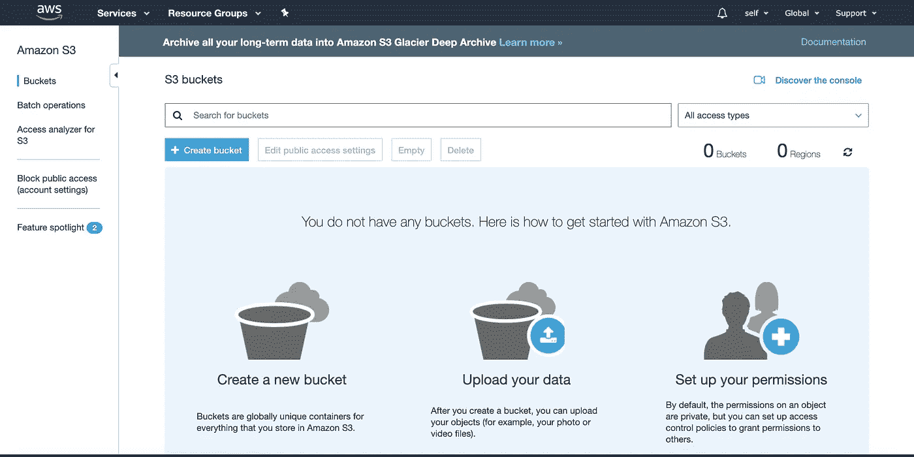
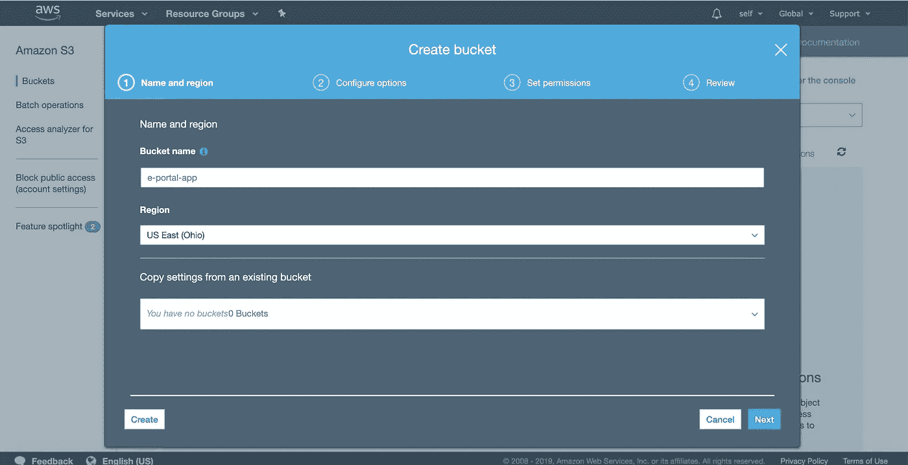
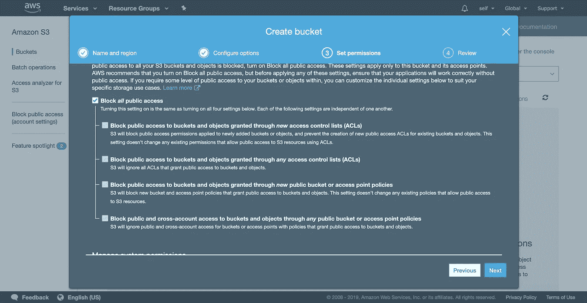
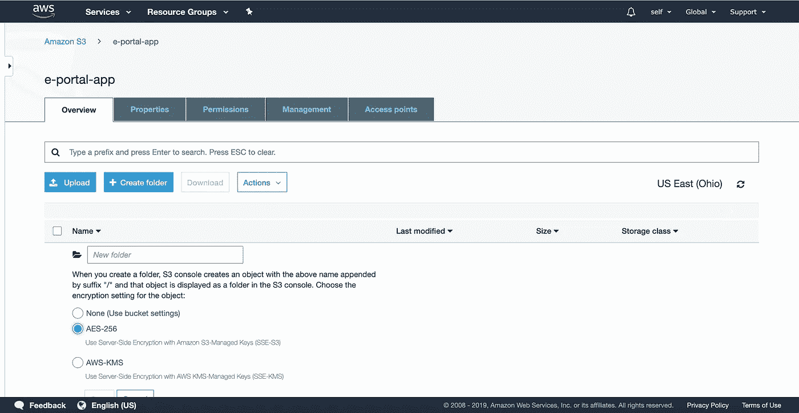
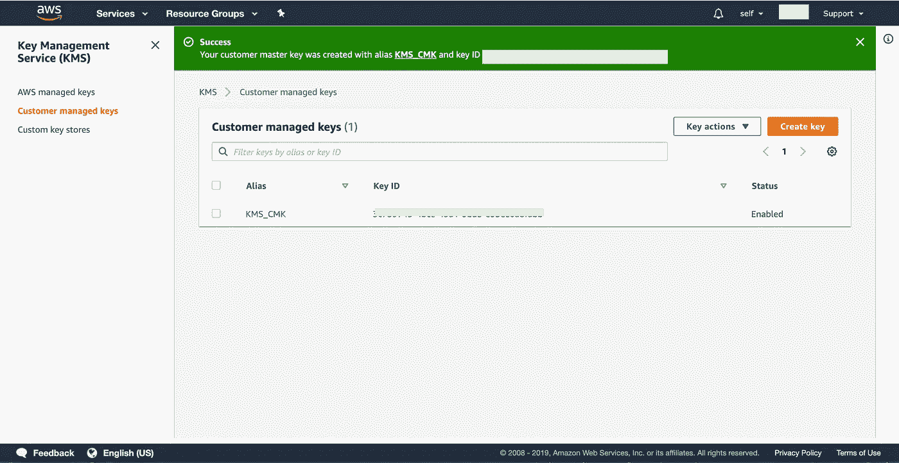

# 使用 AWS S3 在您的节点应用程序中上传和下载加密文件

> 原文：<https://javascript.plainenglish.io/uploading-encrypted-files-in-aws-s3-bucket-with-nodejs-app-c28b7fef1779?source=collection_archive---------3----------------------->

S3 bucket 利用 NodeJS 应用程序来上传、下载和删除文件。加密是文件上传中非常重要的一部分。使用 KMS 密钥的 AWS 信封加密可确保数据在静态时是安全的。这篇文章主要关注上传文件到 S3 桶加密的内容。


## 在 AWS S3 上传和下载加密文件的步骤:

1.  使用 AWS 控制台创建 S3 存储桶和文件夹。在存储桶内创建文件夹并提供访问策略。(不包括用户、用户组和用户池 id 的创建，因为这是另一个主题，将在另一篇文章中讨论)
2.  使用 AWS 控制台创建 KMS 键。KMS 密钥非常重要，是加密文件内容所必需的。
3.  使用 NodeJS 中的 KMS 密钥上传和下载加密文件。

# AWS 控制台

1.  **使用 AWS 控制台创建 S3 存储桶和文件夹:**在 AWS 控制台中创建登录。转到 AWS 服务，在 AWS 控制台中选择 S3。

创建一个新的 S3 时段并选择区域。



阻止公共访问



创建文件夹并选择加密类型，在本例中我们选择了 AES-256。



**2。使用 AWS 控制台创建 KMS 密钥:**

现在使用 [AWS IM 用户控制台](https://console.aws.amazon.com/iam/.)创建一个用户。选择“以编程方式访问”以生成访问键。一旦创建了用户并设置了用户池。使用[AWS KMS 控制台](https://us-east-2.console.aws.amazon.com/kms/home?region=us-east-2#/kms/keys)生成 KMS 密钥。

*   对于区域，选择适当的 AWS 区域。不要使用导航栏中的区域选择器(右上角)。
*   选择生成 CMK **密钥(客户主密钥)**。输入 CMK 的别名。别名不能以 AWS 开头。以**开头的别名 AWS** 由 Amazon Web Services 保留，代表您帐户中 AWS 管理的 cmk。
*   别名是可用于识别 CMK 的显示名称。建议设置是选择一个别名来指示您计划保护的数据类型或您计划与 CMK 一起使用的应用程序。选择描述，虽然它是可选的，但最好有特性。描述应该包含使用该密钥的加密类型和应用程序的信息。



*   单击“下一步”,并键入标记键和可选的标记值。要向 CMK 添加多个标签，选择**添加标签。**标记始终是可选的。选择可以管理 CMK 的 IAM 用户和角色。
*   默认情况下，AWS 帐户(root 用户)拥有完全权限。因此，其附加策略允许适当权限的任何 IAM 用户和角色也可以管理 CMK。要防止您在上一步中选择的 IAM 用户和角色删除此 CMK，请清除页面底部的复选框**允许密钥管理员删除此密钥。**
*   现在下一步是选择 IAM 用户和角色，他们可以使用 CMK 通过 AWS KMS API 加密和解密数据。
*   默认情况下，AWS 帐户(root 用户)拥有完全权限。因此，其附加策略允许适当权限的任何 IAM 用户和角色也可以使用 CMK。
*   这是一个可选步骤，您可以使用页面底部的控件来指定可以使用此 CMK 加密和解密数据的其他 AWS 帐户。为此，选择**添加一个外部账户**，然后输入想要的 AWS 账户 ID。根据需要重复添加多个外部帐户。
*   外部帐户的管理员还必须通过为其用户创建 IAM 策略来允许访问 CMK。有关更多信息，请参见[允许外部 AWS 帐户访问 CMK](https://docs.aws.amazon.com/kms/latest/developerguide/key-policy-modifying.html#key-policy-modifying-external-accounts) 。现在选择下一步，完成密钥创建步骤。

我们的 S3 桶文件夹准备好了。我们还为信封加密创建了用户、用户池 id 和 CMK 密钥。

3.**在节点**中使用 KMS 密钥上传和下载加密文件

*   安装 AWS SDK 依赖项和文件加密模块

```
#Install aws sdk and file encryptor modulenpm install aws-sdknpm install file-encryptornpm install file-system --save
```

*   AWS SDK 和文件加密模块将可用于 NodeJS

```
//to encrypt files
var encryptor = require('file-encryptor');//to read the file
var fs **=** require('fs');//to upload, delete and download from s3 bucket
var AWS **=** require(‘aws-sdk/dist/aws-sdk-react-native’);
```

*   当依赖项准备就绪时，在节点应用程序的源文件夹中创建`aws-sdk.config.json`。注意:不要在根目录中创建`aws-sdk.config.json`,因为一旦运行 docker 命令，docker 将不会包含根目录配置文件。


*   在这个配置中，我们只保留区域细节。其他键从命令行或 dot-env 文件传递。
*   现在在 utils 中创建一个 **encryption.js** 文件，并使用下面的代码进行加密和解密。该文件将在上传和下载之前加密和解密 S3 桶内容。

*   创建一个文件 **upload.js** 负责将文件上传到 S3 桶。该文件将使用上述 **encryption.js** 文件对内容进行加密和解密。

内联 2，我们正在加载 AWS SDK 并检查区域。第 16 行 export.putObject 调用 **encryption.j** s 文件，加密数据，上传到 S3 桶。

接下来编写最后一个函数，将文件上传到 S3 桶`uploadFilesins3BucketHandler`。这个函数使用一个节点`fs module`来读取文件。请参见下面的代码块。

接下来，我们将下载该文件。对于下载，首先我们需要使用相同的密码设置进行解密

删除文件非常简单，只需传递存储桶和文件细节

**结论:**我们已经学会了使用 S3 控制台、创建 KMS 密钥或我们自己的 CMK 密钥来创建 S3 存储桶和文件夹。我们还看到了如何加密文件数据并将其上传到 S3 存储桶。下面是一些有用的参考资料和文档。

参考资料:

[https://docs . AWS . Amazon . com/kms/latest/developer guide/concepts . html # master _ keys](https://docs.aws.amazon.com/kms/latest/developerguide/concepts.html#master_keys)

[https://docs . AWS . Amazon . com/kms/latest/developer guide/key-policy-modificing . html # key-policy-modificing-external-accounts](https://docs.aws.amazon.com/kms/latest/developerguide/key-policy-modifying.html#key-policy-modifying-external-accounts)

 [## AWS 安全凭据

### 当您与 AWS 交互时，您指定您的 AWS 安全凭证来验证您是谁以及您是否拥有…

docs.aws.amazon.com](https://docs.aws.amazon.com/general/latest/gr/aws-security-credentials.html)