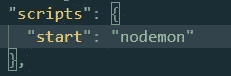
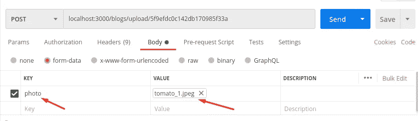

# 在 Node.js 应用程序中使用 Multer 上传文件

> 原文：<https://javascript.plainenglish.io/uploading-file-using-multer-in-node-js-applications-bd4448dd41c4?source=collection_archive---------3----------------------->


Uploading Images Using Multer

# 目录

*   [简介](#149d)
*   [我们建造什么](#6944)
*   [上传图片](#8659)
*   [一个完整的例子](#9e1d)
*   [结论](#363a)

# 介绍

今天，我们可以找到许多像照片共享应用程序或博客网站这样上传图像的应用程序和网站。这就是为什么，有很多很好的理由允许用户在服务器上存储文件。Http 服务器使用 POST 请求处理文件上传。当谈到 node.js 时，情况就不同了。如果不使用库来处理上传，node.js 本身是很难做到的。这就是原因，有许多可用的 npm 软件包。Multer 是一个很好的上传 npm 包。主要配合 express.js 使用。

使用 Express.JS 构建 web APIs 很容易。我已经发布了一个关于 express.js 的教程。Multer 是一个处理多部分/表单数据的 npm 包。它使 express.js 应用程序能够接受文件。在 express.js 服务器中配置非常容易。这个博客是最小化的，只教授使用 **multer** 上传文件，但是它试图给你一个线索，告诉你如何将一个图像链接到数据库中的一个记录，并在以后检索它。

# 我们建造的东西

在本教程中，我将构建一个简单的博客 web API。它让任何人都可以写有标题、内容和照片的博客。因此，我将使用快递。JS 用于处理 http 请求，mongoose 用于存储数据，Multer 用于上传文件。

## 设置

*   创建目录

```
mkdir file-upload
cd file-upload
```

*   正在初始化 package.json

```
npm init -y
```

*   安装软件包

```
npm i -S multer express mongoose body-parser uuid
npm i -D nodemon
```

*   启动脚本:在 package.json 中，添加一个启动脚本，如下所示



Start Script

*   使用 **index.js** 文件(条目文件)内的路线创建 express.js 应用程序

```
***// import packages*** const express = require("express");
const bodyParser = require("body-parser");
const mongoose = require("mongoose");
const path = require("path");***// create and configure express app*** const app = express();
app.use(bodyParser.json()); ***//parsing json files******// routes*** app.get("/blogs",
   (req, res) => res.json({ success: true, blogs: [] }));
app.post("/blogs",
   (req, res) => res.json({ success: true, blog: {} }));
app.put("/blogs/{id}",
   (req, res) => res.json({ success: true, blogs: [] }));
app.delete("/blogs/{id}",
   (req, res) => res.json({ success: true }));***// this route is used for uploading*** app.post("/blog/upload",
   (req, res) => res.json({ success: true, blog: {} }));const PORT = 3000;
app.listen(PORT, (err) =>
   err
   ? console.log(err)
   : console.log(`The server is started on port: ${PORT}`)
);
```

# 上传图像

> Multer 向`request`对象添加一个`body`对象和一个`file`或`files`对象。

如果 multer 被配置为上传单个文件，那么**文件**属性被添加到请求字段，如果它被配置为上传多个**文件**文件属性被附加到请求对象。

*   需要 NPM 软件包

```
const multer = require("multer");
const uuid4 = require("uuid").v4;
```

*   配置存储

**磁盘存储**是一种传递给 multer 的配置类型，用于配置 multer 在磁盘上永久存储文件。

```
const storage = multer.diskStorage({
   destination: path.join(__dirname, "/public/uploads"),
   filename: function (req, file, cb) {
      const fullName =
         "blog_" + uuid4().replace(/-/g, "") +
         path.extname(file.originalname);
         cb(null, fullName);
   },
});
const upload = multer({ storage: storage });
```

*   使用 multer 作为 express.js 中间件。

```
app.post("/blogs/upload", upload.single("photo"), (req, res) =>
   res.json({
      success: true,
      blog: {
         photo: "/uploads/" + req.file.filename,
     },
   })
);
```

## 需要考虑的事项

*   我们需要允许 express**提供公共文件**，这样我们就可以提供上传的图片。

```
app.use(express.static(path.join(__dirname, "public")));
```

*   Multer 可以进一步配置为处理要上传的**最大** **文件大小限制**。**文件大小**以字节计算。
*   文件可以在上传前通过**过滤器**。可能有一种情况**只允许**上传图片。或者过滤器可以用于其他用途。

```
const upload = multer({
   storage: storage,
   limits: { fileSize: 2000000 }, 
   fileFilter: function (req, file, cb) {
      const fileTypes = /png|jpeg|jpg/;
      const extName =
         fileTypes.test(path.extname(file.originalname));
      file.originalname.toLowerCase();
      const mimeType = fileTypes.test(file.mimetype);
      if (extName && mimeType) {
         cb(null, true);
      } else {
         cb("Error: only png, jpeg, and jpg are allowed!");
      }
    },
});
```

## 一个演示 Multer 的例子

这个例子演示了使用 **multer** 为 **express** 上传**文件。**

## 要上传的邮递员

为了测试上传文件的 API，我们将使用 postman。

*   首先粘贴 URL“localhost:3000/blogs/upload/id _ 1234”
*   将方法更改为 POST
*   在 Body 选项卡中选择**表单-数据**，并添加带有类型文件的关键照片。
*   选择一个文件，然后发送请求。



Client Request Demonstrating

# 一个完整的例子

下面的代码是**文件上传和附加到 blog** 的完整示例，使用了另外四种不同的路径来检索、存储、更新和删除 blog。它使用 mongoose 连接到 mongodb 来读写数据。

# 结论

上传文件可以在社交网络应用程序、文件托管服务如 **OneDrive** 等中找到。在 express.js 应用程序中，可以很容易地配置 multer 来处理文件上传。

您克隆这个 [**存储库**](https://github.com/bewarusman/node-file-upload.git) 以获得完整的代码。如果您有任何问题、顾虑或建议，我将很高兴收到您的来信。