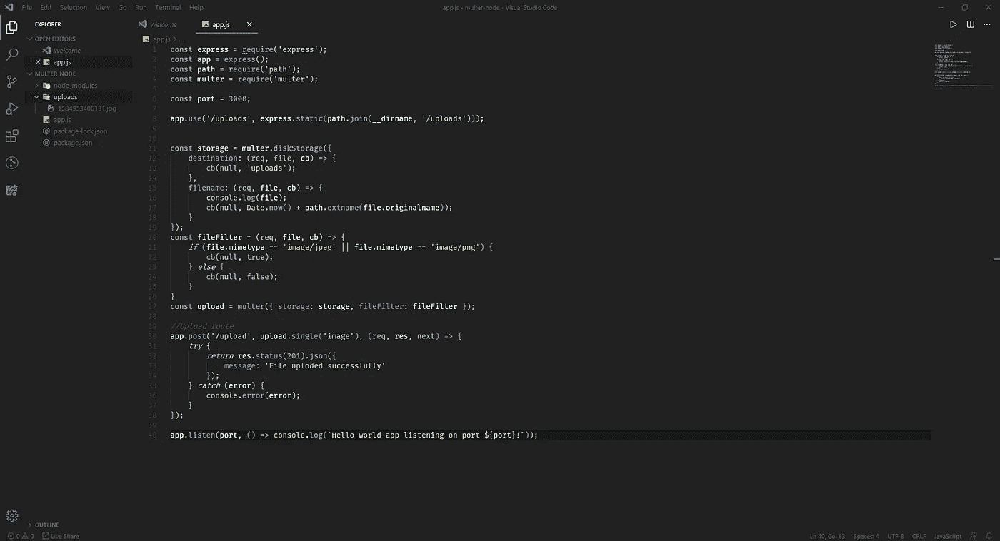

# 用服务器上的 Multer 在 Node.js 和 Express.js 中上传文件

> 原文：<https://javascript.plainenglish.io/uploading-files-using-multer-on-server-in-nodejs-and-expressjs-5f4e621ccc67?source=collection_archive---------0----------------------->

Multer 是一个用于处理的 Node.js 中间件，主要用于上传文件。我将给出一个例子快速演示。


Photo by [Karl Pawlowicz](https://unsplash.com/@karlp?utm_source=medium&utm_medium=referral) on [Unsplash](https://unsplash.com?utm_source=medium&utm_medium=referral)

# 上传过程的幕后。

文件上传流程是 web 客户端上传文件到服务器时，一般通过表单提交，编码为`multipart/form-data`。Multer 是用于 Express 和 Node.js 的中间件，当您的用户上传文件时，它可以很容易地处理这个`multipart/form-data`。

## 什么是 Multer？

Multer 是一个用于处理的 Node.js 中间件，主要用于上传文件。

## 软件要求

1.  [Nod](https://nodejs.org/en/)e . js——node . js 是基于 [Chrome 的 V8 JavaScript 引擎](https://v8.dev/)构建的 JavaScript 运行时。
2.  [Express](https://expressjs.com/)——用于 [Node.js](https://nodejs.org/en/) 的快速、非个性化、极简的 web 框架
3.  [Multer](https://www.npmjs.com/package/multer) — Multer 是一个用于处理的 Node.js 中间件，主要用于上传文件。
4.  [Postman](https://www.postman.com/)—API 开发的协作平台。

## 项目设置

我们将在这个项目中使用 Node Express 框架。当然，您需要安装 Node。

为我们的项目创建一个目录，导航到这个目录，并发出`npm init`来创建一个**。json** 文件管理我们应用程序的所有依赖项

使用 npm 命令安装所需的软件包:

```
npm install --save express body-parser multer
```

创建 Express 服务器

现在配置服务器接受来自客户端的文件。

```
const multer  = require('multer');/* We will upload the file on server local directory, not in database. We will store the directory path into the database. */
```

以下配置用于在服务器上上传图像。

```
const storage = multer.diskStorage({
    destination: (req, file, cb) => {
        cb(null, 'uploads');
    },
    filename: (req, file, cb) => {
        console.log(file);
        cb(null, Date.now() + path.extname(file.originalname));
    }
});const fileFilter = (req, file, cb) => {
    if (file.mimetype == 'image/jpeg' || file.mimetype == 'image/png') {
        cb(null, true);
    } else {
        cb(null, false);
    }
}const upload = multer({ storage: storage, fileFilter: fileFilter });
```

现在创建一个接受我们的文件的路径。

```
//Upload route
app.post('/upload', upload.single('image'), (req, res, next) => {
    try {
        return res.status(201).json({
            message: 'File uploded successfully'
        });
    } catch (error) {
        console.error(error);
    }
});
```

注意:首先在你的项目根目录下创建“*上传*目录。

你也可以一次上传多个文件。

用`upload.array('images', 100)`就行了。


Upload image

数据类型应该是`file`。如果你使用 HTML 表单，那么不要忘记表单中的`enctype="multipart/form-data"`。

```
<form method="POST" action="/upload" enctype="multipart/form-data"><div> 
   <label>Select your profile picture:</label> <input type="file"   name="image" />
</div><div> 
    <input type="submit" name="btn_upload_profile_pic" value="Upload" /> 
</div></form>
```



File uploaded in folder /uploads

## 密码

谢谢大家！

快乐编码:)

[https://pprathamesmore . github . io](https://pprathameshmore.github.io/#)/