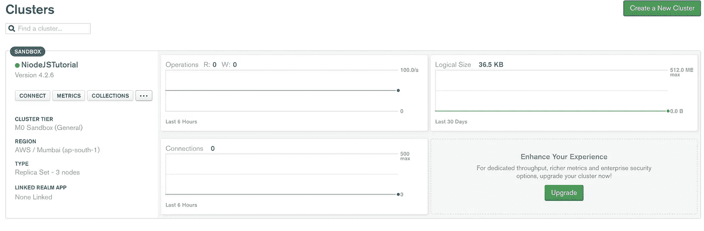

# 如何使用 Node.js 构建一个类似 bitly 或 shorturl 的网址缩写器

> 原文：<https://javascript.plainenglish.io/url-shortner-with-limit-onclick-count-256ff46bf9fa?source=collection_archive---------0----------------------->

## 具有有限 OnClick 计数的 URL 缩写

我们可能听过很多次，人们要求建立一个更短的 URL 作为面试问题，这并不复杂，但让它开始建立一个是复杂的。

所以不要浪费时间，让我们开始吧。

## 什么是网址缩写

URL shortener 是一个简单的工具，它可以将一个长 URL 转换成你想要的任何 URL。

## 为什么我们需要它

有时，链接到一个位置或社交平台的链接变得如此之大，以至于很难管理它们。一个更短的 URL 将有助于管理、跟踪和编辑点击数据，以及他们促进分享的一个重要点。

## 我们将使用的 npm 包

[**配置**](https://www.npmjs.com/package/config) **:** 可以定义一组默认参数，并针对不同的部署环境(开发、QA、试运行、生产等)进行扩展。).对于生产，我们必须为开发 devlopment.js 类似地定义 production.js。

*这将用于存储与 DB 和其他相关的配置。*

[**【valid-URL】**](https://www.npmjs.com/package/valid-url):该模块收集了常用的 URI 验证例程，使输入验证、维护更容易，可读性更强。如果测试通过，所有函数都返回一个未赋值的值，如果测试失败，则返回一个未定义的值。

*这将用于验证用户给出的 URL，以便缩短。*

[**short id**](https://www.npmjs.com/package/shortid):short id 创建非常短的非顺序 URL 友好的惟一 id。

*这将用于为每个缩短的 URL 生成唯一的 id。*

[**Express**](https://www.npmjs.com/package/express):Express 的理念是为 HTTP 服务器提供小型、健壮的工具，使之成为单页面应用程序、网站、混合或公共 HTTP APIs 的优秀解决方案。

*这将用于创建服务器和路由不同的 HTTP 路径。*

[**mongose**](https://www.npmjs.com/package/mongoose):mongose 是一个 MongoDB 对象建模工具，设计用于在异步环境下工作。猫鼬支持承诺和回调。因为他们使用 promise，我们将使用 JS 的异步和等待特性。

*这将用于连接 MongoDB，保存、更新和查询数据库。*

接下来，让我们设置 MongoDB 来设置我们的数据库。

## 设置 MongoDB Atlas

我想使用 MongoDB 的云设置而不是本地设置，你可以选择更适合你的。

设置云 MongoDB Atlas 帐户的步骤:

*   参观现场[https://www.mongodb.com/cloud/atlas](https://www.mongodb.com/cloud/atlas)
*   创建一个帐户，云设置是免费的
*   创建一个集群



*   转到连接，创建一个用户
*   去连接你的应用程序，你会看到一个网址(只要记住网址的位置)。密码将被您的帐户密码替换。

## 设置项目

为您的项目`urlshortener`创建一个单独的目录，在您喜欢的 IDE 中打开该目录。我在这里使用 Visual Studio 代码。

进入文件夹并键入`npm init`，给出设置项目的必要细节。

接下来，我们需要下载我们前面讨论过的必要的节点包，键入下面的命令来下载它们

```
npm i express config mongoose shortid valid-url
```

上面的命令将使用依赖项更新`package.json`,并将需要的包下载到`node_modules`文件夹中。


## 编码部分

打开代码编辑器。创建一个文件夹来存储配置，给文件夹命名为`config`。在文件夹 **default.js** 中创建一个文件，并给出您的 MongoDB connect URL(我们之前设置了它，我告诉过您要记住它😂)和 baseURL。

*   用您为该用户设置的密码替换该密码。
*   allowedClick 是一种限制，即同一个 URL 可以使用多少次。稍后可用于定价目的。你可以根据你的需要来改变它。

## MongoDB 设置的配置文件

我们将导入必要的包并与 MongoDB 连接

## 定义存储 URL 详细信息的模式

*   猫鼬。模式将定义它将存储的文档细节。当我们编码的时候，每个细节做什么就很清楚了。

**urlCode** :这将存储与每个 URL 相关的唯一 id。

**longURL** :这是我们需要缩短的 URL。

**shortUrl** :这是实际的短 Url

**clickCount** :存储用户使用短网址的次数。

## 定义缩短 URL 的路线

创建一个名为`routes`的文件夹，在其中创建一个文件`shorturl.js`，该文件包含缩短 URL 的代码。

## 让我们来理解代码

首先，我们导入了随后需要的必要的包。使用 *express* 包创建一个路由，使用那个路由创建一个 HTTP POST 处理程序。

接下来将它标记为 async，因为它确保函数返回一个承诺，并在其中包装非承诺。使用 async 允许我们使用`await`，它让 JavaScript 等待，直到承诺完成并返回结果。

我们从请求体中取出为了缩短而提交的 URL，还取出在`default.js`中提到的基本 URL。接下来，我们使用 *valid-url* 包的 *isUri* 方法检查提交的 URL 是否是有效的 URL。

检查成功后，我们将查询 MongoDB，检查发送用于缩短的 URL 是否已经缩短。如果 shorten 只返回结果，否则 short URL。

> mongoose 方法返回一个**承诺**，所以我们在它之前添加了**wait**到**等待，直到我们得到响应**。

为了缩短 URL，我们将使用 *shortid* 包的`generate`方法生成一个唯一的 id。接下来，将惟一 id 附加到 baseURL，以生成一个短 URL 形式的 URL。此外，由于短 URL 是第一次生成，我们将把*点击计数*标记为零。保存文档并将结果作为 JSON 返回。

示例响应(发送需要缩短的亚马逊产品链接)。

## 定义用于重定向短 URL 顶部目标的路由

在`routes`文件夹中新建一个名为`getshortenurl.js`的文件。

## 让我们来理解代码

首先，我们导入了随后需要的必要的包。使用 *express* 包创建一个路由，使用那个路由创建一个 HTTP GET 处理程序。该网址将得到 *shortUrl* 作为参数。这个参数是我们附加到 baseUrl 的唯一代码。

接下来，我们将 *shortUrl* 提取到一个单独的变量中。由于代码是唯一的，所以我们可以搜索数据库，如果我们有任何文件与唯一的代码。返回结果存储在一个变量中。

如果返回的结果是一个文档，这意味着我们已经缩短了 URL。检查返回文档的点击次数，如果点击次数超过了我们在 **default.js** 中设置的限制，如果是则返回一个错误，否则增加文档的点击次数并在 DB 中更新。同样，使用 *res* 对象的 *redirect* 方法重定向到长 URL。

## 让我们结合一切

我们需要有一个主文件，将所有这些结合在一起，记住我们还没有创建服务器。

> 我们在 default.js 中配置的 baseURL 的值为 [http://localhopst:8000/v1，](http://localhopst:8000/v1,)，因为我们的应用程序运行在 localhost 中，服务器监听 POST 8000。getShortenUrlRoute 的 URL 是附加到 baseUrl 的/v1/ so..

## 让我们来理解代码

使用导入我们在上一步中创建的路由导入必要的包，导入 MongoDB 连接的配置。

连接到数据库，创建服务器并连接到一个端口(这里是 8000)。

这将解析 JSON 格式的传入请求体。

接下来，将路由器连接到适当的 URL。现在让我们希望事情会解决。使用`node index.js`启动应用程序并播放。

创建一个短 URL 后，将该短 URL 粘贴到您的浏览器中，它应该会重定向到主 URL。

我希望这篇博客能帮助你理解如何缩短 URL 的基础知识。代码可以参考 GitHub 上这里的[。](https://github.com/codesprintpro/urlshortner)

参考:[https://youtu.be/Z57566JBaZQ](https://youtu.be/Z57566JBaZQ)