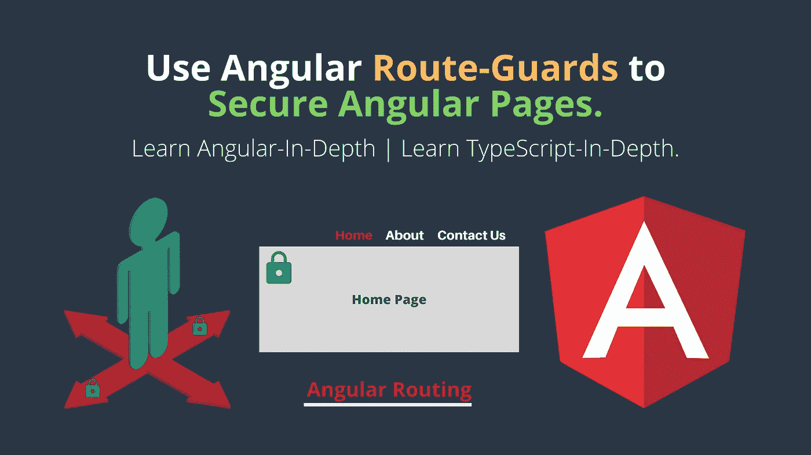
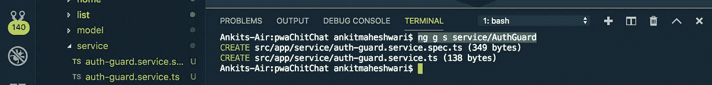

# 使用 Angular Route-guard 保护 Angular 页面-通过允许、拒绝或重定向到其他页面视图。

> 原文：<https://javascript.plainenglish.io/use-angular-route-guards-to-secure-angular-pages-by-allow-deny-or-redirect-to-other-page-view-f2537583e9a?source=collection_archive---------0----------------------->

## **使用 route-guard 保护角页非常简单。**

[](https://medium.com/codechintan/ionic-hide-header-on-scroll-b8828a7a7f86) [## Ionic4 隐藏滚动标题。

### 如何在 Ionic 框架中隐藏内容滚动的标题？

medium.com](https://medium.com/codechintan/ionic-hide-header-on-scroll-b8828a7a7f86) 

路由防护是 Angular 路由器的一个重要功能，它基于某种逻辑，基于用户是否登录，允许或拒绝用户访问路由页面。

*   ROUTE-guard 在有登录/注销场景的 web 应用程序中非常重要。
*   它通常用于检查用户是否登录以及是否有权访问页面。
*   我们可以很容易地管理哪些页面允许登录用户，哪些页面允许未登录用户。

## 实施路线守卫

我们可以通过实现`@angular/router`包中可用的`[CanActivate](https://angular.io/api/router/CanActivate)`接口来添加一个路由守卫，并扩展保存允许或拒绝访问路由的逻辑的`canActivate()`方法。

例如，下列警卫将检查`userLoggedIn`的值，并相应地允许进入一条路线 **:**
( `Don't worry about the code - we'll understand everything in detail.`)

```
class AuthGuardService implements **CanActivate** {
  userLoggedIn = false;**canActivate**() {
    if (this.userLoggedIn) {
     return true;
    } else {
     return false;
    }
  }
}
```

我们现在可以使用`canActivate`属性保护一条路线:

```
const routes: Routes = [
  {
    path: 'user/:id', 
    component: UserDetailComponent,
    **canActivate**:[AuthGuardService] 
  }
];
```

上面的代码是关于“[一个角度组件](https://medium.com/@AnkitMaheshwariIn/routing-of-an-angular-component-angular-routing-2b7e53046542)的走线”。
[点击此处👆](https://medium.com/@AnkitMaheshwariIn/routing-of-an-angular-component-angular-routing-2b7e53046542)了解更多关于角度路由的信息。

我们可以**将**’**Route Guards’应用到** **我们 web 应用程序的认证区域**，或者需要特殊权限才能访问的管理部分。在下面的代码示例中，我们将看到一个非常简单的路由防护实现。

# 创造守卫

我们将首先创建一个服务，但是要创建一个守卫，我们必须实现`canActivate`。让我们创建一个`AuthGuardService`,在您的终端/命令提示符下运行这个命令:

```
ng g s service/AuthGuard
```

这个命令将生成两个类型脚本文件——请看下面👇



# #1 创建 AuthGuardService

接下来，打开`src/app/service/auth-guard.service.ts`文件，更新如下 **:** (我在这段代码中导入并使用了`AuthService`👇👇要了解更多关于`AuthService`的信息，请点击这里👆)

# #2 注册 AuthGuardService

我们现在可以在角度路线定义中注册这个`AuthGuardService`。打开`src/app/app-routing.module.ts`文件，更新如下 **:** 👇👇
(相应地随意更改“路径”和“组件”的值)

> **注意:**安全性在客户端没有意义。相反，我们使用路线警卫(或任何其他机制)都是 UX 的特点，因为我们防止用户进入一个他不被允许进入的区域。但是，最终的安全检查应该总是在服务器端完成。

# 封锁是不够的

仅仅返回`true`或者`false`其实是不够的。我们需要告诉用户发生了什么，为什么他们不允许进入页面。或者通过显示一些通知，或者最常见的是通过**重定向到一些其他页面视图**。

我们可以通过**将路由器注入** `**AuthGuard**`并重定向到其他页面视图来实现。看这个:👇👇

# #3 修改 AuthGuardService

(了解有关“可观察类型”和“管理 Angular 订阅”的更多信息，请点击此处👆)

*   一旦我们将这个保护附加到一个路由上，`canActivate()`方法将在路由被激活之前触发，这意味着在它打开实际的`path`之前或者在它加载实际的`component`之前。

```
const routes: Routes = [
  {
    path: 'user/:id', 
    component: UserDetailComponent,
    **canActivate**:[AuthGuardService] 
  }
];
```

*   该逻辑将首先检查用户是否有效，如果无效，它将导航到登录路径。
*   注意，它还获取当前 URL 并将 is 设置为一个查询参数，因此它类似于`/login?return=%2Fusers%2Fabc123`(URL 被编码)。当我们试图像这样访问用户时就是这种情况:`/users/abc123`和`canActivate`检测到它是未授权用户。

# 结论

#1)创建 AuthGuardService
#2)注册 AuthGuardService
#3)修改 AuthGuardService

> 搞定了。🤩使用 route-guard 保护页面就是这么简单。再见👋👋
> 
> 请在评论框中随意评论…如果我错过了什么，或者什么是不正确的，或者什么对你不起作用:)
> 
> 更多文章敬请关注:
> [https://medium.com/@AnkitMaheshwariIn](https://medium.com/@AnkitMaheshwariIn)

如果你不介意给它一些掌声👏 👏既然有帮助，我会非常感谢:)帮助别人找到这篇文章，所以它可以帮助他们！

永远鼓掌…


*原载于 2019 年 12 月 28 日*[*https://www.codewithchintan.com*](https://www.codewithchintan.com/angular-route-guards/)*。*

# 了解更多信息