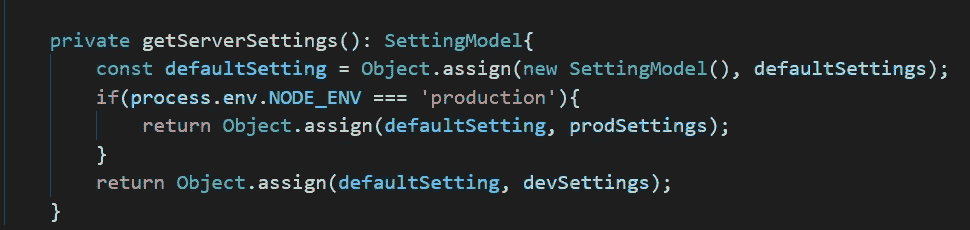

# 在 NestJS 或任何 NodeJs 应用程序中使用 Angular 样式的环境配置

> 原文：<https://javascript.plainenglish.io/use-angular-style-environment-config-file-in-nestjs-app-d29aafda989c?source=collection_archive---------5----------------------->

## 一个简单的、强类型的、延迟加载的解决方案


管理 Web 应用程序的不同环境配置是一项基本任务。NestJS 提供了一个现成的[配置包](https://docs.nestjs.com/techniques/configuration)，基于。环境文件。然而，我个人的偏好是使用 Angular 风格的环境配置文件。

本文将描述一个简单的环境配置解决方案。该解决方案在一个 NestJS 应用程序中进行了说明，但它可以在任何 NodeJs 应用程序中工作。

## 特定于环境的默认配置

配置文件结构如下所示。 *settings.json* 包含带有默认值的基本配置，而`*settings.[environment].json*`存储可以覆盖默认值的特定于环境的配置。

```
└──Project/src/environments/
                   └──settings.json
                   └──settings.prod.json
                   └──settings.dev.json
```

为了便于说明，下面列出了示例设置。

```
// settings.json
{
  "apiUrl": "http://default-url",
  "databaseName": "testDB",
  "logLevel": "info"
}// settings.dev.json
{
  "apiUrl": "http://test-url"
}// settings.prod.json
{
  "apiUrl": "http://production-url",
  "databaseName": "productionDB"
}
```

## 设置模型

一个 *settingModel.ts* 类表示配置模型。

```
export class SettingModel {
  databaseName: string;
  apiUrl: string;
  logLevel: 'info' | 'debug' | 'warning' | 'error';
}
```

## 加载配置

使用 *serverSetting.ts* 加载配置。

```
import * as prodSettings from './environments/settings.prod.json';
import * as devSettings from './environments/settings.dev.json';
import * as defaultSettings from './environments/settings.json';
```

在`getServerSettings` 方法中，我们基于 `**NODE_ENV**` 全局变量加载环境特定的设置。请注意`Object.assign`用于将默认设置与特定环境的设置对象合并。这对于本示例来说已经足够了，但是如果您的设置包含嵌套对象，这可能还不够。



`*serverSetting.ts*` 服务被设计成只加载设置一次。下面列出了完整的代码。

## 使用配置

这些配置可以在应用程序中使用，如下所示。

```
const settings = ServerSetting.getInstance().Settings;
```

当我们在不同的环境中运行应用程序时，结果如下。

```
// When run in development mode
{
  apiUrl: '[http://test-url'](http://test-url'),
  databaseName: 'testDB',
  logLevel: 'info' 
}
// When run in production mode
{
  apiUrl: '[http://production-url'](http://production-url'),
  databaseName: 'productionDB',
  logLevel: 'info' 
}
```

## 摘要

在 Node.js 中，通常使用全局变量 **process.env** ，它包含环境的状态。然而，我不喜欢将特定于应用程序的配置合并到已经很大的全局变量对象中。

该解决方案是创建单一服务来管理应用程序配置的替代方案。强类型模型类中表示的设置是延迟加载的。因为所有配置都存储在 JSON 文件中，所以很容易通过 CI/CD 转换/覆盖敏感的生产设置，并且生产设置文件只能包含占位符。

如果你觉得这篇文章有用，你也可以看看下面这篇文章。

[](/angular-state-management-with-observable-service-pattern-27b18538f4c3) [## 具有可观察服务模式的角度状态管理

### Angular 状态管理是任何 Angular 应用程序的核心，但没有放之四海而皆准的解决方案。

javascript.plainenglish.io](/angular-state-management-with-observable-service-pattern-27b18538f4c3) 

编程快乐！

*如果您还不是 Medium、* [***的付费会员，您可以通过访问此链接***](https://sunnysun-5694.medium.com/membership) *进行注册。你可以无限制地阅读媒体上的所有报道。我会收你一部分会员费作为介绍费。*