# 像高级前端开发者一样使用 Chrome DevTools

> 原文：<https://javascript.plainenglish.io/use-chrome-devtools-like-a-senior-frontend-developer-99a4740674?source=collection_archive---------0----------------------->

## 如果你选择 Chrome 作为你的开发环境，你必须知道的 11 个技巧。


Photo by [Morning Brew](https://unsplash.com/@morningbrew?utm_source=medium&utm_medium=referral) on [Unsplash](https://unsplash.com?utm_source=medium&utm_medium=referral)

好吧，现在出于某种原因，你终于选择了 Chrome 作为你开发的浏览器。然后你打开开发者工具，开始调试你的代码。


您有时会打开控制台面板来检查程序的输出，或者打开“元素”面板来检查 CSS 代码中的 DOM 元素。


但是你真的了解 Chrome DevTools 吗？其实它提供了很多强大但未知的功能，可以大大提高我们开发的效率。

这里我就介绍一下最有用的功能，希望能帮到你。

在我们开始之前，我想介绍一下命令菜单。命令菜单对于 Chrome 来说就像内核对于 Linux 一样重要。命令菜单允许你输入一些命令来操作 Chrome。

首先，我们打开 Chrome Developer Tools，然后使用以下快捷方式打开命令菜单:

*   windows:Ctrl + Shift + P
*   macOS:Cmd + Shift + P

或者我们可以点击下面的按钮打开它:

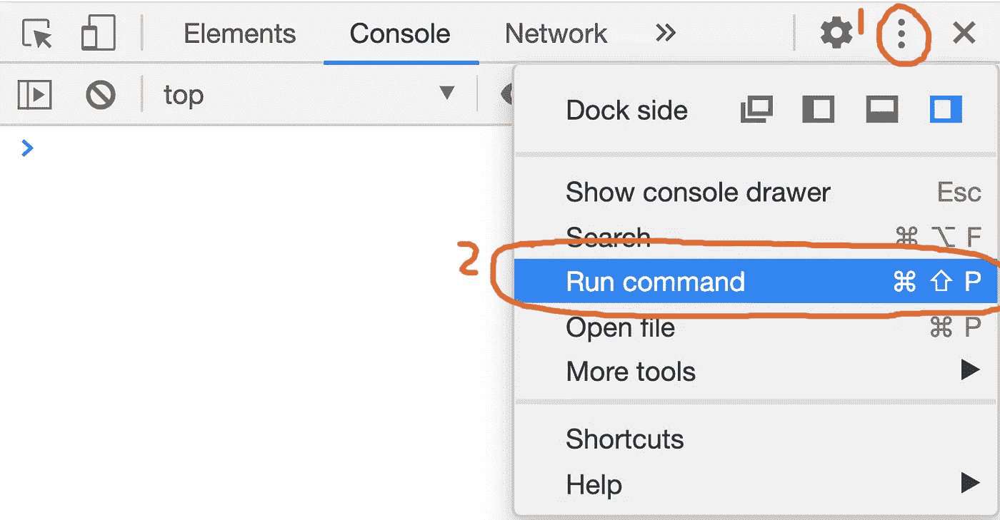

然后，我们可以转到命令面板，在那里我们有各种命令可供选择，以执行各种强大的功能。

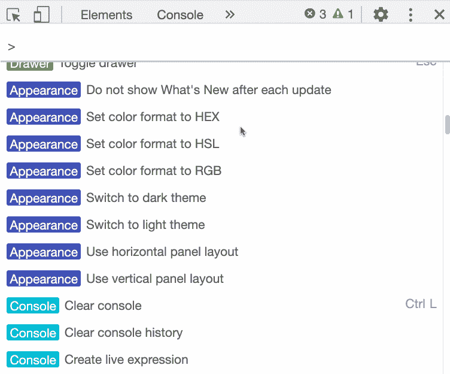

# 强大的截图

捕捉屏幕的一部分是一个非常常见的需求，我相信你现在的电脑上已经有非常方便的截图软件了。但是，你能完成以下任务吗？

*   对网页上的所有内容进行截图，包括没有出现在可视窗口中的任何内容
*   准确捕获 DOM 元素的内容

这是两个常见的需求，但是使用操作系统自带的截图工具很难解决。此时，我们可以使用命令来帮助我们完成这个需求。

相应的命令有:

*   截图捕捉全尺寸截图
*   截图捕获节点截图

## 例子

现在打开任何网页，例如，媒体上 JavaScript 的头条新闻页面。https://medium.com/tag/javascript

并打开命令菜单，执行`Screenshot Capture full size screenshot`

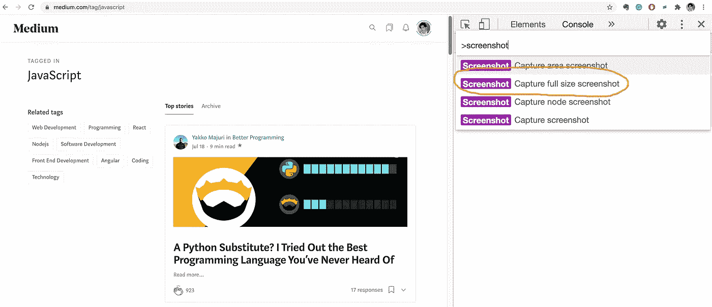

然后我们就可以得到当前页面的完整截图了。


*上面的原图非常清晰，但为了节省流量，我在这里上传了一张压缩图。*

同样的，如果你想对一个 DOM 元素进行截图，可以使用系统自带的截图工具，但是不能精确的抓取元素。此时，可以使用`Capture node screenshot`。

首先，我们在元素面板中选择一个元素，然后运行命令。

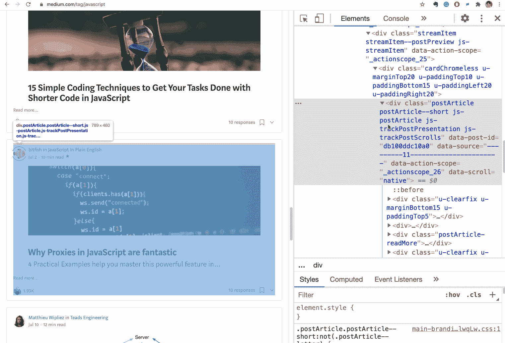

这是精确截图的结果:

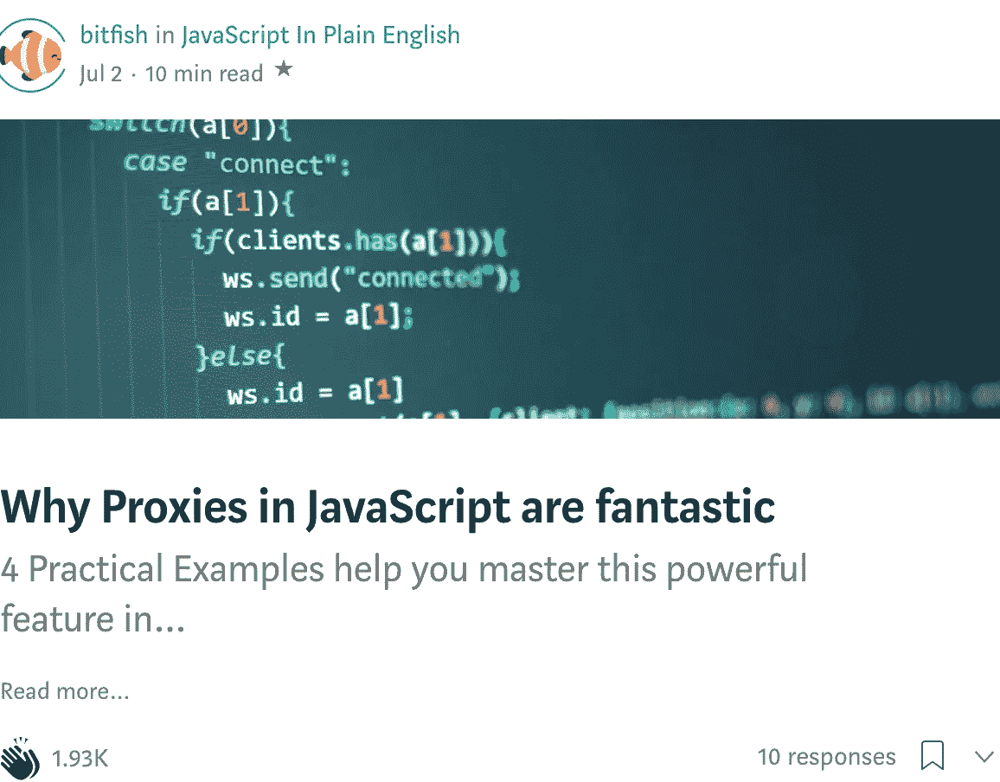

# 参考控制台中最后一次操作的结果

我们经常需要在控制台中调试代码。假设您想知道如何在 JavaScript 中反转一个字符串，然后您在 web 上搜索相关信息，找到了下面的代码行。

```
'abcde'.split('').reverse().join('')
```

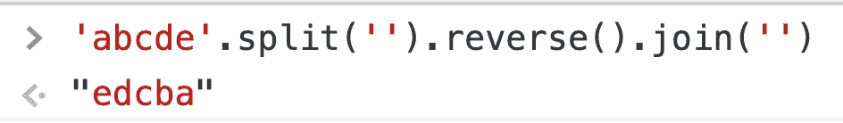

嗯，上面的代码确实把字符串反转了。但是你还是不明白 split() reverse() join()方法是做什么的，以及运行这些中间步骤的结果。所以现在你想一步一步地执行上面的代码，你可以这样写:

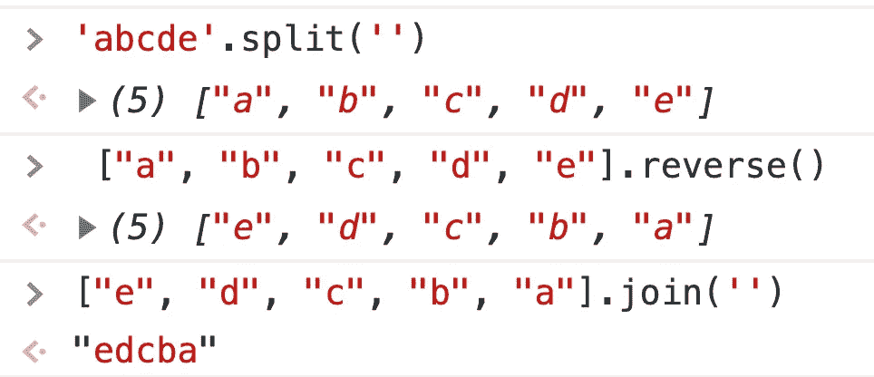

在这些步骤之后，我们知道了每个方法运行的返回值。

但这是非常多余的。它既容易出错，又难以理解。实际上，在控制台中，我们可以使用神奇变量`$_`来引用前面操作的结果。

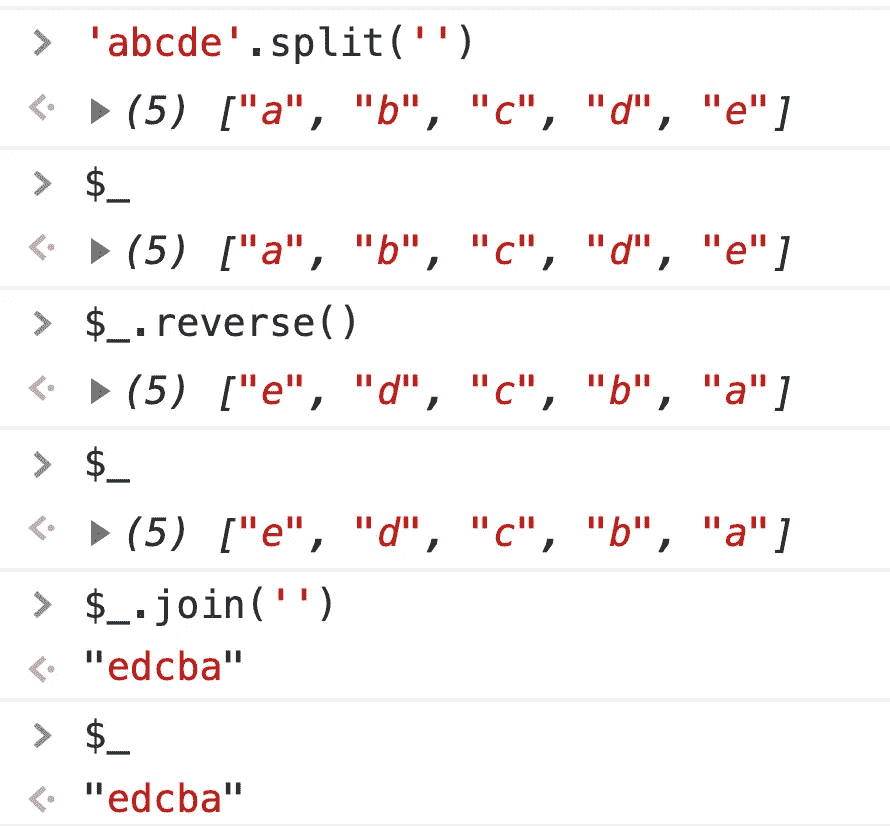

`$_`是一个特殊变量，其值始终等于控制台中最后一次操作的结果。这种技术是调试代码的一种简便方法。

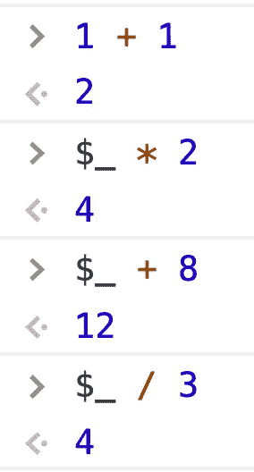

# 重新发送 XHR 请求

在我们的前端项目中，我们经常需要使用 XHR 向后端发出请求以获取数据。如果你想重新发送一个 XHR 请求，你会怎么做？

对于新手来说，他可能会刷新页面，但这可能很麻烦。其实我们可以直接在网络面板里调试。

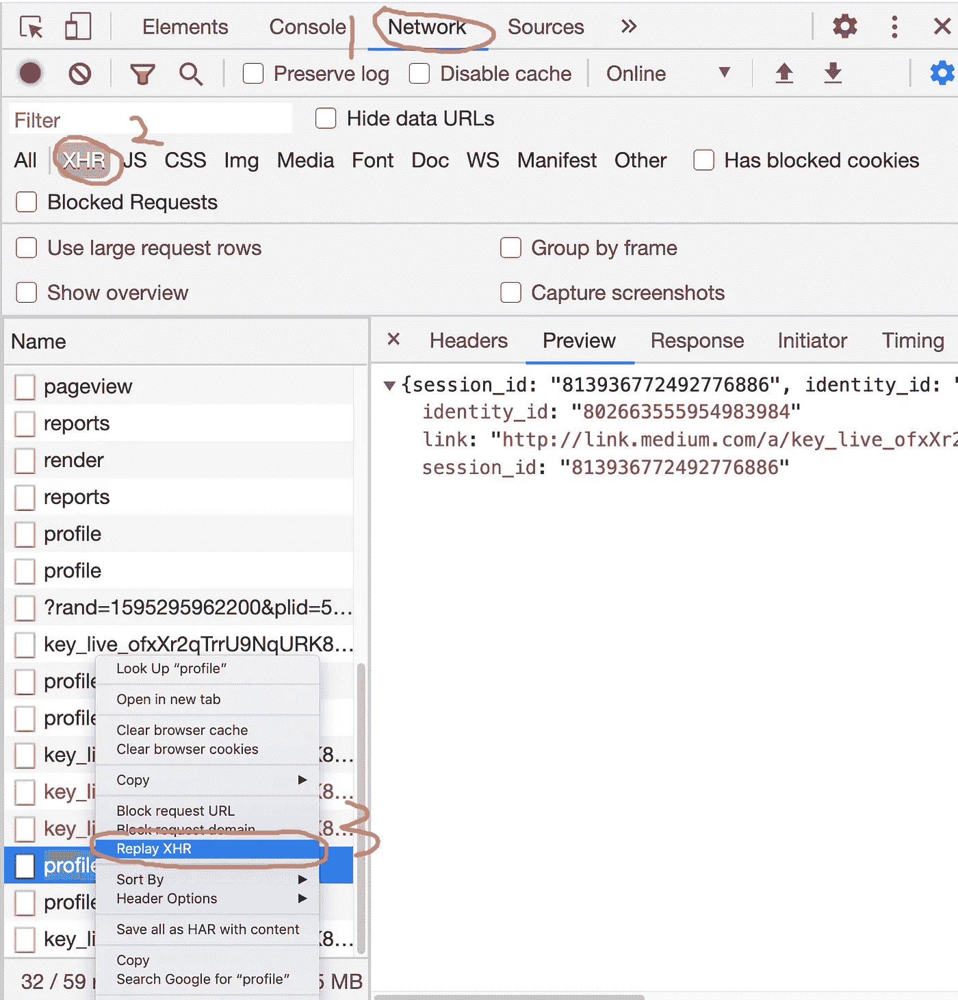

*   打开网络面板
*   点击 XHR 按钮
*   选择您要重新发送的 XHR 请求
*   重播 XHR

下面是一个 gif 示例:

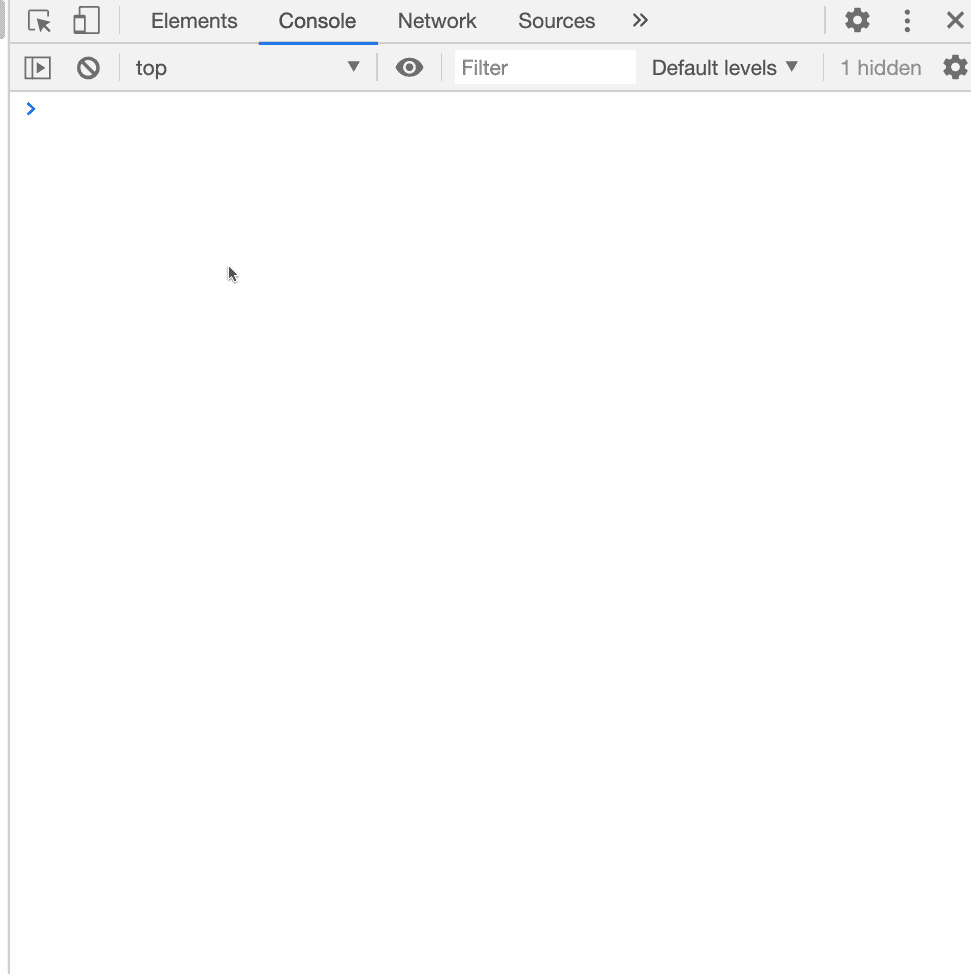

# 监控页面加载状态

从开始到页面完全加载可能需要十几秒钟的时间。这是我们需要监控页面在不同时间的加载情况的地方。

在 Chrome DevTools 中，我们可以使用网络面板下的`Capture Screenshots`来抓取页面加载的截图。

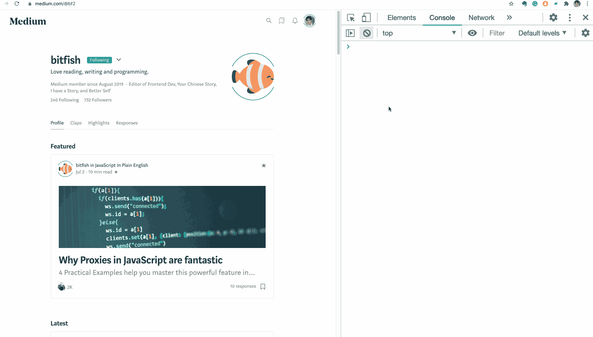

点击每个截图，显示相应时间的网络请求。这种可视化演示将让您更好地了解每时每刻都有哪些网络请求。

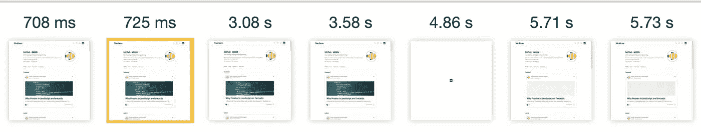

# 复制变量

可以将 JavaScript 变量的值复制到其他地方吗？

这似乎是一项不可能完成的任务，但在 Chrome 中，有一个名为`copy`的功能可以帮助你复制变量。

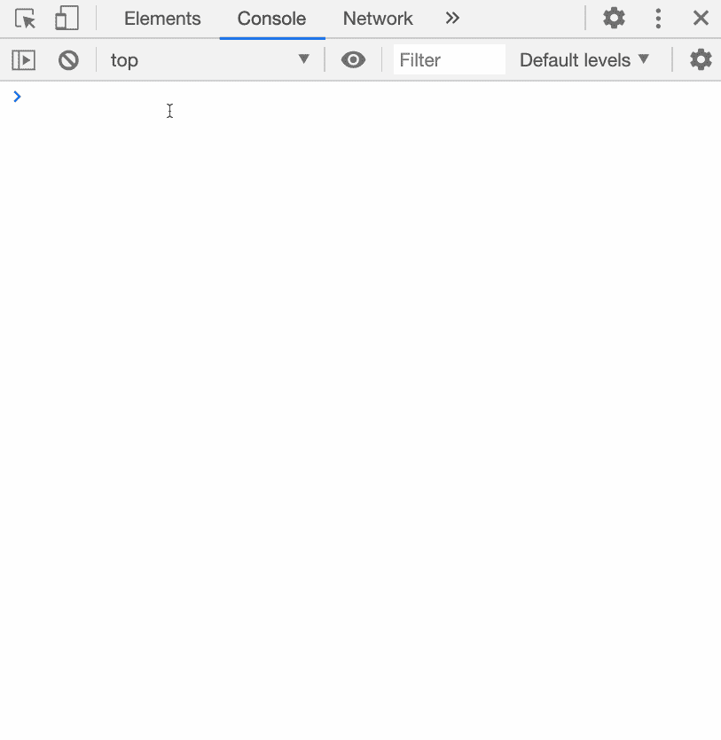

`copy`功能不是由 ECMAScript 定义的，而是由 Chrome 提供的。使用这个函数，您可以将 JavaScript 变量的值复制到剪贴板。

# 将图像复制为数据 URI

有两种方法可以处理我们页面上的图像，一种是通过外部资源链接加载，另一种是将图像编码成[数据 URL](https://developer.mozilla.org/en-US/docs/Web/HTTP/Basics_of_HTTP/Data_URIs)。

> **数据 URL**，以`data:`方案为前缀的 URL，允许内容创建者在文档中内嵌小文件。他们以前被称为“数据 URIs”，直到该名称被 WHATWG 停用。

将这些小图像编码到数据 URL 中并直接嵌入到代码中，可以减少页面需要发出的 HTTP 请求的数量，从而加快页面加载速度。

那么在 Chrome 中，我们如何把一张图片变成一个数据 URL 呢？

下面是一张 gif:


# 表对象数组

假设我们有一个这样的对象数组:

```
let users = [{name: 'Jon', age: 22},
  {name: 'bitfish', age: 30},
  {name: 'Alice', age: 33}]
```

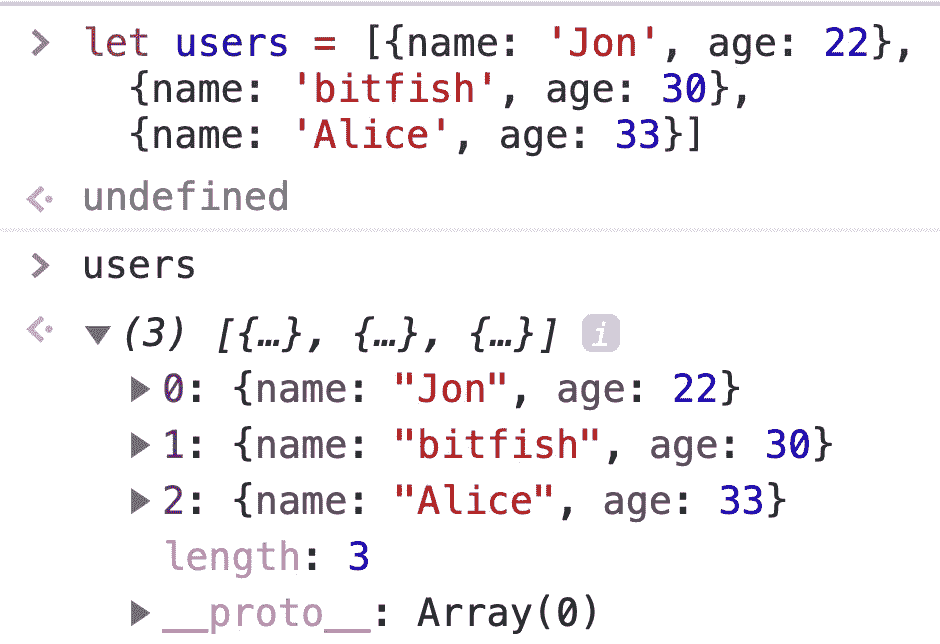

这样的阵列不容易在控制台中查看。如果数组更长，元素更复杂，那么就更难理解了。

幸运的是，Chrome 提供了一个表格功能，可以将一组对象列表。

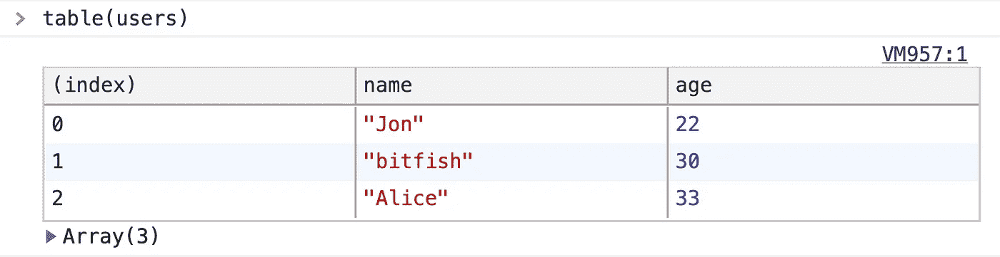

在很多情况下，这个函数非常有用。

# 在“元素”面板中拖放

有时我们想调整页面上某些 DOM 元素的位置来测试 UI。在“元素”面板中，您可以拖放任何 HTML 元素，并更改其在页面中的位置:

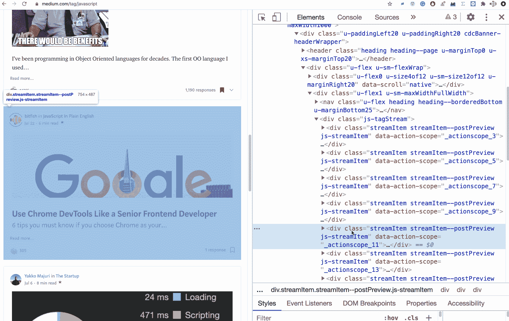

在上面的 git 中，我在元素面板中拖动了一个 div 的位置，它在网页上的位置也同步改变了。

# 引用控制台中当前选定的元素

`$0`是另一个神奇的变量，它引用了元素面板中当前选中的元素。

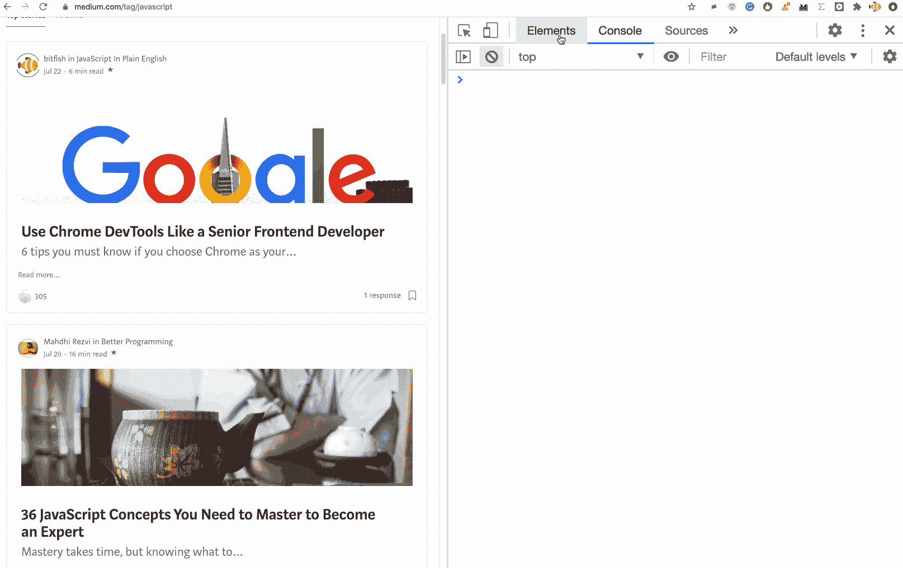

# 触发 CSS **伪类**

> 伪类让您不仅可以根据文档树的内容，还可以根据外部因素，如导航器的历史(例如`[:visited](https://developer.mozilla.org/en-US/docs/Web/CSS/:visited)`)、内容的状态(如某些表单元素上的`[:checked](https://developer.mozilla.org/en-US/docs/Web/CSS/:checked)`)或鼠标的位置(如`[:hover](https://developer.mozilla.org/en-US/docs/Web/CSS/:hover)`，让您知道鼠标是否在元素上)对元素应用样式。

我们可以为一个元素编写多个伪类，为了便于测试这些样式，我们可以直接在 Elements 面板中触发这些样式。

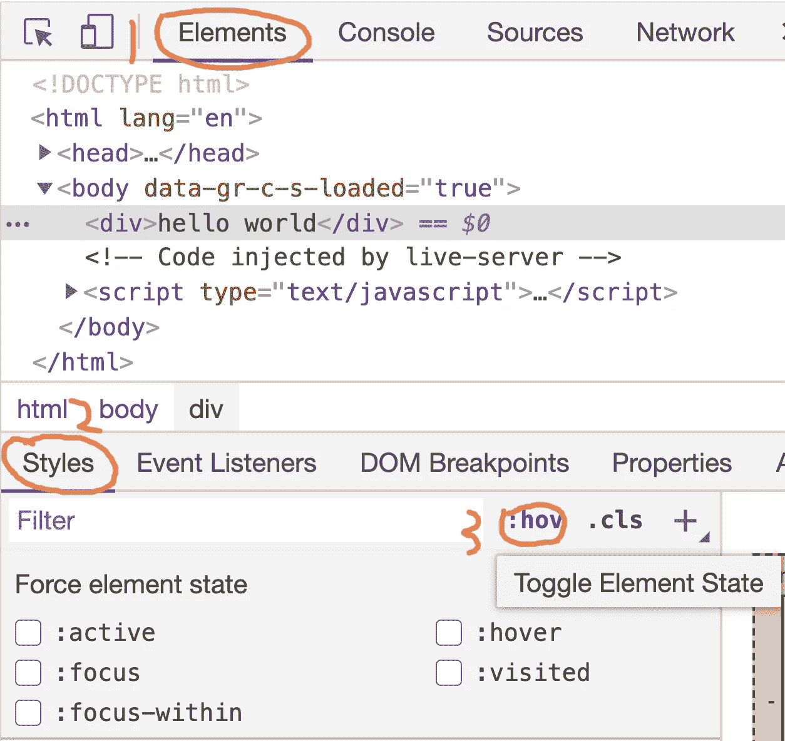

## 例子

这是一个网页:

然后我们在浏览器中打开它，并通过 Elements 面板调试它的伪类样式。

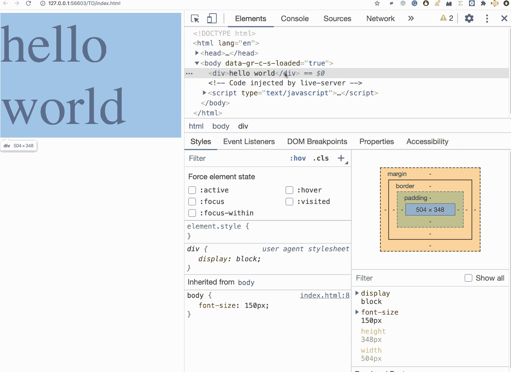

# 隐藏元素的快捷方式

在调试 CSS 样式时，我们经常需要隐藏一个元素。如果我们选择元素并按下键盘上的`H`，我们可以快速隐藏该元素。

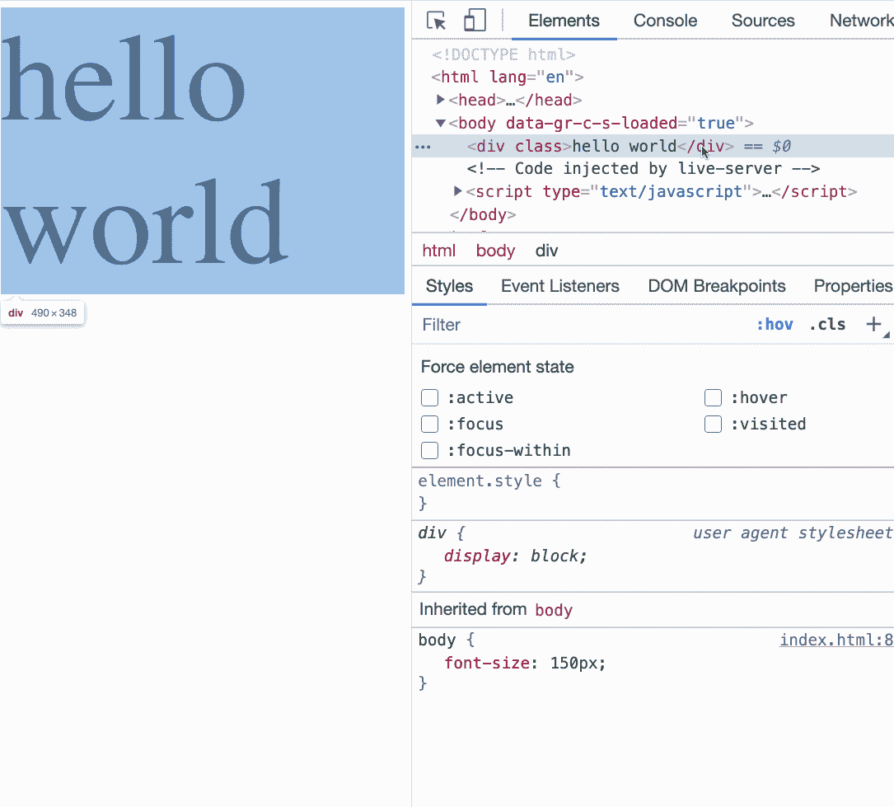

Press H on the keyboard

这个操作是给对应的元素添加一个`visibility: hidden !important;`样式。

# 在全局临时变量中存储一个 DOM 元素

如果我们想在控制台中快速获取 DOM 元素引用，我们可以这样做:

*   选择元素
*   右键单击鼠标
*   存储为全局变量

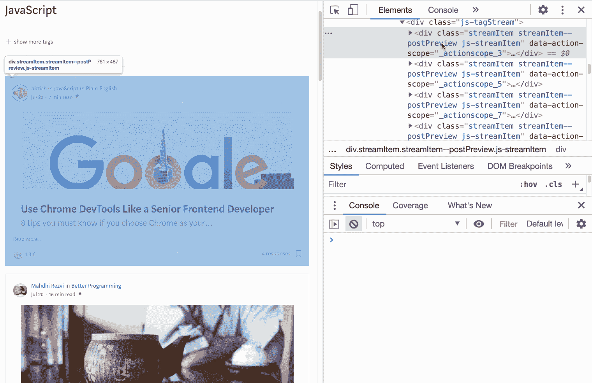

# 相关文章

[](https://levelup.gitconnected.com/use-vscode-like-a-senior-developer-9b54054c452a) [## 像高级开发人员一样使用 VSCode

### 如果选择 VSCode 作为代码编辑器，您应该知道的 4 个技巧。

levelup.gitconnected.com](https://levelup.gitconnected.com/use-vscode-like-a-senior-developer-9b54054c452a)