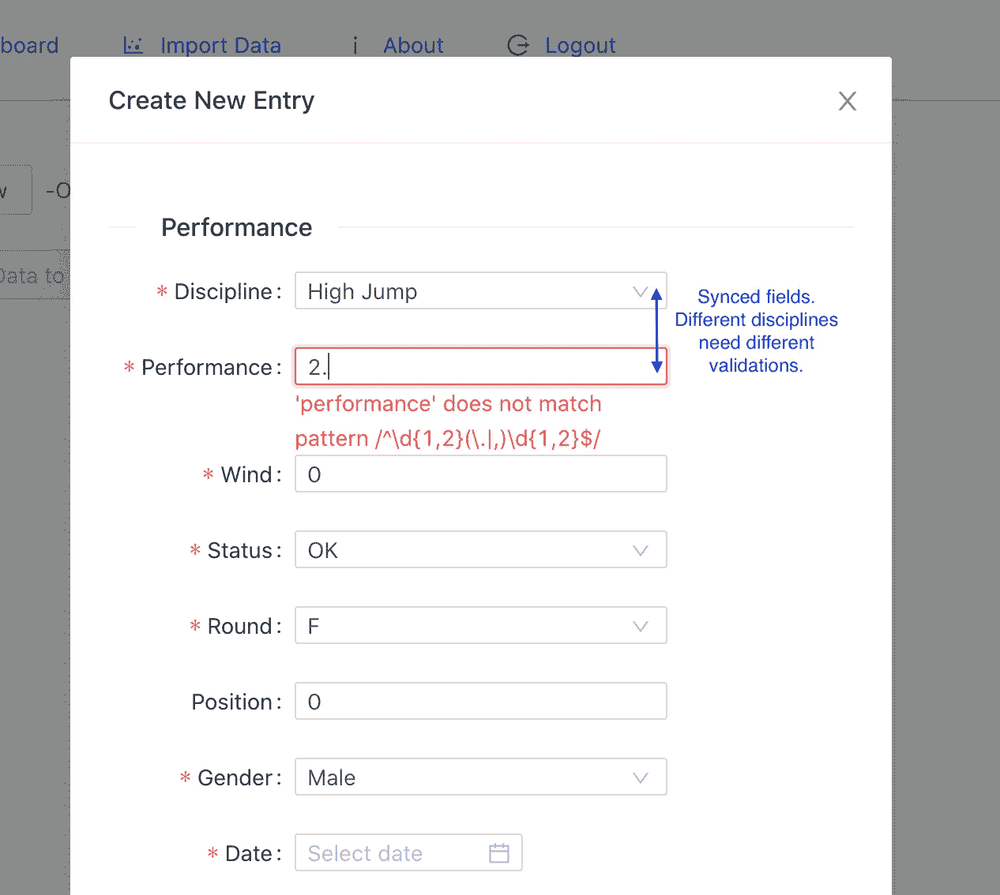
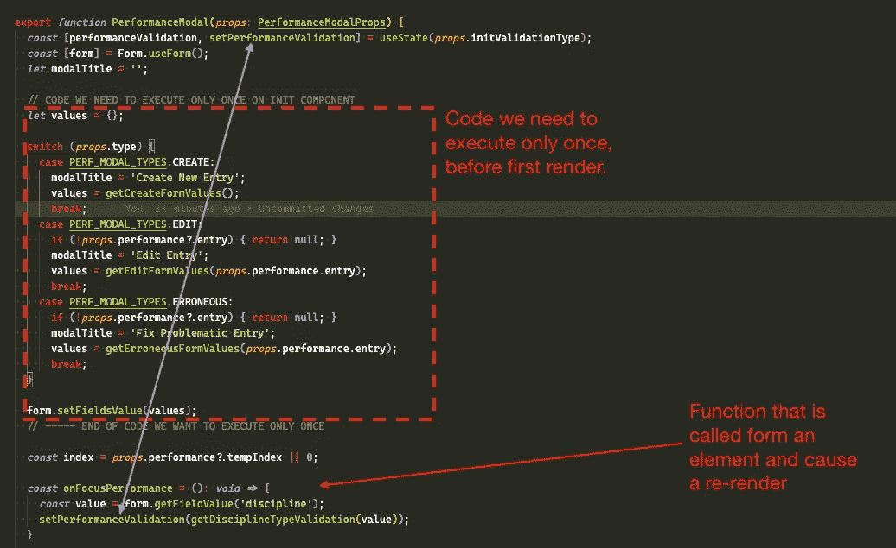
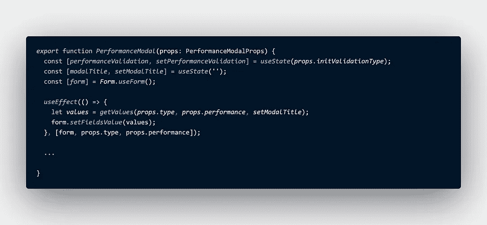
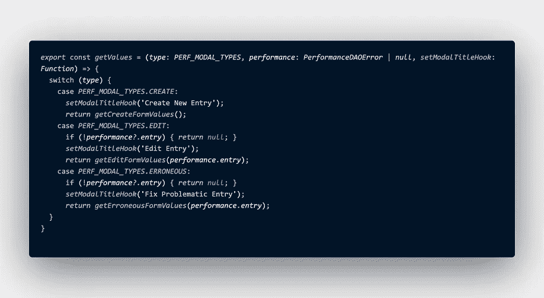

# 如何在带有自定义钩子的反应功能组件中模拟“构造函数”

> 原文：<https://javascript.plainenglish.io/use-constructor-in-react-functional-component-with-custom-hooks-e0770e92b840?source=collection_archive---------2----------------------->

“反应”中的功能组件缺少构造函数的概念

## 但是什么是构造函数呢？

*在* [*类基础上的*](https://en.wikipedia.org/wiki/Class-based_programming) [*面向对象编程的*](https://en.wikipedia.org/wiki/Object-oriented_programming) *中，有一个* ***构造函数*** *(简称:* ***函数*** *)是一种特殊类型的* [*子程序**称为*](https://en.wikipedia.org/wiki/Subroutine) [它为使用准备新的对象，经常接受构造者用来设置所需的](https://en.wikipedia.org/wiki/Object_creation) [*成员变量*](https://en.wikipedia.org/wiki/Member_variable) *的*参数* *。~* [*维基链接*](https://en.wikipedia.org/wiki/Constructor_(object-oriented_programming))*

因此，简单地说，使用构造函数，我们初始化了组件的状态，有人可能会说[“函数组件不需要构造函数。您可以在](https://reactjs.org/docs/hooks-faq.html#how-do-lifecycle-methods-correspond-to-hooks) [useState](https://reactjs.org/docs/hooks-reference.html#usestate) 调用中初始化状态。

这里的问题是函数组件是…函数。只要你打电话给他们，他们就会跑。就这样。这意味着我们没有生命周期，这也意味着我们没有地方可以用在组件第一次呈现之前只运行一次的代码来初始化我们的组件。

## 这个问题的真实例子。

在下面的例子中，我们有一个带有内部形式的模态。 ***性能字段有一个确认*** ，即与规程同步的 ***。由于这个表单是用于编辑和创建的，我们需要知道用什么验证来初始化这个表单。为了实现这一点，我们通过 props 将验证从父组件传递到组件，并用钩子处理验证***



我们还希望仅在组件初始化时设置字段值**。**



我们的问题是，每次我们调用 ***onFocusPerformance()，*** 时，由于***setPerformanceValidation()，*** *导致重新运行红框内的代码块并再次重置表单中的值，所以状态会发生变化。*

# 解决方案

我们可以以编程方式创建一个函数，该函数将在组件每次运行时被调用，但将基于一个标志执行其内部代码。
*这实际上是如何实现单例的。我们想要些东西。如果存在，带来现有的，如果没有创建一个新的*。大概是这样的:

```
const OurFunctionalComponent = () => {
 const [constructorHasRun, setConstructorHasRun] = useState(false); ***const constructor = () => {
   if (constructorHasRun) return;
   // Some code...
   setConstructorHasRun(true);
 };*** constructor(); // called on each re-render
 ...
} 
```

我们现在还可以，但是实现并不是越干净越好。我们需要在我们需要的每个组件上编码这个逻辑。我们可以通过使用自定义钩子来避免它。

通过将我们的逻辑移入一个自定义钩子，我们可以拥有一个更干净的“构造器”。


*注意:要获得构造函数的行为——请记住——我们需要在函数* ***之上调用它* ***,以便在所有函数*** *之前运行它。***

更新 1:有一些评论指出使用 **useEffects** 而不是这种方法。

**useEffect** 钩子不满足*构造函数的所有*条件。

*use effect 运行一次，且在该组件的整个生命周期内只运行一次。我们对此没意见。我们得到了我们要求的一部分。*

*问题是*它在组件渲染后运行。当然，这也是我们所期待的，因为这在 Hooks 文档中有明确的说明:“[默认情况下，效果会在每次渲染完成后运行。](https://reactjs.org/docs/hooks-reference.html#useeffect)

更新 2:正如本帖*中的一个评论所提到的，“你正在进入一个可能导致内存泄漏的领域，或者在 React 的未来版本中代码变得脆弱。”。即使这篇文章的目的不是提出 useEffect()(😅显然)，我*做了一些实验，我设法改变了实现。现在我用 useEffect()代替了我的自定义 useConstructor 钩子**。**



我最初的场景很复杂，我不得不重构更多的代码，以便在我的组件上实现预期的行为。所以，我没有改动这篇文章的其余部分，我添加了上面更改过的代码，以便于每个人进行比较。