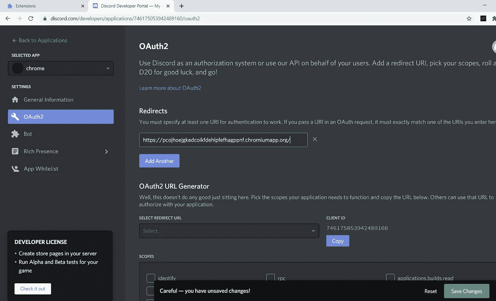
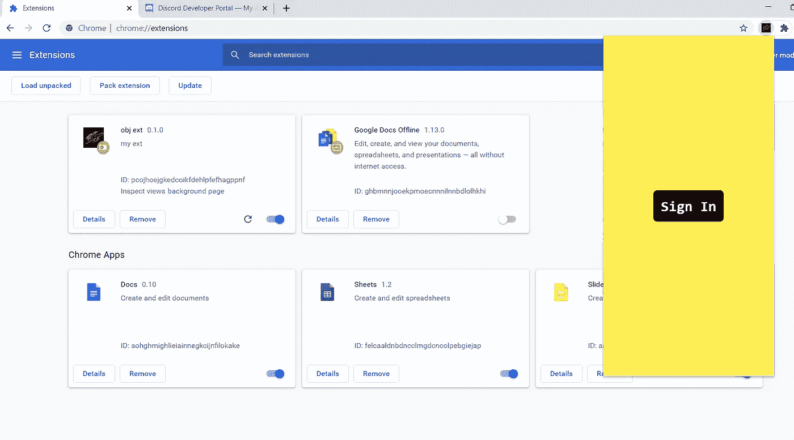
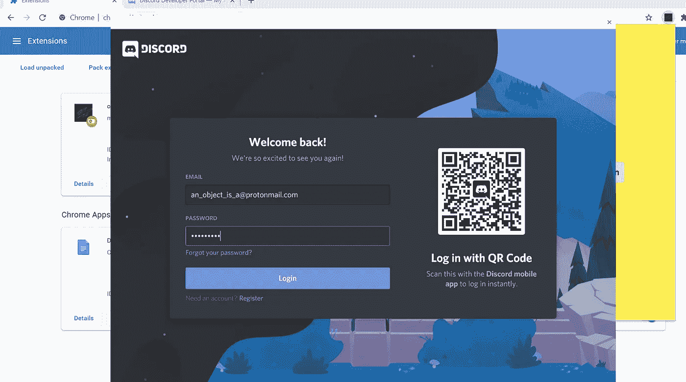
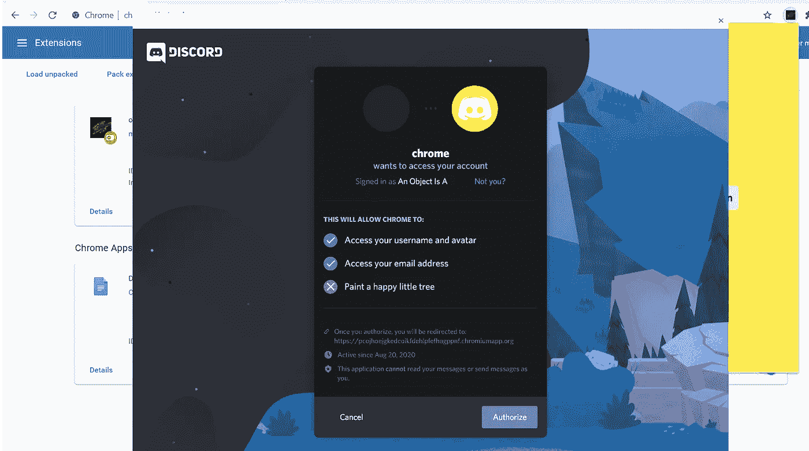
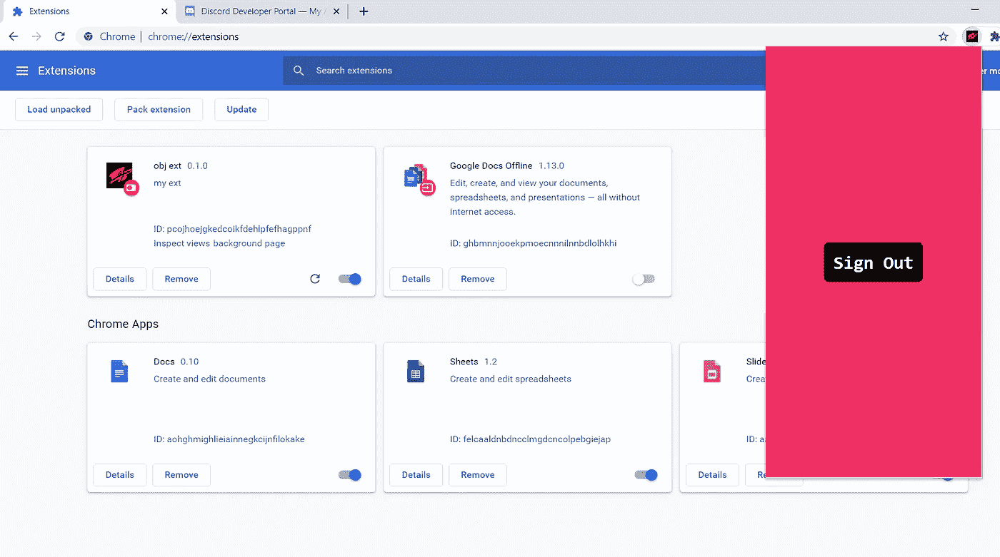

# 使用 Discord 登录到您的 Chrome 扩展

> 原文：<https://javascript.plainenglish.io/use-discord-to-login-to-your-chrome-extension-6c50039e3534?source=collection_archive---------3----------------------->

允许你的用户使用他们的不和谐凭证登录到你的 Chrome 扩展

本教程使用了一个简单的谷歌 Chrome 扩展设置。如果你想知道如何进行设置，请点击这里查看我的文章:

[](https://medium.com/@an_object_is_a/how-does-a-chrome-extension-work-web-development-6e85bd2bccc1) [## Chrome 扩展是如何工作的？(网络开发)

### Chrome 扩展有 5 个部分:

medium.com](https://medium.com/@an_object_is_a/how-does-a-chrome-extension-work-web-development-6e85bd2bccc1) 

# 我们开始吧

在我们接触一行代码之前，我们需要设置我们的开发工作区，以便我们能够使用 **Discord 的 OAuth2 端点**。

导航至 https://discord.com/developers/applications/的“[**”**“](https://discord.com/developers/applications/')”并登录。
点击右上角的**新应用**。
随便你怎么命名。
保持此窗口打开，稍后我们将需要“**客户端 ID** ”。

导航到" **chrome://extensions** "并确保你的 chrome 扩展已经加载。

复制您的扩展的' **ID** '并返回到 **Discord 开发者门户**。

点击左边工具条上的“ **OAuth2** ”链接。

点击'**添加重定向**'并添加网址，“**https://<chrome ext id>. chrome app . org/**”其中' **< chrome ext id >** '是你之前复制的扩展 id。

制作人务必点击“**保存更改**”。



## 在开始实际的 Chrome 扩展工作之前，让我们先做一些网络开发工作

我们将创建两个页面:一个“登录”页面和一个“注销”页面。没什么特别的。

```
/* popup-sign-in.html */
<!DOCTYPE html>
<html lang="en"><head>
    <meta charset="UTF-8">
    <meta name="viewport" content="width=device-width, initial-scale=1.0">
    <title>Document</title>
    <style>
        body {
            width: 300px;
            height: 600px;
            margin: 0;
            padding: 0;
            overflow: hidden;
        } div {
            align-items: center;
            display: flex;
            width: 100%;
            height: 100%;
            justify-content: center;
            text-align: center;
            margin: auto;
            box-sizing: border-box;
            background-color: #fcee54;
        } button {
            font-size: 200%;
            background-color: #f5c2e0;
            border-radius: 5px;
            border: none;
            text-align: center;
            color: black;
            font-family: monospace;
            font-weight: bold;
            transition-duration: 0.3s;
            padding: 10px;
        }
    </style>
</head><body>
    <div>
        <button type="submit">Sign In</button>
    </div>
    <script src="./popup-sign-in-script.js"></script>
</body></html>/* popup-sign-out.html */
<!DOCTYPE html>
<html lang="en"><head>
    <meta charset="UTF-8">
    <meta name="viewport" content="width=device-width, initial-scale=1.0">
    <title>Document</title>
    <style>
        body {
            width: 300px;
            height: 600px;
            margin: 0;
            padding: 0;
            overflow: hidden;
        } div {
            align-items: center;
            display: flex;
            width: 100%;
            height: 100%;
            justify-content: center;
            text-align: center;
            background-color: #00ffa7;
            transition-duration: 0.5s;
        } button {
            font-size: 200%;
            background-color: #f5c2e0;
            border-radius: 5px;
            border: none;
            text-align: center;
            color: black;
            font-family: monospace;
            font-weight: bold;
            transition-duration: 0.3s;
            padding: 10px;
        }
    </style>
</head><body>
    <div>
        <button type="submit">Sign Out</button>
    </div>
    <script src="./popup-sign-out-script.js"></script>
</body></html>
```

**注意:**
确保包含“body”CSS 属性。
其他你并不真正需要的 CSS。只是用来让页面好看而已。

请注意，我们在每个 HTML 页面上都附加了脚本…

```
/* popup-sign-in-script.js */
const button = document.querySelector('button');button.addEventListener('mouseover', () => {
    button.style.backgroundColor = 'black';
    button.style.color = 'white';
    button.style.transform = 'scale(1.3)';
});button.addEventListener('mouseleave', () => {
    button.style.backgroundColor = '#f5c2e0';
    button.style.color = 'black';
    button.style.transform = 'scale(1)';
});button.addEventListener('click', () => {});/* popup-sign-out-script.js */
const button = document.querySelector('button');button.addEventListener('mouseover', () => {
    button.style.backgroundColor = 'black';
    button.style.color = 'white';
    button.style.transform = 'scale(1.3)';document.querySelector('div').style.backgroundColor = '#ee2f64';
});button.addEventListener('mouseleave', () => {
    button.style.backgroundColor = '#f5c2e0';
    button.style.color = 'black';
    button.style.transform = 'scale(1)';document.querySelector('div').style.backgroundColor = '#fcee54';
});button.addEventListener('click', () => {

});
```

**注:**
这段代码很多完全没有必要。它只是用来使页面看起来漂亮和生动。脚本中唯一重要的代码是按钮的“点击”监听器。

## 现在我们已经讨论了 Web 开发部分，让我们看看我们的“manifest.json”。

```
{
    "name": "obj ext",
    "description": "my ext",
    "version": "0.1.0",
    "manifest_version": 2,
    "icons": {
        "16": "./obj-16x16.png",
        "32": "./obj-32x32.png",
        "48": "./obj-48x48.png",
        "128": "./obj-128x128.png"
    },
    "background": {
        "scripts": ["./background.js"]
    },
    "options_page": "./options.html",
    "browser_action": {
        "default_popup": "./popup-sign-in.html"
    },
    "permissions": [
        "identity"
    ] 
}
```

**注:** 1。****browser _ action**的 **default_popup** 属性设置为页面中的
**标志。
2。为了使用 Chrome 的' **launchWebAuthFlow()** '方法，我们需要' **identity** '权限。****

## **让我们做一些实际的 Chrome 扩展编程。**

**我们将从编写应用程序的基本框架逻辑流开始。**

**在' **popup-sign-in-script.js** 中，当用户点击按钮时，我们会向'**后台**脚本发送消息，要求“**登录**”。
如果我们从“**背景**”中获得一个“**成功**”，我们将把页面更改为“**注销**”页面。**

```
// popup-sign-in-script.jsconst button = document.querySelector('button');button.addEventListener('mouseover', () => {
    button.style.backgroundColor = 'black';
    button.style.color = 'white';
    button.style.transform = 'scale(1.3)';
});button.addEventListener('mouseleave', () => {
    button.style.backgroundColor = '#f5c2e0';
    button.style.color = 'black';
    button.style.transform = 'scale(1)';
});button.addEventListener('click', () => {
    chrome.runtime.sendMessage({ message: 'login' }, function (response) {
        if (response === 'success') window.location.replace("./popup-sign-out.html");
    });
});
```

**' **popup.js** '就是这样。您可以关闭文件。
‘**popup-sign-out-script . js**’几乎一模一样。**

**在'**popup-sign-out-script . js**'中，当用户点击按钮时，我们会向'**后台**脚本发送消息，要求“**注销**”。
如果我们从“**背景**中得到一个“**成功**”，我们将把该页面更改为页面中的
**标志。****

```
// popup-sign-out-script.jsconst button = document.querySelector('button');button.addEventListener('mouseover', () => {
    button.style.backgroundColor = 'black';
    button.style.color = 'white';
    button.style.transform = 'scale(1.3)';document.querySelector('div').style.backgroundColor = '#ee2f64';
});button.addEventListener('mouseleave', () => {
    button.style.backgroundColor = '#f5c2e0';
    button.style.color = 'black';
    button.style.transform = 'scale(1)';document.querySelector('div').style.backgroundColor = '#fcee54';
});button.addEventListener('click', () => {
    chrome.runtime.sendMessage({ message: 'logout' }, function (response) {
        if (response === 'success') window.location.replace("./popup-sign-in.html");
    });
});
```

**这个文件完成了。你可以关闭它。**

**转到' **background.js** '脚本，我们将创建
**Discord oauth 2****Endpoint**，这将用于第三方登录凭证。**

**我们需要 **6 个常量**和 **1 个变量**。
当我们这样做时，一个变量跟踪用户的登录状态
，我们将创建一个函数将所有这些信息汇集在一起。**

```
// background.jsconst DISCORD_URI_ENDPOINT = '[https://discord.com/api/oauth2/authorize'](https://discord.com/api/oauth2/authorize');
const CLIENT_ID = encodeURIComponent('');
const RESPONSE_TYPE = encodeURIComponent('token');
const REDIRECT_URI = encodeURIComponent('['](https://pcojhoejgkedcoikfdehlpfefhagppnf.chromiumapp.org/'));
const SCOPE = encodeURIComponent('identify email');
const STATE = encodeURIComponent('meet' + Math.random().toString(36).substring(2, 15));let user_signed_in = false;function create_auth_endpoint() {
    let nonce = 
        encodeURIComponent(Math.random().toString(36).substring(2,  
        15) + Math.random().toString(36).substring(2, 15)); let endpoint_url =
        `${DISCORD_URI_ENDPOINT}
?client_id=${CLIENT_ID}
&redirect_uri=${REDIRECT_URI}
&response_type=${RESPONSE_TYPE}
&scope=${SCOPE}
&nonce=${nonce}`; return endpoint_url;
}
```

****注:**
1。DISCORD _ URI _ 端点—我们如何到达 DISCORD 的 OAuth2 端点
2。CLIENT_ID —告诉 Discord 我们被允许使用他们的 OAuth2 端点
3。RESPONSE_TYPE —向 Discord 询问特定类别的信息
4。REDIRECT_URI —在给我们令牌
5 后将用户重定向到哪里。SCOPE —向 Discord 询问具体数据
6。陈述—帮助个性化我们的请求**

**我们在函数中创建了最后一个变量， **nonce** 。
' **nonce** '只是一个字符串，每当我们需要使用 Discord OAuth2 端点时，它就会随机生成。
每次都需要不同。这就是为什么它不是一个**常数**的原因。**

# **让我们一起努力。**

**当我们的' **background.js** '脚本得到消息“登录”时，我们将调用'**chrome . identity . launchwebauthflow()**'函数。**

**这需要两个参数。**

****第一个**是一个对象，具有我们构造的 OAuth2 端点和为真的“ **interactive** ”标志(这允许用户看到不一致的凭证提示)。**

****第二个**是一个回调函数，从 **Discord 的**服务器给我们一个“**重定向 uri** ”。我们可以使用提供给我们的“令牌”来访问登录用户的 Discord 数据。**

***在本视频中，我们不会这样做；我们只是使用这个端点来"* ***认证*** *"用户，而不是"* ***授权*** *"用户。***

```
// background.jschrome.runtime.onMessage.addListener((request, sender, sendResponse) => {
    if (request.message === 'login') {
        chrome.identity.launchWebAuthFlow({
            url: create_auth_endpoint(),
            interactive: true
        }, function (redirect_uri) {
            if (chrome.runtime.lastError || 
                redirect_uri.includes('access_denied')) {
                  console.log("Could not authenticate.");
                  sendResponse('fail');
            } else {
                user_signed_in = true;
                sendResponse('success');
            }
        });
        return true;
    } 
```

*****注意:*** *除了检查 chrome.runtime 错误，我们还检查用户是否成功登录。如果没有，一个"****error = access _ denied****"字符串将在'****redirect _ uri****'中找到。***

**“注销”分支非常简单。**

**只需将' **user_signed_in** '标志翻转为 false，并发送“成功”响应。**

```
// background.js...
    } else if (request.message === 'logout') {
        user_signed_in = false;
        sendResponse('success');
    }
```

**我们完了。当用户点击按钮中的**标志时，他们将进入 Discord 的登录系统。****

**如果他们成功登录，他们将看到我们的“**注销**”页面。**

****************

**你可以在 这里找到源文件 [**。**](https://github.com/an-object-is-a/chrome-ext-discord-oauth2)**

**一定要在 [**Instagram**](https://www.instagram.com/an_object_is_a/) 和 [**Twitter**](https://twitter.com/anobjectisa1) 上关注我们，跟上我们最新的 **Web 开发教程**。**