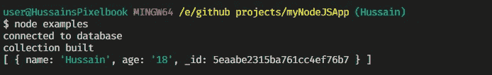

# 使用 MongoDB 和 Node。射流研究…

> 原文：<https://javascript.plainenglish.io/use-mongodb-with-node-js-14781ec11c0a?source=collection_archive---------4----------------------->


Source: [Skitterphoto on Pexels](https://www.pexels.com/photo/ancient-antique-architectural-design-architecture-442420/)

## MongoDB 本地 API 的基础知识

## 在节点中启用数据库功能。Js 应用程序

你已经一次又一次地向你的同事证明了你是一个了不起的程序员，可以出色地完成开发 web 应用程序后端的工作。您熟练地使用 Express 中的[路由器来处理用户导航到的多条路线。有一天，你接到图书馆打来的电话，让你在他们网站的服务器端工作。](https://medium.com/better-programming/express-js-routing-1b48f459d43a)

然而后来，图书管理员在你的作品中扔了一把扳手。她说图书馆在后台需要某种存储系统，这样用户就可以通过数据库在线查看他们书籍的信息。通过进一步的研究，您发现最好的数据库解决方案之一是 **MongoDB**

# 简介:什么是 MongoDB

MongoDB 是一个面向文档的数据库程序。它使用带有模式的类似 JSON 的文档。这些术语将在后面解释。

它有几个优点。其中一些是:

*   它高性能、快速且极具可扩展性。此外，它还内置了复制功能，非常灵活。
*   与 mySQL 或其他关系数据库不同，你不需要预先规划你的数据结构，你不需要创建所有的表和列，也不需要考虑决定你的数据是什么数据类型，即 VARCHAR 还是 STRING。
*   除此之外，MongoDB API 非常容易学习，并且支持包括 JavaScript 在内的多种语言，因此无论何时开发涉及 MongoDB 的应用程序，您都会感觉像在家里一样。

# 要记住的事情

## 基本术语

在我们涉足之前，有一些关键词你应该记住。

*   **文档**:简单的数据记录**。它是数据库中存储数据的基本单位。如果你有关系数据库的背景，你可以把文档想象成一行。文档由字段-值对组成。文档的一个简单示例可以是:**

```
{
name: 'Hussain'
Age : 18
occupation:'Student'
}
```

**每有一个`field`，就会有一个`value`。例如，在这里，`fields`中的一个是`name`，它关联的`value`是`'Hussain'`**

*   ****集合** : **数据库中的一组文档**。一个数据库可以有多个集合。对于关系数据库用户，它们类似于表。**
*   ****查询**:用于指定需要选择哪些单据进行读取、更新、删除操作的条件。**

## **__id 字段**

**对于每个 MongoDB 文档来说,`__id`字段是必需的。这是一个主键。换句话说，它用于唯一地确定数据库中的一个文档，因此它具有唯一的值。即使不指定这个字段，MongoDB 也会自动为您生成一个`__id`。**

**除此之外，**请记住，任何字段名都不应该包含** `**null**` **容器**。**

# **入门指南**

**首先，您需要导航到 [MongoDB 社区](https://www.mongodb.com/download-center/community)下载页面。我们正在安装这个软件来查看和创建文件和集合，没有任何代码。如果你在 Windows 上开发，最好安装一个 MSI 安装程序。下载选项应该如下所示:**

****

**How your download options should look like in the end**

**最后，安装向导将为您完成这项工作。**

**完成后，进入命令行并键入`mongod`，验证安装是否正确完成**

****

**If you see this in your terminal window, your installation was done correctly.**

**现在，我们需要创建一个通过 NPM 安装了`mongodb`模块的项目。**

```
mkdir myMongoDBApp
cd myMongoDBApp
npm init -y **npm install mongodb**
```

**我们现在完成了！让我们继续创建一个数据库。**

# **初始化我们的数据库**

**我们现在需要建立我们的数据库。首先我们需要请求`mongodb`模块，然后初始化`MongoClient`的一个对象:**

```
const Mongo = require('mongodb')
const MongoClient = Mongo.MongoClient; 
const client = new MongoClient("mongodb://localhost:27017", { useUnifiedTopology: true })
```

**在这段代码中，我们已经初始化了一个对象`Mongo.MongoClient`，它将为我们提供对`connect`方法的访问，从而允许我们创建/连接到一个数据库。`MongoClient`构造函数的第一个参数是您想要连接的`URL`。**

**为了连接到数据库，我们使用了`client.connect`方法。为此，请编写以下内容:**

```
client.connect((err)=>{
  if(err) console.log(err)
  console.log('built database')
 ** const db = client.db('HussainsDatabase')**
  client.close()
})
```

**在这段代码中，我们最终连接到了一个名为`HussainsDatabase`的数据库(用粗线表示)。最后，我们调用`client.close`方法来关闭数据库及其连接。**

**输出如下所示:**

****

**The output when we run the code**

# **创建 MongoDB 集合**

**既然我们的数据库已经建立，我们需要创建一个集合来为我们的文档建立一个家。为此，我们将利用`db.createCollection()`方法**

```
const createCollection = (db,callback)=>{
  db.createCollection('HussainsCollection',(err,results)=>{
    if(err) console.log(err)
    console.log('collection built');
    callback();
 })
}
```

**在这段代码中，我们通过一个`Db`实例的帮助创建了一个名为`'HussainsCollection'`的 MongoDB 集合。最后，我们执行一个回调函数。这个回调函数的存在是必要的，因为我们将调用`client.close()`作为回调函数**

**既然已经创建了`createCollection`方法，我们将在上面已经使用过的`client.connect`中调用这个函数。**

**最终，代码将如下所示:**

**如上所述，我们已经调用了`client.close`函数作为回调，以最终关闭所有数据库连接。**

**输出如下所示:**

****

**Output if the code is run**

# **MongoDB 中的 CRUD 操作**

**所有这些操作都可以通过`Collection`类实现。更多详情，点击[此处](http://mongodb.github.io/node-mongodb-native/2.0/api/Collection.html)。**

> **注意:在这些例子中，为了简洁起见，`createCollection`方法、`require`和初始化方法没有在下一个例子中编写，因为它们与上一个例子相同。**

# **插入/创建文档**

**我们已经连接到一个数据库，现在已经建立了一个集合。现在我们需要在集合中插入文档。**

**插入文档有多种方法。**

## **db.collection.insertOne**

**顾名思义，我们一次只插入一个文档。一个例子是:**

**这里，我们添加一个带有`name`和`age`字段的文档。`name`将为`Hussain`而`age`将为 18**

```
const insert = (db,callback)=>{ db.collection('HussainsCollection').**insertOne**({name:'Hussain', age:       '18'},(err,result)=>{ if(err) console.log(err)
  console.log(result.ops);
  callback();
 })
}
```

**`insertOne`的第一个参数是告诉插入什么数据/文件。如果有错误，将相应地记录下来。属性会告诉我们插入了什么文档。**

**我们将在我们的`createCollection`方法中添加这段代码，并做一些小的修改，如下所示:**

**输出如下所示:**

****

**Output of the code**

## **数据库.集合.插入许多**

**该方法用于在给定时间内插入多个文档。这将通过在`insertMany`的第一个参数中传递一个文档数组来完成。**

```
const insertMany = (db,callback)=>{db.collection('HussainsCollection').**insertMany**([{name:'Hussain', age:'18'},{name:'Arif', age: 50}] ,(err,result)=>{ if(err) console.log(err)
 console.log(result.ops);
 callback();
 })
}
```

**像往常一样，这个函数将在`client.connect`回调中被调用。**

**注意这个方法和`insertOne`差不多。输出如下所示:**

****

**Output when insertMany is run**

# **阅读/查找文档**

**我们将首先使用`find`方法来查询数据库。`find`返回光标，允许用户对数据进行操作。**

**`find`法的定义是:**

```
db.collection.find(query,options)
```

**这将返回一个`Cursor`对象，用它我们将调用`toArray`方法将返回的结果(文档)转换成数组**

```
db.collection.find(query,options).toArray((result,documents)=>{
//code
})
```

**在本例中，我们将运行一个查询来返回具有值'`Hussain'`'的文档。**

```
const findDocument = (db,callback)=>{
   db.collection('HussainsCollection').find({name:'Hussain'}).toArray((err,docs)=>{
 console.log(docs);
 callback();
 })
}
```

**代码将在`client.connect`回调中**

**在我的数据库中，我有五个从`name`字段到`Hussain`字段的文档。因此，在我的程序中，输出如下:**

****

**The output with the code**

> **注意:`age`字段中的一些值是字符串，因为我在编写程序的最终版本之前插入了字符串值。在您的情况下，`age`字段应该总是整数。**

**要获取列表中的所有文档，将`query`参数设为空，即**

```
db.collection.find(**{}**).toArray(...)
```

# **更新文档**

**更新文档有两个功能，`updateOne`和`updateMany`。**

**这两个函数都有以下参数。**

```
db.collection.update**X**({query},{$set: {field:value}},(err,result)=> {//code
})
```

> **这里，`**X**`可以是`One`也可以是`Many`**

**如果任何文档与`query`匹配，那么我们可以将它的`field`值设置为相应的`value`**

## **`db.collection.updateOne`:**

**它将更新找到的与查询匹配的第一个**文档。****

**在本例中，我们将找到任何带有`Hussain`的`name`的文档，并将它更改为`Ali`的`name`:**

```
const updateDocument=  (db,callback)=>{
db.collection('HussainsCollection').updateOne({name: 'Hussain'} , {$set : {name: 'Ali'}} , (err,result)=>{
if(err) console.log(err)
console.log(' 1 Document updated');
callback()
})
}
```

**最终，代码将如下所示:**

**输出如下所示:**

****

**Code output**

**由于`updateOne`仅更新第一个文档**，因此每次运行该功能时仅更新一个文档。****

**您也可以在`$set`参数中更新多个字段。**

**执行修改后，您可以使用`db.collection.find`获得最终结果列表。**

## **数据库收集更新许多**

**它类似于`updateOne`方法，但是不同于`updateOne` , `updateMany`将更新所有匹配给定查询的文档。**

**在本例中，我们将更新所有包含名称`'Hussain'`的文档，并将它们更改为名称`'Ali'`**

```
const updateMany =  (db,callback)=>{
  db.collection('HussainsCollection').updateMany({name: 'Hussain'} ,   {$set : {name: 'Ali'}} , (err,result)=>{ if(err) console.log(err) console.log(result.result.nModified + ' documents have been     modified'); callback()
})
}
```

**该代码将记录由于该方法而被更改的文档的数量。该属性由`result.result.nModified`属性给出。**

**通常，这个方法将在`createCollection`方法中被调用，回调函数执行`client.close`方法。**

**在我的机器上，我有四个文档匹配代码中给出的查询。因此，输出如下:**

****

**Output if updateMany is run**

**可以一次更新多个字段。让我们更改这段代码中的姓名和年龄(用粗体显示):**

```
db.collection.updateX({name:'Hussain'},{$set : **{name:'Ali',age:43}**},function(err,res){
//code
})
```

> **这里，`X`可以是`One`也可以是`Many`**

# **删除文档**

**要删除文档，我们使用`deleteOne`和`deleteMany`方法**

**`deleteOne`和`deleteMany`定义如下:**

```
db.collection('HussainCollection').delete**X**(query,(err,result)=>{
//code
})
```

> **这里的`**X**`不是`One`就是`Many`。它们都有相同的参数。**

**此功能将删除与给定`query`匹配的文件。回调中的`result`参数包含由于该功能而被删除的文档的信息。**

## **数据库.集合.删除一个**

**仅删除匹配此查询的文档的第**个**个匹配项。**

**在本例中，我们将删除字段为`name`到`Arif`的文档。**

```
const deleteDocument=  (db,callback)=>{
 db.collection('HussainsCollection').deleteOne({name: 'Arif'} ,  (err,result)=>{
  if(err) console.log(err)
  console.log(result.deletedCount);
  callback()
 })
}
```

**`result`的`deletedCount`属性给出了删除了多少个文档。**

**像所有例子一样，这将在`createCollection`功能块中调用。我的机器上的输出如下:**

****

**Code wen updateOne was run**

## **数据库收集更新许多**

**删除与给定查询匹配的所有文档。**

**让我们删除所有匹配查询的文档，其中`name`是`Arif`。**

```
const deleteDocument=  (db,callback)=>{
db.collection('HussainsCollection').deleteMany({name: 'Arif'} , (err,result)=>{
 if(err) console.log(err)
 console.log(result.deletedCount);
 callback()
 })
}
```

**在我的机器上，有两个文档与查询匹配。因此，输出如下:**

****

**Output when updateMany is run**

# **摘要**

**对于所有 CRUD 操作**

**要连接到数据库并创建集合:**

*   **一个**文档**是 MongoDb 中的一个简单记录**
*   **一个**集合**是一组文档。**

# **外部资源**

*   **[MongoDB 官方节点。Js 教程页面](http://mongodb.github.io/node-mongodb-native/3.6/tutorials/main/)**
*   **[MongoDB 和 Node。Js — W3Schools](https://www.w3schools.com/nodejs/nodejs_mongodb.asp)**
*   **[如何配合 Node 使用 MongoDB？弗拉维奥·科普斯](https://flaviocopes.com/node-mongodb/)**
*   **[什么是 MongoDB？Guru99](https://www.guru99.com/what-is-mongodb.html)**

**使用 MongoDB 原生 API 的一个更简单的替代方法是使用**mongose API**。在下一篇教程中，我们将学习如何用 Mongoose 实现关系数据库功能。**

**本教程可能看起来冗长乏味，但是如果您在代码中应用示例，这个主题非常容易理解。记住，你只有在开始做的时候才会学到东西，而不仅仅是阅读。**

**非常感谢你坚持到本教程结束！祝您愉快！**

**呆在家里，注意安全！**

## **简明英语笔记**

**你知道我们有四种出版物吗？给他们一个 follow 来表达爱意:[**JavaScript in Plain English**](https://medium.com/javascript-in-plain-english)，[**AI in Plain English**](https://medium.com/ai-in-plain-english)，[**UX in Plain English**](https://medium.com/ux-in-plain-english)，[**Python in Plain English**](https://medium.com/python-in-plain-english)**—谢谢，继续学习！****

****此外，我们总是有兴趣帮助推广好的内容。如果您有一篇文章想要提交给我们的任何出版物，请发送电子邮件至[**submissions @ plain English . io**](mailto:submissions@plainenglish.io)**并附上您的媒体用户名和您感兴趣的内容，我们将会回复您！******