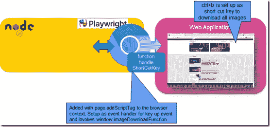
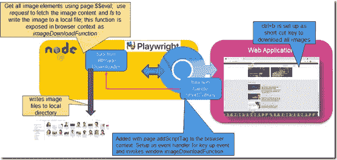

# 使用剧作家注入数据到任何网页

> 原文：<https://javascript.plainenglish.io/use-playwright-to-inject-shortcut-keys-into-any-web-page-for-example-to-download-all-images-59195cf557a5?source=collection_archive---------6----------------------->

向 web 应用程序或网站添加快捷键组合会非常强大。当快捷键组合被激活时，事情就会发生。您在 web 应用程序已经提供的基础上定义的东西。在这篇文章中，我描述了我如何使用剧作家注入一个快捷组合键到一个网站。这个热键(只需按 ctrl+b 即可激活)运行一个功能，将当前浏览器上下文中的所有图像下载到本地文件系统。所执行的函数是一个节点(JS)函数，它一方面可以访问完整的浏览器上下文(包括 DOM、JavaScript 上下文、本地存储、cookies 等),另一方面可以处理所有的节点和 NPM。一个非常强大的组合。

这篇文章只是一个例子，告诉你如何丰富你的 SaaS 网络应用、博客、云平台和任何你在浏览器中运行的东西的功能。通过使用剧作家运行浏览器，您可以获得正常的浏览器功能，以及通过剧作家提供的包装器和桥的节点世界。我在之前的一篇文章中介绍了剧作家，如果你还不知道剧作家，我强烈建议你读一下那篇文章。

简而言之:剧作家是一个开源软件库，它在 machina 中给了我们一个*deus——*一个机器人在我们的浏览器中执行电源操作。这带来了从自动化测试到战术集成和 RPA(机器人流程自动化)以及从 deeplink 书签、屏幕抓取、web 应用健康监控(smoketests)和定制 web 应用的机会。剧作家是一个相当新的(2020)，开源的，基于 JavaScript 的，用于端到端测试的跨浏览器自动化库。

# 如何向第三方 Web 应用程序添加快捷键

您可能想知道我们如何扩展现有的网站或 web 应用程序——尤其是当它不是我们自己的时候。我们所做的是将网站或 web 应用程序加载到嵌入式浏览器中，我们使用剧作家库从节点应用程序运行该浏览器。这允许我们用自己的应用程序逻辑包装浏览器。在这个逻辑中，我们可以操作当前加载的页面的 DOM 和 JavaScript 上下文。

在这种情况下，函数 *handleShortCutKey* 被注入到页面中。

```
// create a shortcut key (ctrl + b) that triggers the JS function to download all imagesconst shortCutJS  = `async function handleShortCutKey(e) { 
  if ('KeyB'==e.code && e.ctrlKey) { // ctrl + b
  const result = await window.imageDownloadFunction() ;  // invoke the Node function that was exposed to the browser context
  }
}document.addEventListener('keyup', handleShortCutKey);await page.addScriptTag({ content: shortCutJS })
```

该函数被设置为 key up 事件的事件监听器。在 handleShortCutKey 中，我们测试快捷键组合 ctrl+b。如果该键已被激活，该函数将调用名为 *imageDownloadFunction* 的函数。



第二个功能不是第三方 web 应用程序的一部分。它也不真正存在于浏览器环境中。该函数是节点应用程序中启动浏览器和加载 web 应用程序的函数的占位符。使用语句

```
await context.exposeBinding('imageDownloadFunction', allImageDownloader)
```

节点应用程序中的功能 *allImageDownloader* 已经暴露在浏览器*窗口*对象上，可以从浏览器上下文中调用该功能；这个代理的名字是 *imageDownloadFunction* 。

```
const { chromium } = require('playwright');
const fs = require("fs");
const request = require('request')const URL = "https://www.amis.nl/"
const IMAGE_PATH = "./images/"var streamImageFromURL = function (imageURL, imageFilename) {
  request(imageURL).pipe(fs.createWriteStream(`${IMAGE_PATH}${imageFilename}`));
}const allImageDownloader = async (source) => {
// using the page object in source.page, get all img elements and return a collection of image objects to be processed in the Node context
const images = await source.page.$$eval("img", (images) =>
images.map((image) => { return {src: image.src, alt: image.alt, width:image.clientWidth, height:image.clientHeight}})
)// for each image of substantial size - determine the name of the image file and invoke the function streamImageFromURL to download the image and save it locally
    images.forEach(image => { if (image.width * image.height > 2500) {
    const startIndex = image.src.lastIndexOf("/") + 1 // do not include /
    const endIndex = image.src.indexOf("?")> -1?  image.src.indexOf("?"):500
    const imageFilename = image.src.substring(startIndex,endIndex)
    console.log(`download ${image.src} as ${imageFilename}`)
    streamImageFromURL(image.src, imageFilename);
  }
  });
  return images.length
}(async () => {
  const browser = await chromium.launch({ headless: false })
  const context = await browser.newContext()
  // expose a Node function as binding to the page (to be invoked from the function) await context.exposeBinding('imageDownloadFunction', allImageDownloader)
  const page = await context.newPage();
  await page.goto(URL);
```

下图显示了完整的设置。handleShortCutKey 函数位于浏览器内部，添加到 web 应用程序中。当用户激活 ctrl+b 时调用该函数。通过到节点/剧作家上下文的桥，该函数调用节点函数 allImageDownloader。这个函数检索网页中所有图像元素的列表——使用剧作家`page.$$eval`函数。然后，它检索所有这些图像的内容，并将其写入本地文件系统。



成果:任何 web 应用程序或网站都可以在嵌入式浏览器中加载。自动地，功能和快捷键组合被设置在 web 应用程序内部。当用户按 ctrl+b 时，所有图像都被下载。

当然，下载所有图像只是任何快捷键触发功能可以做的一个例子。你可以用同样的方式为所有类型的网站添加各种动作的功能。从而创建功能更多、更符合您需求的网站和 web 应用程序。

# 资源

我在之前的一篇文章中介绍过剧作家

本文源代码:[https://github . com/lucasjellema/剧作家-场景/树/主/注入-快捷方式](https://github.com/lucasjellema/playwright-scenarios/tree/main/inject-shortcuts)

*原载于 2020 年 12 月 24 日*[*https://technology . amis . nl*](https://technology.amis.nl/2020/12/24/use-playwright-to-inject-shortcut-keys-into-any-web-page-for-example-to-download-all-images/)*。*